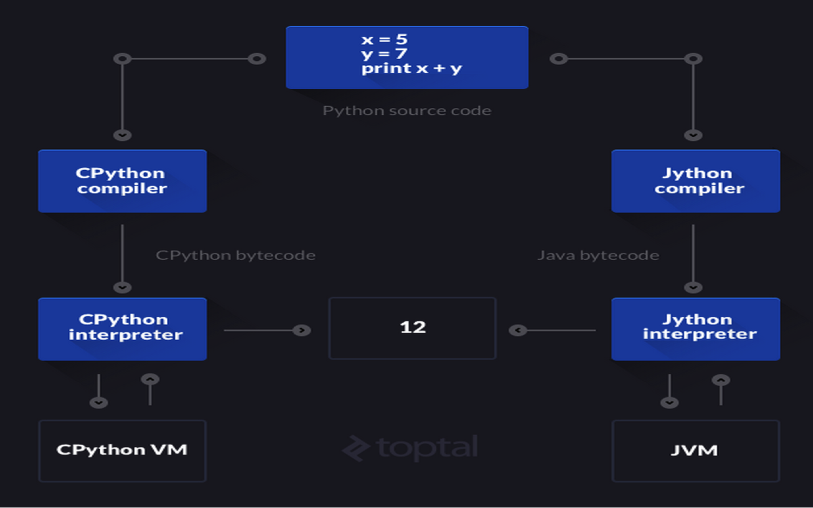
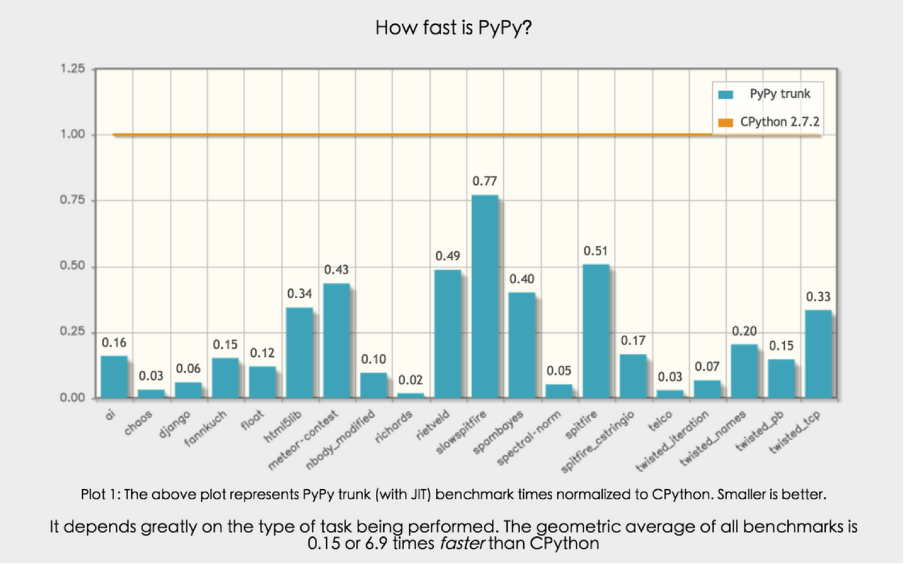
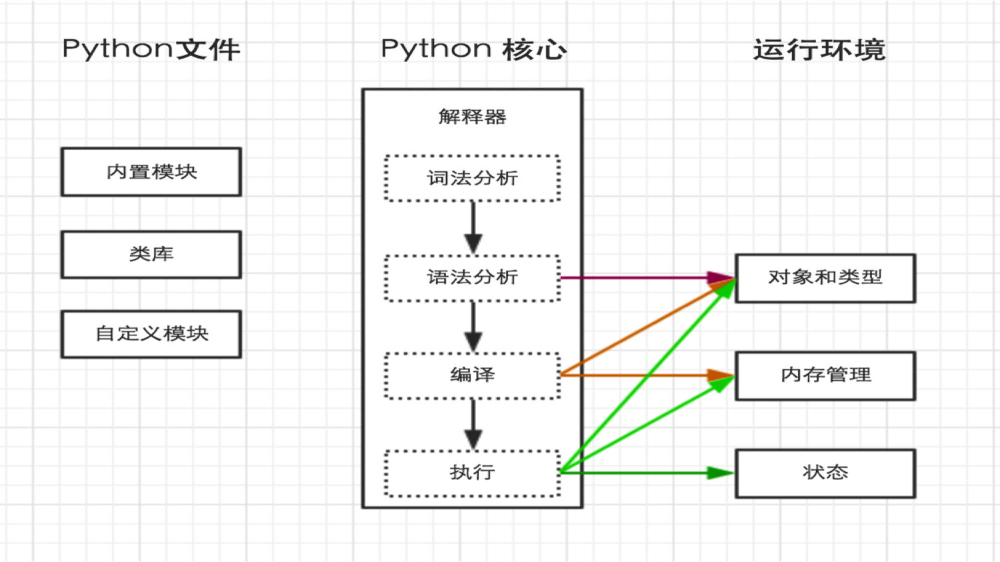
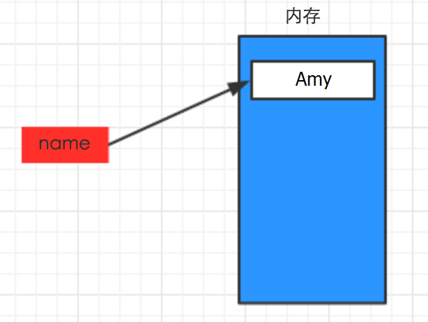
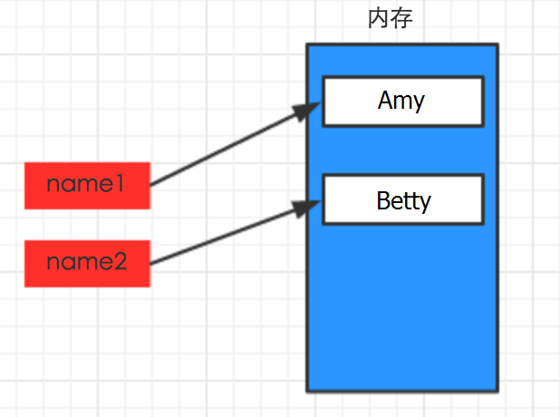

# 一、Python简介
## Python优势

- 减少开发成本
 - Linux原装Python，其他语言没有；
 - 丰富的类库支持
 - Python在速度上可能稍显逊色    

## Python和其他语言对比

- C语言： 代码编译得到 机器码 ，机器码在处理器上直接执行，每一条指令控制CPU工作
- 高级语言： 代码编译得到 字节码 ，经由虚拟机/解释器执行字节码，并转换成机器码后在处理器上执行
- Python由C开发而来

## Python的种类

- Cpython
  ​    Python的官方版本，使用C语言实现，使用最为广泛，CPython实现会将源文件（py文件）转换成字节码文件（pyc文件），然后运行在Python虚拟机上。
- Jyhton
  ​    Python的Java实现，Jython会将Python代码动态编译成Java字节码，然后在JVM上运行。
- IronPython
  ​    Python的C#实现，IronPython将Python代码编译成C#字节码，然后在CLR上运行。（与Jython类似）
- PyPy（特殊）
  ​    Python实现的Python，将Python代码转成C字节码文件，对Python代码进行动态编译，全部转换成机器码之后再执行。
- RubyPython、Brython ...

以上除PyPy之外，其他的Python的对应关系和执行流程如下：




PyPy，在Python的基础上对Python的字节码进一步处理，从而提升执行速度！




## Python解释器  

- CPython ：  代码 -> C字节码（.pyc文件）-> 机器码  -> 逐行执行。Python是解释型语言，代码在执行时会一行一行地翻译成CPU能理解的机器码，这个翻译过程非常耗时，所以很慢。而对于C程序等编译型语言，运行前直接变异成CPU能执行的机器码，所以非常快。
- PyPy：         
  - PyPy采用JIT技术，对Python代码进行动态编译（注意不是解释），可以显著提高Python代码的执行速度。
  - 代码 -> C字节码 -> 机器码 全部转换完 -> 执行
- 其他Python：代码 -> 对应语言的字节码 -> 机器码
- **疑问**：Python解释器将代码编译为对应的字节码，那将字节码转换成机器码是用什么？虚拟机？


## 安装Python

**windows：**

```shell
1、下载安装包
    https://www.python.org/downloads/
2、安装
    默认安装路径：C:\python27
3、配置环境变量
    【右键计算机】--》【属性】--》【高级系统设置】--》【高级】--》【环境变量】--》【在第二个内容框中找到 变量名为Path 的一行，双击】 --> 【Python安装目录追加到变值值中，用 ； 分割】
    如：原来的值;C:\python27，切记前面有分号
```

**linux：**

```shell
无需安装，原装Python环境
ps：如果自带2.6，请更新至2.7
```

**更新Python**

**windows:**

```shell
卸载重装即可
```

**linux:**

Linux的yum依赖自带Python，为防止错误，此处更新其实就是再安装一个Python

```shell
查看默认Python版本
python -V
  
1、安装gcc，用于编译Python源码
    yum install gcc
2、下载源码包，https://www.python.org/ftp/python/
3、解压并进入源码文件
4、编译安装
    ./configure
    make all
    make install
5、查看版本
    /usr/local/bin/python2.7 -V
6、修改默认Python版本
    mv /usr/bin/python /usr/bin/python2.6
    ln -s /usr/local/bin/python2.7 /usr/bin/python
7、防止yum执行异常，修改yum使用的Python版本
    vi /usr/bin/yum
    将头部 #!/usr/bin/python 修改为 #!/usr/bin/python2.6
```


# 二、Python基础
## 1、基本步骤
1. 安装： python解释器
2. 写程序
3. 执行            
  - 打开文件，读取文件内容
  - 词法分析，语法分析
  - 转换为字节码

**第一句Python代码**

在 /home/dev/ 目录下创建 hello.py 文件，内容如下：

```python
print (hello world!)
```

执行 hello.py 文件，即： `python /home/dev/hello.py`

python内部执行过程如下：



## 2. 解释器
- .py文件头部#!/usr/bin/python
  文件编码，声明py文件的字符编码
- 解释器编码
  - 2.x：ASCII
  - 3.x：utf-8
- 潜规则：后缀名为.py
- .pyc文件，字节码

上一步中执行 python /home/dev/hello.py 时，明确的指出 hello.py 脚本由 python 解释器来执行。

如果想要类似于执行shell脚本一样执行python脚本，例： `./hello.py `，那么就需要在 hello.py 文件的头部指定解释器，如下：

```python
`#!/usr/bin/env python`` ` `print` `"hello,world"`
```

如此一来，执行： .`/hello.py` 即可。

ps：执行前需给予 hello.py 执行权限，chmod 755 hello.py

## 3. 内容编码

- ASCII码：只有英文字母和特殊字符。1个字节。（American Standard Code for Information Interchange，美国标准信息交换代码）是基于拉丁字母的一套电脑编码系统，主要用于显示现代英语和其他西欧语言，其最多只能用 8 位来表示（一个字节），即：2**8 = 256，所以，ASCII码最多只能表示 256 个符号。

- Unicode：万国码，支持大部分语言，但较占内存。英文2个字节，中文3个字节。为每种语言中的每个字符设定了统一并且唯一的二进制编码，规定所有的字符和符号最少由 16 位来表示（2个字节），即：2 **16 = 65536。
  注：此处说的的是最少2个字节，可能更多

- UTF-8：对Unicode的压缩，可扩展。英文1字节，中文3字节。为大多数开源软件使用。将所有的字符和符号进行分类：ascii码中的内容用1个字节保存，欧洲的字符用2个字节保存，东亚的字符用3个字节保存...

- gbk/gb2312：仅中文，2个字节。         

所以，python解释器在加载 .py 文件中的代码时，会对内容进行编码（默认ascill），如果是如下代码的话：

报错：ascii码无法表示中文
```python
#!/usr/bin/env python
  
print "你好，世界"
```
改正：应该显示的告诉python解释器，用什么编码来执行源代码，即：
```python
#!/usr/bin/env python
# -*- coding: utf-8 -*-
  
print "你好，世界"
```
## 4.  IDE-pycharm

- 使用
     1. new project 
     2. new Directory
     3. new Python file
     4. 在py文件中右键， run xx.py

- 文件编码：defaultsettign -> encoding

- 文件模板：template

- 鼠标滑轮改变大小：mouse
## 5. 注释
```python
当行注释：# 被注释内容
多行注释：""" 被注释内容 """
快捷键：ctrl+/
```

## 执行脚本传入参数

Python有大量的模块，从而使得开发Python程序非常简洁。类库有包括三中：

- Python内部提供的模块
- 业内开源的模块
- 程序员自己开发的模块

Python内部提供一个 sys 的模块，其中的 sys.argv 用来捕获执行执行python脚本时传入的参数

```python
`#!/usr/bin/env python``# -*- coding: utf-8 -*-`` ` `import` `sys`` ` `print` `sys.argv`
```

## pyc 文件

执行Python代码时，如果导入了其他的 .py 文件，那么，执行过程中会自动生成一个与其同名的 .pyc 文件，该文件就是Python解释器编译之后产生的字节码。

ps：代码经过编译可以产生字节码；字节码通过反编译也可以得到代码。

## 6. 变量             

**声明变量**

```python
#!/usr/bin/env python
# -*- coding: utf-8 -*-
name = "Amy"
```

上述代码声明了一个变量，变量名为： name，变量值为："Amy"

变量的作用：昵称，代指内存里某个地址中保存的内容



**变量定义的规则：**

- 只能是 字母、数字或下划线的任意组合
- 第一个字符不能是数字
- 不能使用python内置关键字
  ['and', 'as', 'assert', 'break', 'class', 'continue', 'def', 'del', 'elif', 'else', 'except', 'exec', 'finally', 'for', 'from', 'global', 'if', 'import', 'in', 'is', 'lambda', 'not', 'or', 'pass', 'print', 'raise', 'return', 'try', 'while', 'with', 'yield']

- 建议使用下划线分割    

**变量的赋值**

```python
#!/usr/bin/env python
# -*- coding: utf-8 -*-

name1 = "Amy"
name2 = "Betty"
```



```python
#!/usr/bin/env python
# -*- coding: utf-8 -*-

name1 = "Amy"
name2 = name1
```


## 7. 输入，输出     
```python
#!/usr/bin/env python
# -*- coding: utf-8 -*-
  
# 将用户输入的内容赋值给 name 变量
name = raw_input("请输入用户名：")
  
# 打印输入的内容
print name

# 输入密码时，如果想要不可见，需要利用getpass 模块中的 getpass方法，即：
import getpass
  
# 将用户输入的内容赋值给 name 变量
pwd = getpass.getpass("请输入密码：")
  
# 打印输入的内容
print pwd
```

## 8. 条件语句

```python
# if条件语句可以嵌套
if 条件:
	成功走这里，不符合条件直接pass

if 条件:
	成功走这里
else:
	失败走这里

if 条件:
    ...
elif 条件:
    ...
else:
    ...
```

## 流程控制和缩进

**需求一、用户登陆验证**

```python
#!/usr/bin/env python
# -*- coding: encoding -*-
# 提示输入用户名和密码
# 验证用户名和密码
# 如果错误，则输出用户名或密码错误
# 如果成功，则输出 欢迎，XXX!
import getpass
name = raw_input('请输入用户名：')
pwd = getpass.getpass('请输入密码：')
if name =="alex" and pwd == "cmd":
    print("欢迎，alex！")
else:
    print "用户名和密码错误"
```

**需求二、根据用户输入内容输出其权限**

```python
# 根据用户输入内容打印其权限
# alex --> 超级管理员
# eric --> 普通管理员
# tony,rain --> 业务主管
# 其他 --> 普通用户
```

## 9. while循环

​	while 条件:
​		continue    # 结束本次循环，立即开始下次循环
​		break       # 跳出所有循环

1、基本循环

```python
while 条件:
     
    # 循环体
 
    # 如果条件为真，那么循环体则执行
    # 如果条件为假，那么循环体不执行
```

2、break

break用于退出所有循环

```python
while True:
    print "123"
    break
    print "456"
```

3、continue

continue用于退出当前循环，继续下一次循环

```python
while True:
    print "123"
    continue
    print "456"
```

4、break和continue只退出当前循环，跟上级循环无关。

## 10. 练习：

1、使用while循环输入 1 2 3 4 5 6  8 9 10

```python
# 1、使用while循环输入 1 2 3 4 5 6 8 9 10（没有7）
i = 1
while i < 11:
    if i == 7:
        i += 1
        continue
    print(i)
    i = i + 1
```

2、求1-100的所有数的和

```python
x = 1
y = 0
while x < 101:
    y = y + x
    x += 1

print('1-100所有数的和为：%s'%y)
```

3、输出 1-100 内的所有奇数

```python
x = 1
while x < 100:
    if x%2 != 0:
        print('本次奇数为：%s' %x)
    x += 1
```

4、输出 1-100 内的所有偶数

```python
x = 1
while x < 100:
    if x%2 == 0:
        print('本次偶数为：%s' %x)
    x += 1
```

5、求1-2+3-4+5 ... 99的所有数的和

```python
a = 1
b = 0
while a < 100:
    if a%2 != 0:
        b = b + a
    else:
        b = b - a
    a += 1
print('1-2+3-4+5 ... 99的所有数的和：%s' %b)
```

6、用户登陆（三次机会重试）

```python
import getpass
i = 1
while i < 4:
    user = input("请输入用户名：")
    # getpass用户输入时不显示，但注意：只能在终端用，pycharm中不生效
    # pwd = getpass.getpass("请输入密码：")
    pwd = input("请输入密码：")
    if user == "amy" and pwd == "123":
        print("登录成功！")
        break
    else:
        print("用户名或密码错误，请重新输入！")
        i += 1
```

7、公鸡5文钱一只，母鸡3文钱一只，小鸡1文钱3只，用100文钱买100只鸡,其中公鸡，母鸡，小鸡都必须要有，问公鸡，母鸡，小鸡要买多少只刚好凑足100文钱？

```python
# 5x<100; 3y<100; z/3<100
# 5x + 3y + z/3 == 100; x + y + z == 100
for x in range(1,21):
    for y in range(1,34):
        for z in range(1,301):
            # money = 5*x + 3*y + z/3
            if 5*x + 3*y + z/3 == 100 and x + y + z == 100:
                print('公鸡：%s，母鸡：%s，小鸡：%s' %(x,y,z))
```


# 三、运算符
1. i += 1
2. and 和 or，按顺序判断  

		if 1 == 1 or 1 > 2 and 1 == 4:
	​		print('正确')
	​	else:
	​	print('错误')
3. if "sth" in content:  

# 四、Python数据类型
## 1. 整数 int

- 创建(python3中整型包含了长整型)
   a = 123
   a = int(123)

- 转换，只能转换纯数字
    age = "18"
    new_age = int(age)
## 2.布尔值 

 - 创建
    a = True
    b = False

 - 转换
    - 数字转换，只有0是False，其他True
    - 字符串，  只有""是False，其他True
    - 待续...

## 3.字符串

 - 创建

    a = 'amy'

    a = "amy"

    a = '''amy''' --段落

    a = str('amy')

 - 转换

    age = 18

    new_age =  str(age)

 - 字符串的拼接，两个字符串变量用+拼接。

    ```python
    name = 'amy'
    gender = '女'
    new_str = name + gender
    print(new_str)
    ```

 - 字符串格式化，占位符

    ```python
    name = '我叫Amy，性别：%s,我今年%s岁。'
    new_str = name %('女',19,)
    print(new_str)
        
    name = '我叫Amy，性别：%s,我今年%s岁，我在说谎!' %('女',19,)
    print(name)
    ```

 - 判断子序列是否在字符串中 

   ```python
   content = "成员变量" 
   
   if "成员" in content:
   
   	print("包含")
   else:
   	print("不包含")
   ```


**常用功能**

  - 移除空白、换行符（\n）

       ```python
       val = " abc "		
       new_val = val.strip() # 移除左右空格，源字符串不变
       new_val = val.lstrip()# 左边
       new_val = val.rstrip() # 右边
       
       print(new_val)
       ```

  - 分割

     ```python
     user_info = "amy bill 9 abc"
     v1 = user_info.split(' ') #全部以空格分割
     v2 = user_info.split(' ',1) #从左边开始分割1个
     v3 = user_info.rsplit(' ',2) #从右边开始分割2个
     ```

  - 长度（python3中按字符）

       len(val)

  - 索引，按索引位置查找字符

      ```python
      val[0]
      print(v)
      
      val = input('请输入>>>')
      i = 0
      while i < len(val):
          print(val[i])
          i += 1
      ```

  - 切片

       ```python
       name = "我叫艾米，今年18岁。"
       
       # 取第一个字符
       print(name[0])
       # 0<=取值范围<2
       print(name[0:2])
       # 5<=取值范围<9
       print(name[5:9])
       # 第5个开始取，到最后一个
       print(name[5:])
       # 第5个开始取，最后两个不取
       print(name[5:-2])
       # 从右边开始，取2个字符
       print(name[-2:])
       ```

## 4. 列表

```python
# 创建
a = ['jack','rose',1984,'alex','bill','christ']
b = list(['zhao','qian','sun'])
#in判断
if 'jack' in a: # 判断元素是否在列表中
    print("包含")
else:
    print('不包含')
    
if 'ck' in a[1]: # 取出第一个元素，判断'ck'是否是其子序列
    print("包含")
else:
    print('不包含')
    
#长度
val = len(a)
#索引
val = a[2])
#切片
v1 = a[:5:2] #起：终：步长
v2 = a[::-2] #从右边开始，步长为2
v3 = a[-3:]  #从右边开始，倒数3个
v4 = a[4:-2] #错误写法，显示为空
#追加
a.append('david')#只能追加一个元素
print(a)
#插入
a.insert(3,'frank')
print(a)
#删除-根据value删除，只删除找到的第一个
a.remove('frank')
print(a)
#删除-根据索引删除
del a[1]
print(a)
#修改
a = ['jack', 'rose', 1984, 'alex', 'christ']
print(a)
a[0] = 'amy'
print(a)

# for循环
# 支持break、continue
b = ['zhao','qian','sun']

for item in b: #得到列表中的每个元素
		print(item)
```

## 5. 字典操作

- 创建    
    ​    v = {
    ​        'k1': 'v1',
    ​        'k2': 'v2'
    ​    }

- 根据索引获取值 ，根据key获取value

    val = v['k1']

- 增加，如果原来没有键，增加；如果有，修改 

    v['k3'] = 'v3'

- 删除 

    del v['k1']

- 循环

```python
# 一个键值对是字典里的一个元素，默认只拿到key
for item in v:
    print(item)
# 循环所有的key  
for item in v.keys():
	print(item)
# 循环所有的value
for item in v.values():
	print(item)
# 循环所有的键值对。输出结果是key和value组成的元组
for item in v.items():
	print(item)
# 把key和value分别赋值
for key,val in v.items():
    	print(key,val)
```

- 字典和列表相互嵌套
```python
user_list = [
    {'name':'alex','pwd':'123','times':1},
	{'name':'bill','pwd':'456','times':2},
	{'name':'chris','pwd':'789','times':2},
]
# 输出：每个元素是字典
for item in user_list:
	print(item)
	
name = input('pls input the name:')
pwd = input('pls input the pwd:')

for contents in user_list: # contents 是字典
    if name == contents['name'] and pwd == contents['pwd']:
        print('now you login')
        break #加else，break放这里循环至直到打印出正确的值
    # 不加else，则只输入正确时显示。输入错误时不显示，直接退出。
	# else:
		# print('failure')
```

- 示例

```python
#db
alex|123123|3
eric|123123|3

# login.py
#!/usr/bin/python
# -*- coding:utf-8 -*-
# 1. 打开并读取文件内容
f1 = open('db','r')
data = f1.read()
f1.close()

# 2. 格式化，列表中嵌套字典
print(data)
user_info_list = []
user_str_list = data.split('\n')
for item in user_str_list:
    temp = item.split('|')
    v = {
        'name': temp[0],
        'pwd': temp[1],
        'times': temp[2]
    }
    user_info_list.append(v)
user_info_list[1]['times'] = 3
print(user_info_list)

# 3. 列表中嵌套的字典


# 4. 重新写入文件
target = """alex|123123|3\neric|123123|3"""

f2 = open('db','w')
f2.write(target)
f2.close()

```

- 练习

```python
0. 基于文件存储的用户登录程序（3次登录失败，锁定用户）
a. 元素分类

    有如下值集合 v1 = [11,22,33,44,55,66,77,88,99,90]，
    将所有大于 66 的值保存至字典的第一个key中，将小于 66 的值保存至第二个key的值中。
    即： {'k1': 大于66的所有值, 'k2': 小于66的所有值}
    
    v2 = {'k1': [],'k2':[] }
    

b. 功能要求：
    v = 2000
    要求用户输入总资产，例如：2000
    显示商品列表，让用户根据序号选择商品，加入购物车
    购买，如果商品总额大于总资产，提示账户余额不足，否则，购买成功。
    goods = [
        {"name": "电脑", "price": 1999},
        {"name": "鼠标", "price": 10},
        {"name": "游艇", "price": 20},
        {"name": "美女", "price": 998},
    ]
    
    num = input('>>>') # 1
    num = int(num)
    goods[num]['price']

c. 用户交互，显示省市县三级联动的选择

    dic = {
        "河北": {
            "石家庄": ["鹿泉", "藁城", "元氏"],
            "邯郸": ["永年", "涉县", "磁县"],
        }
        "河南": {
            ...
        }
        "山西": {
            ...
        }
    }
    
    for v in dic.keys():
        print(v)
    inp = input('>>>')
    dic[inp]

```

