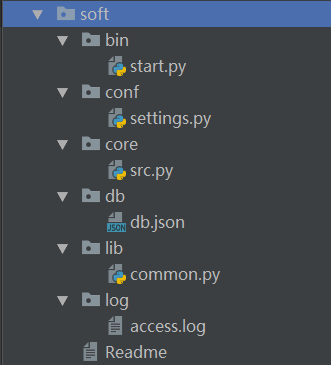

### 一 模块介绍

**1、什么是模块？**

```python
大家之前在编写ATM作业时，思路是先将程序中都需要有哪些功能定义出来，然后在需要用的地方调用即可。
比起之前通篇垒代码的方式，将重复要用的功能定义成函数会让程序更加简洁，这不能不算做是一种进步，
但问题是，随着程序功能越来越多，再将所有的代码都放到一起，程序的组织结构仍然会不清晰，不方便管理，
以后我们写程序，都是分文件的，如果多个文件中都需要用到同一段功能，难道我们要重复编写该功能吗？很明显不能
这就需要我们找到一种解决方案，能够将程序中经常要用的功能集合到一起，然后在想用的地方随时导入使用，
这几乎就是模块的全部含义了

最后总结：
模块就是一组功能的集合体，我们的程序可以导入模块来复用模块里的功能。
```


```python
#常见的场景：一个模块就是一个包含了一组功能的python文件,比如spam.py，模块名为spam，可以通过import spam使用。

#在python中，模块的使用方式都是一样的，但其实细说的话，模块可以分为四个通用类别：　

　　1 使用python编写的.py文件

　　2 已被编译为共享库或DLL的C或C++扩展

　　3 把一系列模块组织到一起的文件夹（注：文件夹下有一个__init__.py文件，该文件夹称之为包）

　　4 使用C编写并链接到python解释器的内置模块
```


**2、为何要使用模块？**


```python
#1、从文件级别组织程序，更方便管理
随着程序的发展，功能越来越多，为了方便管理，我们通常将程序分成一个个的文件，这样做程序的结构更清晰，方便管理。这时我们不仅仅可以把这些文件当做脚本去执行，还可以把他们当做模块来导入到其他的模块中，实现了功能的重复利用

#2、拿来主义，提升开发效率
同样的原理，我们也可以下载别人写好的模块然后导入到自己的项目中使用，这种拿来主义，可以极大地提升我们的开发效率

#ps：
如果你退出python解释器然后重新进入，那么你之前定义的函数或者变量都将丢失，因此我们通常将程序写到文件中以便永久保存下来，需要时就通过python test.py方式去执行，此时test.py被称为脚本script。
```


**3、以spam.py为例来介绍模块的使用：****文件名spam.py,模块名spam**

```python
#spam.py
print('from the spam.py')

money=1000

def read1():
    print('spam模块：',money)

def read2():
    print('spam模块')
    read1()

def change():
    global money
    money=0
```


### 二 使用模块之import

**1、import的使用**

```python
#模块可以包含可执行的语句和函数的定义，这些语句的目的是初始化模块，它们只在模块名第一次遇到导入import语句时才执行（import语句是可以在程序中的任意位置使用的,且针对同一个模块很import多次,为了防止你重复导入，python的优化手段是：第一次导入后就将模块名加载到内存了，后续的import语句仅是对已经加载到内存中的模块对象增加了一次引用，不会重新执行模块内的语句），如下 

#test.py
import spam #只在第一次导入时才执行spam.py内代码,此处的显式效果是只打印一次'from the spam.py',当然其他的顶级代码也都被执行了,只不过没有显示效果.
import spam
import spam
import spam

'''
执行结果：
from the spam.py
'''
```


ps：我们可以从sys.module中找到当前已经加载的模块，sys.module是一个字典，内部包含模块名与模块对象的映射，该字典决定了导入模块时是否需要重新导入。

**2、在第一次导入模块时会做三件事，重复导入会直接引用内存中已经加载好的结果**


```python
#1.为源文件(spam模块)创建新的名称空间，在spam中定义的函数和方法若是使用到了global时访问的就是这个名称空间。

#2.在新创建的命名空间中执行模块中包含的代码，见初始导入import spam
    提示:导入模块时到底执行了什么？
    In fact function definitions are also ‘statements’ that are 
    ‘executed’; the execution of a module-level function definition 
    enters the function name in the module’s global symbol table.
    事实上函数定义也是“被执行”的语句，模块级别函数定义的执行将函数名放
    入模块全局名称空间表，用globals()可以查看

#3.创建名字spam来引用该命名空间
    这个名字和变量名没什么区别，都是‘第一类的’，且使用spam.名字的方式
    可以访问spam.py文件中定义的名字，spam.名字与test.py中的名字来自
    两个完全不同的地方。
```

**3、被导入模块有独立的名称空间**

每个模块都是一个独立的名称空间，定义在这个模块中的函数，把这个模块的名称空间当做全局名称空间，这样我们在编写自己的模块时，就不用担心我们定义在自己模块中全局变量会在被导入时，与使用者的全局变量冲突.

测试一:money与spam.money不冲突

```python
#test.py
import spam 
money=10
print(spam.money)

'''
执行结果：
from the spam.py
1000
'''
```

测试二：read1与spam.read1不冲突

```python
#test.py
import spam
def read1():
    print('========')
spam.read1()

'''
执行结果:
from the spam.py
spam->read1->money 1000
'''
```

测试三：执行spam.change()操作的全局变量money仍然是spam中的

```python
#test.py
import spam
money=1
spam.change()
print(money)

'''
执行结果：
from the spam.py
1
'''
```


**4、为模块名起别名**

为已经导入的模块起别名的方式对编写可扩展的代码很有用

```python
1 import spam as sm
2 print(sm.money)
```

有两中sql模块mysql和oracle，根据用户的输入，选择不同的sql功能。

```python
#mysql.py
def sqlparse():
    print('from mysql sqlparse')
#oracle.py
def sqlparse():
    print('from oracle sqlparse')

#test.py
db_type=input('>>: ')
if db_type == 'mysql':
    import mysql as db
elif db_type == 'oracle':
    import oracle as db

db.sqlparse() 
```


假设有两个模块xmlreader.py和csvreader.py，它们都定义了函数read_data(filename):用来从文件中读取一些数据，但采用不同的输入格式。可以编写代码来选择性地挑选读取模块

```python
if file_format == 'xml':
    import xmlreader as reader
elif file_format == 'csv':
    import csvreader as reader
data=reader.read_date(filename)
```

**5、在一行导入多个模块**

```python
1 import sys,os,re
```


### **三 使用模块之from ... import...**

**1、from...import...的使用**

```python
 1 from spam import read1,read2
```

**2、from...import 与import的对比**

```python
#唯一的区别就是：使用from...import...则是将spam中的名字直接导入到当前的名称空间中，所以在当前名称空间中，直接使用名字就可以了、无需加前缀：spam.

#from...import...的方式有好处也有坏处
    好处：使用起来方便了
    坏处：容易与当前执行文件中的名字冲突
    
# import导入的一定是名字。(函数名、变量名、类名 --> 这些都是名字，名字都是绑定到一个值，解除绑定，再绑定到一个值。)
```

验证一：当前位置直接使用read1和read2就好了，执行时，仍然以spam.py文件全局名称空间

```python
#测试一：导入的函数read1，执行时仍然回到spam.py中寻找全局变量money
#test.py
from spam import read1
money=1000
read1()
'''
执行结果:
from the spam.py
spam->read1->money 1000
'''

#测试二:导入的函数read2，执行时需要调用read1(),仍然回到spam.py中找read1()
#test.py
from spam import read2
def read1():
    print('==========')
read2()

'''
执行结果:
from the spam.py
spam->read2 calling read
spam->read1->money 1000
'''
```


验证二：如果当前有重名read1或者read2，那么会有覆盖效果。

```python
#测试三:导入的函数read1，被当前位置定义的read1覆盖掉了
#test.py
from spam import read1
def read1():
    print('==========')
read1()
'''
执行结果:
from the spam.py
==========
'''
```


验证三：导入的方法在执行时，始终是以源文件为准的

```python
from spam import money,read1
money=100 #将当前位置的名字money绑定到了100
print(money) #打印当前的名字
read1() #读取spam.py中的名字money,仍然为1000

'''
from the spam.py
100
spam->read1->money 1000
'''
```


**3、也支持as**

```python
1 from spam import read1 as read
```

**4、一行导入多个名字**

```python
from spam import read1,read2,money
```

**5、from...import \***

```python
#from spam import * 把spam中所有的不是以下划线(_)开头的名字都导入到当前位置

#大部分情况下我们的python程序不应该使用这种导入方式，因为*你不知道你导入什么名字，很有可能会覆盖掉你之前已经定义的名字。而且可读性极其的差，在交互式环境中导入时没有问题。
```


```python
from spam import * #将模块spam中所有的名字都导入到当前名称空间
print(money)
print(read1)
print(read2)
print(change)

'''
执行结果:
from the spam.py
1000
<function read1 at 0x1012e8158>
<function read2 at 0x1012e81e0>
<function change at 0x1012e8268>
'''
```

可以使用`__all__`来控制*（用来发布新版本），在spam.py中新增一行

```python
__all__=['money','read1'] #这样在另外一个文件中用from spam import *就这能导入列表中规定的两个名字
```

**6、模块循环导入问题**

**模块循环/嵌套导入抛出异常的根本原因是由于在python中模块被导入一次之后，就不会重新导入，只会在第一次导入时执行模块内代码**

**在我们的项目中应该尽量避免出现循环/嵌套导入，如果出现多个模块都需要共享的数据，可以将共享的数据集中存放到某一个地方**

**在程序出现了循环/嵌套导入后的异常分析、解决方法如下**

示例文件

```python
#示范文件内容如下
#m1.py
print('正在导入m1')
from m2 import y

x='m1'

#m2.py
print('正在导入m2')
from m1 import x

y='m2'

#run.py
import m1

#测试一
执行run.py会抛出异常
正在导入m1
正在导入m2
Traceback (most recent call last):
  File "/Users/linhaifeng/PycharmProjects/pro01/1 aaaa练习目录/aa.py", line 1, in <module>
    import m1
  File "/Users/linhaifeng/PycharmProjects/pro01/1 aaaa练习目录/m1.py", line 2, in <module>
    from m2 import y
  File "/Users/linhaifeng/PycharmProjects/pro01/1 aaaa练习目录/m2.py", line 2, in <module>
    from m1 import x
ImportError: cannot import name 'x'

#测试一结果分析
先执行run.py--->执行import m1，开始导入m1并运行其内部代码--->打印内容"正在导入m1"
--->执行from m2 import y 开始导入m2并运行其内部代码--->打印内容“正在导入m2”--->执行from m1 import x,由于m1已经被导入过了，所以不会重新导入，所以直接去m1中拿x，然而x此时并没有存在于m1中，所以报错


#测试二:执行文件不等于导入文件，比如执行m1.py不等于导入了m1
直接执行m1.py抛出异常
正在导入m1
正在导入m2
正在导入m1
Traceback (most recent call last):
  File "/Users/linhaifeng/PycharmProjects/pro01/1 aaaa练习目录/m1.py", line 2, in <module>
    from m2 import y
  File "/Users/linhaifeng/PycharmProjects/pro01/1 aaaa练习目录/m2.py", line 2, in <module>
    from m1 import x
  File "/Users/linhaifeng/PycharmProjects/pro01/1 aaaa练习目录/m1.py", line 2, in <module>
    from m2 import y
ImportError: cannot import name 'y'


#测试二分析
执行m1.py，打印“正在导入m1”，执行from m2 import y ，导入m2进而执行m2.py内部代码--->打印"正在导入m2"，执行from m1 import x，此时m1是第一次被导入，执行m1.py并不等于导入了m1，于是开始导入m1并执行其内部代码--->打印"正在导入m1"，执行from m1 import y，由于m1已经被导入过了，所以无需继续导入而直接问m2要y，然而y此时并没有存在于m2中所以报错


# 解决方法:
方法一:导入语句放到最后
#m1.py
print('正在导入m1')

x='m1'

from m2 import y

#m2.py
print('正在导入m2')
y='m2'

from m1 import x

方法二:导入语句放到函数中
#m1.py
print('正在导入m1')

def f1():
    from m2 import y
    print(x,y)

x = 'm1'

# f1()

#m2.py
print('正在导入m2')

def f2():
    from m1 import x
    print(x,y)

y = 'm2'

#run.py
import m1

m1.f1()
```

思考

```python
#m1.py
f1()
print('正在导入m1')
import m2

x='m1'

print(m2.y)


#m2.py
print('正在导入m2')
import m1

y='m2'

#run.py
import m1
```


### 四、模块的重载 (了解)

考虑到性能的原因，每个模块只被导入一次,放入字典sys.module中，如果你改变了模块的内容，你必须重启程序，python不支持重新加载或卸载之前导入的模块，

有的同学可能会想到直接从sys.module中删除一个模块不就可以卸载了吗，注意了，你删了sys.module中的模块对象仍然可能被其他程序的组件所引用，因而不会被清楚。

特别的对于我们引用了这个模块中的一个类，用这个类产生了很多对象，因而这些对象都有关于这个模块的引用。

如果只是你想交互测试的一个模块，使用 importlib.reload(), e.g. import importlib; importlib.reload(modulename)，这只能用于测试环境。

aa.py的初始内容

```python
def func1():
    print('func1')
```

执行test.py

```python
1 import time,importlib
2 import aa
3 
4 time.sleep(20)
5 # importlib.reload(aa)
6 aa.func1()
```

在20秒的等待时间里，修改aa.py中func1的内容，等待test.py的结果。

打开importlib注释，重新测试

```python
模块被导入时，会在统计目录的__pychache__中，生成 模块名.cppython-35.pyc文件(字节码文件)。下次再导入时，就不需要再解释，直接读这个.pyc文件，提升导入速度。
```


### **五 py文件区分两种用途:模块与脚本**

```python
#编写好的一个python文件可以有两种用途：
    一：脚本，一个文件就是整个程序，用来被执行
    二：模块，文件中存放着一堆功能，用来被导入使用


#python为我们内置了全局变量__name__，
    当文件被当做脚本执行时：__name__ 等于'__main__'
    当文件被当做模块导入时：__name__等于模块名

#作用：用来控制.py文件在不同的应用场景下执行不同的逻辑
    if __name__ == '__main__':
```


```python
#fib.py

def fib(n):    # write Fibonacci series up to n
    a, b = 0, 1
    while b < n:
        print(b, end=' ')
        a, b = b, a+b
    print()

def fib2(n):   # return Fibonacci series up to n
    result = []
    a, b = 0, 1
    while b < n:
        result.append(b)
        a, b = b, a+b
    return result

if __name__ == "__main__":
    import sys
    fib(int(sys.argv[1]))


#执行：python fib.py <arguments>
python fib.py 50 #在命令行
```


### **六、模块搜索路径**

**模块的查找顺序是：内存中已经加载的模块->内置模块->sys.path路径中包含的模块**

详细的

```python
#模块的查找顺序
1、在第一次导入某个模块时（比如spam），会先检查该模块是否已经被加载到内存中（当前执行文件的名称空间对应的内存），如果有则直接引用
    ps：python解释器在启动时会自动加载一些模块到内存中，可以使用sys.modules查看
2、如果没有，解释器则会查找同名的内建模块
3、如果还没有找到就从sys.path给出的目录列表中依次寻找spam.py文件。


#sys.path的初始化的值来自于：
The directory containing the input script (or the current directory when no file is specified).
PYTHONPATH (a list of directory names, with the same syntax as the shell variable PATH).
The installation-dependent default.

#需要特别注意的是：我们自定义的模块名不应该与系统内置模块重名。虽然每次都说，但是仍然会有人不停的犯错。 

#在初始化后，python程序可以修改sys.path,路径放到前面的优先于标准库被加载。
1 >>> import sys
2 >>> sys.path.append('/a/b/c/d')
3 >>> sys.path.insert(0,'/x/y/z') #排在前的目录，优先被搜索
注意：搜索时按照sys.path中从左到右的顺序查找，位于前的优先被查找，sys.path中还可能包含.zip归档文件和.egg文件，python会把.zip归档文件当成一个目录去处理，

#首先制作归档文件：zip module.zip foo.py bar.py 
import sys
sys.path.append('module.zip')
import foo,bar

#也可以使用zip中目录结构的具体位置
sys.path.append('module.zip/lib/python')


#windows下的路径不加r开头，会语法错误
sys.path.insert(0,r'C:\Users\Administrator\PycharmProjects\a')
 

#至于.egg文件是由setuptools创建的包，这是按照第三方python库和扩展时使用的一种常见格式，.egg文件实际上只是添加了额外元数据(如版本号，依赖项等)的.zip文件。

#需要强调的一点是：只能从.zip文件中导入.py，.pyc等文件。使用C编写的共享库和扩展块无法直接从.zip文件中加载（此时setuptools等打包系统有时能提供一种规避方法），且从.zip中加载文件不会创建.pyc或者.pyo文件，因此一定要事先创建他们，来避免加载模块是性能下降。
```

官网解释：

```python
#官网链接：https://docs.python.org/3/tutorial/modules.html#the-module-search-path
搜索路径：
当一个命名为spam的模块被导入时
    解释器首先会从内建模块中寻找该名字
    找不到，则去sys.path中找该名字

sys.path从以下位置初始化
    1 执行文件所在的当前目录
    2 PTYHONPATH（包含一系列目录名，与shell变量PATH语法一样）
    3 依赖安装时默认指定的

注意：在支持软连接的文件系统中，执行脚本所在的目录是在软连接之后被计算的，换句话说，包含软连接的目录不会被添加到模块的搜索路径中

在初始化后，我们也可以在python程序中修改sys.path,执行文件所在的路径默认是sys.path的第一个目录，在所有标准库路径的前面。这意味着，当前目录是优先于标准库目录的，需要强调的是：我们自定义的模块名不要跟python标准库的模块名重复，除非你是故意的，傻叉。
```


### **七、编译python文件（了解）**

为了提高加载模块的速度，强调强调强调：提高的是加载速度而绝非运行速度。python解释器会在__pycache__目录中下缓存每个模块编译后的版本，格式为：module.version.pyc。通常会包含python的版本号。例如，在CPython3.3版本下，spam.py模块会被缓存成__pycache__/spam.cpython-33.pyc。这种命名规范保证了编译后的结果多版本共存。

Python检查源文件的修改时间与编译的版本进行对比，如果过期就需要重新编译。这是完全自动的过程。并且编译的模块是平台独立的，所以相同的库可以在不同的架构的系统之间共享，即pyc使一种跨平台的字节码，类似于JAVA火.NET,是由python虚拟机来执行的，但是pyc的内容跟python的版本相关，不同的版本编译后的pyc文件不同，2.5编译的pyc文件不能到3.5上执行，并且pyc文件是可以反编译的，因而它的出现仅仅是用来提升模块的加载速度的，不是用来加密的。

详细的

```python
#python解释器在以下两种情况下不检测缓存
#1 如果是在命令行中被直接导入模块，则按照这种方式，每次导入都会重新编译，并且不会存储编译后的结果（python3.3以前的版本应该是这样）
    python -m spam.py

#2 如果源文件不存在，那么缓存的结果也不会被使用，如果想在没有源文件的情况下来使用编译后的结果，则编译后的结果必须在源目录下
sh-3.2# ls
__pycache__ spam.py
sh-3.2# rm -rf spam.py 
sh-3.2# mv __pycache__/spam.cpython-36.pyc ./spam.pyc
sh-3.2# python3 spam.pyc 
spam
 

#提示：
1.模块名区分大小写，foo.py与FOO.py代表的是两个模块
2.你可以使用-O或者-OO转换python命令来减少编译模块的大小
    -O转换会帮你去掉assert语句
    -OO转换会帮你去掉assert语句和__doc__文档字符串
    由于一些程序可能依赖于assert语句或文档字符串，你应该在在确认需要
    的情况下使用这些选项。
3.在速度上从.pyc文件中读指令来执行不会比从.py文件中读指令执行更快，只有在模块被加载时，.pyc文件才是更快的

4.只有使用import语句是才将文件自动编译为.pyc文件，在命令行或标准输入中指定运行脚本则不会生成这类文件，因而我们可以使用compieall模块为一个目录中的所有模块创建.pyc文件

模块可以作为一个脚本（使用python -m compileall）编译Python源  
python -m compileall /module_directory 递归着编译
如果使用python -O -m compileall /module_directory -l则只一层
  
命令行里使用compile()函数时，自动使用python -O -m compileall
  
详见：https://docs.python.org/3/library/compileall.html#module-compileall
```


### 八、包介绍

**1、什么是包？**

```python
#官网解释
Packages are a way of structuring Python’s module namespace by using “dotted module names”
包是一种通过使用‘.模块名’来组织python模块名称空间的方式。
包就是另外一种形式的“模块”

#具体的：包就是一个包含有__init__.py文件的文件夹，所以其实我们创建包的目的就是为了用文件夹将文件/模块组织起来

#需要强调的是：
　　1. 在python3中，即使包下没有__init__.py文件，import 包仍然不会报错，而在python2中，包下一定要有该文件，否则import 包报错

　　2. 创建包的目的不是为了运行，而是被导入使用，记住，包只是模块的一种形式而已，包的本质就是一种模块
```


**2、为何要使用包**

```python
包的本质就是一个文件夹，那么文件夹唯一的功能就是将文件组织起来
随着功能越写越多，我们无法将所以功能都放到一个文件中，于是我们使用模块去组织功能，而随着模块越来越多，我们就需要用文件夹将模块文件组织起来，以此来提高程序的结构性和可维护性
```

**3、注意事项**

```python
#1.关于包相关的导入语句也分为import和from ... import ...两种，但是无论哪种，无论在什么位置，在导入时都必须遵循一个原则：
凡是在导入时带点的，点的左边都必须是一个包，否则非法。可以带有一连串的点，如import item.subitem.subsubitem（subsubitem可以是包，也可以是模块）,但都必须遵循这个原则。但对于导入后，在使用时就没有这种限制了，点的左边可以是包,模块，函数，类(它们都可以用点的方式调用自己的属性)。


#2、import导入文件时，产生名称空间中的名字来源于文件，import 包，产生的名称空间的名字同样来源于文件，即包下的__init__.py，导入包本质就是在导入该文件

#3、包A和包B下有同名模块也不会冲突，如A.a与B.a来自俩个命名空间

```


**4、上课流程**

```python
1 实验一
    准备：
        执行文件为test.py，内容
        #test.py
        import aaa
        同级目录下创建目录aaa,然后自建空__init__.py(或者干脆建包)

    需求：验证导入包就是在导入包下的__init__.py

    解决：
        先执行看结果
        再在__init__.py添加打印信息后，重新执行

2、实验二
    准备：基于上面的结果

    需求：
        aaa.x
        aaa.y
    解决：在__init__.py中定义名字x和y

3、实验三
    准备：在aaa下建立m1.py和m2.py
        #m1.py
        def f1():
            print('from 1')
        #m2.py
        def f2():
            print('from 2')
    需求：
        aaa.m1 #进而aaa.m1.func1()
        aaa.m2 #进而aaa.m2.func2()

    解决：在__init__.py中定义名字m1和m2,先定义一个普通变量，再引出如何导入模块名，强调:环境变量是以执行文件为准
    

4、实验四
    准备：在aaa下新建包bbb

    需求：
        aaa.bbb

    解决：在aaa的__init__.py内导入名字bbb

5、实验五
    准备：
        在bbb下建立模块m3.py
        #m3.py
        def f3():
            print('from 3')
    需求：
        aaa.bbb.m3 #进而aaa.bbb.m3.f3()

    解决：是bbb下的名字m3，因而要在bbb的__init__.py文件中导入名字m3，from aaa.bbb import m3

6、实验六
    准备：基于上面的结果

    需求:
        aaa.m1()
        aaa.m2()
        aaa.m3()
        进而实现
        aaa.f1()
        aaa.f2()
        aaa.f3()
        先用绝对导入，再用相对导入
        
    解决：在aaa的__init__.py中拿到名字m1、m2、m3
    包内模块直接的相对导入，强调包的本质：包内的模块是用来被导入的，而不是被执行的
    用户无法区分模块是文件还是一个包，我们定义包是为了方便开发者维护

7、实验七
    将包整理当做一个模块，移动到别的目录下，操作sys.path
```


### 九、包的使用

**1、示范文件**

```python
glance/                   #Top-level package

├── __init__.py      #Initialize the glance package

├── api                  #Subpackage for api

│   ├── __init__.py

│   ├── policy.py

│   └── versions.py

├── cmd                #Subpackage for cmd

│   ├── __init__.py

│   └── manage.py

└── db                  #Subpackage for db

    ├── __init__.py

    └── models.py
```


 文件内容

执行文件与示范文件在同级目录下

**2、包的使用之import** 

```python
1 import glance.db.models
2 glance.db.models.register_models('mysql') 
```

单独导入包名称时不会导入包中所有包含的所有子模块，如

```python
#在与glance同级的test.py中
import glance
glance.cmd.manage.main()

'''
执行结果：
AttributeError: module 'glance' has no attribute 'cmd'

''' 
```

解决方法：

```python
1 #glance/__init__.py
2 from . import cmd
3 
4 #glance/cmd/__init__.py
5 from . import manage
```

执行：

```python
1 #在于glance同级的test.py中
2 import glance
3 glance.cmd.manage.main()
```

**3、包的使用之from ... import ...**

**需要注意的是from后import导入的模块，必须是明确的一个不能带点，否则会有语法错误，如：from a import b.c是错误语法**

```python
1 from glance.db import models
2 models.register_models('mysql')
3 
4 from glance.db.models import register_models
5 register_models('mysql')
```

```python
# 包的绝对导入
# 在包内部进行导入操作，尽量避免使用import。要以当前路径为准进行查找。

在包内部想要引用同一个包内部的其他模块，要用from…import… ，并且from要以包最顶级的路径开始。
from…import…只针对于给别人引用的情况，自己右键运行文件会报错：ImportError: No module named 'xx'
```


**4、from glance.api import \***

在讲模块时，我们已经讨论过了从一个模块内导入所有*，此处我们研究从一个包导入所有*。

此处是想从包api中导入所有，实际上该语句只会导入包api下__init__.py文件中定义的名字，我们可以在这个文件中定义``` __all__```:

```python
1 #在__init__.py中定义
2 x=10
3 
4 def func():
5     print('from api.__init.py')
6 
7 __all__=['x','func','policy'] #可以把当前文件夹下的模块名给引用者返回，不需要再进行导入操作
# __all__是属于 * 的特殊语法。只对import * 有用。
```

此时我们在于glance同级的文件中执行from glance.api import *就导入__all__中的内容（versions仍然不能导入）。

练习：

```python
#执行文件中的使用效果如下，请处理好包的导入
from glance import *

get()
create_resource('a.conf')
main()
register_models('mysql')
```


```python
#在glance.__init__.py中
from .api.policy import get
from .api.versions import create_resource

from .cmd.manage import main
from .db.models import  register_models

__all__=['get','create_resource','main','register_models']
```


**5、绝对导入和相对导入**

我们的最顶级包glance是写给别人用的，然后在glance包内部也会有彼此之间互相导入的需求，这时候就有绝对导入和相对导入两种方式：

绝对导入：以glance作为起始

相对导入：用.或者..的方式最为起始（只能在一个包中使用，不能用于不同目录内）

例如：我们在glance/api/version.py中想要导入glance/cmd/manage.py

```python
1 在glance/api/version.py
2 
3 #绝对导入
4 from glance.cmd import manage
5 manage.main()
6 
7 #相对导入
8 from ..cmd import manage
9 manage.main()
```

测试结果：注意一定要在于glance同级的文件中测试

```python
1 from glance.api import versions 
```

**6、包以及包所包含的模块都是用来被导入的，而不是被直接执行的。而环境变量都是以执行文件为准的**

比如我们想在glance/api/versions.py中导入glance/api/policy.py，有的同学一抽这俩模块是在同一个目录下，十分开心的就去做了，它直接这么做

```python
1 #在version.py中
2 
3 import policy
4 policy.get()
```

没错，我们单独运行version.py是一点问题没有的，运行version.py的路径搜索就是从当前路径开始的，于是在导入policy时能在当前目录下找到

但是你想啊，你子包中的模块version.py极有可能是被一个glance包同一级别的其他文件导入，比如我们在于glance同级下的一个test.py文件中导入version.py，如下

```python
 1 from glance.api import versions
 2 
 3 '''
 4 执行结果:
 5 ImportError: No module named 'policy'
 6 '''
 7 
 8 '''
 9 分析:
10 此时我们导入versions在versions.py中执行
11 import policy需要找从sys.path也就是从当前目录找policy.py,
12 这必然是找不到的
13 '''
```

**7、 绝对导入与相对导入总结**

```python
绝对导入与相对导入

# 绝对导入: 以执行文件的sys.path为起始点开始导入,称之为绝对导入
#        优点: 执行文件与被导入的模块中都可以使用
#        缺点: 所有导入都是以sys.path为起始点,导入麻烦

# 相对导入: 参照当前所在文件的文件夹为起始开始查找,称之为相对导入
#        符号: .代表当前所在文件的文件加,..代表上一级文件夹,...代表上一级的上一级文件夹
#        优点: 导入更加简单
#        缺点: 只能在导入包中的模块时才能使用
　　　　  #注意:
　　　　　　　　1. 相对导入只能用于包内部模块之间的相互导入,导入者与被导入者都必须存在于一个包内
　　　　　　　　2. attempted relative import beyond top-level package # 试图在顶级包之外使用相对导入是错误的,言外之意,必须在顶级包内使用相对导入,每增加一个.代表跳到上一级文件夹,而上一级不应该超出顶级包
```

[**实验: https://pan.baidu.com/s/1C1Rzioen64WvvuOiQuamZQ**](https://pan.baidu.com/s/1C1Rzioen64WvvuOiQuamZQ)

**8、包的分发（了解）**

<https://packaging.python.org/distributing/>


### 十 软件开发规范




```python
#===============>star.py
import sys,os
BASE_DIR=os.path.dirname(os.path.dirname(os.path.abspath(__file__)))
sys.path.append(BASE_DIR)

from core import src

if __name__ == '__main__':
    src.run()
#===============>settings.py
import os

BASE_DIR=os.path.dirname(os.path.dirname(os.path.abspath(__file__)))
DB_PATH=os.path.join(BASE_DIR,'db','db.json')
LOG_PATH=os.path.join(BASE_DIR,'log','access.log')
LOGIN_TIMEOUT=5

"""
logging配置
"""
# 定义三种日志输出格式
standard_format = '[%(asctime)s][%(threadName)s:%(thread)d][task_id:%(name)s][%(filename)s:%(lineno)d]' \
                  '[%(levelname)s][%(message)s]' #其中name为getlogger指定的名字
simple_format = '[%(levelname)s][%(asctime)s][%(filename)s:%(lineno)d]%(message)s'
id_simple_format = '[%(levelname)s][%(asctime)s] %(message)s'

# log配置字典
LOGGING_DIC = {
    'version': 1,
    'disable_existing_loggers': False,
    'formatters': {
        'standard': {
            'format': standard_format
        },
        'simple': {
            'format': simple_format
        },
    },
    'filters': {},
    'handlers': {
        #打印到终端的日志
        'console': {
            'level': 'DEBUG',
            'class': 'logging.StreamHandler',  # 打印到屏幕
            'formatter': 'simple'
        },
        #打印到文件的日志,收集info及以上的日志
        'default': {
            'level': 'DEBUG',
            'class': 'logging.handlers.RotatingFileHandler',  # 保存到文件
            'formatter': 'standard',
            'filename': LOG_PATH,  # 日志文件
            'maxBytes': 1024*1024*5,  # 日志大小 5M
            'backupCount': 5,
            'encoding': 'utf-8',  # 日志文件的编码，再也不用担心中文log乱码了
        },
    },
    'loggers': {
        #logging.getLogger(__name__)拿到的logger配置
        '': {
            'handlers': ['default', 'console'],  # 这里把上面定义的两个handler都加上，即log数据既写入文件又打印到屏幕
            'level': 'DEBUG',
            'propagate': True,  # 向上（更高level的logger）传递
        },
    },
}


#===============>src.py
from conf import settings
from lib import common
import time

logger=common.get_logger(__name__)

current_user={'user':None,'login_time':None,'timeout':int(settings.LOGIN_TIMEOUT)}
def auth(func):
    def wrapper(*args,**kwargs):
        if current_user['user']:
            interval=time.time()-current_user['login_time']
            if interval < current_user['timeout']:
                return func(*args,**kwargs)
        name = input('name>>: ')
        password = input('password>>: ')
        db=common.conn_db()
        if db.get(name):
            if password == db.get(name).get('password'):
                logger.info('登录成功')
                current_user['user']=name
                current_user['login_time']=time.time()
                return func(*args,**kwargs)
        else:
            logger.error('用户名不存在')

    return wrapper

@auth
def buy():
    print('buy...')

@auth
def run():

    print('''
    1 购物
    2 查看余额
    3 转账
    ''')
    while True:
        choice = input('>>: ').strip()
        if not choice:continue
        if choice == '1':
            buy()


#===============>db.json
{"egon": {"password": "123", "money": 3000}, "alex": {"password": "alex3714", "money": 30000}, "wsb": {"password": "3714", "money": 20000}}

#===============>common.py
from conf import settings
import logging
import logging.config
import json

def get_logger(name):
    logging.config.dictConfig(settings.LOGGING_DIC)  # 导入上面定义的logging配置
    logger = logging.getLogger(name)  # 生成一个log实例
    return logger


def conn_db():
    db_path=settings.DB_PATH
    dic=json.load(open(db_path,'r',encoding='utf-8'))
    return dic


#===============>access.log
[2017-10-21 19:08:20,285][MainThread:10900][task_id:core.src][src.py:19][INFO][登录成功]
[2017-10-21 19:08:32,206][MainThread:10900][task_id:core.src][src.py:19][INFO][登录成功]
[2017-10-21 19:08:37,166][MainThread:10900][task_id:core.src][src.py:24][ERROR][用户名不存在]
[2017-10-21 19:08:39,535][MainThread:10900][task_id:core.src][src.py:24][ERROR][用户名不存在]
[2017-10-21 19:08:40,797][MainThread:10900][task_id:core.src][src.py:24][ERROR][用户名不存在]
[2017-10-21 19:08:47,093][MainThread:10900][task_id:core.src][src.py:24][ERROR][用户名不存在]
[2017-10-21 19:09:01,997][MainThread:10900][task_id:core.src][src.py:19][INFO][登录成功]
[2017-10-21 19:09:05,781][MainThread:10900][task_id:core.src][src.py:24][ERROR][用户名不存在]
[2017-10-21 19:09:29,878][MainThread:8812][task_id:core.src][src.py:19][INFO][登录成功]
[2017-10-21 19:09:54,117][MainThread:9884][task_id:core.src][src.py:19][INFO][登录成功]
```


