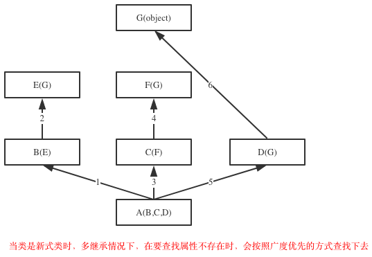

Chapter07-类的封装、继承和多态


# 继承

### 一 初识继承**

**什么是继承**

*继承是一种创建新类的方式，新建的类可以继承一个或多个父类（python支持多继承），父类又可称为基类或超类，新建的类称为派生类或子类。*

*子类会“”遗传”父类的属性，从而解决代码重用问题（比如练习7中Garen与Riven类有很多冗余的代码）*

**python中类的继承分为：单继承和多继承**

[](javascript:void(0);)

```
class ParentClass1: #定义父类
    pass

class ParentClass2: #定义父类
    pass

class SubClass1(ParentClass1): #单继承，基类是ParentClass1，派生类是SubClass
    pass

class SubClass2(ParentClass1,ParentClass2): #python支持多继承，用逗号分隔开多个继承的类
    pass
```

[](javascript:void(0);)

**查看继承**

```
>>> SubClass1.__bases__ #__base__只查看从左到右继承的第一个子类，__bases__则是查看所有继承的父类
(<class '__main__.ParentClass1'>,)
>>> SubClass2.__bases__
(<class '__main__.ParentClass1'>, <class '__main__.ParentClass2'>)
```

**经典类与新式类**

```
1.只有在python2中才分新式类和经典类，python3中统一都是新式类
2.在python2中，没有显式的继承object类的类，以及该类的子类，都是经典类
3.在python2中，显式地声明继承object的类，以及该类的子类，都是新式类
3.在python3中，无论是否继承object，都默认继承object，即python3中所有类均为新式类
#关于新式类与经典类的区别，我们稍后讨论
```

**提示：如果没有指定基类，python的类会默认继承object类，object是所有python类的基类，它提供了一些常见方法（如__str__）的实现。**

```
>>> ParentClass1.__bases__
(<class 'object'>,)
>>> ParentClass2.__bases__
(<class 'object'>,)
```


### **二 继承与抽象（先抽象再继承）**

**继承描述的是子类与父类之间的关系，是一种什么是什么的关系。要找出这种关系，必须先抽象再继承**

抽象即抽取类似或者说比较像的部分。

抽象分成两个层次： 

1.将奥巴马和梅西这俩对象比较像的部分抽取成类； 

2.将人，猪，狗这三个类比较像的部分抽取成父类。

抽象最主要的作用是划分类别（可以隔离关注点，降低复杂度）

 

**继承：是基于抽象的结果，通过编程语言去实现它，肯定是先经历抽象这个过程，才能通过继承的方式去表达出抽象的结构。**

抽象只是分析和设计的过程中，一个动作或者说一种技巧，通过抽象可以得到类


 


### 三 继承与重用性


[](javascript:void(0);)

```
==========================第一部分
例如

　　猫可以：喵喵叫、吃、喝、拉、撒

　　狗可以：汪汪叫、吃、喝、拉、撒

如果我们要分别为猫和狗创建一个类，那么就需要为 猫 和 狗 实现他们所有的功能，伪代码如下：
 

#猫和狗有大量相同的内容
class 猫：

    def 喵喵叫(self):
        print '喵喵叫'

    def 吃(self):
        # do something

    def 喝(self):
        # do something

    def 拉(self):
        # do something

    def 撒(self):
        # do something

class 狗：

    def 汪汪叫(self):
        print '喵喵叫'

    def 吃(self):
        # do something

    def 喝(self):
        # do something

    def 拉(self):
        # do something

    def 撒(self):
        # do something


==========================第二部分
上述代码不难看出，吃、喝、拉、撒是猫和狗都具有的功能，而我们却分别的猫和狗的类中编写了两次。如果使用 继承 的思想，如下实现：

　　动物：吃、喝、拉、撒

　　   猫：喵喵叫（猫继承动物的功能）

　　   狗：汪汪叫（狗继承动物的功能）

伪代码如下：
class 动物:

    def 吃(self):
        # do something

    def 喝(self):
        # do something

    def 拉(self):
        # do something

    def 撒(self):
        # do something

# 在类后面括号中写入另外一个类名，表示当前类继承另外一个类
class 猫(动物)：

    def 喵喵叫(self):
        print '喵喵叫'
        
# 在类后面括号中写入另外一个类名，表示当前类继承另外一个类
class 狗(动物)：

    def 汪汪叫(self):
        print '喵喵叫'


==========================第三部分
#继承的代码实现
class Animal:

    def eat(self):
        print("%s 吃 " %self.name)

    def drink(self):
        print ("%s 喝 " %self.name)

    def shit(self):
        print ("%s 拉 " %self.name)

    def pee(self):
        print ("%s 撒 " %self.name)


class Cat(Animal):

    def __init__(self, name):
        self.name = name
        self.breed = '猫'

    def cry(self):
        print('喵喵叫')

class Dog(Animal):

    def __init__(self, name):
        self.name = name
        self.breed='狗'

    def cry(self):
        print('汪汪叫')


# ######### 执行 #########

c1 = Cat('小白家的小黑猫')
c1.eat()

c2 = Cat('小黑的小白猫')
c2.drink()

d1 = Dog('胖子家的小瘦狗')
d1.eat()
```

[](javascript:void(0);)

 在开发程序的过程中，如果我们定义了一个类A，然后又想新建立另外一个类B，但是类B的大部分内容与类A的相同时

我们不可能从头开始写一个类B，这就用到了类的继承的概念。

通过继承的方式新建类B，让B继承A，B会‘遗传’A的所有属性(数据属性和函数属性)，实现代码重用


[](javascript:void(0);)

```
class Hero:
    def __init__(self,nickname,aggressivity,life_value):
        self.nickname=nickname
        self.aggressivity=aggressivity
        self.life_value=life_value

    def move_forward(self):
        print('%s move forward' %self.nickname)

    def move_backward(self):
        print('%s move backward' %self.nickname)

    def move_left(self):
        print('%s move forward' %self.nickname)

    def move_right(self):
        print('%s move forward' %self.nickname)

    def attack(self,enemy):
        enemy.life_value-=self.aggressivity
class Garen(Hero):
    pass

class Riven(Hero):
    pass

g1=Garen('草丛伦',100,300)
r1=Riven('锐雯雯',57,200)

print(g1.life_value)
r1.attack(g1)
print(g1.life_value)

'''
运行结果
243
'''
```

[](javascript:void(0);)

提示：用已经有的类建立一个新的类，这样就重用了已经有的软件中的一部分设置大部分，大大生了编程工作量，这就是常说的软件重用，不仅可以重用自己的类，也可以继承别人的，比如标准库，来定制新的数据类型，这样就是大大缩短了软件开发周期，对大型软件开发来说，意义重大.

注意：像g1.life_value之类的属性引用，会先从实例中找life_value然后去类中找，然后再去父类中找...直到最顶级的父类。

**重点！！！：再看属性查找**


[](javascript:void(0);)

```
class Foo:
    def f1(self):
        print('Foo.f1')

    def f2(self):
        print('Foo.f2')
        self.f1()

class Bar(Foo):
    def f1(self):
        print('Foo.f1')


b=Bar()
b.f2()
```

[](javascript:void(0);)


### 四 派生

当然子类也可以添加自己新的属性或者在自己这里重新定义这些属性（不会影响到父类），需要注意的是，一旦重新定义了自己的属性且与父类重名，那么调用新增的属性时，就以自己为准了。

```
class Riven(Hero):
    camp='Noxus'
    def attack(self,enemy): #在自己这里定义新的attack,不再使用父类的attack,且不会影响父类
        print('from riven')
    def fly(self): #在自己这里定义新的
        print('%s is flying' %self.nickname)
```

在子类中，新建的重名的函数属性，在编辑函数内功能的时候，有可能需要重用父类中重名的那个函数功能，应该是用调用普通函数的方式，即：类名.func()，此时就与调用普通函数无异了，因此即便是self参数也要为其传值

[](javascript:void(0);)

```
class Riven(Hero):
    camp='Noxus'
    def __init__(self,nickname,aggressivity,life_value,skin):
        Hero.__init__(self,nickname,aggressivity,life_value) #调用父类功能
        self.skin=skin #新属性
    def attack(self,enemy): #在自己这里定义新的attack,不再使用父类的attack,且不会影响父类
        Hero.attack(self,enemy) #调用功能
        print('from riven')
    def fly(self): #在自己这里定义新的
        print('%s is flying' %self.nickname)

r1=Riven('锐雯雯',57,200,'比基尼')
r1.fly()
print(r1.skin)

'''
运行结果
锐雯雯 is flying
比基尼

'''
```

[](javascript:void(0);)


### 五 组合与重用性

**软件重用的重要方式除了继承之外还有另外一种方式，即：组合**

**组合指的是，在一个类中以另外一个类的对象作为数据属性，称为类的组合**

[](javascript:void(0);)

```
>>> class Equip: #武器装备类
...     def fire(self):
...         print('release Fire skill')
... 
>>> class Riven: #英雄Riven的类,一个英雄需要有装备,因而需要组合Equip类
...     camp='Noxus'
...     def __init__(self,nickname):
...         self.nickname=nickname
...         self.equip=Equip() #用Equip类产生一个装备,赋值给实例的equip属性
... 
>>> r1=Riven('锐雯雯')
>>> r1.equip.fire() #可以使用组合的类产生的对象所持有的方法
release Fire skill
```

[](javascript:void(0);)

 

**组合与继承都是有效地利用已有类的资源的重要方式。但是二者的概念和使用场景皆不同，**

**1.继承的方式**

**通过继承建立了派生类与基类之间的关系，它是一种'是'的关系，比如白马是马，人是动物。**

**当类之间有很多相同的功能，提取这些共同的功能做成基类，用继承比较好，比如老师是人，学生是人**

**2.组合的方式**

**用组合的方式建立了类与组合的类之间的关系，它是一种‘有’的关系,比如教授有生日，教授教python和linux课程，教授有学生s1、s2、s3...**


[](javascript:void(0);)

```
class People:
    def __init__(self,name,age,sex):
        self.name=name
        self.age=age
        self.sex=sex

class Course:
    def __init__(self,name,period,price):
        self.name=name
        self.period=period
        self.price=price
    def tell_info(self):
        print('<%s %s %s>' %(self.name,self.period,self.price))

class Teacher(People):
    def __init__(self,name,age,sex,job_title):
        People.__init__(self,name,age,sex)
        self.job_title=job_title
        self.course=[]
        self.students=[]


class Student(People):
    def __init__(self,name,age,sex):
        People.__init__(self,name,age,sex)
        self.course=[]


egon=Teacher('egon',18,'male','沙河霸道金牌讲师')
s1=Student('牛榴弹',18,'female')

python=Course('python','3mons',3000.0)
linux=Course('python','3mons',3000.0)

#为老师egon和学生s1添加课程
egon.course.append(python)
egon.course.append(linux)
s1.course.append(python)

#为老师egon添加学生s1
egon.students.append(s1)


#使用
for obj in egon.course:
    obj.tell_info()
```

[](javascript:void(0);)

**当类之间有显著不同，并且较小的类是较大的类所需要的组件时，用组合比较好**


### **六 接口与归一化设计**

**1.什么是接口**


[](javascript:void(0);)

```
=================第一部分：Java 语言中的接口很好的展现了接口的含义: IAnimal.java
/*
* Java的Interface接口的特征:
* 1)是一组功能的集合,而不是一个功能
* 2)接口的功能用于交互,所有的功能都是public,即别的对象可操作
* 3)接口只定义函数,但不涉及函数实现
* 4)这些功能是相关的,都是动物相关的功能,但光合作用就不适宜放到IAnimal里面了 */

package com.oo.demo;
public interface IAnimal {
    public void eat();
    public void run(); 
    public void sleep(); 
    public void speak();
}

=================第二部分：Pig.java：猪”的类设计,实现了IAnnimal接口 
package com.oo.demo;
public class Pig implements IAnimal{ //如下每个函数都需要详细实现
    public void eat(){
        System.out.println("Pig like to eat grass");
    }

    public void run(){
        System.out.println("Pig run: front legs, back legs");
    }

    public void sleep(){
        System.out.println("Pig sleep 16 hours every day");
    }

    public void speak(){
        System.out.println("Pig can not speak"); }
}

=================第三部分：Person2.java
/*
*实现了IAnimal的“人”,有几点说明一下: 
* 1)同样都实现了IAnimal的接口,但“人”和“猪”的实现不一样,为了避免太多代码导致影响阅读,这里的代码简化成一行,但输出的内容不一样,实际项目中同一接口的同一功能点,不同的类实现完全不一样
* 2)这里同样是“人”这个类,但和前面介绍类时给的类“Person”完全不一样,这是因为同样的逻辑概念,在不同的应用场景下,具备的属性和功能是完全不一样的 */

package com.oo.demo;
public class Person2 implements IAnimal { 
    public void eat(){
        System.out.println("Person like to eat meat");
    }

    public void run(){
        System.out.println("Person run: left leg, right leg");
    }

    public void sleep(){
        System.out.println("Person sleep 8 hours every dat"); 
    }

    public void speak(){
        System.out.println("Hellow world, I am a person");
    } 
}

=================第四部分：Tester03.java
package com.oo.demo;

public class Tester03 {
    public static void main(String[] args) {
        System.out.println("===This is a person==="); 
        IAnimal person = new Person2();
        person.eat();
        person.run();
        person.sleep();
        person.speak();
        
        System.out.println("\n===This is a pig===");
        IAnimal pig = new Pig();
        pig.eat();
        pig.run();
        pig.sleep();
        pig.speak();
    } 
}
```

[](javascript:void(0);)

PS:hi boy，给我开个查询接口。。。此时的接口指的是：自己提供给使用者来调用自己功能的方式\方法\入口

**2. 为何要用接口**

接口提取了一群类共同的函数，可以把接口当做一个函数的集合。

然后让子类去实现接口中的函数。

这么做的意义在于归一化，什么叫归一化，就是只要是基于同一个接口实现的类，那么所有的这些类产生的对象在使用时，从用法上来说都一样。

 

归一化的好处在于：

\1. 归一化让使用者无需关心对象的类是什么，只需要的知道这些对象都具备某些功能就可以了，这极大地降低了使用者的使用难度。

\2. 归一化使得高层的外部使用者可以不加区分的处理所有接口兼容的对象集合

2.1：就好象linux的泛文件概念一样，所有东西都可以当文件处理，不必关心它是内存、磁盘、网络还是屏幕（当然，对底层设计者，当然也可以区分出“字符设备”和“块设备”，然后做出针对性的设计：细致到什么程度，视需求而定）。

2.2：再比如：我们有一个汽车接口，里面定义了汽车所有的功能，然后由本田汽车的类，奥迪汽车的类，大众汽车的类，他们都实现了汽车接口，这样就好办了，大家只需要学会了怎么开汽车，那么无论是本田，还是奥迪，还是大众我们都会开了，开的时候根本无需关心我开的是哪一类车，操作手法（函数调用）都一样

**3. 模仿interface**

在python中根本就没有一个叫做interface的关键字，如果非要去模仿接口的概念

可以借助第三方模块：

<http://pypi.python.org/pypi/zope.interface>

[twisted](http://blog.csdn.net/hanhuili/article/details/9389433)的twisted\internet\interface.py里使用zope.interface

文档https://zopeinterface.readthedocs.io/en/latest/

设计模式：https://github.com/faif/python-patterns

 

也可以使用继承： 

继承的两种用途

一：继承基类的方法，并且做出自己的改变或者扩展（代码重用）：实践中，继承的这种用途意义并不很大，甚至常常是有害的。因为它使得子类与基类出现强耦合。

二：声明某个子类兼容于某基类，定义一个接口类（模仿java的Interface），接口类中定义了一些接口名（就是函数名）且并未实现接口的功能，子类继承接口类，并且实现接口中的功能


[](javascript:void(0);)

```
class Interface:#定义接口Interface类来模仿接口的概念，python中压根就没有interface关键字来定义一个接口。
    def read(self): #定接口函数read
        pass

    def write(self): #定义接口函数write
        pass


class Txt(Interface): #文本，具体实现read和write
    def read(self):
        print('文本数据的读取方法')

    def write(self):
        print('文本数据的读取方法')

class Sata(Interface): #磁盘，具体实现read和write
    def read(self):
        print('硬盘数据的读取方法')

    def write(self):
        print('硬盘数据的读取方法')

class Process(Interface):
    def read(self):
        print('进程数据的读取方法')

    def write(self):
        print('进程数据的读取方法')
```

[](javascript:void(0);)

上面的代码只是看起来像接口，其实并没有起到接口的作用，子类完全可以不用去实现接口 ，这就用到了抽象类


### 七 抽象类

**1 什么是抽象类**

​    *与java一样，python也有抽象类的概念但是同样需要借助模块实现，\**抽象类是一个特殊的类，它的特殊之处在于只能被继承，不能被实例化***

**2 为什么要有抽象类**

​    *如果说\**类是从**一堆**对象**中抽取相同的内容而来的，那么**抽象类**就**是从**一堆**类**中抽取相同的内容而来的，内容包括数据属性和函数属性。*

　 *比如我们有香蕉的类，有苹果的类，有桃子的类，从这些类抽取相同的内容就是水果这个抽象的类，你吃水果时，要么是吃一个具体的香蕉，要么是吃一个具体的桃子。。。。。。你永远无法吃到一个叫做水果的东西。*

​    *从设计角度去看，如果类是从现实对象抽象而来的，那么抽象类就是基于类抽象而来的。*

　 *从实现角度来看，抽象类与普通类的不同之处在于：抽象类中只能有抽象方法（没有实现功能），该类不能被实例化，只能被继承，且子类必须实现抽象方法。这一点与接口有点类似，但其实是不同的，即将揭晓答案*

**3. 在python中实现抽象类**


[](javascript:void(0);)

```
#_*_coding:utf-8_*_
__author__ = 'Linhaifeng'
#一切皆文件
import abc #利用abc模块实现抽象类

class All_file(metaclass=abc.ABCMeta):
    all_type='file'
    @abc.abstractmethod #定义抽象方法，无需实现功能
    def read(self):
        '子类必须定义读功能'
        pass

    @abc.abstractmethod #定义抽象方法，无需实现功能
    def write(self):
        '子类必须定义写功能'
        pass

# class Txt(All_file):
#     pass
#
# t1=Txt() #报错,子类没有定义抽象方法

class Txt(All_file): #子类继承抽象类，但是必须定义read和write方法
    def read(self):
        print('文本数据的读取方法')

    def write(self):
        print('文本数据的读取方法')

class Sata(All_file): #子类继承抽象类，但是必须定义read和write方法
    def read(self):
        print('硬盘数据的读取方法')

    def write(self):
        print('硬盘数据的读取方法')

class Process(All_file): #子类继承抽象类，但是必须定义read和write方法
    def read(self):
        print('进程数据的读取方法')

    def write(self):
        print('进程数据的读取方法')

wenbenwenjian=Txt()

yingpanwenjian=Sata()

jinchengwenjian=Process()

#这样大家都是被归一化了,也就是一切皆文件的思想
wenbenwenjian.read()
yingpanwenjian.write()
jinchengwenjian.read()

print(wenbenwenjian.all_type)
print(yingpanwenjian.all_type)
print(jinchengwenjian.all_type)
```

[](javascript:void(0);)

**4. 抽象类与接口**

*抽象类的本质还是类，指的是一组类的相似性，包括数据属性（如all_type）和函数属性（如read、write），而接口只强调函数属性的相似性。*

**\*抽象类是一个介于类和接口直接的一个概念，同时具备类和接口的部分特性，可以用来实现归一化设计*** 


### 八 **继承实现的原理（可恶的菱形问题）**

**1 继承顺序**

在Java和C#中子类只能继承一个父类，而Python中子类可以同时继承多个父类，如A(B,C,D)

如果继承关系为非菱形结构，则会按照先找B这一条分支，然后再找C这一条分支，最后找D这一条分支的顺序直到找到我们想要的属性

如果继承关系为菱形结构，那么属性的查找方式有两种，分别是：深度优先和广度优先




 View Code

**2 继承原理（python如何实现的继承）**

python到底是如何实现继承的，对于你定义的每一个类，python会计算出一个方法解析顺序(MRO)列表，这个MRO列表就是一个简单的所有基类的线性顺序列表，例如

```
>>> F.mro() #等同于F.__mro__
[<class '__main__.F'>, <class '__main__.D'>, <class '__main__.B'>, <class '__main__.E'>, <class '__main__.C'>, <class '__main__.A'>, <class 'object'>]
```

 

为了实现继承,python会在MRO列表上从左到右开始查找基类,直到找到第一个匹配这个属性的类为止。
而这个MRO列表的构造是通过一个C3线性化算法来实现的。我们不去深究这个算法的数学原理,它实际上就是合并所有父类的MRO列表并遵循如下三条准则:
1.子类会先于父类被检查
2.多个父类会根据它们在列表中的顺序被检查
3.如果对下一个类存在两个合法的选择,选择第一个父类


### 九 子类中调用父类的方法

方法一：指名道姓，即父类名.父类方法()


[](javascript:void(0);)

```
#_*_coding:utf-8_*_
__author__ = 'Linhaifeng'

class Vehicle: #定义交通工具类
     Country='China'
     def __init__(self,name,speed,load,power):
         self.name=name
         self.speed=speed
         self.load=load
         self.power=power

     def run(self):
         print('开动啦...')

class Subway(Vehicle): #地铁
    def __init__(self,name,speed,load,power,line):
        Vehicle.__init__(self,name,speed,load,power)
        self.line=line

    def run(self):
        print('地铁%s号线欢迎您' %self.line)
        Vehicle.run(self)

line13=Subway('中国地铁','180m/s','1000人/箱','电',13)
line13.run()
```

[](javascript:void(0);)

方法二：super()


[](javascript:void(0);)

```
class Vehicle: #定义交通工具类
     Country='China'
     def __init__(self,name,speed,load,power):
         self.name=name
         self.speed=speed
         self.load=load
         self.power=power

     def run(self):
         print('开动啦...')

class Subway(Vehicle): #地铁
    def __init__(self,name,speed,load,power,line):
        #super(Subway,self) 就相当于实例本身 在python3中super()等同于super(Subway,self)
        super().__init__(name,speed,load,power)
        self.line=line

    def run(self):
        print('地铁%s号线欢迎您' %self.line)
        super(Subway,self).run()

class Mobike(Vehicle):#摩拜单车
    pass

line13=Subway('中国地铁','180m/s','1000人/箱','电',13)
line13.run()
```

[](javascript:void(0);)

**强调：二者使用哪一种都可以，但最好不要混合使用** 

 

了解部分：

即使没有直接继承关系，super仍然会按照mro继续往后查找


[](javascript:void(0);)

```
#A没有继承B,但是A内super会基于C.mro()继续往后找
class A:
    def test(self):
        super().test()
class B:
    def test(self):
        print('from B')
class C(A,B):
    pass

c=C()
c.test() #打印结果:from B


print(C.mro())
#[<class '__main__.C'>, <class '__main__.A'>, <class '__main__.B'>, <class 'object'>]
```

[](javascript:void(0);)

指名道姓与super()的区别


[](javascript:void(0);)

```
#指名道姓
class A:
    def __init__(self):
        print('A的构造方法')
class B(A):
    def __init__(self):
        print('B的构造方法')
        A.__init__(self)


class C(A):
    def __init__(self):
        print('C的构造方法')
        A.__init__(self)


class D(B,C):
    def __init__(self):
        print('D的构造方法')
        B.__init__(self)
        C.__init__(self)

    pass
f1=D() #A.__init__被重复调用
'''
D的构造方法
B的构造方法
A的构造方法
C的构造方法
A的构造方法
'''


#使用super()
class A:
    def __init__(self):
        print('A的构造方法')
class B(A):
    def __init__(self):
        print('B的构造方法')
        super(B,self).__init__()


class C(A):
    def __init__(self):
        print('C的构造方法')
        super(C,self).__init__()


class D(B,C):
    def __init__(self):
        print('D的构造方法')
        super(D,self).__init__()

f1=D() #super()会基于mro列表,往后找
'''
D的构造方法
B的构造方法
C的构造方法
A的构造方法
'''
```

[](javascript:void(0);)

*当你使用super()函数时,Python会在MRO列表上继续搜索下一个类。只要每个重定义的方法统一使用super()并只调用它一次,那么控制流最终会遍历完整个MRO列表,每个方法也只会被调用一次（\**注意注意注意：使用super调用的所有属性，都是从MRO列表当前的位置往后找，千万不要通过看代码去找继承关系，一定要看MRO列表**）*


# 多态

### **一 多态**

多态指的是一类事物有多种形态

动物有多种形态：人，狗，猪

[](javascript:void(0);)

```
import abc
class Animal(metaclass=abc.ABCMeta): #同一类事物:动物
    @abc.abstractmethod
    def talk(self):
        pass

class People(Animal): #动物的形态之一:人
    def talk(self):
        print('say hello')

class Dog(Animal): #动物的形态之二:狗
    def talk(self):
        print('say wangwang')

class Pig(Animal): #动物的形态之三:猪
    def talk(self):
        print('say aoao')
```

[](javascript:void(0);)

文件有多种形态：文本文件，可执行文件

[](javascript:void(0);)

```
import abc
class File(metaclass=abc.ABCMeta): #同一类事物:文件
    @abc.abstractmethod
    def click(self):
        pass

class Text(File): #文件的形态之一:文本文件
    def click(self):
        print('open file')

class ExeFile(File): #文件的形态之二:可执行文件
    def click(self):
        print('execute file')
```

[](javascript:void(0);)

 


### 二 多态性

**一 什么是多态动态绑定（在继承的背景下使用时，有时也称为多态性）**

**多态性是指在不考虑实例类型的情况下使用实例**


```
在面向对象方法中一般是这样表述多态性：向不同的对象发送同一条消息（！！！obj.func():是调用了obj的方法func，又称为向obj发送了一条消息func），不同的对象在接收时会产生不同的行为（即方法）。也就是说，每个对象可以用自己的方式去响应共同的消息。所谓消息，就是调用函数，不同的行为就是指不同的实现，即执行不同的函数。

比如：老师.下课铃响了（），学生.下课铃响了()，老师执行的是下班操作，学生执行的是放学操作，虽然二者消息一样，但是执行的效果不同
```

 

**多态性分为静态多态性和动态多态性**

　　*静态多态性：如任何类型都可以用运算符+进行运算*

　　*动态多态性：如下*

[](javascript:void(0);)

```
peo=People()
dog=Dog()
pig=Pig()

#peo、dog、pig都是动物,只要是动物肯定有talk方法
#于是我们可以不用考虑它们三者的具体是什么类型,而直接使用
peo.talk()
dog.talk()
pig.talk()

#更进一步,我们可以定义一个统一的接口来使用
def func(obj):
    obj.talk()
```

[](javascript:void(0);)

**二 为什么要用多态性（多态性的好处）**

其实大家从上面多态性的例子可以看出，我们并没有增加什么新的知识，也就是说python本身就是支持多态性的，这么做的好处是什么呢？

1.增加了程序的灵活性

　　*以不变应万变，不论对象千变万化，使用者都是同一种形式去调用，如func(animal)*

2.增加了程序额可扩展性

　　*通过继承animal类创建了一个新的类，使用者无需更改自己的代码，还是用func(animal)去调用* 　　　　

[](javascript:void(0);)

```
>>> class Cat(Animal): #属于动物的另外一种形态：猫
...     def talk(self):
...         print('say miao')
... 
>>> def func(animal): #对于使用者来说，自己的代码根本无需改动
...     animal.talk()
... 
>>> cat1=Cat() #实例出一只猫
>>> func(cat1) #甚至连调用方式也无需改变，就能调用猫的talk功能
say miao

'''
这样我们新增了一个形态Cat，由Cat类产生的实例cat1，使用者可以在完全不需要修改自己代码的情况下。使用和人、狗、猪一样的方式调用cat1的talk方法，即func(cat1)
'''
```

[](javascript:void(0);)

**三  鸭子类型**

逗比时刻：

　　Python崇尚鸭子类型，即‘如果看起来像、叫声像而且走起路来像鸭子，那么它就是鸭子’

python程序员通常根据这种行为来编写程序。例如，如果想编写现有对象的自定义版本，可以继承该对象

也可以创建一个外观和行为像，但与它无任何关系的全新对象，后者通常用于保存程序组件的松耦合度。

例1：利用标准库中定义的各种‘与文件类似’的对象，尽管这些对象的工作方式像文件，但他们没有继承内置文件对象的方法


[](javascript:void(0);)

```
#二者都像鸭子,二者看起来都像文件,因而就可以当文件一样去用
class TxtFile:
    def read(self):
        pass

    def write(self):
        pass

class DiskFile:
    def read(self):
        pass
    def write(self):
        pass
```

[](javascript:void(0);)

 

例2：其实大家一直在享受着多态性带来的好处，比如Python的序列类型有多种形态：字符串，列表，元组，多态性体现如下


[](javascript:void(0);)

```
#str,list,tuple都是序列类型
s=str('hello')
l=list([1,2,3])
t=tuple((4,5,6))

#我们可以在不考虑三者类型的前提下使用s,l,t
s.__len__()
l.__len__()
t.__len__()

len(s)
len(l)
len(t)
```

[](javascript:void(0);)


# 封装


### 一 引子

从封装本身的意思去理解，封装就好像是拿来一个麻袋，把小猫，小狗，小王八，还有alex一起装进麻袋，然后把麻袋封上口子。照这种逻辑看，封装=‘隐藏’，这种理解是相当片面的


### 二 先看如何隐藏

**\*在python中用双下划线开头的方式将属性隐藏起来（设置成私有的）***

[](javascript:void(0);)

```python
#其实这仅仅这是一种变形操作且仅仅只在类定义阶段发生变形
#类中所有双下划线开头的名称如__x都会在类定义时自动变形成：_类名__x的形式：

class A:
    __N=0 #类的数据属性就应该是共享的,但是语法上是可以把类的数据属性设置成私有的如__N,会变形为_A__N
    def __init__(self):
        self.__X=10 #变形为self._A__X
    def __foo(self): #变形为_A__foo
        print('from A')
    def bar(self):
        self.__foo() #只有在类内部才可以通过__foo的形式访问到.

#A._A__N是可以访问到的，
#这种，在外部是无法通过__x这个名字访问到。

__开头的语法只在定义阶段发生变形，类内部函数调用时已经变过形了。
定义结束以后，实例已经产生，再给实例增加__开头的属性，不会变形。
```


这种变形需要注意的问题是：

**\*1.这种机制也并没有真正意义上限制我们从外部直接访问属性，知道了类名和属性名就可以拼出名字：_类名__属性，然后就可以访问了，如a._A__N，*****即这种操作并不是严格意义上的限制外部访问，仅仅只是一种语法意义上的变形，主要用来限制外部的直接访问。**

**\*2.变形的过程只在类的定义时发生一次,在定义后的赋值操作，不会变形***

**

**\*3.在继承中，父类如果不想让子类覆盖自己的方法，可以将方法定义为私有的***


[](javascript:void(0);)

```
#正常情况
>>> class A:
...     def fa(self):
...         print('from A')
...     def test(self):
...         self.fa()
... 
>>> class B(A):
...     def fa(self):
...         print('from B')
... 
>>> b=B()
>>> b.test()
from B
 

#把fa定义成私有的，即__fa
>>> class A:
...     def __fa(self): #在定义时就变形为_A__fa
...         print('from A')
...     def test(self):
...         self.__fa() #只会与自己所在的类为准,即调用_A__fa
... 
>>> class B(A):
...     def __fa(self):
...         print('from B')
... 
>>> b=B()
>>> b.test()
from A
```

[](javascript:void(0);)


### 三 **封装不是单纯意义的隐藏**

**封装的真谛在于明确地区分内外，封装的属性可以直接在内部使用，而不能被外部直接使用，然而定义属性的目的终归是要用，外部要想用类隐藏的属性，需要我们为其开辟接口，让外部能够间接地用到我们隐藏起来的属性，那这么做的意义何在？？？**

1：封装数据：将数据隐藏起来这不是目的。隐藏起来然后对外提供操作该数据的接口，然后我们可以在接口附加上对该数据操作的限制，以此完成对数据属性操作的严格控制。


[](javascript:void(0);)

```
class Teacher:
    def __init__(self,name,age):
        # self.__name=name
        # self.__age=age
        self.set_info(name,age)

    def tell_info(self):
        print('姓名:%s,年龄:%s' %(self.__name,self.__age))
    def set_info(self,name,age):
        if not isinstance(name,str):
            raise TypeError('姓名必须是字符串类型')
        if not isinstance(age,int):
            raise TypeError('年龄必须是整型')
        self.__name=name
        self.__age=age


t=Teacher('egon',18)
t.tell_info()

t.set_info('egon',19)
t.tell_info()
```

[](javascript:void(0);)

2：封装方法：目的是隔离复杂度

封装方法举例： 

*1. 你的身体没有一处不体现着封装的概念：你的身体把膀胱尿道等等这些尿的功能隐藏了起来，然后为你提供一个尿的接口就可以了（接口就是你的。。。，），你总不能把膀胱挂在身体外面，上厕所的时候就跟别人炫耀：hi，man，你瞅我的膀胱，看看我是怎么尿的。*

*2. 电视机本身是一个黑盒子，隐藏了所有细节，但是一定会对外提供了一堆按钮，这些按钮也正是接口的概念，所以说，封装并不是单纯意义的隐藏！！！*

*3. 快门就是傻瓜相机为傻瓜们提供的方法，该方法将内部复杂的照相功能都隐藏起来了*

*提示：在编程语言里，对外提供的接口（接口可理解为了一个入口），可以是函数，称为接口函数，这与接口的概念还不一样，接口代表一组接口函数的集合体。*


[](javascript:void(0);)

```
#取款是功能,而这个功能有很多功能组成:插卡、密码认证、输入金额、打印账单、取钱
#对使用者来说,只需要知道取款这个功能即可,其余功能我们都可以隐藏起来,很明显这么做
#隔离了复杂度,同时也提升了安全性

class ATM:
    def __card(self):
        print('插卡')
    def __auth(self):
        print('用户认证')
    def __input(self):
        print('输入取款金额')
    def __print_bill(self):
        print('打印账单')
    def __take_money(self):
        print('取款')

    def withdraw(self):
        self.__card()
        self.__auth()
        self.__input()
        self.__print_bill()
        self.__take_money()

a=ATM()
a.withdraw()
```

[](javascript:void(0);)

3: 了解

*python并不会真的阻止你访问私有的属性，模块也遵循这种约定，如果模块名以单下划线开头，那么from module import \*时不能被导入,但是你from module import _private_module依然是可以导入的*

*其实很多时候你去调用一个模块的功能时会遇到单下划线开头的(socket._socket,sys._home,sys._clear_type_cache),这些都是私有的，原则上是供内部调用的，作为外部的你，一意孤行也是可以用的，只不过显得稍微傻逼一点点*

*python要想与其他编程语言一样，严格控制属性的访问权限，只能借助内置方法如__getattr__，详见面向对象进阶*


## 四、特性(property) 

**什么是特性property**

*property是一种特殊的属性，访问它时会执行一段功能（函数）然后返回值*

例一：BMI指数（bmi是计算而来的，但很明显它听起来像是一个属性而非方法，如果我们将其做成一个属性，更便于理解）

成人的BMI数值：

过轻：低于18.5

正常：18.5-23.9

过重：24-27

肥胖：28-32

非常肥胖, 高于32

　　体质指数（BMI）=体重（kg）÷身高^2（m）

　　EX：70kg÷（1.75×1.75）=22.86


```
class People:
    def __init__(self,name,weight,height):
        self.name=name
        self.weight=weight
        self.height=height
    @property
    def bmi(self):
        return self.weight / (self.height**2)

p1=People('egon',75,1.85)
print(p1.bmi)
```


例二：圆的周长和面积 

```
import math
class Circle:
    def __init__(self,radius): #圆的半径radius
        self.radius=radius

    @property
    def area(self):
        return math.pi * self.radius**2 #计算面积

    @property
    def perimeter(self):
        return 2*math.pi*self.radius #计算周长

c=Circle(10)
print(c.radius)
print(c.area) #可以向访问数据属性一样去访问area,会触发一个函数的执行,动态计算出一个值
print(c.perimeter) #同上
'''
输出结果:
314.1592653589793
62.83185307179586
'''
```

[](javascript:void(0);)

```
#注意：此时的特性arear和perimeter不能被赋值
c.area=3 #为特性area赋值
'''
抛出异常:
AttributeError: can't set attribute
'''
```

**为什么要用property**

将一个类的函数定义成特性以后，对象再去使用的时候obj.name,根本无法察觉自己的name是执行了一个函数然后计算出来的，这种特性的使用方式**遵循了统一访问的原则**

除此之外，看下

[](javascript:void(0);)

```
ps：面向对象的封装有三种方式:
【public】
这种其实就是不封装,是对外公开的
【protected】
这种封装方式对外不公开,但对朋友(friend)或者子类(形象的说法是“儿子”,但我不知道为什么大家 不说“女儿”,就像“parent”本来是“父母”的意思,但中文都是叫“父类”)公开
【private】
这种封装对谁都不公开
```

[](javascript:void(0);)

python并没有在语法上把它们三个内建到自己的class机制中，在C++里一般会将所有的所有的数据都设置为私有的，然后提供set和get方法（接口）去设置和获取，在python中通过property方法可以实现

[](javascript:void(0);)

```
class Foo:
    def __init__(self,val):
        self.__NAME=val #将所有的数据属性都隐藏起来

    @property
    def name(self):
        return self.__NAME #obj.name访问的是self.__NAME(这也是真实值的存放位置)

    @name.setter
    def name(self,value):
        if not isinstance(value,str):  #在设定值之前进行类型检查
            raise TypeError('%s must be str' %value)
        self.__NAME=value #通过类型检查后,将值value存放到真实的位置self.__NAME

    @name.deleter
    def name(self):
        raise TypeError('Can not delete')

f=Foo('egon')
print(f.name)
# f.name=10 #抛出异常'TypeError: 10 must be str'
del f.name #抛出异常'TypeError: Can not delete'
```

[](javascript:void(0);)


[](javascript:void(0);)

```
class Foo:
    def __init__(self,val):
        self.__NAME=val #将所有的数据属性都隐藏起来

    def getname(self):
        return self.__NAME #obj.name访问的是self.__NAME(这也是真实值的存放位置)

    def setname(self,value):
        if not isinstance(value,str):  #在设定值之前进行类型检查
            raise TypeError('%s must be str' %value)
        self.__NAME=value #通过类型检查后,将值value存放到真实的位置self.__NAME

    def delname(self):
        raise TypeError('Can not delete')

    name=property(getname,setname,delname) #不如装饰器的方式清晰
```

[](javascript:void(0);)


## 五、封装与扩展性

*封装在于明确区分内外，使得类实现者可以修改封装内的东西而不影响外部调用者的代码；而外部使用用者只知道一个接口(函数)，只要接口（函数）名、参数不变，使用者的代码永远无需改变。这就提供一个良好的合作基础——或者说，只要接口这个基础约定不变，则代码改变不足为虑。*


```python
#类的设计者
class Room:
    def __init__(self,name,owner,width,length,high):
        self.name=name
        self.owner=owner
        self.__width=width
        self.__length=length
        self.__high=high
    def tell_area(self): #对外提供的接口，隐藏了内部的实现细节，此时我们想求的是面积
        return self.__width * self.__length


#使用者
>>> r1=Room('卧室','egon',20,20,20)
>>> r1.tell_area() #使用者调用接口tell_area
400


#类的设计者，轻松的扩展了功能，而类的使用者完全不需要改变自己的代码
class Room:
    def __init__(self,name,owner,width,length,high):
        self.name=name
        self.owner=owner
        self.__width=width
        self.__length=length
        self.__high=high
    def tell_area(self): #对外提供的接口，隐藏内部实现，此时我们想求的是体积,内部逻辑变了,只需求修该下列一行就可以很简答的实现,而且外部调用感知不到,仍然使用该方法，但是功能已经变了
        return self.__width * self.__length * self.__high


#对于仍然在使用tell_area接口的人来说，根本无需改动自己的代码，就可以用上新功能
>>> r1.tell_area()
8000
```


## 七、绑定与非绑定

在类内部定义的函数，都是绑定到对象身上的方法。


补充：

init不负责创建对象，只是在已经创建出对象的基础之上，为对象添加属性。（初始化属性）


