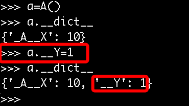

### 一 引子

从封装本身的意思去理解，封装就好像是拿来一个麻袋，把小猫，小狗，小王八，还有alex一起装进麻袋，然后把麻袋封上口子。照这种逻辑看，封装=‘隐藏’，这种理解是相当片面的


### 二 先看如何隐藏

**\*在python中用双下划线开头的方式将属性隐藏起来（设置成私有的）***

```python
#其实这仅仅这是一种变形操作且仅仅只在类定义阶段发生变形
#类中所有双下划线开头的名称如__x都会在类定义时自动变形成：_类名__x的形式：

class A:
    __N=0 #类的数据属性就应该是共享的,但是语法上是可以把类的数据属性设置成私有的如__N,会变形为_A__N
    def __init__(self):
        self.__X=10 #变形为self._A__X
    def __foo(self): #变形为_A__foo
        print('from A')
    def bar(self):
        self.__foo() #只有在类内部才可以通过__foo的形式访问到.

#A._A__N是可以访问到的，
#这种，在外部是无法通过__x这个名字访问到。
```


这种变形需要注意的问题是：

**\*1.这种机制也并没有真正意义上限制我们从外部直接访问属性，知道了类名和属性名就可以拼出名字：_类名__属性，然后就可以访问了，如a._A__N，*****即这种操作并不是严格意义上的限制外部访问，仅仅只是一种语法意义上的变形，主要用来限制外部的直接访问。**

**\*2.变形的过程只在类的定义时发生一次,在定义后的赋值操作，不会变形***

**

**\*3.在继承中，父类如果不想让子类覆盖自己的方法，可以将方法定义为私有的***

```python
#正常情况
>>> class A:
...     def fa(self):
...         print('from A')
...     def test(self):
...         self.fa()
... 
>>> class B(A):
...     def fa(self):
...         print('from B')
... 
>>> b=B()
>>> b.test()
from B
 

#把fa定义成私有的，即__fa
>>> class A:
...     def __fa(self): #在定义时就变形为_A__fa
...         print('from A')
...     def test(self):
...         self.__fa() #只会与自己所在的类为准,即调用_A__fa
... 
>>> class B(A):
...     def __fa(self):
...         print('from B')
... 
>>> b=B()
>>> b.test()
from A
```


### 三 **封装不是单纯意义的隐藏**

**封装的真谛在于明确地区分内外，封装的属性可以直接在内部使用，而不能被外部直接使用，然而定义属性的目的终归是要用，外部要想用类隐藏的属性，需要我们为其开辟接口，让外部能够间接地用到我们隐藏起来的属性，那这么做的意义何在？？？**

1：封装数据：将数据隐藏起来这不是目的。隐藏起来然后对外提供操作该数据的接口，然后我们可以在接口附加上对该数据操作的限制，以此完成对数据属性操作的严格控制。

```python
class Teacher:
    def __init__(self,name,age):
        # self.__name=name
        # self.__age=age
        self.set_info(name,age)

    def tell_info(self):
        print('姓名:%s,年龄:%s' %(self.__name,self.__age))
    def set_info(self,name,age):
        if not isinstance(name,str):
            raise TypeError('姓名必须是字符串类型')
        if not isinstance(age,int):
            raise TypeError('年龄必须是整型')
        self.__name=name
        self.__age=age


t=Teacher('egon',18)
t.tell_info()

t.set_info('egon',19)
t.tell_info()
```


2：封装方法：目的是隔离复杂度

封装方法举例： 

*1. 你的身体没有一处不体现着封装的概念：你的身体把膀胱尿道等等这些尿的功能隐藏了起来，然后为你提供一个尿的接口就可以了（接口就是你的。。。，），你总不能把膀胱挂在身体外面，上厕所的时候就跟别人炫耀：hi，man，你瞅我的膀胱，看看我是怎么尿的。*

*2. 电视机本身是一个黑盒子，隐藏了所有细节，但是一定会对外提供了一堆按钮，这些按钮也正是接口的概念，所以说，封装并不是单纯意义的隐藏！！！*

*3. 快门就是傻瓜相机为傻瓜们提供的方法，该方法将内部复杂的照相功能都隐藏起来了*

*提示：在编程语言里，对外提供的接口（接口可理解为了一个入口），可以是函数，称为接口函数，这与接口的概念还不一样，接口代表一组接口函数的集合体。*

隔离复杂度的例子

```python
#取款是功能,而这个功能有很多功能组成:插卡、密码认证、输入金额、打印账单、取钱
#对使用者来说,只需要知道取款这个功能即可,其余功能我们都可以隐藏起来,很明显这么做
#隔离了复杂度,同时也提升了安全性

class ATM:
    def __card(self):
        print('插卡')
    def __auth(self):
        print('用户认证')
    def __input(self):
        print('输入取款金额')
    def __print_bill(self):
        print('打印账单')
    def __take_money(self):
        print('取款')

    def withdraw(self):
        self.__card()
        self.__auth()
        self.__input()
        self.__print_bill()
        self.__take_money()

a=ATM()
a.withdraw()
```


3: 了解

*python并不会真的阻止你访问私有的属性，模块也遵循这种约定，如果模块名以单下划线开头，那么from module import \*时不能被导入,但是你from module import _private_module依然是可以导入的*

*其实很多时候你去调用一个模块的功能时会遇到单下划线开头的(socket._socket,sys._home,sys._clear_type_cache),这些都是私有的，原则上是供内部调用的，作为外部的你，一意孤行也是可以用的，只不过显得稍微傻逼一点点*

*python要想与其他编程语言一样，严格控制属性的访问权限，只能借助内置方法如__getattr__，详见面向对象进阶*


### 四 特性(property) 

**什么是特性property**

*property是一种特殊的属性，访问它时会执行一段功能（函数）然后返回值*

例一：BMI指数（bmi是计算而来的，但很明显它听起来像是一个属性而非方法，如果我们将其做成一个属性，更便于理解）

成人的BMI数值：

过轻：低于18.5

正常：18.5-23.9

过重：24-27

肥胖：28-32

非常肥胖, 高于32

　　体质指数（BMI）=体重（kg）÷身高^2（m）

　　EX：70kg÷（1.75×1.75）=22.86

```python
class People:
    def __init__(self,name,weight,height):
        self.name=name
        self.weight=weight
        self.height=height
    @property
    def bmi(self):
        return self.weight / (self.height**2)

p1=People('egon',75,1.85)
print(p1.bmi)
```

 

例二：圆的周长和面积 

```python
import math
class Circle:
    def __init__(self,radius): #圆的半径radius
        self.radius=radius

    @property
    def area(self):
        return math.pi * self.radius**2 #计算面积

    @property
    def perimeter(self):
        return 2*math.pi*self.radius #计算周长

c=Circle(10)
print(c.radius)
print(c.area) #可以向访问数据属性一样去访问area,会触发一个函数的执行,动态计算出一个值
print(c.perimeter) #同上
'''
输出结果:
314.1592653589793
62.83185307179586
'''
```


```python
#注意：此时的特性arear和perimeter不能被赋值
c.area=3 #为特性area赋值
'''
抛出异常:
AttributeError: can't set attribute
'''
```

**为什么要用property**

将一个类的函数定义成特性以后，对象再去使用的时候obj.name,根本无法察觉自己的name是执行了一个函数然后计算出来的，这种特性的使用方式**遵循了统一访问的原则**

除此之外，看下

```python
ps：面向对象的封装有三种方式:
【public】
这种其实就是不封装,是对外公开的
【protected】
这种封装方式对外不公开,但对朋友(friend)或者子类(形象的说法是“儿子”,但我不知道为什么大家 不说“女儿”,就像“parent”本来是“父母”的意思,但中文都是叫“父类”)公开
【private】
这种封装对谁都不公开
```


python并没有在语法上把它们三个内建到自己的class机制中，在C++里一般会将所有的所有的数据都设置为私有的，然后提供set和get方法（接口）去设置和获取，在python中通过property方法可以实现

```python
class Foo:
    def __init__(self,val):
        self.__NAME=val #将所有的数据属性都隐藏起来

    @property
    def name(self):
        return self.__NAME #obj.name访问的是self.__NAME(这也是真实值的存放位置)

    @name.setter
    def name(self,value):
        if not isinstance(value,str):  #在设定值之前进行类型检查
            raise TypeError('%s must be str' %value)
        self.__NAME=value #通过类型检查后,将值value存放到真实的位置self.__NAME

    @name.deleter
    def name(self):
        raise TypeError('Can not delete')

f=Foo('egon')
print(f.name)
# f.name=10 #抛出异常'TypeError: 10 must be str'
del f.name #抛出异常'TypeError: Can not delete'
```

了解：一种property的古老用

```python
class Foo:
    def __init__(self,val):
        self.__NAME=val #将所有的数据属性都隐藏起来

    def getname(self):
        return self.__NAME #obj.name访问的是self.__NAME(这也是真实值的存放位置)

    def setname(self,value):
        if not isinstance(value,str):  #在设定值之前进行类型检查
            raise TypeError('%s must be str' %value)
        self.__NAME=value #通过类型检查后,将值value存放到真实的位置self.__NAME

    def delname(self):
        raise TypeError('Can not delete')

    name=property(getname,setname,delname) #不如装饰器的方式清晰
```


### 五 封装与扩展性

*封装在于明确区分内外，使得类实现者可以修改封装内的东西而不影响外部调用者的代码；而外部使用用者只知道一个接口(函数)，只要接口（函数）名、参数不变，使用者的代码永远无需改变。这就提供一个良好的合作基础——或者说，只要接口这个基础约定不变，则代码改变不足为虑。*

```python
#类的设计者
class Room:
    def __init__(self,name,owner,width,length,high):
        self.name=name
        self.owner=owner
        self.__width=width
        self.__length=length
        self.__high=high
    def tell_area(self): #对外提供的接口，隐藏了内部的实现细节，此时我们想求的是面积
        return self.__width * self.__length


#使用者
>>> r1=Room('卧室','egon',20,20,20)
>>> r1.tell_area() #使用者调用接口tell_area
400


#类的设计者，轻松的扩展了功能，而类的使用者完全不需要改变自己的代码
class Room:
    def __init__(self,name,owner,width,length,high):
        self.name=name
        self.owner=owner
        self.__width=width
        self.__length=length
        self.__high=high
    def tell_area(self): #对外提供的接口，隐藏内部实现，此时我们想求的是体积,内部逻辑变了,只需求修该下列一行就可以很简答的实现,而且外部调用感知不到,仍然使用该方法，但是功能已经变了
        return self.__width * self.__length * self.__high


#对于仍然在使用tell_area接口的人来说，根本无需改动自己的代码，就可以用上新功能
>>> r1.tell_area()
8000
```


 