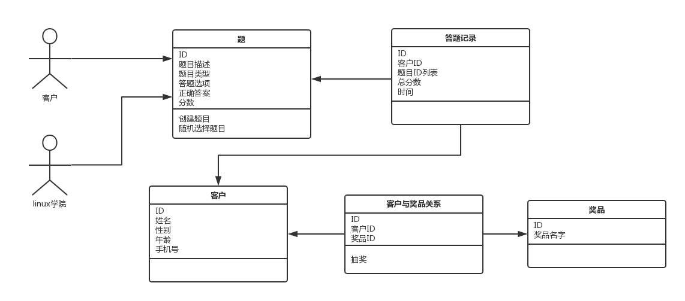
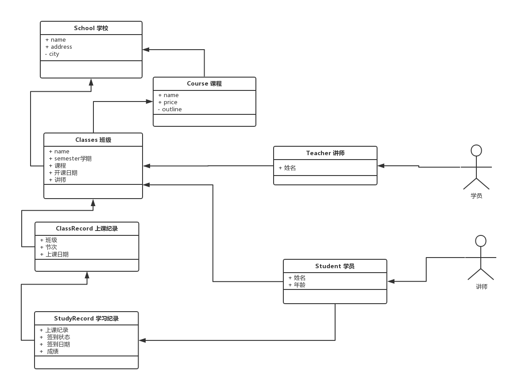

chapter07-面向对象实战


### 一 引子

学完了面向对象的基础知识后，很明显你还是不知该如何下手，凡是都得有个章法

此刻有经验的人可能会想到瀑布模型、螺旋模型、迭代开发、敏捷、RUP等一堆软件工程相关的软件开发流程，但对于大部分人来说这些流程仅仅只是项目管理上的流程

本节我们就带大家来了解下，作为一名程序员基于面向对象开发程序的开发流程：

需求模型->领域模型->设计模型->实现模型


### 二 需求模型之5w1h8c

**1. 需求VS功能**

需求：客户想要的效果，对客户有价值的事情
功能：系统为了实现客户的价值而提供的能力/功能

举例：
汽车：驾驶是需求，刹车、加速、转弯是功能
打印机：打印是需求，进纸、设定、与电脑连接等是功能

　　pos机：买单是需求，商品扫描、金额汇总、收银等是功能

**2. 需求的重要性**

1/3的项目失败或陷入困境是因为需求原因导致的
garbage in，garbage out
屎上了生产饼干的流水线，最后产出的是像饼干一样的屎


修复需求错误的问题成本极高

1 编码阶段修复发现一个错误耗费人类是1个单位
2 测试阶段修复需求错误的成本是5-10倍
3 维护阶段（产品上线后），修复需求错误成本是20倍
ps：在需求阶段修复错误，成本只需要0.1-0.2即可
结论：需求错了，几乎要把软件项目重做一遍

**3. 需求分析的目的**

1 记录员，记录客户的需求
2 分析员，和客户一起分析，完善需求
3 引导员，能够引导客户的需求


**4. 需求分析的方法**

需求分析518方法，简称我要发，具体就是5w1h8c
**5w：**
when:用户想在什么时间用，例如半夜备份的任务，很明显我们得知该需求需要自动化执行
where：用户想在什么地方用，例如垃圾桶室内和室外的区别，同样的事物放到不同地方用肯定不一样
who：用户想让谁来用，不仅是人，也可以是一个系统
what：用户想要我们程序的输出结果是什么，如图片，文档，系统
why：问一问用户为什么要这么做，（你不问，他基本不说），包括客户所有觉得不爽的事情
ps：why是核心


 

**1h：how**
用例方法


**8c：8个constraint约束**
性能performance

*性能是系统提供相应服务的效率。主要包括响应时间、吞吐量*
*性能是很多系统架构设计的关键约束条件之一*
*例如，同样一个web网站，虽然都是提供信息给用户流量，设计一个日访问量1w的网站与日访问量10亿的网站，二者的设计截然不同*

成本cost

*成本指为了实现系统而需要付出的代价*
*成本也是很多系统架构设计的关键约束之一*
*例如客户只愿意花100w，而我们却设计了一个耗费1000w的系统*

时间time

*指客户要求什么时候交付*

可靠性reliability

　　*指系统长时间正确运行的能力，银行、证券、电信这些公司，对宕机时间要求很严格*

安全security

*指对信息安全的保护能力，涉及到钱、身份证、社会保险号等需求对这个要求很高*

合规性compliance

　　*指满足各种行业标准、法律法规、规范等，例如3C、SOX、3GPP，ITUT*

技术性technology

*有的客户可能要求我们采用某种技术*
*例如客户现在都是windows服务器，要求我们基于windows平台开发*

兼容性compatibility

*指我们的产品与客户其他已有的产品或系统的兼容能力，要知道现在很少有产品是孤立运行的，特别是在大企业、大公司中，多个系统都是相互交互、互相配合的。新的系统必须能够和已有的系统配合，否则将无法运行*


ps：
5w+1h属于功能属性
8c属于质量属性


### 三 需求模型之用例的写法

写用例的技巧

```
三段法：NEA
1 正常处理（normal):分析正常流程
2 异常处理(exception)：分析每一步异常情况和对应的处理
3 替代处理(alternative)：分析每一步是否有其他替代方法，以及如何做
```

 

用例的书写格式

```python
#1. 用例名称
一般情况下，用例名称即需求名称

#2. 场景
场景即用例发生的环境，正好对应5w中的：when，where，who

#3. 用例描述
描述详细的用例内容，对应5w中的what和how
即用户应该怎样做，以及每个步骤中的输出，但不要求每个步骤都有一定的输出，可以有也可以没有，也可以有多个

#4. 用例价值
描述用例对应的客户价值，对应5w中的why

#5. 约束和限制
即真个需求流程中相关的约束和限制条件，对应518方法中的8C
```


用例编写案例

```python
#用例名
    答题系统

#场景：
    when：8.10开始
    where：老男孩
    who：linux学院，网络客户

#用例描述：
    1 linux学院提供50道题
    2 每个客户无需输入任何个人信息就可以参与答题，随机选择20道题，给客户回答，每道题5分，
    3.答题结束后，输入手机号，提交，算总分
    4 60分参与抽奖，<60分赠送基础视频


#用户价值：
    答题有奖，答题提交时输入自己的手机号获取成绩，获得潜在客户的联系方式，为后期将客户转成学员做准备

#约束：
    暂无
```


### 四 领域模型

需求分析阶段不区分面向对象还是面向过程

领域模型是完成从需求分析到面向对象设计的一座桥梁

```
#定义：领域模型是对领域内的概念或现实世界中对象的可视化表示，又称为观念模型，领域对象模型，分析对象模型
#它专注于分析问题领域本身，发掘重要的业务领域概念，并建立业务领域概念之间的关系
```

 

领域模型主要两个作用：

```
#1 发掘重要的业务领域概念
#2 建立业务领域概念之间的关系
```


归纳领域建模的方法就是：

```
#1 从用例中找名词（找完后需要删除不是领域对象的名词，具体删除什么，与不同领域有关，没有统一标准，靠经验）
#2 加属性（有些属性并没有在用例中明确给出，靠行业经验自己添加）
#3 连关系（画UML图）
```

 

### 五 设计模型

```
面向对象类设计的具体步骤
    第一步：领域类映射（不是全盘拷贝）
        类筛选：并不是每个领域类都会出现在软件中
        名称映射：对应
        属性映射：对应，照搬
        提炼方法：领域类中并没有方法，在用例中找动词

    第二步：应用设计原则和设计模式
    第三步：拆分辅助类（领域类可以在实现阶段拆分为几个类）
```


### 六 实现模型

选取一种支持面向对象的语言实现我们的设计


### 七 答题系统案例

第一步：需求分析（写用例）

```python
#用例名
    答题系统

#场景：
    when：8.10开始
    where：老男孩
    who：linux学院，网络客户

#用例描述：
    1 linux学院提供50道题
    2 每个客户无需输入任何个人信息就可以参与答题，随机选择20道题，给客户回答，每道题5分，
    3.答题结束后，输入手机号，提交，算总分
    4 60分参与抽奖，<60分赠送基础视频


#用户价值：
    答题有奖，答题提交时输入自己的手机号获取成绩，获得潜在客户的联系方式，为后期将客户转成学员做准备

#约束：
    暂无
```


第二步：领域模型（找名词，加属性，连关系=>出图）

```python
#找名词：
linux学院，题，客户，得分，奖，视频
#筛选：去掉与领域无关的名词。视频应该算作一种奖品
linux学院，题，客户，得分，奖
```


```python
#加属性
加属性
名词         属性                        备注
linux学院    NA                       对于答题系统来说，并不需要linux学院的属性，因此在领域模型中，linux学院是没有属性的
题          题目编号，题目类型，题目描述，答题选项，正确答案，分数
客户        客户编号，姓名，性别，年龄，手机号
答题记录     记录编号，客户编号，题目编号列表，总分数，时间     通过答题记录就可以知道用户是谁，以及用户答过的题目
奖品        奖品编号，奖品名字                    
```


```python
#连关系：画图
1：答题记录是客户与题的关系类，而客户与奖品之间可以建一个关系类，这样以后单查关系类就可以知道谁得了什么奖品
2：找动词：
    创建题目
    随机选择题目
    答题
    提交
    算总分
    抽奖
```



 

第三步：设计模型（略）

第四部：实现模型

```
链接: https://pan.baidu.com/s/1jHYFKWI 密码: wimc
```

 

### 第八 UML图

待整理

类图中通过加号(+)来表示 public 
通过减号(-)表示 private
通过井号(#)表示 protected


### 第九 作业

```python
角色:学校、学员、课程、讲师
要求:
1. 创建北京、上海 2 所学校
2. 创建linux , python , go 3个课程 ， linux\py 在北京开， go 在上海开
3. 课程包含，周期，价格，通过学校创建课程 
4. 通过学校创建班级， 班级关联课程、讲师
5. 创建学员时，选择学校，关联班级
5. 创建讲师角色时要关联学校， 
6. 提供两个角色接口
6.1 学员视图， 可以注册， 交学费， 选择班级，
6.2 讲师视图， 讲师可管理自己的班级， 上课时选择班级， 查看班级学员列表 ， 修改所管理的学员的成绩 
6.3 管理视图，创建讲师， 创建班级，创建课程

7. 上面的操作产生的数据都通过pickle序列化保存到文件里
```


思路：

一：选课系统用例

```python
#用例名称
选课
#场景
who：学生，老师，管理员
where：老男孩
when：任意时间

#用例描述（用户怎么做，或者说用户想怎么用）：
1. 管理员创建学校：北京和上海两个校区
2. 管理员创建课程：python，go，linux
3. 管理员创建班级：python周末18期，python脱产7期，linux架构35期
4. 管理员创建学员：小晴，花野真衣，川岛芳子
5. 管理员创建讲师：alex，egon，wupeiqi，yuanhao
6. 讲师创建上课记录：python周末班18期day7
7. 讲师为day7这节课所有学生批改作业，为每个学生打分
8. 学员杨磊查看自己的详细信息：所在学校，报名课程，所在班级
9. 学员杨磊在python18期day7提交了作业
10.学员杨磊查看了自己在day7作业的成绩列表，然后自杀了
11.学员小晴跟egon表白了，当天下午就去领了结婚证

#用例价值

帮老男孩解决课程管理问题
#约束

暂无
```


二：找名词：

```
管理员，学校，课程，班级，学员讲师，上课记录，作业，分数，学员详细信息，成绩列表，结婚证
筛选：去掉与行业或者说领域无关的名词
管理员，学校，课程，班级，学员，讲师，上课记录，作业，分数，学员详细信息，成绩列表
```

 

三： 加属性：

```
名字                属性      备注
管理员             NA        具备所有权限，对于选课系统来说，并不需要管理员的属性，因此在领域模型中，管理员是没有属性的
学校               学校名，地址，课程列表，班级列表
课程               课程名，周期，价钱，大纲
班级               班级名，所属学校，课程
学员               学员名，
讲师               讲师名
上课记录          班级，课程节次，日期
```


四：连关系



五：实现吧亲