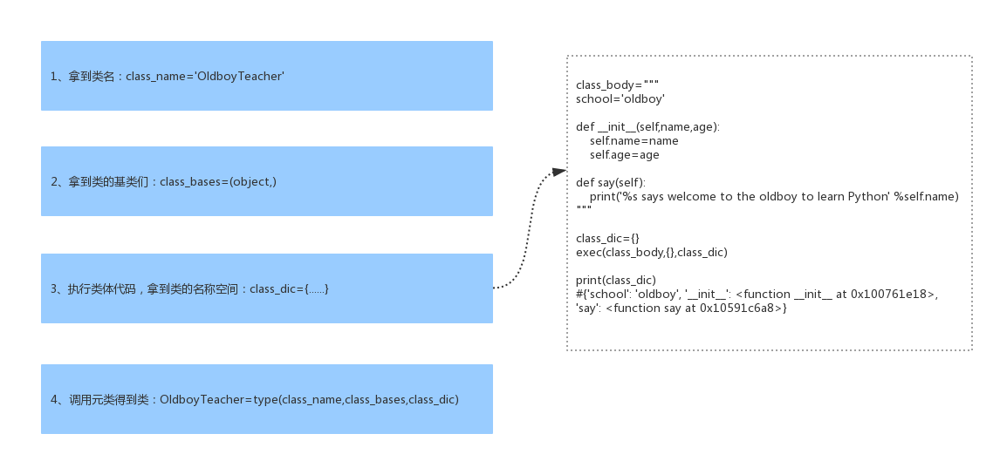
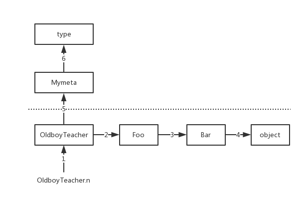
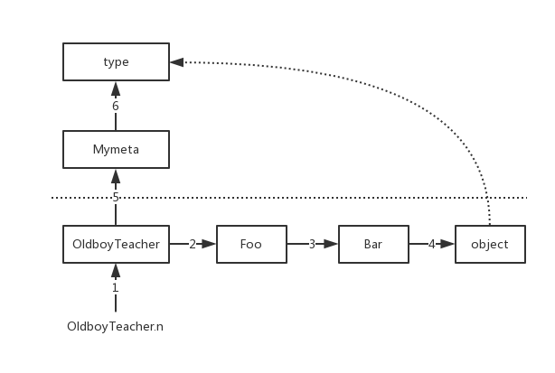

chapter08-metaclass元类


# 一、前言

元类属于python面向对象编程的深层魔法，99%的人都不得要领，一些自以为搞明白元类的人其实也只是自圆其说、点到为止，从对元类的控制上来看就破绽百出、逻辑混乱，今天我就来带大家来深度了解python元类的来龙去脉。

笔者深入浅出的背后是对技术一日复一日的执念，希望可以大家可以尊重原创，为大家能因此文而解开对元类所有的疑惑而感到开心！！！


# 二、什么是元类

一切源自于一句话：python中一切皆为对象。让我们先定义一个类，然后逐步分析

```python
class OldboyTeacher(object):
    school='oldboy'

    def __init__(self,name,age):
        self.name=name
        self.age=age

    def say(self):
        print('%s says welcome to the oldboy to learn Python' %self.name)
```


所有的对象都是实例化或者说调用类而得到的（调用类的过程称为类的实例化），比如对象t1是调用类OldboyTeacher得到的

```python
t1=OldboyTeacher('egon',18)
print(type(t1)) #查看对象t1的类是<class '__main__.OldboyTeacher'>
```

 

如果一切皆为对象，那么类OldboyTeacher本质也是一个对象，既然所有的对象都是调用类得到的，那么OldboyTeacher必然也是调用了一个类得到的，这个类称为元类

**于是我们可以推导出===>产生OldboyTeacher的过程一定发生了：OldboyTeacher=元类(...)**

```python
print(type(OldboyTeacher)) # 结果为<class 'type'>，证明是调用了type这个元类而产生的OldboyTeacher，即默认的元类为type
```


 

# 三、class关键字创建类的流程分析

上文我们基于python中一切皆为对象的概念分析出：我们用class关键字定义的类本身也是一个对象，负责产生该对象的类称之为元类（元类可以简称为类的类），内置的元类为type

class关键字在帮我们创建类时，必然帮我们调用了元类OldboyTeacher=type(...)，那调用type时传入的参数是什么呢？必然是类的关键组成部分，一个类有三大组成部分，分别是

1、类名class_name='OldboyTeacher'

2、基类们class_bases=(object,)

3、类的名称空间class_dic，类的名称空间是执行类体代码而得到的

调用type时会依次传入以上三个参数

 

综上，class关键字帮我们创建一个类应该细分为以下四个过程



补充：exec的用法

```python
#exec：三个参数

#参数一：包含一系列python代码的字符串

#参数二：全局作用域（字典形式），如果不指定，默认为globals()

#参数三：局部作用域（字典形式），如果不指定，默认为locals()

#可以把exec命令的执行当成是一个函数的执行，会将执行期间产生的名字存放于局部名称空间中
g={
    'x':1,
    'y':2
}
l={}

exec('''
global x,z
x=100
z=200

m=300
''',g,l)

print(g) #{'x': 100, 'y': 2,'z':200,......}
print(l) #{'m': 300}
```


# 五、自定义元类控制类OldboyTeacher的创建

一个类没有声明自己的元类，默认他的元类就是type，除了使用内置元类type，我们也可以通过继承type来自定义元类，然后使用metaclass关键字参数为一个类指定元类

```python
class Mymeta(type): #只有继承了type类才能称之为一个元类，否则就是一个普通的自定义类
    pass

class OldboyTeacher(object,metaclass=Mymeta): # OldboyTeacher=Mymeta('OldboyTeacher',(object),{...})
    school='oldboy'

    def __init__(self,name,age):
        self.name=name
        self.age=age

    def say(self):
        print('%s says welcome to the oldboy to learn Python' %self.name)
```


自定义元类可以控制类的产生过程，类的产生过程其实就是元类的调用过程,即OldboyTeacher=Mymeta('OldboyTeacher',(object),{...})，调用Mymeta会先产生一个空对象OldoyTeacher，然后连同调用Mymeta括号内的参数一同传给Mymeta下的__init__方法，完成初始化，于是我们可以

```python
class Mymeta(type): #只有继承了type类才能称之为一个元类，否则就是一个普通的自定义类
    def __init__(self,class_name,class_bases,class_dic):
        # print(self) #<class '__main__.OldboyTeacher'>
        # print(class_bases) #(<class 'object'>,)
        # print(class_dic) #{'__module__': '__main__', '__qualname__': 'OldboyTeacher', 'school': 'oldboy', '__init__': <function OldboyTeacher.__init__ at 0x102b95ae8>, 'say': <function OldboyTeacher.say at 0x10621c6a8>}
        super(Mymeta, self).__init__(class_name, class_bases, class_dic)  # 重用父类的功能

        if class_name.islower():
            raise TypeError('类名%s请修改为驼峰体' %class_name)

        if '__doc__' not in class_dic or len(class_dic['__doc__'].strip(' \n')) == 0:
            raise TypeError('类中必须有文档注释，并且文档注释不能为空')

class OldboyTeacher(object,metaclass=Mymeta): # OldboyTeacher=Mymeta('OldboyTeacher',(object),{...})
    """
    类OldboyTeacher的文档注释
    """
    school='oldboy'

    def __init__(self,name,age):
        self.name=name
        self.age=age

    def say(self):
        print('%s says welcome to the oldboy to learn Python' %self.name)
```


# 六、自定义元类控制类OldboyTeacher的调用

储备知识：`__call__`

```python
class Foo:
    def __call__(self, *args, **kwargs):
        print(self)
        print(args)
        print(kwargs)

obj=Foo()
#1、要想让obj这个对象变成一个可调用的对象，需要在该对象的类中定义一个方法__call__方法，该方法会在调用对象时自动触发
#2、调用obj的返回值就是__call__方法的返回值
res=obj(1,2,3,x=1,y=2) 
```

由上例得知，调用一个对象，就是触发对象所在类中的`__call__`方法的执行，如果把OldboyTeacher也当做一个对象，那么在OldboyTeacher这个对象的类中也必然存在一个`__call__`方法

```python
class Mymeta(type): #只有继承了type类才能称之为一个元类，否则就是一个普通的自定义类
    def __call__(self, *args, **kwargs):
        print(self) #<class '__main__.OldboyTeacher'>
        print(args) #('egon', 18)
        print(kwargs) #{}
        return 123

class OldboyTeacher(object,metaclass=Mymeta):
    school='oldboy'

    def __init__(self,name,age):
        self.name=name
        self.age=age

    def say(self):
        print('%s says welcome to the oldboy to learn Python' %self.name)


# 调用OldboyTeacher就是在调用OldboyTeacher类中的__call__方法
# 然后将OldboyTeacher传给self,溢出的位置参数传给*，溢出的关键字参数传给**
# 调用OldboyTeacher的返回值就是调用__call__的返回值
t1=OldboyTeacher('egon',18)
print(t1) #123
```

 默认地，调用t1=OldboyTeacher('egon',18)会做三件事

1、产生一个空对象obj

2、调用`__init__`方法初始化对象obj

3、返回初始化好的obj

对应着，OldboyTeacher类中的__call__方法也应该做这三件事

```python
class Mymeta(type): #只有继承了type类才能称之为一个元类，否则就是一个普通的自定义类
    def __call__(self, *args, **kwargs): #self=<class '__main__.OldboyTeacher'>
        #1、调用__new__产生一个空对象obj
        obj=self.__new__(self) # 此处的self是类OldoyTeacher，必须传参，代表创建一个OldboyTeacher的对象obj

        #2、调用__init__初始化空对象obj
        self.__init__(obj,*args,**kwargs)

        #3、返回初始化好的对象obj
        return obj

class OldboyTeacher(object,metaclass=Mymeta):
    school='oldboy'

    def __init__(self,name,age):
        self.name=name
        self.age=age

    def say(self):
        print('%s says welcome to the oldboy to learn Python' %self.name)

t1=OldboyTeacher('egon',18)
print(t1.__dict__) #{'name': 'egon', 'age': 18}
```

 

上例的`__call__`相当于一个模板，我们可以在该基础上改写`__call__`的逻辑从而控制调用OldboyTeacher的过程，比如将OldboyTeacher的对象的所有属性都变成私有的

```python
class Mymeta(type): #只有继承了type类才能称之为一个元类，否则就是一个普通的自定义类
    def __call__(self, *args, **kwargs): #self=<class '__main__.OldboyTeacher'>
        #1、调用__new__产生一个空对象obj
        obj=self.__new__(self) # 此处的self是类OldoyTeacher，必须传参，代表创建一个OldboyTeacher的对象obj

        #2、调用__init__初始化空对象obj
        self.__init__(obj,*args,**kwargs)

        # 在初始化之后，obj.__dict__里就有值了
        obj.__dict__={'_%s__%s' %(self.__name__,k):v for k,v in obj.__dict__.items()}
        #3、返回初始化好的对象obj
        return obj

class OldboyTeacher(object,metaclass=Mymeta):
    school='oldboy'

    def __init__(self,name,age):
        self.name=name
        self.age=age

    def say(self):
        print('%s says welcome to the oldboy to learn Python' %self.name)

t1=OldboyTeacher('egon',18)
print(t1.__dict__) #{'_OldboyTeacher__name': 'egon', '_OldboyTeacher__age': 18}
```

上例中涉及到查找属性的问题，比如`self.__new__`，请看下一小节


# 六、再看属性查找

结合python继承的实现原理+元类重新看属性的查找应该是什么样子呢？？？

在学习完元类后，其实我们用class自定义的类也全都是对象（包括object类本身也是元类type的 一个实例，可以用type(object)查看），我们学习过继承的实现原理，如果把类当成对象去看，将下述继承应该说成是：对象OldboyTeacher继承对象Foo，对象Foo继承对象Bar，对象Bar继承对象object


```python
class Mymeta(type): #只有继承了type类才能称之为一个元类，否则就是一个普通的自定义类
    n=444

    def __call__(self, *args, **kwargs): #self=<class '__main__.OldboyTeacher'>
        obj=self.__new__(self)
        self.__init__(obj,*args,**kwargs)
        return obj

class Bar(object):
    n=333

class Foo(Bar):
    n=222

class OldboyTeacher(Foo,metaclass=Mymeta):
    n=111

    school='oldboy'

    def __init__(self,name,age):
        self.name=name
        self.age=age

    def say(self):
        print('%s says welcome to the oldboy to learn Python' %self.name)


print(OldboyTeacher.n) #自下而上依次注释各个类中的n=xxx，然后重新运行程序，发现n的查找顺序为OldboyTeacher->Foo->Bar->object->Mymeta->type
```


于是属性查找应该分成两层，一层是对象层（基于c3算法的MRO）的查找，另外一个层则是类层（即元类层）的查找



```python
#查找顺序：
#1、先对象层：OldoyTeacher->Foo->Bar->object
#2、然后元类层：Mymeta->type
```

依据上述总结，我们来分析下元类Mymeta中__call__里的self.__new__的查找


```python
class Mymeta(type): 
    n=444

    def __call__(self, *args, **kwargs): #self=<class '__main__.OldboyTeacher'>
        obj=self.__new__(self)
        print(self.__new__ is object.__new__) #True


class Bar(object):
    n=333

    # def __new__(cls, *args, **kwargs):
    #     print('Bar.__new__')

class Foo(Bar):
    n=222

    # def __new__(cls, *args, **kwargs):
    #     print('Foo.__new__')

class OldboyTeacher(Foo,metaclass=Mymeta):
    n=111

    school='oldboy'

    def __init__(self,name,age):
        self.name=name
        self.age=age

    def say(self):
        print('%s says welcome to the oldboy to learn Python' %self.name)


    # def __new__(cls, *args, **kwargs):
    #     print('OldboyTeacher.__new__')


OldboyTeacher('egon',18) #触发OldboyTeacher的类中的__call__方法的执行，进而执行self.__new__开始查找 
```


总结，Mymeta下的`__call__`里的`self.__new__`在OldboyTeacher、Foo、Bar里都没有找到`__new__`的情况下，会去找object里的`__new__`，而object下默认就有一个`__new__`，所以即便是之前的类均未实现`__new__`,也一定会在object中找到一个，根本不会、也根本没必要再去找元类Mymeta->type中查找`__new__` 

我们在元类的`__call__`中也可以用`object.__new__(self)`去造对象



**但我们还是推荐在__call__中使用self.__new__（self）去创造空对象，因为这种方式会检索三个类OldboyTeacher->Foo->Bar,而object.__new__则是直接跨过了他们三个**

最后说明一点

```python
class Mymeta(type): #只有继承了type类才能称之为一个元类，否则就是一个普通的自定义类
    n=444

    def __new__(cls, *args, **kwargs):
        obj=type.__new__(cls,*args,**kwargs) # 必须按照这种传值方式
        print(obj.__dict__)
        # return obj # 只有在返回值是type的对象时，才会触发下面的__init__
        return 123

    def __init__(self,class_name,class_bases,class_dic):
        print('run。。。')


class OldboyTeacher(object,metaclass=Mymeta): #OldboyTeacher=Mymeta('OldboyTeacher',(object),{...})
    n=111

    school='oldboy'

    def __init__(self,name,age):
        self.name=name
        self.age=age

    def say(self):
        print('%s says welcome to the oldboy to learn Python' %self.name)


print(type(Mymeta)) #<class 'type'>
# 产生类OldboyTeacher的过程就是在调用Mymeta，而Mymeta也是type类的一个对象，那么Mymeta之所以可以调用，一定是在元类type中有一个__call__方法
# 该方法中同样需要做至少三件事：
# class type:
#     def __call__(self, *args, **kwargs): #self=<class '__main__.Mymeta'>
#         obj=self.__new__(self,*args,**kwargs) # 产生Mymeta的一个对象
#         self.__init__(obj,*args,**kwargs) 
#         return obj
```


# 七、练习题

**练习一：在元类中控制把自定义类的数据属性都变成大写**

```python
class Mymetaclass(type):
    def __new__(cls,name,bases,attrs):
        update_attrs={}
        for k,v in attrs.items():
            if not callable(v) and not k.startswith('__'):
                update_attrs[k.upper()]=v
            else:
                update_attrs[k]=v
        return type.__new__(cls,name,bases,update_attrs)

class Chinese(metaclass=Mymetaclass):
    country='China'
    tag='Legend of the Dragon' #龙的传人
    def walk(self):
        print('%s is walking' %self.name)


print(Chinese.__dict__)
'''
{'__module__': '__main__',
 'COUNTRY': 'China', 
 'TAG': 'Legend of the Dragon',
 'walk': <function Chinese.walk at 0x0000000001E7B950>,
 '__dict__': <attribute '__dict__' of 'Chinese' objects>,                                         
 '__weakref__': <attribute '__weakref__' of 'Chinese' objects>,
 '__doc__': None}
'''
```


**练习二：在元类中控制自定义的类无需__init__方法**

　　1.元类帮其完成创建对象，以及初始化操作；

　　2.要求实例化时传参必须为关键字形式，否则抛出异常TypeError: must use keyword argument

　　3.key作为用户自定义类产生对象的属性，且所有属性变成大写

```python
class Mymetaclass(type):
    # def __new__(cls,name,bases,attrs):
    #     update_attrs={}
    #     for k,v in attrs.items():
    #         if not callable(v) and not k.startswith('__'):
    #             update_attrs[k.upper()]=v
    #         else:
    #             update_attrs[k]=v
    #     return type.__new__(cls,name,bases,update_attrs)

    def __call__(self, *args, **kwargs):
        if args:
            raise TypeError('must use keyword argument for key function')
        obj = object.__new__(self) #创建对象，self为类Foo

        for k,v in kwargs.items():
            obj.__dict__[k.upper()]=v
        return obj

class Chinese(metaclass=Mymetaclass):
    country='China'
    tag='Legend of the Dragon' #龙的传人
    def walk(self):
        print('%s is walking' %self.name)


p=Chinese(name='egon',age=18,sex='male')
print(p.__dict__)
```


**练习三：在元类中控制自定义的类产生的对象相关的属性全部为隐藏属性**

```python
class Mymeta(type):
    def __init__(self,class_name,class_bases,class_dic):
        #控制类Foo的创建
        super(Mymeta,self).__init__(class_name,class_bases,class_dic)

    def __call__(self, *args, **kwargs):
        #控制Foo的调用过程，即Foo对象的产生过程
        obj = self.__new__(self)
        self.__init__(obj, *args, **kwargs)
        obj.__dict__={'_%s__%s' %(self.__name__,k):v for k,v in obj.__dict__.items()}

        return obj

class Foo(object,metaclass=Mymeta):  # Foo=Mymeta(...)
    def __init__(self, name, age,sex):
        self.name=name
        self.age=age
        self.sex=sex


obj=Foo('egon',18,'male')
print(obj.__dict__)
```


**练习四：基于元类实现单例模式**

```python
#步骤五：基于元类实现单例模式
# 单例：即单个实例，指的是同一个类实例化多次的结果指向同一个对象，用于节省内存空间
# 如果我们从配置文件中读取配置来进行实例化，在配置相同的情况下，就没必要重复产生对象浪费内存了
#settings.py文件内容如下
HOST='1.1.1.1'
PORT=3306

#方式一:定义一个类方法实现单例模式
import settings

class Mysql:
    __instance=None
    def __init__(self,host,port):
        self.host=host
        self.port=port

    @classmethod
    def singleton(cls):
        if not cls.__instance:
            cls.__instance=cls(settings.HOST,settings.PORT)
        return cls.__instance


obj1=Mysql('1.1.1.2',3306)
obj2=Mysql('1.1.1.3',3307)
print(obj1 is obj2) #False

obj3=Mysql.singleton()
obj4=Mysql.singleton()
print(obj3 is obj4) #True


#方式二：定制元类实现单例模式
import settings

class Mymeta(type):
    def __init__(self,name,bases,dic): #定义类Mysql时就触发

        # 事先先从配置文件中取配置来造一个Mysql的实例出来
        self.__instance = object.__new__(self)  # 产生对象
        self.__init__(self.__instance, settings.HOST, settings.PORT)  # 初始化对象
        # 上述两步可以合成下面一步
        # self.__instance=super().__call__(*args,**kwargs)


        super().__init__(name,bases,dic)

    def __call__(self, *args, **kwargs): #Mysql(...)时触发
        if args or kwargs: # args或kwargs内有值
            obj=object.__new__(self)
            self.__init__(obj,*args,**kwargs)
            return obj

        return self.__instance


class Mysql(metaclass=Mymeta):
    def __init__(self,host,port):
        self.host=host
        self.port=port


obj1=Mysql() # 没有传值则默认从配置文件中读配置来实例化，所有的实例应该指向一个内存地址
obj2=Mysql()
obj3=Mysql()

print(obj1 is obj2 is obj3)

obj4=Mysql('1.1.1.4',3307)


#方式三:定义一个装饰器实现单例模式
import settings

def singleton(cls): #cls=Mysql
    _instance=cls(settings.HOST,settings.PORT)

    def wrapper(*args,**kwargs):
        if args or kwargs:
            obj=cls(*args,**kwargs)
            return obj
        return _instance

    return wrapper


@singleton # Mysql=singleton(Mysql)
class Mysql:
    def __init__(self,host,port):
        self.host=host
        self.port=port

obj1=Mysql()
obj2=Mysql()
obj3=Mysql()
print(obj1 is obj2 is obj3) #True

obj4=Mysql('1.1.1.3',3307)
obj5=Mysql('1.1.1.4',3308)
print(obj3 is obj4) #False
```

