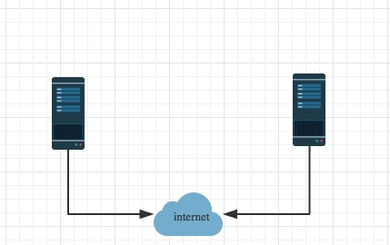
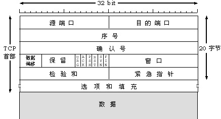
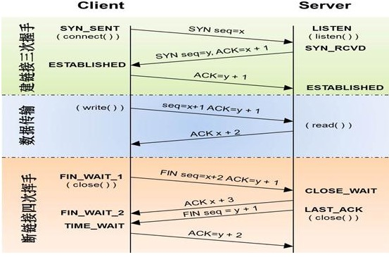

# 一.操作系统基础

操作系统:(Operating System，简称OS)是管理和控制计算机硬件与软件资源的计算机程序，是直接运行在“裸机”上的最基本的系统软件，任何其他软件都必须在操作系统的支持下才能运行。

注：计算机(硬件)－>os－>应用软件


# 二.网络通信原理

## 2.1 互联网的本质就是一系列的网络协议

一台硬设有了操作系统，然后装上软件你就可以正常使用了，然而你也只能自己使用

像这样，每个人都拥有一台自己的机器，然而彼此孤立


如何能大家一起玩耍



然而internet为何物？

其实两台计算机之间通信与两个人打电话之间通信的原理是一样的。

中国有很多地区，不同的地区有不同的方言，为了全中国人都可以听懂，大家统一讲普通话。

普通话属于中国国内人与人之间通信的标准，那如果是两个国家的人交流呢？和美国人交流用英语，和法国人交流用法语……

问题是，你不可能要求`一个人／计算机`掌握全世界的`语言／标准`，于是有了世界统一的通信标准：英语。

结论：英语成为世界上所有人通信的统一标准，如果把计算机看成分布于世界各地的人，那么连接两台计算机之间的internet实际上就是一系列统一的标准，这些标准称之为互联网协议，互联网的本质就是一系列的协议，总称为‘互联网协议’（Internet Protocol Suite).

互联网协议的功能：定义计算机如何接入internet，以及接入internet的计算机通信的标准。


## 2.2 osi七层协议

互联网协议按照功能不同分为osi七层或tcp/ip五层或tcp/ip四层


 

每层运行常见物理设备


 


## 2.3 tcp/ip五层模型讲解

我们将应用层，表示层，会话层并作应用层，从tcp／ip五层协议的角度来阐述每层的由来与功能，搞清楚了每层的主要协议就理解了整个互联网通信的原理。

首先，用户感知到的只是最上面一层应用层，自上而下每层都依赖于下一层，所以我们从最下一层开始切入，比较好理解

每层都运行特定的协议，越往上越靠近用户，越往下越靠近硬件

### 2.3.1 物理层

物理层由来：上面提到，孤立的计算机之间要想一起玩，就必须接入internet，言外之意就是计算机之间必须完成组网


物理层功能：主要是基于电器特性发送高低电压(电信号)，高电压对应数字1，低电压对应数字0


### 2.3.2 数据链路层

数据链路层由来：单纯的电信号0和1没有任何意义，必须规定电信号多少位一组，每组什么意思

数据链路层的功能：定义了电信号的分组方式

**\*以太网协议：***

早期的时候各个公司都有自己的分组方式，后来形成了统一的标准，即以太网协议ethernet。

ethernet规定：

- 一组电信号构成一个数据包，叫做‘帧’
- 每一数据帧分成：报头head和数据data两部分

| head | data |
| ---- | ---- |
|      |      |

head包含：(固定18个字节)用来标识数据部分，对数据部分进行一些说明操作

- 发送者／源地址，6个字节
- 接收者／目标地址，6个字节
- 数据类型，6个字节

data包含：(最短46字节，最长1500字节)

- 数据包的具体内容

head长度＋data长度＝最短64字节，最长1518字节，超过最大限制就分片发送

**\*mac地址：***

head中包含的源和目标地址由来：ethernet规定接入internet的设备都必须具备网卡，发送端和接收端的地址便是指网卡的地址，即mac地址

mac地址：每块网卡出厂时都被烧制上一个世界唯一的mac地址，长度为48位2进制，通常由12位16进制数表示（前六位是厂商编号，后六位是流水线号）


**广播：**

mac地址不能出广播域？限制到子网里

有了mac地址，同一网络内的两台主机就可以通信了（一台主机通过arp协议获取另外一台主机的mac地址）

ethernet采用最原始的方式，广播的方式进行通信，即计算机通信基本靠吼


### 2.3.3 网络层

网络层由来：有了ethernet、mac地址、广播的发送方式，世界上的计算机就可以彼此通信了。

问题是世界范围的互联网是由一个个彼此隔离的小的局域网组成的，那么如果所有的通信都采用以太网的广播方式，那么一台机器发送的包全世界都会收到，

这就不仅仅是效率低的问题了，这会是一种灾难


上图结论：必须找出一种方法来区分哪些计算机属于同一广播域，哪些不是。

如果是就采用广播的方式发送，

如果不是，就采用路由的方式（向不同广播域／子网分发数据包），mac地址是无法区分的，它只跟厂商有关

网络层功能：引入一套新的地址用来区分不同的广播域／子网，这套地址即网络地址

**\*IP协议：***

- 规定网络地址的协议叫ip协议，它定义的地址称之为ip地址，广泛采用的v4版本即ipv4，它规定网络地址由32位2进制表示
- 范围0.0.0.0-255.255.255.255
- 一个ip地址通常写成四段十进制数，例：172.16.10.1

**ip地址分成两部分**

- 网络部分：标识子网
- 主机部分：标识主机

注意：单纯的ip地址段只是标识了ip地址的种类，从网络部分或主机部分都无法辨识一个ip所处的子网

例：172.16.10.1与172.16.10.2并不能确定二者处于同一子网

**\*子网掩码***

所谓”子网掩码”，就是表示**子网络特征**的一个参数。它在形式上等同于IP地址，也是一个32位二进制数字，它的网络部分全部为1，主机部分全部为0。比如，IP地址172.16.10.1，如果已知网络部分是前24位，主机部分是后8位，那么子网络掩码就是11111111.11111111.11111111.00000000，写成十进制就是255.255.255.0。

 

知道”子网掩码”，我们就能判断，任意两个IP地址是否处在同一个子网络。方法是将两个IP地址与子网掩码分别进行AND运算（两个数位都为1，运算结果为1，否则为0），然后比较结果是否相同，如果是的话，就表明它们在同一个子网络中，否则就不是。

 

比如，已知IP地址172.16.10.1和172.16.10.2的子网掩码都是255.255.255.0，请问它们是否在同一个子网络？两者与子网掩码分别进行AND运算，

172.16.10.1：10101100.00010000.00001010.000000001

255255.255.255.0:11111111.11111111.11111111.00000000

AND运算得**网络地址**结果：10101100.00010000.00001010.000000001->172.16.10.0

 

172.16.10.2：10101100.00010000.00001010.000000010

255255.255.255.0:11111111.11111111.11111111.00000000

AND运算得网络地址结果：10101100.00010000.00001010.000000001->172.16.10.0

结果都是172.16.10.0，因此它们在同一个子网络。

总结一下，IP协议的作用主要有两个：

1、为每一台计算机分配IP地址

2、确定哪些地址在同一个子网络。

```python
ip地址四段十进制数,和子网掩码按位与运算，得到一个网络地址。网络地址用来区分不同的子网。 
通过IP地址和子网掩码可以找到子网，通过arp协议获取网关的mac。可以唯一定位到一台机器。
端口用来唯一标识这台机器上我是哪个程序。tcp/udp基于端口工作的协议
应用层，http,https,ftp,ssh应用软件级别的协议。通常我们自己可以在应用层定义协议。
socket层就是把tcp/udp协议封装，把内部的复杂操作隐藏起来，只对外提供简单的接口。
```


**\*ip数据包***

ip数据包也分为head和data部分，无须为ip包定义单独的栏位，直接放入以太网包的data部分。

head：长度为20到60字节

data：最长为65,515字节。

而以太网数据包的”数据”部分，最长只有1500字节。因此，如果IP数据包超过了1500字节，它就需要分割成几个以太网数据包，分开发送了。

| 以太网头 | ip 头 | ip数据 |
| -------- | ----- | ------ |
|          |       |        |

 **\*ARP协议***

arp协议由来：计算机通信基本靠吼，即广播的方式，所有上层的包到最后都要封装上以太网头，然后通过以太网协议发送，在谈及以太网协议时候，我门了解到

通信是基于mac的广播方式实现，计算机在发包时，获取自身的mac是容易的，如何获取目标主机的mac，就需要通过arp协议

arp协议功能：广播的方式发送数据包，获取目标主机的mac地址

协议工作方式：每台主机ip都是已知的

例如：主机172.16.10.10/24访问172.16.10.11/24

一：首先通过ip地址和子网掩码区分出自己所处的子网

| 场景     | 数据包地址              |
| -------- | ----------------------- |
| 同一子网 | 目标主机mac，目标主机ip |
| 不同子网 | 网关mac，目标主机ip     |

二：分析172.16.10.10/24与172.16.10.11/24处于同一网络(如果不是同一网络，那么下表中目标ip为172.16.10.1,通过arp获取的是网关的mac)

|            | 源mac     | 目标mac           | 源ip            | 目标ip          | 数据部分 |
| ---------- | --------- | ----------------- | --------------- | --------------- | -------- |
| 发送端主机 | 发送端mac | FF:FF:FF:FF:FF:FF | 172.16.10.10/24 | 172.16.10.11/24 | 数据     |

三：这个包会以广播的方式在发送端所处的自网内传输，所有主机接收后拆开包，发现目标ip为自己的，就响应，返回自己的mac


### 2.3.4 传输层

传输层的由来：网络层的ip帮我们区分子网，以太网层的mac帮我们找到主机，然后大家使用的都是应用程序，你的电脑上可能同时开启qq，暴风影音，等多个应用程序，

那么我们通过ip和mac找到了一台特定的主机，如何标识这台主机上的应用程序，答案就是端口，端口即应用程序与网卡关联的编号。

传输层功能：建立端口到端口的通信

补充：端口范围0-65535，0-1023为系统占用端口

tcp协议：

可靠传输，TCP数据包没有长度限制，理论上可以无限长，但是为了保证网络的效率，通常TCP数据包的长度不会超过IP数据包的长度，以确保单个TCP数据包不必再分割。

| 以太网头 | ip 头 | tcp头 | 数据 |
| -------- | ----- | ----- | ---- |
|          |       |       |      |

udp协议：

不可靠传输，”报头”部分一共只有8个字节，总长度不超过65,535字节，正好放进一个IP数据包。

| 以太网头 | ip头 | udp头 | 数据 |
| -------- | ---- | ----- | ---- |
|          |      |       |      |

tcp报文



tcp三次握手和四次挥手




### 2.3.5 应用层

应用层由来：用户使用的都是应用程序，均工作于应用层，互联网是开放的，大家都可以开发自己的应用程序，数据多种多样，必须规定好数据的组织形式 

应用层功能：规定应用程序的数据格式。

例：TCP协议可以为各种各样的程序传递数据，比如Email、WWW、FTP等等。那么，必须有不同协议规定电子邮件、网页、FTP数据的格式，这些应用程序协议就构成了”应用层”。

 


### 2.3.6 socket

我们知道两个进程如果需要进行通讯，最基本的一个前提是能够唯一的标示一个进程，在本地进程通讯中我们可以使用PID来唯一标示一个进程，但PID只在本地唯一，网络中的两个进程PID冲突几率很大，这时候我们需要另辟它径了。

我们知道IP层的ip地址可以唯一标示主机，而TCP层协议和端口号可以唯一标示主机的一个进程，这样我们可以利用ip地址＋协议＋端口号唯一标示网络中的一个进程。

能够唯一标示网络中的进程后，它们就可以利用socket进行通信了，什么是socket呢？我们经常把socket翻译为套接字，socket是在应用层和传输层之间的一个抽象层，它把TCP/IP层复杂的操作抽象成几个简单的接口供应用层调用，以实现进程在网络中通信。


socket起源于UNIX，在Unix一切皆文件哲学的思想下，socket是一种"打开—读/写—关闭"模式的实现，服务器和客户端各自维护一个"文件"，在建立连接打开后，可以向自己文件写入内容供对方读取或者读取对方内容，通讯结束时关闭文件。


# 三.网络通信实现

想实现网络通信，每台主机需具备四要素

- 本机的IP地址
- 子网掩码
- 网关的IP地址
- DNS的IP地址

获取这四要素分两种方式

1.静态获取

即手动配置

2.动态获取

通过dhcp获取

| 以太网头 | ip头 | udp头 | dhcp数据包 |
| -------- | ---- | ----- | ---------- |
|          |      |       |            |

（1）最前面的”以太网标头”，设置发出方（本机，即新加入的计算机）的MAC地址和接收方（DHCP服务器）的MAC地址。前者就是本机网卡的MAC地址，后者这时不知道，就填入一个广播地址：FF-FF-FF-FF-FF-FF。

（2）后面的”IP标头”，设置发出方的IP地址和接收方的IP地址。这时，对于这两者，本机都不知道。于是，发出方的IP地址就设为0.0.0.0，接收方的IP地址设为255.255.255.255。

（3）最后的”UDP标头”，设置发出方的端口和接收方的端口。这一部分是DHCP协议规定好的，发出方是68端口，接收方是67端口。

 

这个数据包构造完成后，就可以发出了。以太网是广播发送，同一个子网络的每台计算机都收到了这个包。因为接收方的MAC地址是FF-FF-FF-FF-FF-FF，看不出是发给谁的，所以每台收到这个包的计算机，还必须分析这个包的IP地址，才能确定是不是发给自己的。当看到发出方IP地址是0.0.0.0，接收方是255.255.255.255，于是DHCP服务器知道”这个包是发给我的”，而其他计算机就可以丢弃这个包。

 

接下来，DHCP服务器读出这个包的数据内容，分配好IP地址，发送回去一个”DHCP响应”数据包。这个响应包的结构也是类似的，以太网标头的MAC地址是双方的网卡地址，IP标头的IP地址是DHCP服务器的IP地址（发出方）和255.255.255.255（接收方），UDP标头的端口是67（发出方）和68（接收方），分配给请求端的IP地址和本网络的具体参数则包含在Data部分。

 

新加入的计算机收到这个响应包，于是就知道了自己的IP地址、子网掩码、网关地址、DNS服务器等等参数


# 四.网络通信流程

**1.本机获取**

- 本机的IP地址：192.168.1.100
- 子网掩码：255.255.255.0
- 网关的IP地址：192.168.1.1
- DNS的IP地址：8.8.8.8

**2.打开浏览器**

想要访问Google，在地址栏输入了网址：www.google.com。

**3.dns协议(基于udp协议)**


 

13台根dns：

A.root-servers.net198.41.0.4美国
B.root-servers.net192.228.79.201美国（另支持[IPv6](https://www.baidu.com/s?wd=IPv6&tn=44039180_cpr&fenlei=mv6quAkxTZn0IZRqIHckPjm4nH00T1d9ryR4nhnsn1b3ujfYPAfk0ZwV5Hcvrjm3rH6sPfKWUMw85HfYnjn4nH6sgvPsT6KdThsqpZwYTjCEQLGCpyw9Uz4Bmy-bIi4WUvYETgN-TLwGUv3ErH0YPW6snH0)）
C.root-servers.net192.33.4.12法国
D.root-servers.net128.8.10.90美国
E.root-servers.net192.203.230.10美国
F.root-servers.net192.5.5.241美国（另支持[IPv6](https://www.baidu.com/s?wd=IPv6&tn=44039180_cpr&fenlei=mv6quAkxTZn0IZRqIHckPjm4nH00T1d9ryR4nhnsn1b3ujfYPAfk0ZwV5Hcvrjm3rH6sPfKWUMw85HfYnjn4nH6sgvPsT6KdThsqpZwYTjCEQLGCpyw9Uz4Bmy-bIi4WUvYETgN-TLwGUv3ErH0YPW6snH0)）
G.root-servers.net192.112.36.4美国
H.root-servers.net128.63.2.53美国（另支持[IPv6](https://www.baidu.com/s?wd=IPv6&tn=44039180_cpr&fenlei=mv6quAkxTZn0IZRqIHckPjm4nH00T1d9ryR4nhnsn1b3ujfYPAfk0ZwV5Hcvrjm3rH6sPfKWUMw85HfYnjn4nH6sgvPsT6KdThsqpZwYTjCEQLGCpyw9Uz4Bmy-bIi4WUvYETgN-TLwGUv3ErH0YPW6snH0)）
I.root-servers.net192.36.148.17瑞典
J.root-servers.net192.58.128.30美国
K.root-servers.net193.0.14.129英国（另支持IPv6）
L.root-servers.net198.32.64.12美国
M.root-servers.net202.12.27.33日本（另支持IPv6）

 

域名定义：http://jingyan.baidu.com/article/1974b289a649daf4b1f774cb.html

顶级域名：以.com,.net,.org,.cn等等属于国际顶级域名，根据目前的国际互联网域名体系，国际顶级域名分为两类：类别顶级域名(gTLD)和地理顶级域名(ccTLD)两种。类别顶级域名是以"COM"、"NET"、"ORG"、"BIZ"、"INFO"等结尾的域名，均由国外公司负责管理。地理顶级域名是以国家或地区代码为结尾的域名，如"CN"代表中国，"UK"代表英国。地理顶级域名一般由各个国家或地区负责管理。

二级域名：二级域名是以顶级域名为基础的地理域名，比喻中国的二级域有，.com.cn,.net.cn,.org.cn,.gd.cn等.子域名是其父域名的子域名，比喻父域名是abc.com,子域名就是www.abc.com或者*.abc.com.
一般来说，二级域名是域名的一条记录，比如alidiedie.com是一个域名，www.alidiedie.com是其中比较常用的记录，一般默认是用这个，但是类似*.alidiedie.com的域名全部称作是alidiedie.com的二级域名


**4.HTTP部分的内容**

类似于下面这样：

> GET / HTTP/1.1
> Host: www.google.com
> Connection: keep-alive
> User-Agent: Mozilla/5.0 (Windows NT 6.1) ……
> Accept: text/html,application/xhtml+xml,application/xml;q=0.9,*/*;q=0.8
> Accept-Encoding: gzip,deflate,sdch
> Accept-Language: zh-CN,zh;q=0.8
> Accept-Charset: GBK,utf-8;q=0.7,*;q=0.3
> Cookie: … …

我们假定这个部分的长度为4960字节，它会被嵌在TCP数据包之中。

 

**5 TCP协议**

TCP数据包需要设置端口，接收方（Google）的HTTP端口默认是80，发送方（本机）的端口是一个随机生成的1024-65535之间的整数，假定为51775。

TCP数据包的标头长度为20字节，加上嵌入HTTP的数据包，总长度变为4980字节。

 

**6 IP协议**

然后，TCP数据包再嵌入IP数据包。IP数据包需要设置双方的IP地址，这是已知的，发送方是192.168.1.100（本机），接收方是172.194.72.105（Google）。

IP数据包的标头长度为20字节，加上嵌入的TCP数据包，总长度变为5000字节。

 

**7 以太网协议**

最后，IP数据包嵌入以太网数据包。以太网数据包需要设置双方的MAC地址，发送方为本机的网卡MAC地址，接收方为网关192.168.1.1的MAC地址（通过ARP协议得到）。

以太网数据包的数据部分，最大长度为1500字节，而现在的IP数据包长度为5000字节。因此，IP数据包必须分割成四个包。因为每个包都有自己的IP标头（20字节），所以四个包的IP数据包的长度分别为1500、1500、1500、560。

 


 

**8 服务器端响应**

经过多个网关的转发，Google的服务器172.194.72.105，收到了这四个以太网数据包。

根据IP标头的序号，Google将四个包拼起来，取出完整的TCP数据包，然后读出里面的”HTTP请求”，接着做出”HTTP响应”，再用TCP协议发回来。

本机收到HTTP响应以后，就可以将网页显示出来，完成一次网络通信。