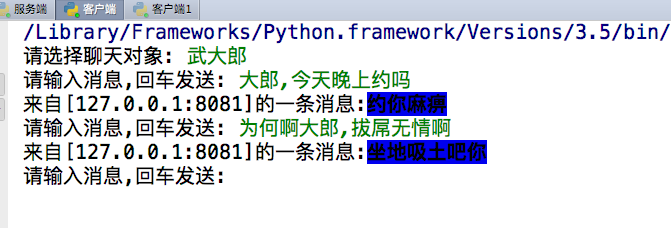
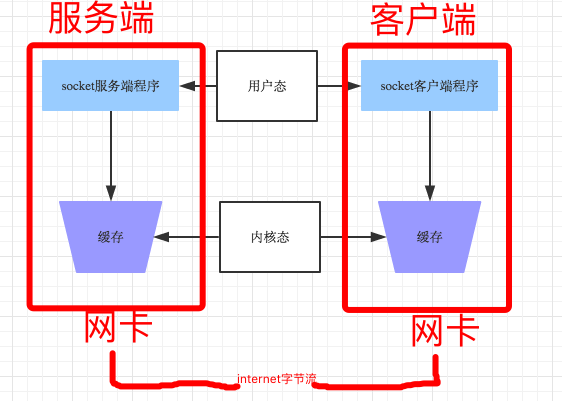
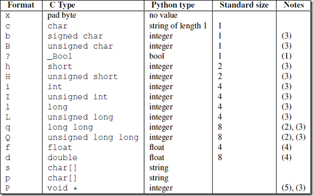
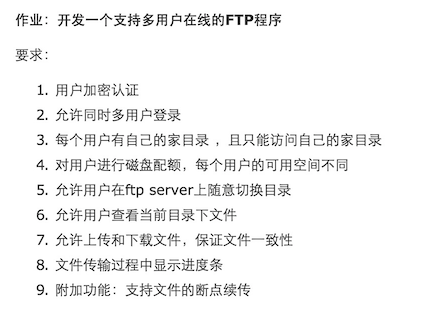

chapter09-socket编程

# 一、客户端/服务器架构

1.硬件C/S架构(打印机)

2.软件C/S架构

　　*互联网中处处是C/S架构*

　　*如网站是服务端，你的浏览器是客户端（B/S架构也是C/S架构的一种）*

　　*腾讯作为服务端为你提供视频，你得下个腾讯视频客户端才能看它的视频*

C/S架构与socket的关系：

*我们学习socket就是为了完成C/S架构的开发*


# 二、osi七层

**引子：**

*须知一个完整的计算机系统是由硬件、操作系统、应用软件三者组成,具备了这三个条件，一台计算机系统就可以自己跟自己玩了（打个单机游戏，玩个扫雷啥的）*

*如果你要跟别人一起玩，那你就需要上网了，什么是互联网？*

*互联网的核心就是由一堆协议组成，协议就是标准，比如全世界人通信的标准是英语*

*如果把计算机比作人，互联网协议就是计算机界的英语。所有的计算机都学会了互联网协议，那所有的计算机都就可以按照统一的标准去收发信息从而完成通信了。*

*人们按照分工不同把互联网协议从逻辑上划分了层级，详见网络通信原理

 

**为何学习socket一定要先学习互联网协议：**

*1.首先：本文目的就是学习如何基于socket编程，来开发一款自己的C/S架构软件*

*2.其次：C/S架构的软件（软件属于应用层）是基于网络进行通信的*

*3.然后：网络的核心即一堆协议，协议即标准，你想开发一款基于网络通信的软件，就必须遵循这些标准。*

*4.最后：就让我们从这些标准开始研究，开启我们的socket编程之旅*

​                                                                              

​                                                           图1


# 三、socket层

在图1中，我们没有看到Socket的影子，那么它到底在哪里呢？还是用图来说话，一目了然。 


​							**图2**


# 四、socket是什么

Socket是应用层与TCP/IP协议族通信的中间软件抽象层，它是一组接口。在设计模式中，Socket其实就是一个门面模式，它把复杂的TCP/IP协议族隐藏在Socket接口后面，对用户来说，一组简单的接口就是全部，让Socket去组织数据，以符合指定的协议。

所以，我们无需深入理解tcp/udp协议，socket已经为我们封装好了，我们只需要遵循socket的规定去编程，写出的程序自然就是遵循tcp/udp标准的。


```python
# 扫盲篇
也有人将socket说成ip+port，ip是用来标识互联网中的一台主机的位置，而port是用来标识这台机器上的一个应用程序，ip地址是配置到网卡上的，而port是应用程序开启的，ip与port的绑定就标识了互联网中独一无二的一个应用程序

而程序的pid是同一台机器上不同进程或者线程的标识
```


# 五、套接字发展史及分类

套接字起源于 20 世纪 70 年代加利福尼亚大学伯克利分校版本的 Unix,即人们所说的 BSD Unix。 因此,有时人们也把套接字称为“伯克利套接字”或“BSD 套接字”。一开始,套接字被设计用在同 一台主机上多个应用程序之间的通讯。这也被称进程间通讯,或 IPC。套接字有两种（或者称为有两个种族）,分别是基于文件型的和基于网络型的。 

**\*基于文件类型的套接字家族***

套接字家族的名字：AF_UNIX

unix一切皆文件，基于文件的套接字调用的就是底层的文件系统来取数据，两个套接字进程运行在同一机器，可以通过访问同一个文件系统间接完成通信

**\*基于网络类型的套接字家族***

套接字家族的名字：AF_INET

(还有AF_INET6被用于ipv6，还有一些其他的地址家族，不过，他们要么是只用于某个平台，要么就是已经被废弃，或者是很少被使用，或者是根本没有实现，所有地址家族中，AF_INET是使用最广泛的一个，python支持很多种地址家族，但是由于我们只关心网络编程，所以大部分时候我么只使用AF_INET)


# 六、套接字工作流程

​       一个生活中的场景。你要打电话给一个朋友，先拨号，朋友听到电话铃声后提起电话，这时你和你的朋友就建立起了连接，就可以讲话了。等交流结束，挂断电话结束此次交谈。 生活中的场景就解释了这工作原理。

      

​                                           图3       

先从服务器端说起。服务器端先初始化Socket，然后与端口绑定(bind)，对端口进行监听(listen)，调用accept阻塞，等待客户端连接。在这时如果有个客户端初始化一个Socket，然后连接服务器(connect)，如果连接成功，这时客户端与服务器端的连接就建立了。客户端发送数据请求，服务器端接收请求并处理请求，然后把回应数据发送给客户端，客户端读取数据，最后关闭连接，一次交互结束

socket()模块函数用法

```python
import socket
socket.socket(socket_family,socket_type,protocal=0)
socket_family 可以是 AF_UNIX 或 AF_INET。socket_type 可以是 SOCK_STREAM 或 SOCK_DGRAM。protocol 一般不填,默认值为 0。

获取tcp/ip套接字
tcpSock = socket.socket(socket.AF_INET, socket.SOCK_STREAM)

获取udp/ip套接字
udpSock = socket.socket(socket.AF_INET, socket.SOCK_DGRAM)

由于 socket 模块中有太多的属性。我们在这里破例使用了'from module import *'语句。使用 'from socket import *',我们就把 socket 模块里的所有属性都带到我们的命名空间里了,这样能 大幅减短我们的代码。
例如tcpSock = socket(AF_INET, SOCK_STREAM)
```


```python
# 服务端套接字函数
s.bind()    绑定(主机,端口号)到套接字
s.listen()  开始TCP监听
s.accept()  被动接受TCP客户的连接,(阻塞式)等待连接的到来

# 客户端套接字函数
s.connect()     主动初始化TCP服务器连接
s.connect_ex()  connect()函数的扩展版本,出错时返回出错码,而不是抛出异常

# 公共用途的套接字函数
s.recv()            接收TCP数据
s.send()            发送TCP数据(send在待发送数据量大于己端缓存区剩余空间时,数据丢失,不会发完)
s.sendall()         发送完整的TCP数据(本质就是循环调用send,sendall在待发送数据量大于己端缓存区剩余空间时,数据不丢失,循环调用send直到发完)
s.recvfrom()        接收UDP数据
s.sendto()          发送UDP数据
s.getpeername()     连接到当前套接字的远端的地址
s.getsockname()     当前套接字的地址
s.getsockopt()      返回指定套接字的参数
s.setsockopt()      设置指定套接字的参数
s.close()           关闭套接字

# 面向锁的套接字方法
s.setblocking()     设置套接字的阻塞与非阻塞模式
s.settimeout()      设置阻塞套接字操作的超时时间
s.gettimeout()      得到阻塞套接字操作的超时时间

# 面向文件的套接字的函数
s.fileno()          套接字的文件描述符
s.makefile()        创建一个与该套接字相关的文件
```


```python
# 读者勿看：socket实验推演流程
1：用打电话的流程快速描述socket通信
2：服务端和客户端加上基于一次链接的循环通信
3：客户端发送空，卡主，证明是从哪个位置卡的
服务端：
from socket import *
phone=socket(AF_INET,SOCK_STREAM)
phone.bind(('127.0.0.1',8081))
phone.listen(5)

conn,addr=phone.accept()
while True:
    data=conn.recv(1024)
    print('server===>')
    print(data)
    conn.send(data.upper())
conn.close()
phone.close()
客户端：
from socket import *

phone=socket(AF_INET,SOCK_STREAM)
phone.connect(('127.0.0.1',8081))

while True:
    msg=input('>>: ').strip()
    phone.send(msg.encode('utf-8'))
    print('client====>')
    data=phone.recv(1024)
    print(data)

说明卡的原因：缓冲区为空recv就卡住，引出原理图


4.演示客户端断开链接，服务端的情况，提供解决方法

5.演示服务端不能重复接受链接，而服务器都是正常运行不断来接受客户链接的

6:简单演示udp
服务端
from socket import *
phone=socket(AF_INET,SOCK_DGRAM)
phone.bind(('127.0.0.1',8082))
while True:
    msg,addr=phone.recvfrom(1024)
    phone.sendto(msg.upper(),addr)
客户端
from socket import *
phone=socket(AF_INET,SOCK_DGRAM)
while True:
    msg=input('>>: ')
    phone.sendto(msg.encode('utf-8'),('127.0.0.1',8082))
    msg,addr=phone.recvfrom(1024)
    print(msg)

udp客户端可以并发演示
udp客户端可以输入为空演示，说出recvfrom与recv的区别，暂且不提tcp流和udp报的概念，留到粘包去说
```


# 七、基于TCP的套接字

**\*tcp是基于链接的，必须先启动服务端，然后再启动客户端去链接服务端***

**\*tcp服务端***

```python
1 ss = socket() #创建服务器套接字
2 ss.bind()      #把地址绑定到套接字
3 ss.listen()      #监听链接
4 inf_loop:      #服务器无限循环
5     cs = ss.accept() #接受客户端链接
6     comm_loop:         #通讯循环
7         cs.recv()/cs.send() #对话(接收与发送)
8     cs.close()    #关闭客户端套接字
9 ss.close()        #关闭服务器套接字(可选)
```


**\*tcp客户端***

```python
1 cs = socket()    # 创建客户套接字
2 cs.connect()    # 尝试连接服务器
3 comm_loop:        # 通讯循环
4     cs.send()/cs.recv()    # 对话(发送/接收)
5 cs.close()            # 关闭客户套接字
```

 

socket通信流程与打电话流程类似，我们就以打电话为例来实现一个low版的套接字通信

服务端

```python
#_*_coding:utf-8_*_
__author__ = 'Linhaifeng'
import socket
ip_port=('127.0.0.1',9000)  #电话卡
BUFSIZE=1024                #收发消息的尺寸
s=socket.socket(socket.AF_INET,socket.SOCK_STREAM) #买手机
s.bind(ip_port) #手机插卡
s.listen(5)     #手机待机


conn,addr=s.accept()            #手机接电话
# print(conn)
# print(addr)
print('接到来自%s的电话' %addr[0])

msg=conn.recv(BUFSIZE)             #听消息,听话
print(msg,type(msg))

conn.send(msg.upper())          #发消息,说话

conn.close()                    #挂电话

s.close()                       #手机关机
```

客户端

```python
#_*_coding:utf-8_*_
__author__ = 'Linhaifeng'
import socket
ip_port=('127.0.0.1',9000)
BUFSIZE=1024
s=socket.socket(socket.AF_INET,socket.SOCK_STREAM)

s.connect_ex(ip_port)           #拨电话

s.send('linhaifeng nb'.encode('utf-8'))         #发消息,说话(只能发送字节类型)

feedback=s.recv(BUFSIZE)                           #收消息,听话
print(feedback.decode('utf-8'))

s.close()                                       #挂电话
```


加上链接循环与通信循环

服务端改进版

```python
#_*_coding:utf-8_*_
__author__ = 'Linhaifeng'
import socket
ip_port=('127.0.0.1',8081)#电话卡
BUFSIZE=1024
s=socket.socket(socket.AF_INET,socket.SOCK_STREAM) #买手机
s.bind(ip_port) #手机插卡
s.listen(5)     #手机待机


while True:                         #新增接收链接循环,可以不停的接电话
    conn,addr=s.accept()            #手机接电话
    # print(conn)
    # print(addr)
    print('接到来自%s的电话' %addr[0])
    while True:                         #新增通信循环,可以不断的通信,收发消息
        msg=conn.recv(BUFSIZE)             #听消息,听话

        # if len(msg) == 0:break        #如果不加,那么正在链接的客户端突然断开,recv便不再阻塞,死循环发生

        print(msg,type(msg))

        conn.send(msg.upper())          #发消息,说话

    conn.close()                    #挂电话

s.close()                       #手机关机
```

客户端改进版

```python
#_*_coding:utf-8_*_
__author__ = 'Linhaifeng'
import socket
ip_port=('127.0.0.1',8081)
BUFSIZE=1024
s=socket.socket(socket.AF_INET,socket.SOCK_STREAM)

s.connect_ex(ip_port)           #拨电话

while True:                             #新增通信循环,客户端可以不断发收消息
    msg=input('>>: ').strip()
    if len(msg) == 0:continue
    s.send(msg.encode('utf-8'))         #发消息,说话(只能发送字节类型)

    feedback=s.recv(BUFSIZE)                           #收消息,听话
    print(feedback.decode('utf-8'))

s.close()                                       #挂电话
```

 

问题：

在重启服务端时可能会遇到


这个是由于你的服务端仍然存在四次挥手的time_wait状态在占用地址（如果不懂，请深入研究1.tcp三次握手，四次挥手 2.syn洪水攻击 3.服务器高并发情况下会有大量的time_wait状态的优化方法）

解决方法：

解决方法一

```python
#加入一条socket配置，重用ip和端口

phone=socket(AF_INET,SOCK_STREAM)
phone.setsockopt(SOL_SOCKET,SO_REUSEADDR,1) #就是它，在bind前加
phone.bind(('127.0.0.1',8080))
```

解决方法二

```python
发现系统存在大量TIME_WAIT状态的连接，通过调整linux内核参数解决，
vi /etc/sysctl.conf

编辑文件，加入以下内容：
net.ipv4.tcp_syncookies = 1
net.ipv4.tcp_tw_reuse = 1
net.ipv4.tcp_tw_recycle = 1
net.ipv4.tcp_fin_timeout = 30
 
然后执行 /sbin/sysctl -p 让参数生效。
 
net.ipv4.tcp_syncookies = 1 表示开启SYN Cookies。当出现SYN等待队列溢出时，启用cookies来处理，可防范少量SYN攻击，默认为0，表示关闭；

net.ipv4.tcp_tw_reuse = 1 表示开启重用。允许将TIME-WAIT sockets重新用于新的TCP连接，默认为0，表示关闭；

net.ipv4.tcp_tw_recycle = 1 表示开启TCP连接中TIME-WAIT sockets的快速回收，默认为0，表示关闭。

net.ipv4.tcp_fin_timeout 修改系統默认的 TIMEOUT 时间
```


# 八、基于UDP的套接字

**\*udp是无链接的，先启动哪一端都不会报错***

udp服务端

```
1 ss = socket()   #创建一个服务器的套接字
2 ss.bind()       #绑定服务器套接字
3 inf_loop:       #服务器无限循环
4     cs = ss.recvfrom()/ss.sendto() # 对话(接收与发送)
5 ss.close()                         # 关闭服务器套接字
```

udp客户端

```
cs = socket()   # 创建客户套接字
comm_loop:      # 通讯循环
    cs.sendto()/cs.recvfrom()   # 对话(发送/接收)
cs.close()                      # 关闭客户套接字
```

## udp套接字简单示例

udp服务端

```python
#_*_coding:utf-8_*_
__author__ = 'Linhaifeng'
import socket
ip_port=('127.0.0.1',9000)
BUFSIZE=1024
udp_server_client=socket.socket(socket.AF_INET,socket.SOCK_DGRAM)

udp_server_client.bind(ip_port)

while True:
    msg,addr=udp_server_client.recvfrom(BUFSIZE)
    print(msg,addr)

    udp_server_client.sendto(msg.upper(),addr)
```

udp客户端

```python

import socket
ip_port=('127.0.0.1',9000)
BUFSIZE=1024
udp_server_client=socket.socket(socket.AF_INET,socket.SOCK_DGRAM)

while True:
    msg=input('>>: ').strip()
    if not msg:continue

    udp_server_client.sendto(msg.encode('utf-8'),ip_port)

    back_msg,addr=udp_server_client.recvfrom(BUFSIZE)
    print(back_msg.decode('utf-8'),addr)
    
# udp客户端即使发空消息，空消息外还包着一层报头信息。
# udp不会粘包，如果接收数据大于BUFSIZE。
1.win下报错，OSError:[WinError 10040]一个在数据报套接字上发送的消息大于内部消息缓冲区或其它一些网络限制
2.linux下只接收BUFSIZE内的数据，其余数据丢弃。
TCP可靠协议：建好链接之后，每发一个消息，把消息发送到自己的缓冲区，接收端一定要给我回一个ACK确认收到了，我才把自己缓冲区的数据清掉。如果没给我回ACK，我就重新把数据发一遍。
UDP不可靠协议：udp没有链接，发一个消息过去，接收端没有回应信息，没有回ACK一说。发完以后自己的缓冲区直接就清掉了，不管对方收没收到。


```


## qq聊天

(由于udp无连接，所以可以同时多个客户端去跟服务端通信)

udp服务端

```python
#_*_coding:utf-8_*_
__author__ = 'Linhaifeng'
import socket
ip_port=('127.0.0.1',8081)
udp_server_sock=socket.socket(socket.AF_INET,socket.SOCK_DGRAM) #买手机
udp_server_sock.bind(ip_port)

while True:
    qq_msg,addr=udp_server_sock.recvfrom(1024)
    print('来自[%s:%s]的一条消息:\033[1;44m%s\033[0m' %(addr[0],addr[1],qq_msg.decode('utf-8')))
    back_msg=input('回复消息: ').strip()

    udp_server_sock.sendto(back_msg.encode('utf-8'),addr)
```

udp客户端1

```python
#_*_coding:utf-8_*_
__author__ = 'Linhaifeng'
import socket
BUFSIZE=1024
udp_client_socket=socket.socket(socket.AF_INET,socket.SOCK_DGRAM)

qq_name_dic={
    '狗哥alex':('127.0.0.1',8081),
    '瞎驴':('127.0.0.1',8081),
    '一棵树':('127.0.0.1',8081),
    '武大郎':('127.0.0.1',8081),
}


while True:
    qq_name=input('请选择聊天对象: ').strip()
    while True:
        msg=input('请输入消息,回车发送: ').strip()
        if msg == 'quit':break
        if not msg or not qq_name or qq_name not in qq_name_dic:continue
        udp_client_socket.sendto(msg.encode('utf-8'),qq_name_dic[qq_name])

        back_msg,addr=udp_client_socket.recvfrom(BUFSIZE)
        print('来自[%s:%s]的一条消息:\033[1;44m%s\033[0m' %(addr[0],addr[1],back_msg.decode('utf-8')))

udp_client_socket.close()
```

udp客户端2  

```python
#_*_coding:utf-8_*_
__author__ = 'Linhaifeng'
import socket
BUFSIZE=1024
udp_client_socket=socket.socket(socket.AF_INET,socket.SOCK_DGRAM)

qq_name_dic={
    '狗哥alex':('127.0.0.1',8081),
    '瞎驴':('127.0.0.1',8081),
    '一棵树':('127.0.0.1',8081),
    '武大郎':('127.0.0.1',8081),
}


while True:
    qq_name=input('请选择聊天对象: ').strip()
    while True:
        msg=input('请输入消息,回车发送: ').strip()
        if msg == 'quit':break
        if not msg or not qq_name or qq_name not in qq_name_dic:continue
        udp_client_socket.sendto(msg.encode('utf-8'),qq_name_dic[qq_name])

        back_msg,addr=udp_client_socket.recvfrom(BUFSIZE)
        print('来自[%s:%s]的一条消息:\033[1;44m%s\033[0m' %(addr[0],addr[1],back_msg.decode('utf-8')))

udp_client_socket.close()
```


服务端运行结果


客户端1运行结果



客户端2运行结果


## \*时间服务器*

ntp服务器

```python
#_*_coding:utf-8_*_
__author__ = 'Linhaifeng'
from socket import *
from time import strftime

ip_port=('127.0.0.1',9000)
bufsize=1024

tcp_server=socket(AF_INET,SOCK_DGRAM)
tcp_server.bind(ip_port)

while True:
    msg,addr=tcp_server.recvfrom(bufsize)
    print('===>',msg)
    
    if not msg:
        time_fmt='%Y-%m-%d %X'
    else:
        time_fmt=msg.decode('utf-8')
    back_msg=strftime(time_fmt)

    tcp_server.sendto(back_msg.encode('utf-8'),addr)

tcp_server.close()
```

ntp客户端

```python

from socket import *
ip_port=('127.0.0.1',9000)
bufsize=1024

tcp_client=socket(AF_INET,SOCK_DGRAM)


while True:
    msg=input('请输入时间格式(例%Y %m %d)>>: ').strip()
    tcp_client.sendto(msg.encode('utf-8'),ip_port)

    data=tcp_client.recv(bufsize)

    print(data.decode('utf-8'))

tcp_client.close()
```


# 九、粘包现象

让我们基于tcp先制作一个远程执行命令的程序（1：执行错误命令 2：执行ls 3：执行ifconfig）

**注意注意注意：**

res=subprocess.Popen(cmd.decode('utf-8'),
shell=True,
stderr=subprocess.PIPE,
stdout=subprocess.PIPE)

的结果的编码是以当前所在的系统为准的，如果是windows，那么**res.stdout.read()读出的就是GBK编码的**，在接收端需**要用GBK解码**

**且只能从管道里读一次结果**

注意：命令ls -l ; lllllll ; pwd 的结果是既有正确stdout结果，又有错误stderr结果

服务端

```python
#_*_coding:utf-8_*_
__author__ = 'Linhaifeng'
from socket import *
import subprocess

ip_port=('127.0.0.1',8080)
BUFSIZE=1024

tcp_socket_server=socket(AF_INET,SOCK_STREAM)
tcp_socket_server.bind(ip_port)
tcp_socket_server.listen(5)

while True:
    conn,addr=tcp_socket_server.accept()
    print('客户端',addr)

    while True:
        cmd=conn.recv(BUFSIZE)
        if len(cmd) == 0:break

        res=subprocess.Popen(cmd.decode('utf-8'),shell=True,
                         stdout=subprocess.PIPE,
                         stdin=subprocess.PIPE,
                         stderr=subprocess.PIPE)

        stderr=act_res.stderr.read()
        stdout=act_res.stdout.read()
        conn.send(stderr)
        conn.send(stdout)
```

客户端

```python

import socket
BUFSIZE=1024
ip_port=('127.0.0.1',8080)

s=socket.socket(socket.AF_INET,socket.SOCK_STREAM)
res=s.connect_ex(ip_port)

while True:
    msg=input('>>: ').strip()
    if len(msg) == 0:continue
    if msg == 'quit':break

    s.send(msg.encode('utf-8'))
    act_res=s.recv(BUFSIZE)

    print(act_res.decode('utf-8'),end='')
```

上述程序是基于tcp的socket，在运行时会发生粘包 

让我们再基于udp制作一个远程执行命令的程序

服务端

```python
#_*_coding:utf-8_*_
__author__ = 'Linhaifeng'

#_*_coding:utf-8_*_
__author__ = 'Linhaifeng'
from socket import *
import subprocess

ip_port=('127.0.0.1',9003)
bufsize=1024

udp_server=socket(AF_INET,SOCK_DGRAM)
udp_server.bind(ip_port)

while True:
    #收消息
    cmd,addr=udp_server.recvfrom(bufsize)
    print('用户命令----->',cmd)

    #逻辑处理
    res=subprocess.Popen(cmd.decode('utf-8'),shell=True,stderr=subprocess.PIPE,stdin=subprocess.PIPE,stdout=subprocess.PIPE)
    stderr=res.stderr.read()
    stdout=res.stdout.read()

    #发消息
    udp_server.sendto(stderr,addr)
    udp_server.sendto(stdout,addr)
udp_server.close()
```

客户端

```python
from socket import *
ip_port=('127.0.0.1',9003)
bufsize=1024

udp_client=socket(AF_INET,SOCK_DGRAM)


while True:
    msg=input('>>: ').strip()
    udp_client.sendto(msg.encode('utf-8'),ip_port)

    data,addr=udp_client.recvfrom(bufsize)
    print(data.decode('utf-8'),end='')
```

上述程序是基于udp的socket，在运行时永远不会发生粘包


# 十、什么是粘包

**须知：只有TCP有粘包现象，UDP永远不会粘包，为何，且听我娓娓道来**

**首先需要掌握一个socket收发消息的原理**



 

发送端可以是一KB一KB地发送数据，而接收端的应用程序可以两KB两KB地提走数据，当然也有可能一次提走3KB或6KB数据，或者一次只提走几个字节的数据，也就是说，应用程序所看到的数据是一个整体，或说是一个流（stream），一条消息有多少字节对应用程序是不可见的，因此TCP协议是面向流的协议，这也是容易出现粘包问题的原因。

而UDP是面向消息的协议，每个UDP段都是一条消息，应用程序必须以消息为单位提取数据，不能一次提取任意字节的数据，这一点和TCP是很不同的。

怎样定义消息呢？可以认为对方一次性write/send的数据为一个消息，需要明白的是当对方send一条信息的时候，无论底层怎样分段分片，TCP协议层会把构成整条消息的数据段排序完成后才呈现在内核缓冲区。

例如基于tcp的套接字客户端往服务端上传文件，发送时文件内容是按照一段一段的字节流发送的，在接收方看了，根本不知道该文件的字节流从何处开始，在何处结束。

**所谓粘包问题主要还是因为接收方不知道消息之间的界限，不知道一次性提取多少字节的数据所造成的。**

此外，发送方引起的粘包是由TCP协议本身造成的，TCP为提高传输效率，发送方往往要收集到足够多的数据后才发送一个TCP段。若连续几次需要send的数据都很少，通常TCP会根据优化[算法](http://lib.csdn.net/base/datastructure)把这些数据合成一个TCP段后一次发送出去，这样接收方就收到了粘包数据。

1. TCP（transport control protocol，传输控制协议）是面向连接的，面向流的，提供高可靠性服务。收发两端（客户端和服务器端）都要有一一成对的socket，因此，发送端为了将多个发往接收端的包，更有效的发到对方，使用了优化方法（Nagle算法），将多次间隔较小且数据量小的数据，合并成一个大的数据块，然后进行封包。这样，接收端，就难于分辨出来了，必须提供科学的拆包机制。 即面向流的通信是无消息保护边界的。
2. UDP（user datagram protocol，用户数据报协议）是无连接的，面向消息的，提供高效率服务。不会使用块的合并优化算法，, 由于UDP支持的是一对多的模式，所以接收端的skbuff(套接字缓冲区）采用了链式结构来记录每一个到达的UDP包，在每个UDP包中就有了消息头（消息来源地址，端口等信息），这样，对于接收端来说，就容易进行区分处理了。 **即面向消息的通信是有消息保护边界的。**
3. **tcp是基于数据流的，于是收发的消息不能为空，这就需要在客户端和服务端都添加空消息的处理机制，防止程序卡住，而udp是基于数据报的，即便是你输入的是空内容（直接回车），那也不是空消息，udp协议会帮你封装上消息头，实验略**

udp的recvfrom是阻塞的，一个recvfrom(x)必须对唯一一个sendinto(y),收完了x个字节的数据就算完成,若是y>x数据就丢失，这意味着udp根本不会粘包，但是会丢数据，不可靠

tcp的协议数据不会丢，没有收完包，下次接收，会继续上次继续接收，己端总是在收到ack时才会清除缓冲区内容。数据是可靠的，但是会粘包。

## 两种情况下会发生粘包。

**发送端需要等缓冲区满才发送出去，造成粘包（发送数据时间间隔很短，数据了很小，会合到一起，产生粘包）**

服务端

```python
#_*_coding:utf-8_*_
__author__ = 'Linhaifeng'
from socket import *
ip_port=('127.0.0.1',8080)

tcp_socket_server=socket(AF_INET,SOCK_STREAM)
tcp_socket_server.bind(ip_port)
tcp_socket_server.listen(5)


conn,addr=tcp_socket_server.accept()


data1=conn.recv(10)
data2=conn.recv(10)

print('----->',data1.decode('utf-8'))
print('----->',data2.decode('utf-8'))

conn.close()
```

客户端

```python
#_*_coding:utf-8_*_
__author__ = 'Linhaifeng'
import socket
BUFSIZE=1024
ip_port=('127.0.0.1',8080)

s=socket.socket(socket.AF_INET,socket.SOCK_STREAM)
res=s.connect_ex(ip_port)


s.send('hello'.encode('utf-8'))
s.send('feng'.encode('utf-8'))
```


**接收方不及时接收缓冲区的包，造成多个包接收（客户端发送了一段数据，服务端只收了一小部分，服务端下次再收的时候还是从缓冲区拿上次遗留的数据，产生粘包）** 

服务端

```python
#_*_coding:utf-8_*_
__author__ = 'Linhaifeng'
from socket import *
ip_port=('127.0.0.1',8080)

tcp_socket_server=socket(AF_INET,SOCK_STREAM)
tcp_socket_server.bind(ip_port)
tcp_socket_server.listen(5)


conn,addr=tcp_socket_server.accept()


data1=conn.recv(2) #一次没有收完整
data2=conn.recv(10)#下次收的时候,会先取旧的数据,然后取新的

print('----->',data1.decode('utf-8'))
print('----->',data2.decode('utf-8'))

conn.close()
```

客户端

```python
#_*_coding:utf-8_*_
__author__ = 'Linhaifeng'
import socket
BUFSIZE=1024
ip_port=('127.0.0.1',8080)

s=socket.socket(socket.AF_INET,socket.SOCK_STREAM)
res=s.connect_ex(ip_port)


s.send('hello feng'.encode('utf-8'))
```

 

## 拆包的发生情况

当发送端缓冲区的长度大于网卡的MTU时，tcp会将这次发送的数据拆成几个数据包发送出去。

**\*补充问题一：为何tcp是可靠传输，udp是不可靠传输***

基于tcp的数据传输请参考我的另一篇文章http://www.cnblogs.com/linhaifeng/articles/5937962.html，tcp在数据传输时，发送端先把数据发送到自己的缓存中，然后协议控制将缓存中的数据发往对端，对端返回一个ack=1，发送端则清理缓存中的数据，对端返回ack=0，则重新发送数据，所以tcp是可靠的

而udp发送数据，对端是不会返回确认信息的，因此不可靠

**\*补充问题二：send(字节流)和recv(1024)及sendall***

recv里指定的1024意思是从缓存里一次拿出1024个字节的数据

send的字节流是先放入己端缓存，然后由协议控制将缓存内容发往对端，如果待发送的字节流大小大于缓存剩余空间，那么数据丢失，用sendall就会循环调用send，数据不会丢失

```python
用户态、内核态是CPU的两种工作状态。
客户端应用程序讲数据丢给操作系统的缓存中。操作系统负责从缓存中拿出数据发到对方去。
操作系统在安装时，已经集成TCP/IP协议，操作系统负责调用TCP协议，按照tcp协议的标准把缓存的数据拿出来，发送给对方。
服务端都工作在用户态
缓存是由操作系统控制的，属于内核态的工作状态。
服务端要想发包，就把消息发送给缓存。切换到内核态，操作系统负责把缓存的数据交给网卡，由网卡发送给对方。
客户端机器的网卡接收到消息，先放到操作系统的缓存中去。客户端负责从缓存中拿消息
服务端/客户端，往外发消息，其实是发给自己的缓存；收消息，是从自己的缓存接收消息。 
服务端/客户端，收发消息，各自操作自己的缓存，只跟自己的缓存有关。
粘包，跟TCP工作原理有关。流式协议
# 客户端发消息时粘包。
数据量比较小，时间间隔短。操作系统没来得及将缓存中的数据取出来，经过网络发出去。程序运行速度快于网络传输速度。网络还没来得及发，消息已经保存到缓存中。操作系统发送时，合成一条消息发送出去。(TCP的优化策略。Nagle算法)
# 服务端收消息时粘包。
# 本质上是因为，接收方不知道数据的长度，从哪开始从哪结束，不知道应该收多少个字节。
# 发送方，事先把自己数据的长度发送给接收方，接收方收到长度后，再接收数据。保证每次发送的数据都接收干净。
```


# 十一、解决粘包的low比处理方法

问题的根源在于，接收端不知道发送端将要传送的字节流的长度，所以解决粘包的方法就是围绕，如何让发送端在发送数据前，把自己将要发送的字节流总大小让接收端知晓，然后接收端来一个死循环接收完所有数据

low版本的解决方法

服务端

```python
#_*_coding:utf-8_*_
__author__ = 'Linhaifeng'
import socket,subprocess
ip_port=('127.0.0.1',8080)
s=socket.socket(socket.AF_INET,socket.SOCK_STREAM)
s.setsockopt(socket.SOL_SOCKET, socket.SO_REUSEADDR, 1)

s.bind(ip_port)
s.listen(5)

while True:
    conn,addr=s.accept()
    print('客户端',addr)
    while True:
        msg=conn.recv(1024)
        if not msg:break
        res=subprocess.Popen(msg.decode('utf-8'),shell=True,\
                            stdin=subprocess.PIPE,\
                         stderr=subprocess.PIPE,\
                         stdout=subprocess.PIPE)
        err=res.stderr.read()
        if err:
            ret=err
        else:
            ret=res.stdout.read()
        data_length=len(ret)
        conn.send(str(data_length).encode('utf-8'))
        data=conn.recv(1024).decode('utf-8')
        if data == 'recv_ready':
            conn.sendall(ret)
    conn.close()
```

客户端

```python
#_*_coding:utf-8_*_
__author__ = 'Linhaifeng'
import socket,time
s=socket.socket(socket.AF_INET,socket.SOCK_STREAM)
res=s.connect_ex(('127.0.0.1',8080))

while True:
    msg=input('>>: ').strip()
    if len(msg) == 0:continue
    if msg == 'quit':break

    s.send(msg.encode('utf-8'))
    length=int(s.recv(1024).decode('utf-8'))
    s.send('recv_ready'.encode('utf-8'))
    send_size=0
    recv_size=0
    data=b''
    while recv_size < length:
        data+=s.recv(1024)
        recv_size+=len(data)


    print(data.decode('utf-8'))
```

为何low：

程序的运行速度远快于网络传输速度，所以在发送一段字节前，先用send去发送该字节流长度，这种方式会放大网络延迟带来的性能损耗


# 十二、解决粘包的正确方法

为字节流加上自定义固定长度报头，报头中包含字节流长度，然后一次send到对端，对端在接收时，先从缓存中取出定长的报头，然后再取真实数据

**struct模块** 

该模块可以把一个类型，如数字，转成固定长度的bytes

\>>> struct.pack('i',1111111111111)

。。。。。。。。。

struct.error: 'i' format requires -2147483648 <= number <= 2147483647 #这个是范围



 

```python
import json,struct
#假设通过客户端上传1T:1073741824000的文件a.txt

#为避免粘包,必须自定制报头
header={'file_size':1073741824000,'file_name':'/a/b/c/d/e/a.txt','md5':'8f6fbf8347faa4924a76856701edb0f3'} #1T数据,文件路径和md5值

#为了该报头能传送,需要序列化并且转为bytes
head_bytes=bytes(json.dumps(header),encoding='utf-8') #序列化并转成bytes,用于传输

#为了让客户端知道报头的长度,用struck将报头长度这个数字转成固定长度:4个字节
head_len_bytes=struct.pack('i',len(head_bytes)) #这4个字节里只包含了一个数字,该数字是报头的长度

#客户端开始发送
conn.send(head_len_bytes) #先发报头的长度,4个bytes
conn.send(head_bytes) #再发报头的字节格式
conn.sendall(文件内容) #然后发真实内容的字节格式

#服务端开始接收
head_len_bytes=s.recv(4) #先收报头4个bytes,得到报头长度的字节格式
x=struct.unpack('i',head_len_bytes)[0] #提取报头的长度

head_bytes=s.recv(x) #按照报头长度x,收取报头的bytes格式
header=json.loads(json.dumps(header)) #提取报头

#最后根据报头的内容提取真实的数据,比如
real_data_len=s.recv(header['file_size'])
s.recv(real_data_len)
```

关于struct的详细用法

```python
#_*_coding:utf-8_*_
#http://www.cnblogs.com/coser/archive/2011/12/17/2291160.html
__author__ = 'Linhaifeng'
import struct
import binascii
import ctypes

values1 = (1, 'abc'.encode('utf-8'), 2.7)
values2 = ('defg'.encode('utf-8'),101)
s1 = struct.Struct('I3sf')
s2 = struct.Struct('4sI')

print(s1.size,s2.size)
prebuffer=ctypes.create_string_buffer(s1.size+s2.size)
print('Before : ',binascii.hexlify(prebuffer))
# t=binascii.hexlify('asdfaf'.encode('utf-8'))
# print(t)


s1.pack_into(prebuffer,0,*values1)
s2.pack_into(prebuffer,s1.size,*values2)

print('After pack',binascii.hexlify(prebuffer))
print(s1.unpack_from(prebuffer,0))
print(s2.unpack_from(prebuffer,s1.size))

s3=struct.Struct('ii')
s3.pack_into(prebuffer,0,123,123)
print('After pack',binascii.hexlify(prebuffer))
print(s3.unpack_from(prebuffer,0))
```

服务端（自定制报头）

```python
import socket,struct,json
import subprocess
phone=socket.socket(socket.AF_INET,socket.SOCK_STREAM)
phone.setsockopt(socket.SOL_SOCKET,socket.SO_REUSEADDR,1) #就是它，在bind前加

phone.bind(('127.0.0.1',8080))

phone.listen(5)

while True:
    conn,addr=phone.accept()
    while True:
        cmd=conn.recv(1024)
        if not cmd:break
        print('cmd: %s' %cmd)

        res=subprocess.Popen(cmd.decode('utf-8'),
                             shell=True,
                             stdout=subprocess.PIPE,
                             stderr=subprocess.PIPE)
        err=res.stderr.read()
        print(err)
        if err:
            back_msg=err
        else:
            back_msg=res.stdout.read()


        conn.send(struct.pack('i',len(back_msg))) #先发back_msg的长度
        conn.sendall(back_msg) #在发真实的内容

    conn.close()
```

客户端（自定制报头）

```python
#_*_coding:utf-8_*_
__author__ = 'Linhaifeng'
import socket,time,struct

s=socket.socket(socket.AF_INET,socket.SOCK_STREAM)
res=s.connect_ex(('127.0.0.1',8080))

while True:
    msg=input('>>: ').strip()
    if len(msg) == 0:continue
    if msg == 'quit':break

    s.send(msg.encode('utf-8'))


    l=s.recv(4)
    x=struct.unpack('i',l)[0]
    print(type(x),x)
    # print(struct.unpack('I',l))
    r_s=0
    data=b''
    while r_s < x:
        r_d=s.recv(1024)
        data+=r_d
        r_s+=len(r_d)

    # print(data.decode('utf-8'))
    print(data.decode('gbk')) #windows默认gbk编码
```


我们可以把报头做成字典，字典里包含将要发送的真实数据的详细信息，然后json序列化，然后用struck将序列化后的数据长度打包成4个字节（4个自己足够用了）

发送时：

先发报头长度

再编码报头内容然后发送

最后发真实内容

 

接收时：

先手报头长度，用struct取出来

根据取出的长度收取报头内容，然后解码，反序列化

从反序列化的结果中取出待取数据的详细信息，然后去取真实的数据内容

服务端：定制稍微复杂一点的报头

```python
import socket,struct,json
import subprocess
phone=socket.socket(socket.AF_INET,socket.SOCK_STREAM)
phone.setsockopt(socket.SOL_SOCKET,socket.SO_REUSEADDR,1) #就是它，在bind前加

phone.bind(('127.0.0.1',8080))

phone.listen(5)

while True:
    conn,addr=phone.accept()
    while True:
        cmd=conn.recv(1024)
        if not cmd:break
        print('cmd: %s' %cmd)

        res=subprocess.Popen(cmd.decode('utf-8'),
                             shell=True,
                             stdout=subprocess.PIPE,
                             stderr=subprocess.PIPE)
        err=res.stderr.read()
        print(err)
        if err:
            back_msg=err
        else:
            back_msg=res.stdout.read()

        headers={'data_size':len(back_msg)}
        head_json=json.dumps(headers)
        head_json_bytes=bytes(head_json,encoding='utf-8')

        conn.send(struct.pack('i',len(head_json_bytes))) #先发报头的长度
        conn.send(head_json_bytes) #再发报头
        conn.sendall(back_msg) #在发真实的内容

    conn.close()
```

客户端

```python
from socket import *
import struct,json

ip_port=('127.0.0.1',8080)
client=socket(AF_INET,SOCK_STREAM)
client.connect(ip_port)

while True:
    cmd=input('>>: ')
    if not cmd:continue
    client.send(bytes(cmd,encoding='utf-8'))

    head=client.recv(4)
    head_json_len=struct.unpack('i',head)[0]
    head_json=json.loads(client.recv(head_json_len).decode('utf-8'))
    data_len=head_json['data_size']

    recv_size=0
    recv_data=b''
    while recv_size < data_len:
        recv_data+=client.recv(1024)
        recv_size+=len(recv_data)

    print(recv_data.decode('utf-8'))
    #print(recv_data.decode('gbk')) #windows默认gbk编码
```

 

**FTP作业：上传下载文件**

服务端

```python
import socket
import struct
import json
import subprocess
import os

class MYTCPServer:
    address_family = socket.AF_INET

    socket_type = socket.SOCK_STREAM

    allow_reuse_address = False

    max_packet_size = 8192

    coding='utf-8'

    request_queue_size = 5

    server_dir='file_upload'

    def __init__(self, server_address, bind_and_activate=True):
        """Constructor.  May be extended, do not override."""
        self.server_address=server_address
        self.socket = socket.socket(self.address_family,
                                    self.socket_type)
        if bind_and_activate:
            try:
                self.server_bind()
                self.server_activate()
            except:
                self.server_close()
                raise

    def server_bind(self):
        """Called by constructor to bind the socket.
        """
        if self.allow_reuse_address:
            self.socket.setsockopt(socket.SOL_SOCKET, socket.SO_REUSEADDR, 1)
        self.socket.bind(self.server_address)
        self.server_address = self.socket.getsockname()

    def server_activate(self):
        """Called by constructor to activate the server.
        """
        self.socket.listen(self.request_queue_size)

    def server_close(self):
        """Called to clean-up the server.
        """
        self.socket.close()

    def get_request(self):
        """Get the request and client address from the socket.
        """
        return self.socket.accept()

    def close_request(self, request):
        """Called to clean up an individual request."""
        request.close()

    def run(self):
        while True:
            self.conn,self.client_addr=self.get_request()
            print('from client ',self.client_addr)
            while True:
                try:
                    head_struct = self.conn.recv(4)
                    if not head_struct:break

                    head_len = struct.unpack('i', head_struct)[0]
                    head_json = self.conn.recv(head_len).decode(self.coding)
                    head_dic = json.loads(head_json)

                    print(head_dic)
                    #head_dic={'cmd':'put','filename':'a.txt','filesize':123123}
                    cmd=head_dic['cmd']
                    if hasattr(self,cmd):
                        func=getattr(self,cmd)
                        func(head_dic)
                except Exception:
                    break

    def put(self,args):
        file_path=os.path.normpath(os.path.join(
            self.server_dir,
            args['filename']
        ))

        filesize=args['filesize']
        recv_size=0
        print('----->',file_path)
        with open(file_path,'wb') as f:
            while recv_size < filesize:
                recv_data=self.conn.recv(self.max_packet_size)
                f.write(recv_data)
                recv_size+=len(recv_data)
                print('recvsize:%s filesize:%s' %(recv_size,filesize))


tcpserver1=MYTCPServer(('127.0.0.1',8080))

tcpserver1.run()


#下列代码与本题无关
class MYUDPServer:

    """UDP server class."""
    address_family = socket.AF_INET

    socket_type = socket.SOCK_DGRAM

    allow_reuse_address = False

    max_packet_size = 8192

    coding='utf-8'

    def get_request(self):
        data, client_addr = self.socket.recvfrom(self.max_packet_size)
        return (data, self.socket), client_addr

    def server_activate(self):
        # No need to call listen() for UDP.
        pass

    def shutdown_request(self, request):
        # No need to shutdown anything.
        self.close_request(request)

    def close_request(self, request):
        # No need to close anything.
        pass
```

客户端

```python
import socket
import struct
import json
import os


class MYTCPClient:
    address_family = socket.AF_INET

    socket_type = socket.SOCK_STREAM

    allow_reuse_address = False

    max_packet_size = 8192

    coding='utf-8'

    request_queue_size = 5

    def __init__(self, server_address, connect=True):
        self.server_address=server_address
        self.socket = socket.socket(self.address_family,
                                    self.socket_type)
        if connect:
            try:
                self.client_connect()
            except:
                self.client_close()
                raise

    def client_connect(self):
        self.socket.connect(self.server_address)

    def client_close(self):
        self.socket.close()

    def run(self):
        while True:
            inp=input(">>: ").strip()
            if not inp:continue
            l=inp.split()
            cmd=l[0]
            if hasattr(self,cmd):
                func=getattr(self,cmd)
                func(l)


    def put(self,args):
        cmd=args[0]
        filename=args[1]
        if not os.path.isfile(filename):
            print('file:%s is not exists' %filename)
            return
        else:
            filesize=os.path.getsize(filename)

        head_dic={'cmd':cmd,'filename':os.path.basename(filename),'filesize':filesize}
        print(head_dic)
        head_json=json.dumps(head_dic)
        head_json_bytes=bytes(head_json,encoding=self.coding)

        head_struct=struct.pack('i',len(head_json_bytes))
        self.socket.send(head_struct)
        self.socket.send(head_json_bytes)
        send_size=0
        with open(filename,'rb') as f:
            for line in f:
                self.socket.send(line)
                send_size+=len(line)
                print(send_size)
            else:
                print('upload successful')


client=MYTCPClient(('127.0.0.1',8080))

client.run()
```


# 十三、认证客户端的链接合法性

如果你想在分布式系统中实现一个简单的客户端链接认证功能，又不像SSL那么复杂，那么利用hmac+加盐的方式来实现

服务端

```python
#_*_coding:utf-8_*_
__author__ = 'Linhaifeng'
from socket import *
import hmac,os

secret_key=b'linhaifeng bang bang bang'
def conn_auth(conn):
    '''
    认证客户端链接
    :param conn:
    :return:
    '''
    print('开始验证新链接的合法性')
    msg=os.urandom(32)
    conn.sendall(msg)
    h=hmac.new(secret_key,msg)
    digest=h.digest()
    respone=conn.recv(len(digest))
    return hmac.compare_digest(respone,digest)

def data_handler(conn,bufsize=1024):
    if not conn_auth(conn):
        print('该链接不合法,关闭')
        conn.close()
        return
    print('链接合法,开始通信')
    while True:
        data=conn.recv(bufsize)
        if not data:break
        conn.sendall(data.upper())

def server_handler(ip_port,bufsize,backlog=5):
    '''
    只处理链接
    :param ip_port:
    :return:
    '''
    tcp_socket_server=socket(AF_INET,SOCK_STREAM)
    tcp_socket_server.bind(ip_port)
    tcp_socket_server.listen(backlog)
    while True:
        conn,addr=tcp_socket_server.accept()
        print('新连接[%s:%s]' %(addr[0],addr[1]))
        data_handler(conn,bufsize)

if __name__ == '__main__':
    ip_port=('127.0.0.1',9999)
    bufsize=1024
    server_handler(ip_port,bufsize)
```

客户端（合法）

```python
#_*_coding:utf-8_*_
__author__ = 'Linhaifeng'
from socket import *
import hmac,os

secret_key=b'linhaifeng bang bang bang'
def conn_auth(conn):
    '''
    验证客户端到服务器的链接
    :param conn:
    :return:
    '''
    msg=conn.recv(32)
    h=hmac.new(secret_key,msg)
    digest=h.digest()
    conn.sendall(digest)

def client_handler(ip_port,bufsize=1024):
    tcp_socket_client=socket(AF_INET,SOCK_STREAM)
    tcp_socket_client.connect(ip_port)

    conn_auth(tcp_socket_client)

    while True:
        data=input('>>: ').strip()
        if not data:continue
        if data == 'quit':break

        tcp_socket_client.sendall(data.encode('utf-8'))
        respone=tcp_socket_client.recv(bufsize)
        print(respone.decode('utf-8'))
    tcp_socket_client.close()

if __name__ == '__main__':
    ip_port=('127.0.0.1',9999)
    bufsize=1024
    client_handler(ip_port,bufsize)
```

客户端（非法：不知道加密方式）

```python
#_*_coding:utf-8_*_
__author__ = 'Linhaifeng'
from socket import *

def client_handler(ip_port,bufsize=1024):
    tcp_socket_client=socket(AF_INET,SOCK_STREAM)
    tcp_socket_client.connect(ip_port)

    while True:
        data=input('>>: ').strip()
        if not data:continue
        if data == 'quit':break

        tcp_socket_client.sendall(data.encode('utf-8'))
        respone=tcp_socket_client.recv(bufsize)
        print(respone.decode('utf-8'))
    tcp_socket_client.close()

if __name__ == '__main__':
    ip_port=('127.0.0.1',9999)
    bufsize=1024
    client_handler(ip_port,bufsize)
```

客户端（非法：不知道secret_key）

```python
#_*_coding:utf-8_*_
__author__ = 'Linhaifeng'
from socket import *
import hmac,os

secret_key=b'linhaifeng bang bang bang1111'
def conn_auth(conn):
    '''
    验证客户端到服务器的链接
    :param conn:
    :return:
    '''
    msg=conn.recv(32)
    h=hmac.new(secret_key,msg)
    digest=h.digest()
    conn.sendall(digest)

def client_handler(ip_port,bufsize=1024):
    tcp_socket_client=socket(AF_INET,SOCK_STREAM)
    tcp_socket_client.connect(ip_port)

    conn_auth(tcp_socket_client)

    while True:
        data=input('>>: ').strip()
        if not data:continue
        if data == 'quit':break

        tcp_socket_client.sendall(data.encode('utf-8'))
        respone=tcp_socket_client.recv(bufsize)
        print(respone.decode('utf-8'))
    tcp_socket_client.close()

if __name__ == '__main__':
    ip_port=('127.0.0.1',9999)
    bufsize=1024
    client_handler(ip_port,bufsize)
```


# 十四、socketserver实现并发

基于tcp的套接字，关键就是两个循环，一个链接循环，一个通信循环

socketserver模块中分两大类：server类（解决链接问题）和request类（解决通信问题）

server类：


request类：


继承关系:


 

 

 

以下述代码为例，分析socketserver源码：

```python
ftpserver=socketserver.ThreadingTCPServer(('127.0.0.1',8080),FtpServer)
ftpserver.serve_forever()
```

查找属性的顺序：ThreadingTCPServer->ThreadingMixIn->TCPServer->BaseServer

1. 实例化得到ftpserver，先找类ThreadingTCPServer的__init__,在TCPServer中找到，进而执行server_bind,server_active
2. 找ftpserver下的serve_forever,在BaseServer中找到，进而执行self._handle_request_noblock()，该方法同样是在BaseServer中
3. 执行self._handle_request_noblock()进而执行request, client_address = self.get_request()（就是TCPServer中的self.socket.accept()），然后执行self.process_request(request, client_address)
4. 在ThreadingMixIn中找到process_request，开启多线程应对并发，进而执行process_request_thread，执行self.finish_request(request, client_address)
5. 上述四部分完成了链接循环，本部分开始进入处理通讯部分，在BaseServer中找到finish_request,触发我们自己定义的类的实例化，去找__init__方法，而我们自己定义的类没有该方法，则去它的父类也就是BaseRequestHandler中找....

源码分析总结：

基于tcp的socketserver我们自己定义的类中的

1. 　　self.server即套接字对象
2. 　　self.request即一个链接
3. 　　self.client_address即客户端地址

基于udp的socketserver我们自己定义的类中的

1. 　　self.request是一个元组（第一个元素是客户端发来的数据，第二部分是服务端的udp套接字对象），如(b'adsf', <socket.socket fd=200, family=AddressFamily.AF_INET, type=SocketKind.SOCK_DGRAM, proto=0, laddr=('127.0.0.1', 8080)>)
2. 　　self.client_address即客户端地址


FtpServer

```python
import socketserver
import struct
import json
import os
class FtpServer(socketserver.BaseRequestHandler):
    coding='utf-8'
    server_dir='file_upload'
    max_packet_size=1024
    BASE_DIR=os.path.dirname(os.path.abspath(__file__))
    def handle(self):
        print(self.request)
        while True:
            data=self.request.recv(4)
            data_len=struct.unpack('i',data)[0]
            head_json=self.request.recv(data_len).decode(self.coding)
            head_dic=json.loads(head_json)
            # print(head_dic)
            cmd=head_dic['cmd']
            if hasattr(self,cmd):
                func=getattr(self,cmd)
                func(head_dic)
    def put(self,args):
        file_path = os.path.normpath(os.path.join(
            self.BASE_DIR,
            self.server_dir,
            args['filename']
        ))

        filesize = args['filesize']
        recv_size = 0
        print('----->', file_path)
        with open(file_path, 'wb') as f:
            while recv_size < filesize:
                recv_data = self.request.recv(self.max_packet_size)
                f.write(recv_data)
                recv_size += len(recv_data)
                print('recvsize:%s filesize:%s' % (recv_size, filesize))


ftpserver=socketserver.ThreadingTCPServer(('127.0.0.1',8080),FtpServer)
ftpserver.serve_forever()
```

FtpClient

```python
import socket
import struct
import json
import os


class MYTCPClient:
    address_family = socket.AF_INET

    socket_type = socket.SOCK_STREAM

    allow_reuse_address = False

    max_packet_size = 8192

    coding='utf-8'

    request_queue_size = 5

    def __init__(self, server_address, connect=True):
        self.server_address=server_address
        self.socket = socket.socket(self.address_family,
                                    self.socket_type)
        if connect:
            try:
                self.client_connect()
            except:
                self.client_close()
                raise

    def client_connect(self):
        self.socket.connect(self.server_address)

    def client_close(self):
        self.socket.close()

    def run(self):
        while True:
            inp=input(">>: ").strip()
            if not inp:continue
            l=inp.split()
            cmd=l[0]
            if hasattr(self,cmd):
                func=getattr(self,cmd)
                func(l)


    def put(self,args):
        cmd=args[0]
        filename=args[1]
        if not os.path.isfile(filename):
            print('file:%s is not exists' %filename)
            return
        else:
            filesize=os.path.getsize(filename)

        head_dic={'cmd':cmd,'filename':os.path.basename(filename),'filesize':filesize}
        print(head_dic)
        head_json=json.dumps(head_dic)
        head_json_bytes=bytes(head_json,encoding=self.coding)

        head_struct=struct.pack('i',len(head_json_bytes))
        self.socket.send(head_struct)
        self.socket.send(head_json_bytes)
        send_size=0
        with open(filename,'rb') as f:
            for line in f:
                self.socket.send(line)
                send_size+=len(line)
                print(send_size)
            else:
                print('upload successful')


client=MYTCPClient(('127.0.0.1',8080))

client.run()
```


# 十五、作业



1.服务端保存用户名、密码到文件

3.ftp配置文件保存用户的家目录。用户登录成功，把家目录赋值给变量。

4.ftp配置文件保存好配额。每次传文件，判断用户家目录可用空间、文件的空间。超过剩余可用空间，不让传。

6.模拟 ls 命令

7.传文件时，传一个哈希

8.sys.stdout.write。已发送数据/总数据

9.客户端下载前，判断自己有没有这个文件。如果有，提示断点续传。把文件大小发给服务端，服务端直接seek到指定位置，接着读文件。客户端seek到文件末尾，接着写新数据。


