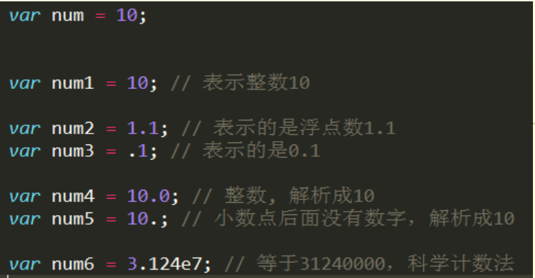
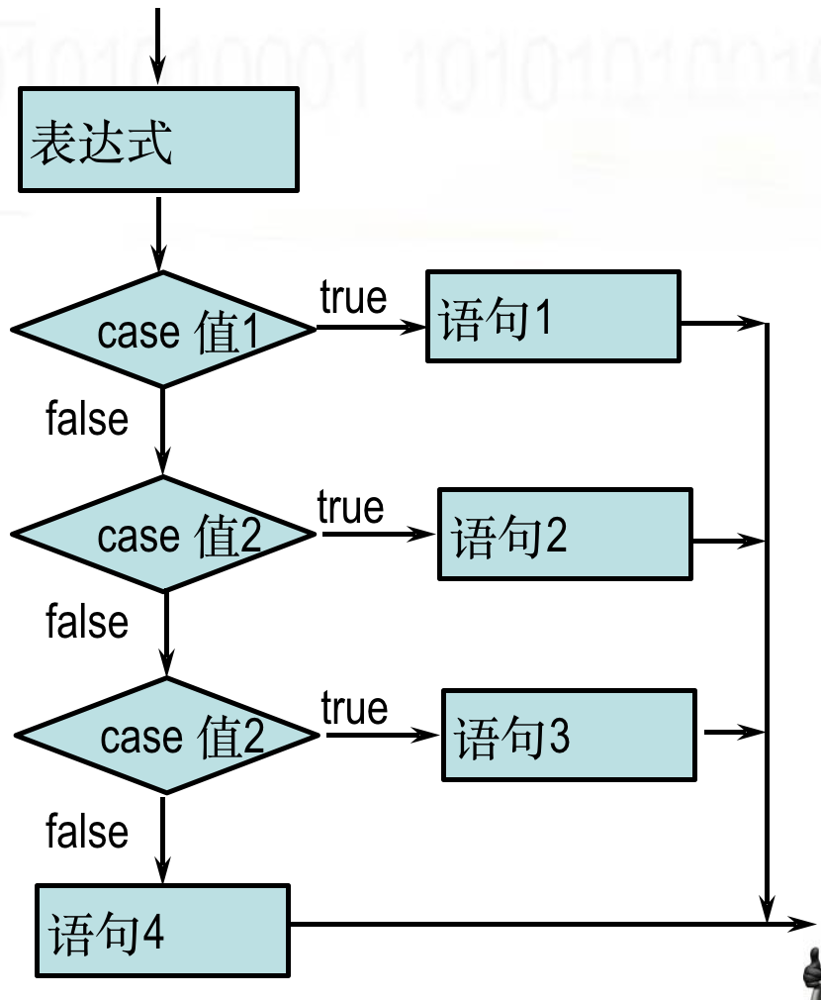
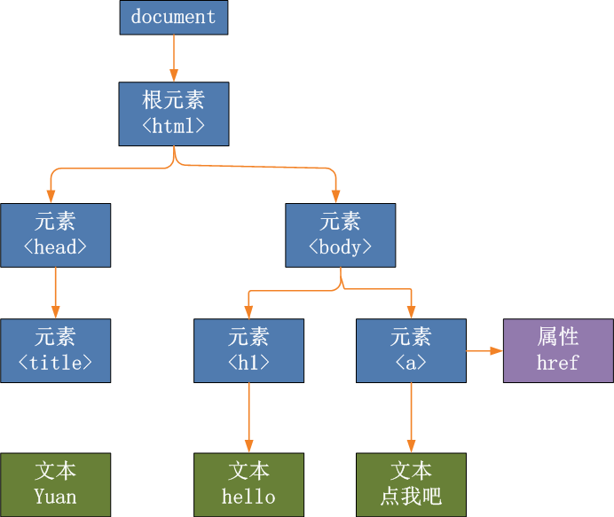
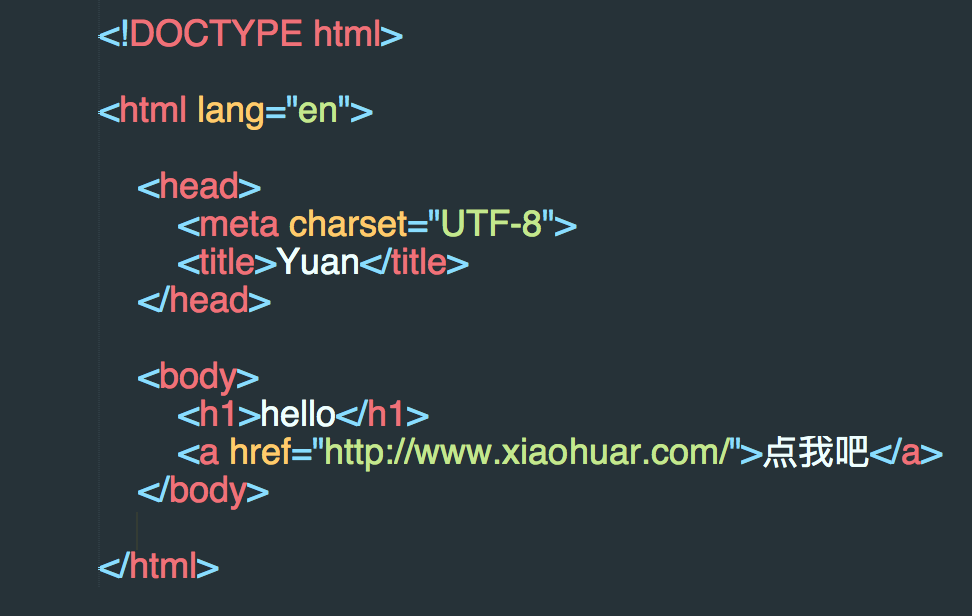
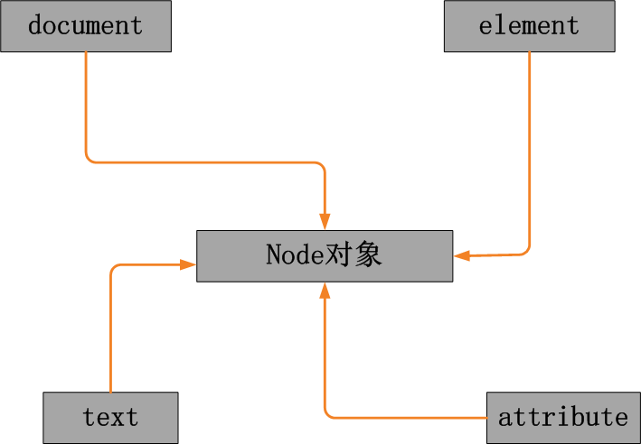
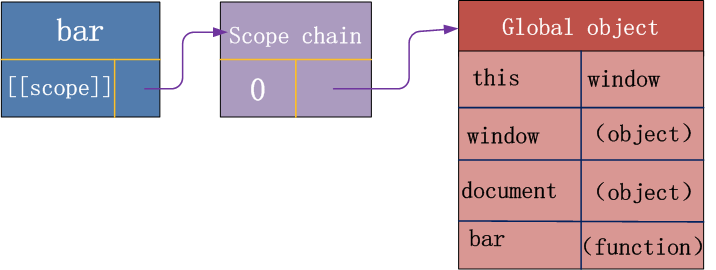
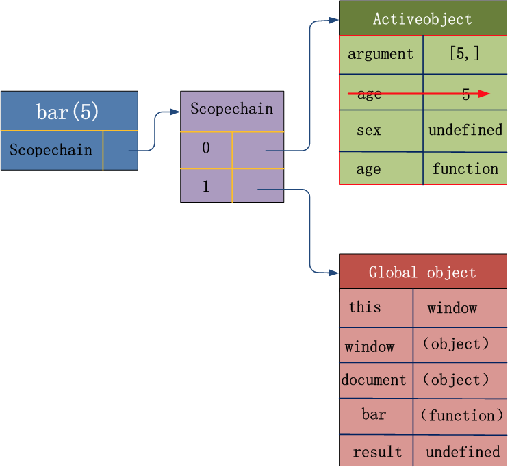

chapter16-JavaScript


#JavaScript概述 

##JavaScript的历史

- 1992年Nombas开发出C-minus-minus(C--)的嵌入式脚本语言(最初绑定在CEnvi软件中).后将其改名ScriptEase.(客户端执行的语言)
- Netscape(网景)接收Nombas的理念,(Brendan Eich)在其Netscape Navigator 2.0产品中开发出一套livescript的脚本语言.Sun和Netscape共同完成.后改名叫Javascript
- 微软随后模仿在其IE3.0的产品中搭载了一个JavaScript的克隆版叫Jscript.
- 为了统一三家,ECMA(欧洲计算机制造协会)定义了ECMA-262规范.国际标准化组织及国际电工委员会（ISO/IEC）也采纳 ECMAScript 作为标准（ISO/IEC-16262）。从此，Web 浏览器就开始努力（虽然有着不同的程度的成功和失败）将 ECMAScript 作为 JavaScript 实现的基础。EcmaScript是规范.

## ECMAScript  

尽管 ECMAScript 是一个重要的标准，但它并不是 JavaScript 唯一的部分，当然，也不是唯一被标准化的部分。实际上，一个完整的 JavaScript 实现是由以下 3 个不同部分组成的：

- 文档对象模型（DOM） Document object model (整合js，css，html，通过js控制html文档，定位和操作标签)
- 浏览器对象模型（BOM） Broswer object model（整合js和浏览器，通过js操作浏览器）
- Javascript 在开发中绝大多数情况是基于对象的.也是面向对象的.（js是基于对象的语言。人家定义好了对象，我们拿过来用。我们更多的是使用，而非创建。）

​         

简单地说，ECMAScript 描述了以下内容：

- 语法 
- 类型 
- 语句 
- 关键字 
- 保留字 
- 运算符 
- 对象 (封装 继承 多态) 基于对象的语言.使用对象.


# 二 JavaScript的基础

## 2.1 JS的引入方式

```html
1 直接编写
    <script>
        alert('hello yuan')
    </script>
2 导入文件
    <script src="hello.js"></script>
```

## 2.2 JS的变量、常量和标识符

### 2.2.1 JS的变量

```js
x=5
y=6
z=x+y
```

在代数中，我们使用字母（比如 x）来保存值（比如 5）。通过上面的表达式 z=x+y，我们能够计算出 z 的值为 11。在 JavaScript 中，这些字母被称为变量。

那么如何在JS中定义使用变量呢？

1、声明变量时不用声明变量类型. 全都使用var关键字;

```js
var a;
a=3;
```

2、一行可以声明多个变量.并且可以是不同类型

```js
var name="yuan", age=20, job="lecturer";
```

3、声明变量时 可以不用var. 如果不用var 那么它是全局变量

4、变量命名,首字符只能是字母,下划线,$美元符 三选一，余下的字符可以是下划线、美元符号或任何字母或数字字符且区分大小写，x与X是两个变量　

```
Camel 标记法--js中使用
首字母是小写的，接下来的字母都以大写字符开头。例如：
var myTestValue = 0, mySecondValue = "hi";
Pascal 标记法
首字母是大写的，接下来的字母都以大写字符开头。例如：
Var MyTestValue = 0, MySecondValue = "hi";
匈牙利类型标记法
在以 Pascal 标记法命名的变量前附加一个小写字母（或小写字母序列），说明该变量的类型。例如，i 表示整数，s 表示字符串，如下所示“
Var iMyTestValue = 0, sMySecondValue = "hi";
```

### 2.2.2 常量和标识符

**常量** ：直接在程序中出现的数据值

标识符：

1. 由不以数字开头的字母、数字、下划线(_)、美元符号($)组成
2. 常用于表示函数、变量等的名称
3. 例如：_abc,$abc,abc,abc123是标识符，而1abc不是
4. JavaScript语言中代表特定含义的词称为保留字，不允许程序再定义为标识符


​           　

## 2.3 JS的数据类型

​            


```js
 /*       
        number     -----  数字
        boolean    -----  布尔值
        string     -----  字符串
        undefined  -----  undefined
        null       -----   null  
      
 */
```


### 2.3.1 数字类型(number)     

- 不区分整型数值和浮点型数值;
- 所有数字都采用64位浮点格式存储，相当于Java和C语言中的double格式
- 能表示的最大值是±1.7976931348623157 x 10308
- 能表示的最小值是±5 x 10 -324 　

整数：
​           在JavaScript中10进制的整数由数字的序列组成
​           精确表达的范围是
-9007199254740992 (-253) 到 9007199254740992 (253)
​           超出范围的整数，精确度将受影响
浮点数：
​           使用小数点记录数据
​           例如：3.4，5.6
​           使用指数记录数据
​           例如：4.3e23 = 4.3 x 1023

16进制和8进制数的表达:
​           16进制数据前面加上0x，八进制前面加0;16进制数是由0-9,A-F等16个字符组成;8进制数由0-7等8个数字组成

​           16进制和8进制与2进制的换算:

```
2进制: 1111 0011 1101 0100   <-----> 16进制:0xF3D4 <-----> 10进制:62420
2进制: 1 111 001 111 010 100 <-----> 8进制:0171724
```

### 2.3.2 字符串类型(string)

是由**Unicode**字符、数字、标点符号组成的序列；字符串常量首尾由单引号或双引号括起；JavaScript中没有字符类型；常用特殊字符在字符串中的表达；
字符串中部分特殊字符必须加上右划线\；常用的转义字符 \n:换行 \':单引号 \":双引号 \\:右划线

### 2.3.3 布尔类型(boolean)

Boolean类型仅有两个值：true和false，也代表1和0，实际运算中true=1,false=0
布尔值也可以看作on/off、yes/no、1/0对应true/false
Boolean值主要用于JavaScript的控制语句，例如：

```js
if (x==1){
      y=y+1;
}else{
      y=y-1;
      }
```

### 2.3.4 Null & Undefined类型

**Undefined类型**

Undefined 类型只有一个值，即 undefined。当声明的变量未初始化时，该变量的默认值是 undefined。（只声明，未赋值时，变量值为undefined）

当函数无明确返回值时，返回的也是值 "undefined";

**Null类型**

另一种只有一个值的类型是 Null，它只有一个专用值 null，即它的字面量。值 undefined 实际上是从值 null 派生来的，因此 ECMAScript 把它们定义为相等的。

尽管这两个值相等，但它们的含义不同。undefined 是声明了变量但未对其初始化时赋予该变量的值，null 则用于表示尚未存在的对象（在讨论 typeof 运算符时，简单地介绍过这一点）。如果函数或方法要返回的是对象，那么找不到该对象时，返回的通常是 null。

## 2.4 运算符

```js
算术运算符：
    +   -    *    /     %       ++        -- 

比较运算符：
    >   >=   <    <=    !=    ==    ===   !==

逻辑运算符：
     &&   ||   ！

赋值运算符：
    =  +=   -=  *=   /=

字符串运算符：
    +  连接，两边操作数有一个或两个是字符串就做连接运算
```

### 2.4.1 算术运算符

**注意1: 自加自减**

假如x=2，那么x++表达式执行后的值为3，x--表达式执行后的值为1；i++相当于i=i+1，i--相当于i=i-1；
递增和递减运算符可以放在变量前也可以放在变量后：--i

```js
var i=10;
console.log("i=i",i);
console.log("a=i++",i++); // 先使用后赋值
console.log("i",i);
console.log("b=++i",++i); // 先赋值，后使用
console.log("i",i);
console.log("c=i--",i--);
console.log("d=i--",i--);
console.log("d=i",i);
console.log("d=--i",--i);
/*
可见： 
* 使用i++时，i先将自身的值赋值给变量a，然后再自增1 
* 使用++i时，i先将自身的值自增1,再将自增后的值赋值给变量a

原理：
运算符优先级
我们知道，++作为后置递增时，优先级为16，而作为前置递增时，优先级为15
=作为赋值运算符时，优先级为3
所以，++会优先于=而执行
*/
```

**注意2: 单元运算符**

```js
- 除了可以表示减号还可以表示负号  例如：x=-y
 
+ 除了可以表示加法运算还可以用于字符串的连接  例如："abc"+"def"="abcdef"
```

**js不同于python，是一门弱类型语言**

```python
#静态类型语言
一种在编译期间就确定数据类型的语言。大多数静态类型语言是通过要求在使用任一变量之前声明其数据类型来保证这一点的。Java 和 C 是静态类型语言。 
#动态类型语言
一种在运行期间才去确定数据类型的语言，与静态类型相反。VBScript 和 Python 是动态类型的，因为它们确定一个变量的类型是在您第一次给它赋值的时候。 
#强类型语言
一种总是强制类型定义的语言。Java 和 Python 是强制类型定义的。您有一个整数，如果不明确地进行转换，不能将把它当成一个字符串去应用。 
#弱类型语言
一种类型可以被忽略的语言，与强类型相反。JS 是弱类型的。在JS中，可以将字符串 '12' 和整数 3 进行连接得到字符串'123'，然后可以把它看成整数 123 ，所有这些都不需要任何的显示转换。 
所以说 Python 既是动态类型语言 (因为它不使用显示数据类型声明)，又是强类型语言 (因为只要一个变量获得了一个数据类型，它实际上就一直是这个类型了)。
```

**注意3:** **NaN**(notNumber)

```js
    var d="yuan";
	// js中加号+可以将字符串转换为数字
    d=+d;
	//NaN:属于Number类型的一个特殊值,当遇到将字符串转成数字无效时,就会得到一个NaN数据
    alert(d);
    alert(typeof(d));//Number

    //NaN特点:
    var n=NaN;
    
    alert(n>3);
    alert(n<3);
    alert(n==3);
    alert(n==NaN);
    
    alert(n!=NaN);//NaN参与的所有的运算都是false,除了!=
```

### 2.4.2 比较运算符

```js
>   >=   <    <=    !=    ==    ===   !==
```

用于控制语句时：

```js
if (2>1){       //  3  0  false null undefined ［］
    console.log("条件成立!")
}
```

等号和非等号的同类运算符是全等号和非全等号。这两个运算符所做的与等号和非等号相同，只是它们在检查相等性前，不执行类型转换。

全等号：判断类型是否一致。

```js
console.log(2==2); //true
console.log(2=="2"); //true
console.log(2==="2"); //false 全等号
console.log(2!=="2"); //true 非全等号
```

注意1：**

```js
var bResult = "Blue" < "alpha";
alert(bResult); //输出 true　　
在上面的例子中，字符串 "Blue" 小于 "alpha"，因为字母 B 的字符代码是 66，字母 a 的字符代码是 97。

比较数字和字符串

另一种棘手的状况发生在比较两个字符串形式的数字时，比如：

var bResult = "25" < "3";
alert(bResult); //输出 "true"
上面这段代码比较的是字符串 "25" 和 "3"。两个运算数都是字符串，所以比较的是它们的最高位字符代码（"2" 的字符代码是 50，"3" 的字符代码是 51）。

不过，如果把某个运算数该为数字，那么结果就有趣了：
var bResult = "25" < 3;
alert(bResult); //输出 "false"
这里，字符串 "25" 将被转换成数字 25，然后与数字 3 进行比较，结果不出所料。

总结：
比较运算符两侧如果一个是数字类型,一个是其他类型,会将其类型转换成数字类型.
比较运算符两侧如果都是字符串类型,比较的是最高位的asc码,如果最高位相等,继续取第二位比较.
```

**注意2：**

```js
等性运算符：== !==
执行类型转换的规则如下：

如果一个运算数是 Boolean 值，在检查相等性之前，把它转换成数字值。false 转换成 0，true 为 1。 
如果一个运算数是字符串，另一个是数字，在检查相等性之前，要尝试把字符串转换成数字。 
如果一个运算数是对象，另一个是字符串，在检查相等性之前，要尝试把对象转换成字符串。 
如果一个运算数是对象，另一个是数字，在检查相等性之前，要尝试把对象转换成数字。 
在比较时，该运算符还遵守下列规则：

值 null 和 undefined 相等。 
在检查相等性时，不能把 null 和 undefined 转换成其他值。 
如果某个运算数是 NaN，等号将返回 false，非等号!=将返回 true。 (NaN参与的所有的运算都是false,除了!=)
如果两个运算数都是对象，那么比较的是它们的引用值。如果两个运算数指向同一对象，那么等号返回 true，否则两个运算数不等。 
```

### 2.4.3 逻辑运算符

```js
//[]为false；列表有值为true。这种使用方式仅限于Python和JS。
// 其他语言中不能直接写个1或字符串等类型是不允许的。
if (2>1 && [1,2]){ 
    console.log("条件与")
}

// 思考返回内容?
console.log(1 && 3); //3
console.log(0 && 3); //0
console.log(0 || 3); //3
console.log(2 || 3); //2

/*
|| 前真返前，前假返后--或是：真前假后
&& 前真返后，前假返前--与是：真后假前
1、只要“||”前面为true，无论“||”后面是true还是false，结果都返回“||”前面的值。
2、只要“||”前面为false，无论“||”后面是true还是false，结果都返回“||”后面的值。
3、只要“&&”前面是true，无论“&&”后面是true还是false，结果都将返“&&”后面的值;
4、只要“&&”前面是false，无论“&&”后面是true还是false，结果都将返“&&”前面的值;

由上两个测试可知，逻辑运算符，“||”和“&&”都是遵行短路原则，只要确定符号前面的真假，既可确定返回值。
需要说明的是“&&”的优先级是高于“||”的，下面测试：
alert(1||'a'&&2);
返回结果是1。
*/
```


## 2.5 流程控制

- 顺序结构(从上向下顺序执行)
- 分支结构
- 循环结构

### 2.5.1 顺序结构

```js
<script>
    console.log(“星期一”);
    console.log(“星期二”);
    console.log(“星期三”);
</script>
```

### 2.5.1 分支结构

**if-else结构：**

```js
if (表达式){
   语句１;
   ......
   } 
else{
   语句２;
   .....
   }
```

功能说明：如果表达式的值为true则执行语句1,否则执行语句2

**示例：**

```js
var d=(new Date()).getDay();
//获取今天的星期值，0为星期天
var td;
if(d==0 || d==6){
    td="周末"
}
else{
    td="工作日"
}
console.log(td)

/*等价于：
var d = (new Date()).getDay()
var td="工作日";
if (d==6 || d==0){
    td = "周末"
}
console.log(td)  
*/
```

**if-elif－else结构：**

```js
if (表达式1) {
    语句1;
}else if (表达式2){
    语句2;
}else if (表达式3){
    语句3;
} else{
    语句4;
}
```

**示例：**

```js
var score=window.prompt("您的分数:");

if (score>90){
    ret="优秀";
}else if (score>80){
    ret="良";
}else if (score>60){
    ret="及格";
}else {
    ret = "不及格";

}
alert(ret);
```

**switch-case结构**

```js
switch基本格式
switch (表达式) {
    case 值1:语句1;break;
    case 值2:语句2;break;
    case 值3:语句3;break;
    default:语句4;
}
```




 

示例：

```js

var x = +window.prompt("选择周几？1-7内的数字:");
var y;
switch(x){
case 1:y="星期一";    break;
case 2:y="星期二";    break;
case 3:y="星期三";    break;
case 4:y="星期四";    break;
case 5:y="星期五";    break;
case 6:y="星期六";    break;
case 7:y="星期日";    break;
default: y="未定义";
}
console.log(y);

/*
x=5时，直接定位到case 5,if语句则要挨个判断，效率不高。
python中没有switch语句，直接通过字典可以实现相同功能。
满足条件，执行完语句要用break退出。否则会一直运行到break语句。
*/
```

switch比else if结构更加简洁清晰，使程序可读性更强,效率更高。

### 2.5.2 循环结构

​              

​                循环语句流程图    

> python中，while循环--条件循环；for循环—遍历循环
>
> js中，for循环和while循环，都属于条件循环

**for循环：**--条件循环

```js
语法规则：

    for(初始表达式;条件表达式;自增或自减)
    {
            执行语句1
            ……
    }
```

功能说明：实现条件循环，当条件成立时，执行语句1，否则跳出循环体

**for循环的另一种形式：**—遍历循环

```js
//此处变量i为索引，python中为索引对应的值。
// js中尽量用条件循环。遍历循环结果中会有元素以外的值。
for( 变量i in 数组或对象) 
    {
        执行语句
        ……
    }
```

**while循环：**--条件循环

```js
语法规则：

while (条件){
    语句1；
    ...
}
```

功能说明：运行功能和for类似，当条件成立循环执行语句花括号{}内的语句，否则跳出循环；同样支持continue与break语句。
**示例：**

```js
var i=1;
while (i<=7) {
    document.write("<H"+i+">hello</H "+i+"> ");
    document.write("<br>");
    i++;
}
//循环输出H1到H7的字体大小
```

### 2.5.3 异常处理

```js
try {
    //这段代码从上往下运行，其中任何一个语句抛出异常该代码块就结束运行
}
catch (e) {
    // 如果try代码块中抛出了异常，catch代码块中的代码就会被执行。
    //e是一个局部变量，用来指向Error对象或者其他抛出的对象
}
finally {
     //无论try中代码是否有异常抛出（甚至是try代码块中有return语句），finally代码块中始终会被执行。
}

try {
    throw Error("error msg")
}
catch (e) {
    console.log("错误信息：",e)
}
finally {
    console.log("无论有没有异常，finally中的代码都会执行")
}
```

注：主动抛出异常 throw Error('xxxx')


# 三 JavaScript的对象

简介：

在JavaScript中除了null和undefined以外其他的数据类型都被定义成了对象，也可以用创建对象的方法定义变量，String、Math、Array、Date、RegExp都是JavaScript中重要的内置对象，在JavaScript程序大多数功能都是基于对象实现的。

```js
<script language="javascript">
var aa=Number.MAX_VALUE; 
//利用数字对象获取可表示最大数
var bb=new String("hello JavaScript"); 
//创建字符串对象
var cc=new Date();
//创建日期对象
var dd=new Array("星期一","星期二","星期三","星期四"); 
//数组对象
</script>
```

   

 

## **3.1 String对象**

### 字符串对象创建

字符串创建(两种方式)
​       ① 变量 = “字符串”
​       ② 字串对象名称 = new String (字符串)

```js
var str1="hello world";
var str1= new String("hello word");
```

### 字符串对象的属性和函数

```js
 x.length         －－－－获取字符串的长度
 x.toLowerCase()        －－－－转为小写
 x.toUpperCase()        －－－－转为大写
 x.trim()               －－－－去除字符串两边空格。一个句子，只去除两边空格，中间的不管。       

－－－－字符串查询方法

x.charAt(index)         －－－－str1.charAt(index);－－－－获取指定位置字符，其中index为要获取的字符索引

x.indexOf(findstr,index)－－－－查询字符串位置(查到的第一个)
x.lastIndexOf(findstr)  －－－－查询字符串位置(查到的最后一个)

x.match(regexp)         －－－－match返回匹配字符串的数组，如果没有匹配则返回null
x.search(regexp)        －－－－search返回匹配字符串的首字符位置索引

                        示例：
                        var str1="welcome to the world of JS!";
                        var str2=str1.match("world");
                        var str3=str1.search("world");
                        alert(str2[0]);  // 结果为"world"
                        alert(str3);     // 结果为15
                        
－－－－子字符串处理方法

x.substr(start, length) －－－－start表示开始位置，length表示截取长度
x.substring(start, end) －－－－end是结束位置

x.slice(start, end)     －－－－切片操作字符串
                        示例：
                            var str1="abcdefgh";
							// [开始位置，结束位置)
                            var str2=str1.slice(2,4);
							// 开始位置
                            var str3=str1.slice(4);
							// [开始位置，结束位置）
							// 索引：从前往后，第一个为0；从后往前，第一个为-1
                            var str4=str1.slice(2,-1);
							// [倒数第3个，最后一个)
                            var str5=str1.slice(-3,-1);

                            alert(str2); //结果为"cd"
                            alert(str3); //结果为"efgh"
                            alert(str4); //结果为"cdefg"
                            alert(str5); //结果为"fg"

x.replace(findstr,tostr) －－－－    字符串替换

x.split();                 －－－－分割字符串
                                 var str1="一,二,三,四,五,六,日"; 
                                var strArray=str1.split(",");
                                alert(strArray[1]);//结果为"二"
                                
x.concat(addstr)         －－－－    拼接字符串
```

```js
// 综合练习
var str1 = "Hello World";
var str2 = new String(" welcome to the world of JS! ");
console.log(str1.length);
console.log(str1.toLowerCase());
console.log(str1.toUpperCase());
// 只去除两边空白
console.log(str2.trim());
console.log(str1.charAt(2));
console.log(str1.indexOf('l'));
console.log(str1.lastIndexOf('l'));
// 返回匹配字符串的数组，没有则返回null。
// ["lo", index: 3, input: "Hello World", groups: undefined]
console.log(str1.match("lo"));
// 返回匹配字符串的首字符位置索引
console.log(str1.search('lo'));
// (开始位置，步长)
console.log(str1.substr(2,5));
// (开始位置，结束位置)
console.log(str1.substring(2,5));
console.log(str1.slice(2,4));
console.log(str1.slice(4));
console.log(str1.slice(2,-1));
console.log(str1.slice(-3,-1));
console.log(str2.replace("JS","python"));
console.log(str2.split(" "));
// 字符串拼接
console.log(str1.concat("hello js"));
```


## 3.2 Array对象

### 3.2.1 数组创建

创建数组的三种方式：

```js
创建方式1:
var arrname = [元素0,元素1,….];          // var arr=[1,2,3];

创建方式2:
var arrname = new Array(元素0,元素1,….); // var test=new Array(100,"a",true);

创建方式3:
var arrname = new Array(长度); 
            //  初始化数组对象:
                var cnweek=new Array(7);
                    cnweek[0]="星期日";
                    cnweek[1]="星期一";
                    ...
                    cnweek[6]="星期六";
```

创建二维数组：

```js
var cnweek=new Array(7);
for (var i=0;i<=6;i++){
    cnweek[i]=new Array(2);
}
cnweek[0][0]="星期日";
cnweek[0][1]="Sunday";
cnweek[1][0]="星期一";
cnweek[1][1]="Monday";
...
cnweek[6][0]="星期六";
cnweek[6][1]="Saturday";
```

### 3.2.2 数组对象的属性和方法

**join方法：**

```js
x.join(bystr)       －－－－将数组元素拼接成字符串

var arr1=[1, 2, 3, 4, 5, 6, 7];
var str1=arr1.join("-");
alert(str1);  //结果为"1-2-3-4-5-6-7" 
```

**concat方法：**

```js
x.concat(value,...)    －－－－ 拼接数组
var a = [1,2,3];
var b=a.concat(4,5) ;
alert(a.toString());  //返回结果为1,2,3            
alert(b.toString());  //返回结果为1,2,3,4,5
```

**数组排序-reverse sort：**

```js
//x.reverse()
//x.sort()

var arr1=[32, 12, 111, 444];
//var arr1=["a","d","f","c"];

arr1.reverse(); //颠倒数组元素
alert(arr1.toString());
//结果为444,111,12,32

arr1.sort();    //排序数组元素
alert(arr1.toString());
//结果为111,12,32,444

//------------------------------
arr=[1,5,2,100];
//arr.sort();
//alert(arr);

//如果就想按着数字比较呢?
function intSort(a,b){
    if (a>b){
        return 1;//-1
    }
    else if(a<b){
        return -1;//1
    }
    else {
        return 0
    }
}
arr.sort(intSort);
alert(arr);

// 函数简化：
function IntSort(a,b){
    return a-b;
}
```

**数组切片操作：**

```js
//x.slice(start, end)
//
//使用注解
//
//x代表数组对象 范围：顾头不顾尾，[开始位置,结束位置)
//start表示开始位置索引
//end是结束位置下一个数组元素索引编号
//第一个数组元素索引为0
//start、end可为负数，-1代表最后一个数组元素
//end省略则相当于从start位置截取以后所有数组元素

var arr1=['a','b','c','d','e','f','g','h'];
var arr2=arr1.slice(2,4);
var arr3=arr1.slice(4);
var arr4=arr1.slice(2,-1);

alert(arr2.toString());
//结果为"c,d" 
alert(arr3.toString());
//结果为"e,f,g,h"
alert(arr4.toString());
//结果为"c,d,e,f,g"
```

**删除子数组：**

```js
//x. splice(start, deleteCount, value, ...)

//使用注解

//x代表数组对象
//splice的主要用途是对数组指定位置进行删除和插入
//start表示开始位置索引
//deleteCount删除数组元素的个数
//value表示在删除位置插入的数组元素
//value参数可以省略       
        
var a = [1,2,3,4,5,6,7,8];
console.log(a.splice(1,2)); // [2, 3]
console.log(a) // [1, 4, 5, 6, 7, 8]
console.log(a.splice(1,1)); // [4]
console.log(a) // [1, 5, 6, 7, 8]
console.log(a.splice(1,2,22,33)); // [5, 6]
console.log(a) // [1, 22, 33, 7, 8]
```

**数组的push和pop：**

```js
//push pop这两个方法模拟的是一个栈操作

//x.push(value, ...)  压栈
//x.pop()             弹栈      
//使用注解
//x代表数组对象
//value可以为字符串、数字、数组等任何值
//push是将value值添加到数组x的结尾
//pop是将数组x的最后一个元素删除


var arr1=[1,2,3];
arr1.push(4,5);
alert(arr1);
//结果为"1,2,3,4,5"
arr1.push([6,7]);
alert(arr1)
//结果为"1,2,3,4,5,6,7"
arr1.pop();
alert(arr1);
//结果为"1,2,3,4,5"
```

**数组的shift和unshift：**

```js
//x.unshift(value,...)
//x.shift()
//使用注解

//x代表数组对象
//value可以为字符串、数字、数组等任何值
//unshift是将value值插入到数组x的开始
//shift是将数组x的第一个元素删除

var arr1=[1,2,3];
arr1.unshift(4,5);
alert(arr1);  //结果为"4,5,1,2,3"

arr1. unshift([6,7]);
alert(arr1);  //结果为"6,7,4,5,1,2,3"

arr1.shift();
alert(arr1);  //结果为"4,5,1,2,3"

var arr1 = [1,2,3];
arr1.push("a","b")
console.log(arr1);
arr1.push("c","d")
console.log(arr1);
arr1.pop();
console.log(arr1);
/* 输出结果
[1, 2, 3, "a", "b"]
[1, 2, 3, "a", "b", "c", "d"]
[1, 2, 3, "a", "b", "c"]
*/

var arr2 = [1,2,3];
arr2.unshift("55","66");
console.log(arr2);
arr2.unshift("11","22");
console.log(arr2);
arr2.shift();
console.log(arr2);
/* 输出结果
["55", "66", 1, 2, 3]
["11", "22", "55", "66", 1, 2, 3]
["22", "55", "66", 1, 2, 3]
*/
```

**总结js的数组特性：**

```js
//  js中数组的特性
         //java中数组的特性,  规定是什么类型的数组,就只能装什么类型.只有一种类型.
         //js中的数组特性1: js中的数组可以装任意类型,没有任何限制.
         //js中的数组特性2: js中的数组,长度是随着下标变化的.用到多长就有多长.
         var arr5 = ['abc',123,1.14,true,null,undefined,new String('1213'),new Function('a','b','alert(a+b)')];
        /*  alert(arr5.length);//8
         arr5[10] = "hahaha";
         alert(arr5.length); //11
         alert(arr5[9]);// undefined */
```

先进还是后进 ，按在数组中的结构来说。


```js
# 综合练习
var str1 = arr1.join("--");
console.log(str1)

var arr_a = ["a",1,"b",2];
var arr_b = arr_a.concat("c",3);
console.log(arr_a);
// ["a", 1, "b", 2, "c", 3]
console.log(arr_b);
// 翻转排序
console.log(arr_a.reverse());
// 按每个元素首位的ASCII码排序
console.log(arr_a.sort());

function intSort(a,b) {
    return a-b;
}
arr_tosort = [222,122,89,18,26];
// [122, 18, 222, 26, 89]
console.log(arr_tosort.sort());
arr_sorted = arr_tosort.sort(intSort);
// [18, 26, 89, 122, 222]
console.log(arr_sorted);

var arr1=['a','b','c','d','e','f','g','h'];
console.log(arr1.slice(2,4));
console.log(arr1.slice(4));
console.log(arr1.slice(2,-1));
// ["d", "e", "f", "g"]
console.log(arr1.slice(-5,-1));

```


## 3.3 Date对象

### 3.3.1 创建Date对象

```js
//方法1：不指定参数
var nowd1=new Date();
alert(nowd1.toLocaleString( ));
//方法2：参数为日期字符串
var nowd2=new Date("2004/3/20 11:12"); // 分隔符 / - 空格
alert(nowd2.toLocaleString( ));
var nowd3=new Date("04/03/20 11:12");
alert(nowd3.toLocaleString( ));
//方法3：参数为毫秒数
var nowd3=new Date(5000);
alert(nowd3.toLocaleString( ));
alert(nowd3.toUTCString());

//方法4：参数为年月日小时分钟秒毫秒
var nowd4=new Date(2004,2,20,11,12,0,300);
alert(nowd4.toLocaleString( ));//毫秒并不直接显示
```

```js
var nowd1 = new Date();
console.log(nowd1.toLocaleString());
var nowd2 = new Date("2001/2/9 11:02");
// Fri Feb 09 2001 11:02:00 GMT+0800 (中国标准时间)
console.log(nowd2);
// 2001/2/9 -- 只显示年月日
console.log(nowd2.toLocaleDateString());
// Fri, 09 Feb 2001 03:02:00 GMT --与中国时间相差8个小时
console.log(nowd2.toUTCString());
var nowd3 = new Date("04/03/20 11:02");
// 2020/4/3 上午11:02:00
console.log(nowd3.toLocaleString());
var nowd3_1 = new Date("2004/03/20 11:02");
// 2004/3/20 上午11:02:00
console.log(nowd3_1.toLocaleString());
var nowd4 = new Date(5000);
console.log(nowd4.toLocaleString());
var nowd6 = new Date(2000,11,1,6,30,10,3);
// 2000/12/1 上午6:30:10
console.log(nowd6.toLocaleString());
```


### Date对象的方法—获取日期和时间

```js
获取日期和时间
getDate()                 获取日
getDay ()                 获取星期。[0, 6]。0表示星期日，1~6分别表示星期一至星期六
getMonth ()               获取月（0-11）
getFullYear ()            获取完整年份,2001
getYear ()                获取年,01
getHours ()               获取小时
getMinutes ()             获取分钟
getSeconds ()             获取秒
getMilliseconds ()        获取毫秒
getTime ()                返回累计毫秒数(从1970/1/1午夜)
```

实例练习：

```js
// 当前日期格式 2002年06月12日 10:22:30 周一
function getCurrentDate(){
        //1. 创建Date对象
        var date = new Date(); //没有填入任何参数那么就是当前时间
        //2. 获得当前年份
        var year = date.getFullYear();
        //3. 获得当前月份 js中月份是从0到11.
        var month = date.getMonth()+1;
        //4. 获得当前日
        var day = date.getDate();
        //5. 获得当前小时
        var hour = date.getHours();
        //6. 获得当前分钟
        var min = date.getMinutes();
        //7. 获得当前秒
        var sec = date.getSeconds();
        //8. 获得当前星期
        var week = date.getDay(); //没有getWeek
        // 2014年06月18日 15:40:30 星期三
        return year+"年"+changeNum(month)+"月"+day+"日 "+hour+":"+min+":"+sec+" "+parseWeek(week);
    }

alert(getCurrentDate());

//解决 自动补齐成两位数字的方法
    function changeNum(num){
    if(num < 10){
        return "0"+num;
    }else{
        return num;
    }

}
//将数字 0~6 转换成 星期日到星期六
    function parseWeek(week){
    var arr = ["星期日","星期一","星期二","星期三","星期四","星期五","星期六"];
    //             0      1      2      3 .............
    return arr[week];
}
```

### Date对象的方法—设置日期和时间

```js
//设置日期和时间
//setDate(day_of_month)       设置日
//setMonth (month)                 设置月
//setFullYear (year)               设置年
//setHours (hour)         设置小时
//setMinutes (minute)     设置分钟
//setSeconds (second)     设置秒
//setMillliseconds (ms)       设置毫秒(0-999)
//setTime (allms)     设置累计毫秒(从1970/1/1午夜)
    
var x=new Date();
x.setFullYear (1997);    //设置年1997
x.setMonth(7);        //设置月7
x.setDate(1);        //设置日1
x.setHours(5);        //设置小时5
x.setMinutes(12);    //设置分钟12
x.setSeconds(54);    //设置秒54
x.setMilliseconds(230);        //设置毫秒230
document.write(x.toLocaleString( )+"<br>");
//返回1997年8月1日5点12分54秒

x.setTime(870409430000); //设置累计毫秒数
document.write(x.toLocaleString( )+"<br>");
//返回1997年8月1日12点23分50秒
```

### Date对象的方法—日期和时间的转换

```js
日期和时间的转换:
getTimezoneOffset():8个时区×15度×4分/度=480;
返回本地时间与GMT的时间差，以分钟为单位
toUTCString()
返回国际标准时间字符串
toLocalString()
返回本地格式时间字符串
Date.parse(x)
返回累计毫秒数(从1970/1/1午夜到本地时间)
Date.UTC(x)
返回累计毫秒数(从1970/1/1午夜到国际时间)
```


## 3.4 Math对象

```js
// Math对象不需要创建对象,直接使用Math对象调用即可
//该对象中的属性方法 和数学有关.
abs(x)    返回数的绝对值。
exp(x)    返回 e 的指数。
floor(x)  对数进行下舍入。
log(x)    返回数的自然对数（底为e）。
max(x,y)    返回 x 和 y 中的最高值。
min(x,y)    返回 x 和 y 中的最低值。
pow(x,y)    返回 x 的 y 次幂。
random()    返回 0 ~ 1 之间的随机数。
round(x)    把数四舍五入为最接近的整数。
sin(x)    返回数的正弦。
sqrt(x)   返回数的平方根。
tan(x)    返回角的正切。

//方法练习:
//alert(Math.random()); // 获得随机数 0~1 不包括1.
//alert(Math.round(1.5)); // 四舍五入
//练习：获取1-100的随机整数，包括1和100
	var num = Math.random();
	num = num*100+1;
	num = Math.round(num);
	console.log(num);
//============max  min=========================
/* alert(Math.max(1,2));// 2
alert(Math.min(1,2));// 1 */
//-------------pow--------------------------------
alert(Math.pow(2,4));// pow 计算参数1 的 参数2 次方.
```


## 3.5 Function 对象(重点)

### **3.5.1 函数的定义**

```js
function 函数名 (参数){
    函数体;
    return 返回值;
}
```

功能说明：

可以使用变量、常量或表达式作为函数调用的参数
函数由关键字function定义
函数名的定义规则与标识符一致，大小写是敏感的
返回值必须使用return
Function 类可以表示开发者定义的任何函数。

补充理解:函数的定义和变量的定义没什么区别，都是赋值操作。将一个值/函数体赋值给一个变量名/函数名。区别在于调用方法不同。变量直接用 变量名 ，函数则是 函数名()

用 Function 类直接创建函数的语法如下：

```js
var 函数名 = new Function("参数1","参数n","function_body");
```

虽然由于字符串的关系，第二种形式写起来有些困难，但有助于理解函数只不过是一种引用类型，它们的行为与用 Function 类明确创建的函数行为是相同的。

示例：

```js
function func1(name){
    alert('hello'+name);
    return 8
}

    ret=func1("yuan");
    alert(ret);


var func2=new Function("name","alert(\"hello\"+name);")
func2("egon")
```

**注意：js的函数加载执行与python不同，它是整体加载完才会执行，所以执行函数放在函数声明上面或下面都可以：**(用 Function 类直接创建函数时，不行。)

```js
<script>
    //f(); --->OK
    function f(){
        console.log("hello")
    }
    f() //----->OK
</script>
```

### **3.5.2 Function 对象的属性**

如前所述，函数属于引用类型，所以它们也有属性和方法。
比如，ECMAScript 定义的属性 length 声明了函数期望的参数个数。

```js
alert(func1.length)
```

### **3.5.3 Function 的调用**

```js
function func1(a,b){
    alert(a+b);
}

    func1(1,2);  //3
    func1(1,2,3);//3
    func1(1);    //NaN
    func1();     //NaN
    //只要函数名写对即可,参数怎么填都不报错.

-------------------面试题-----------
 function a(a,b){
    alert(a+b);
}
   // 覆盖了函数的定义
   var a=1;
   var b=2;
   // uncaught TypeError: a is not a function
   a(a,b) 
```

### **3.5.4** 函数的内置对象arguments

```js
// ------------------arguments：接收指定个数参数------------------
function add(a,b){
        console.log(a+b);//3
        console.log(arguments.length);//2
        console.log(arguments);//[1,2]
    }
    add(1,2)

    // ------------------arguments的用处1:任意位数加法器 ------------------
    function nxAdd(){
        var result=0;
        for (var num in arguments){
            result+=arguments[num]
        }
        alert(result)
    }
	//arguments: [1, 2, 3, 4, 5, callee: ƒ, Symbol(Symbol.iterator): ƒ]
    nxAdd(1,2,3,4,5)

//     ------------------arguments的用处2 ------------------
    function f(a,b,c){
        if (arguments.length!=3){
            throw new Error("function f called with "+arguments.length+" arguments,but it just need 3 arguments")
        }
        else {
            alert("success!")
        }
    }

    f(1,2,3,4,5)
```

### **3.5.4** 匿名函数

```js
// 定义：定义函数时，不写函数名。
// 匿名函数可以赋值给一个变量。但失去了匿名函数的意义。
    var func = function(arg){
        return "tony";
    }

// 匿名函数的应用--(执行体)()
    (function(){
        alert("tony");
    } )()

    (function(arg){
        console.log(arg);
    })('123')
```

```python
# python中的匿名函数lambda：(lambda 参数1,参数2:执行代码返回值)(参数1,参数2)
(lambda x,y:x+y)(1,2)
```


# **BOM对象（对象）**

**window对象**

```js
所有浏览器都支持 window 对象。
概念上讲.一个html文档对应一个window对象.
功能上讲: 控制浏览器窗口的.
使用上讲: window对象是一个全局变量，不需要创建对象,直接使用即可.
```

### Window 对象方法

```js
alert()            显示带有一段消息和一个确认按钮的警告框。
confirm()          显示带有一段消息以及确认按钮和取消按钮的对话框。返回值true/false
prompt()           显示可提示用户输入的对话框。

open()             打开一个新的浏览器窗口或查找一个已命名的窗口。
close()            关闭浏览器窗口。
// 大量应用，定时器
setInterval()      按照指定的周期（以毫秒计）来调用函数或计算表达式。(按周期执行)
clearInterval()    取消由 setInterval() 设置的 timeout。
setTimeout()       在指定的毫秒数后调用函数或计算表达式。(只执行一次)
clearTimeout()     取消由 setTimeout() 方法设置的 timeout。
scrollTo()         把内容滚动到指定的坐标。
alert("hello") 即window.alert("hello")。默认知道是window对象在调用。
```

### 方法使用

**1、alert confirm prompt以及open函数**

```js
    //----------alert confirm prompt----------------------------
    //alert('aaa');
        
    /* var result = confirm("您确定要删除吗?");
    alert(result); */

    //prompt 参数1 : 提示信息.   参数2:输入框的默认值. 返回值是用户输入的内容.
	// 返回值：返回值:1. 点击确定按钮，文本框中的内容将作为函数返回值；2. 点击取消按钮，将返回null
    var result = prompt("请输入一个数字!","haha");
    alert(result);


    方法讲解:    
        //open方法 打开一个新的窗口 并 进入指定网址.参数1 : 网址.
        //调用方式1
            //open("http://www.baidu.com");
        //参数1 什么都不填 就是打开一个新窗口.  参数2.填入新窗口的名字(一般可以不填). 参数3: 新打开窗口的参数.
            open('','','width=200,resizable=no,height=100'); // 新打开一个宽为200 高为100的窗口
        //close方法  将当前文档窗口关闭.
            //close();
```

**示例：**

```js
 var num = Math.round(Math.random()*100);
    function acceptInput(){
        //2.让用户输入(prompt)    并接受 用户输入结果
    	var userNum = prompt("请输入一个0~100之间的数字!","0");
    	//3.将用户输入的值与 随机数进行比较
        if(isNaN(+userNum)){
            //用户输入的无效(重复2,3步骤)
            alert("请输入有效数字!");
            acceptInput();
        }else if(usernum == null){
            // 用户点击“取消”，关闭当前页面
        	close();
    	}else if(userNum > num){
            //大了==> 提示用户大了,让用户重新输入(重复2,3步骤)
            alert("您输入的大了!");
            acceptInput();
        }else if(userNum < num){
            //小了==> 提示用户小了,让用户重新输入(重复2,3步骤)
            alert("您输入的小了!");
            acceptInput();
        }else{
            //答对了==>提示用户答对了 , 询问用户是否继续游戏(confirm).
            var result = confirm("恭喜您!答对了,是否继续游戏?");
            if(result){
                //是 ==> 重复123步骤.
                num = Math.round(Math.random()*100);
                acceptInput();
            }else{
                //否==> 关闭窗口(close方法).
                close();
            }
        }
    }

// 字符串转换为数字的方式之一：+ 操作符
// 如果是一个NaN值，那么返回的也是NaN 
```

2、**setInterval，clearInterval**

setInterval() 方法会不停地调用函数，直到 clearInterval() 被调用或窗口被关闭。由 setInterval() 返回的 ID 值可用作 clearInterval() 方法的参数。

```js
语法：
setInterval(code,millisec)
其中，code为要调用的函数名（注意不是函数的执行）或要执行的代码串。millisec周期性执行或调用 code 之间的时间间隔，以毫秒计。
```

```js
// 应用场景：点赞之后，提示不能重复点击；京东轮播图
// 基本使用
function func(){
    console.log("hello!")
}

intervalID = setInterval(func, 1000);
// 控制台没有打印，1秒钟未到就取消了
clearInterval(intervalID);

timeoutID = setTimeout(func,1000);
// 控制台没有打印
clearTimeout(timeoutID);
```

**示例：**

```html
<input id="input_datetime" type="text">
<button onclick="begin()">开始</button>
<button onclick="end()">停止</button>

<script>
    function showtime() {
    var now = new Date().toLocaleString();
    var ele = document.getElementById("input_datetime");
    // html标签就是一个对象，获取属性用点语法.
    ele.value = now.toString();
    }

    var ID;
    function begin() {
        if (ID == undefined){
            showtime();
            ID = setInterval(showtime,1000);
        }
    }

    function end() {
        clearInterval(ID);
        ID = undefined;
    }

</script>
```

# **DOM对象（重点）**

## **什么是HTML  DOM**

- ​    HTML  Document Object Model（文档对象模型）
- ​    HTML DOM 定义了访问和操作HTML文档的标准方法
- ​    HTML DOM 把 HTML 文档呈现为带有元素、属性和文本的树结构（节点树)

## **DOM**树

 

​              

 

 画dom树是为了展示文档中各个对象之间的关系，用于对象的导航。

## **DOM节点**

### **节点类型**

HTML 文档中的每个成分都是一个节点。可以理解为都是节点对象。

DOM 是这样规定的：
​    整个文档是一个文档节点 

​    每个 HTML 标签是一个元素节点 

​    每一个 HTML 属性是一个属性节点

​    包含在 HTML 元素中的文本是文本节点 

注释节点



 

其中，document与element节点是重点。

### 节点关系

节点树中的节点彼此拥有层级关系。
父(parent),子(child)和同胞(sibling)等术语用于描述这些关系。父节点拥有子节点。同级的子节点被称为同胞（兄弟或姐妹）。

- ​    在节点树中，顶端节点被称为根（root）
- ​    每个节点都有父节点、除了根（它没有父节点）
- ​    一个节点可拥有任意数量的子节点
- ​    同胞是拥有相同父节点的节点

下面的图片展示了节点树的一部分，以及节点之间的关系：


访问 HTML 元素（节点）,访问 HTML 元素等同于访问节点,我们能够以不同的方式来访问 HTML 元素。

### 节点查找

**直接查找节点**

```js
document.getElementById(“idname”)
document.getElementsByTagName(“tagname”)
document.getElementsByName(“name”)
document.getElementsByClassName(“name”)
```


```html
<div id="div1">

    <div class="div2">i am div2</div>
    <div name="yuan">i am div2</div>
    <div id="div3">i am div2</div>
    <p>hello p</p>
</div>

<script>

   var div1=document.getElementById("div1");

////支持;
//   var ele= div1.getElementsByTagName("p");
//   alert(ele.length);
////支持
//   var ele2=div1.getElementsByClassName("div2");
//   alert(ele2.length);
////不支持
//   var ele3=div1.getElementById("div3");
//   alert(ele3.length);
////不支持
//   var ele4=div1.getElementsByName("yuan");
//   alert(ele4.length)

</script>
```

**注意：设计到寻找元素，注意<script>标签的位置！**

**导航节点属性**

```js
'''

parentElement           // 父节点标签元素

children                // 所有子标签

firstElementChild       // 第一个子标签元素

lastElementChild        // 最后一个子标签元素

nextElementtSibling     // 下一个兄弟标签元素

previousElementSibling  // 上一个兄弟标签元素

'''
```

注意，js中没有办法找到所有的兄弟标签！

### 节点操作

**创建节点：**

```js
createElement(标签名) ：创建一个指定名称的元素。
// 例：
var tag=document.createElement(“input")
tag.setAttribute('type','text');
tag.type="text";
```

**添加节点：**

```js
// 父节点添加子节点。追加一个子节点（作为最后的子节点）
somenode.appendChild(newnode)
 
// 兄弟节点前后插入。把增加的节点放到某个节点的前边
somenode.insertBefore(newnode,某个节点);
```

**删除节点：**

```js
removeChild(ele)：获得要删除的元素，通过父元素调用删除
```

**替换节点：**

```js
somenode.replaceChild(newnode, 某个节点);
```

**节点属性操作：**

1、获取文本节点的值：

innerText 元素节点下的纯文本。替换时，替换全部内容，按纯文本渲染。

innerHTML 元素节点下的html内容。替换时，替换全部内容，按HTML标签渲染。

2、attribute操作

```
js原始操作方法：
elementNode.setAttribute(name,value)    

elementNode.getAttribute("属性名")	<-------------->elementNode.属性名(DHTML)动态获取方法

elementNode.removeAttribute("属性名");
// 相当于OC中的点语法，对getter和setter的简化。
```

3、value获取当前选中的value值
​        1.input   （input中的name和value组成键值对，发送到server端）

​        2.select （selectedIndex）

​        3.textarea  

4、innerHTML 给节点添加html代码：
​        该方法不是w3c的标准，但是主流浏览器支持    
​        tag.innerHTML = “<p>要显示内容</p>”;

5、关于class的操作：

```js
elementNode.className
elementNode.classList.add
elementNode.classList.remove
```

 6、改变css样式：

```html
<p id="p2">Hello world!</p>
document.getElementById("p2").style.color="blue";
                             .style.fontSize=48px

```

## DOM Event(事件)

### 事件类型

on触发某个事件+具体事件

```js
onclick        当用户点击某个对象时调用的事件句柄。
ondblclick     当用户双击某个对象时调用的事件句柄。

onfocus        元素获得焦点。               练习：输入框
onblur         元素失去焦点。               应用场景：用于表单验证,用户离开某个输入框时,代表已经输入完了,我们可以对它进行验证.
onchange       域的内容被改变。             应用场景：通常用于表单元素,当元素内容被改变时触发.（三级联动）

onkeydown      某个键盘按键被按下。          应用场景: 当用户在最后一个输入框按下回车按键时,表单提交.
onkeypress     某个键盘按键被按下并松开。
onkeyup        某个键盘按键被松开。

onload         一张页面或一幅图像完成加载。

onmousedown    鼠标按钮被按下。
onmousemove    鼠标被移动。
onmouseout     鼠标从某元素移开。离开
onmouseover    鼠标移到某元素之上。悬浮。
onmouseleave   鼠标从元素离开。(建议使用)

onselect       文本被选中。
onsubmit       确认按钮被点击。
```

### 绑定事件方式

**方式1:**

```html
<div id="div" onclick="foo(this)">点我呀</div>

<script>
    function foo(self){           // 形参不能是this;
        console.log("点你了!");
        console.log(self);   
    }
</script>
```

**方式2:**

```html
<p id="abc">试一试!</p>

<script>

    var ele=document.getElementById("abc");

    ele.onclick=function(){
        console.log("ok");
        console.log(this);    // this直接用
    };

</script>
```

```js
// this 指当前事件触发的标签
```


### 事件介绍

```js
window.onload=function(e){}
形参e:事件状态。event对象。封装了所有事件的状态。
事件驱动编程。触发机制，用户通过操作某个事件触发。事件依赖物理器件的状态完成。只有操作系统才知道事件什么时候发生以及最终的状态。所以e是由操作系统封装的函数。
应用场景：
登录信息可以点击按钮提交，也可以按回车键提交(e中监听键盘输入的具体值)
点击提交按钮前，在前端验证用户输入格式，格式不对，不向服务器提交。e.preventDefault。
```


**1、onload：**

onload 属性开发中 只给 body元素加.这个属性的触发 标志着 页面内容被加载完成.应用场景: 当有些事情我们希望页面加载完立刻执行,那么可以使用该事件属性.

```html
<!DOCTYPE html>
<html lang="en">
<head>
    <meta charset="UTF-8">
    <title>Title</title>

    <script>
         /*
              window.onload=function(){
                   var ele=document.getElementById("ppp");
                   ele.onclick=function(){
                   alert(123)
                };
             };
         
         */
          function fun() {
              var ele=document.getElementById("ppp");
               ele.onclick=function(){
                alert(123)
            };
          }

    </script>
</head>
<body onload="fun()">

<p id="ppp">hello p</p>

</body>
</html>
```


**2、onsubmit：**

当表单在提交时触发. 该属性也只能给form元素使用.应用场景: 在表单提交前验证用户输入是否正确.如果验证失败.在该方法中我们应该阻止表单的提交.

```html
<!DOCTYPE html>
<html lang="en">
<head>
    <meta charset="UTF-8">
    <title>Title</title>

    <script>

        window.onload=function(){
            //阻止表单提交方式1().
            //onsubmit 命名的事件函数,可以接受返回值. 其中返回false表示拦截表单提交.其他为放行.
             var ele=document.getElementById("form");
             ele.onsubmit=function(event) {
            //    alert("验证失败 表单不会提交!");
            //    return false;

            // 阻止表单提交方式2 event.preventDefault(); ==>通知浏览器不要执行与事件关联的默认动作。
             alert("验证失败 表单不会提交!");
             event.preventDefault();

    }

        };

    </script>
</head>
<body>

<form id="form">
            <input type="text"/>
            <input type="submit" value="点我!" />
</form>

</body>
</html>
```

**3、事件传播：**

子标签设定的事件不想受到父标签影响时，使用event.stopPropagation(); 阻止事件向外层div传播。

```html
<div id="abc_1" style="border:1px solid red;width:300px;height:300px;">
        <div id="abc_2" style="border:1px solid red;width:200px;height:200px;">

        </div>
</div>

<script type="text/javascript">
        document.getElementById("abc_1").onclick=function(){
            alert('111');
        };
        document.getElementById("abc_2").onclick=function(event){
            alert('222');
            event.stopPropagation(); //阻止事件向外层div传播.
        }
</script>
```


**4、onselect：**（不常用）

应用场景：下拉菜单选中时触发。input框中文本选中时。文档选中内容时。

```html
<input type="text">

<script>
    var ele=document.getElementsByTagName("input")[0];

    ele.onselect=function(){
          alert(123);
    }

</script>
```


**5、onchange:**（常用）

三级联动

```html
<select name="" id="">
    <option value="">111</option>
    <option value="">222</option>
    <option value="">333</option>
</select>

<script>
    var ele=document.getElementsByTagName("select")[0];

    ele.onchange=function(){
          alert(123);
    }

</script>
```


**6、onkeydown:**

Event 对象：Event 对象代表事件的状态，比如事件在其中发生的元素、键盘按键的状态、鼠标的位置、鼠标按钮的状态。
事件通常与函数结合使用，函数不会在事件发生前被执行！event对象在事件发生时系统已经创建好了,并且会在事件函数被调用时传给事件函数.我们获得仅仅需要接收一下即可.比如onkeydown,我们想知道哪个键被按下了，需要问下event对象的属性，这里就时KeyCode.

```html
<input type="text" id="t1"/>

<script type="text/javascript">

    var ele=document.getElementById("t1");

    ele.onkeydown=function(e){
		// 做兼容。作为全局变量传。有的浏览器识别不了window.event。||（或）前面的取不到就取后面的。取的都是事件状态的event对象。
        e=e||window.event;

        var keynum=e.keyCode;//键盘上对应的ASC码
        var keychar=String.fromCharCode(keynum); 
        //同Python中ord()字母转换成对应ASC码，char()ASC码转成对应字母

        alert(keynum+'----->'+keychar);

    };

</script>
```

**7、onmouseout与onmouseleave事件的区别：**

```html
<!DOCTYPE html>
<html lang="en">
<head>
    <meta charset="UTF-8">
    <title>Title</title>
    <style>
        #container{
            width: 300px;
        }
        #title{
            cursor: pointer;
            background: #ccc;
        }
       #list{
           display: none;
           background:#fff;
       }

        #list div{
            line-height: 50px;
        }
        #list  .item1{
            background-color: green;
        }

         #list  .item2{
            background-color: rebeccapurple;
        }

         #list  .item3{
            background-color: lemonchiffon;
        }


    </style>
</head>
<body>


<p>先看下使用mouseout的效果:</p>

<div id="container">
        <div id="title">使用了mouseout事件↓</div>
        <div id="list">
                <div class="item1">第一行</div>
                <div class="item2">第二行</div>
                <div class="item3">第三行</div>
        </div>
</div>


<script>

// 1.不论鼠标指针离开被选元素还是任何子元素，都会触发 mouseout 事件。
// 2.只有在鼠标指针离开被选元素时，才会触发 mouseleave 事件。

   var container=document.getElementById("container");
   var title=document.getElementById("title");
   var list=document.getElementById("list");

   title.onmouseover=function(){
       list.style.display="block";
   };

   container.onmouseleave=function(){  // 改为mouseout试一下
       list.style.display="none";
   };

/*

因为mouseout事件是会冒泡的，也就是onmouseout事件可能被同时绑定到了container的子元素title和list
上，所以鼠标移出每个子元素时也都会触发我们的list.style.display="none";

*/


  /*
  思考:
  if:
       list.onmouseout=function(){
           list.style.display="none";
   };


     为什么移出第一行时,整个list会被隐藏?

     其实是同样的道理,onmouseout事件被同时绑定到list和它的三个子元素item上,所以离开任何一个
     子元素同样会触发list.style.display="none";

   */

</script>
</body>
</html>
```

# 实例练习

### 1 左侧菜单

```html
<!DOCTYPE html>
<html lang="en">
<head>
    <meta charset="UTF-8">
    <title>左侧菜单</title>
    <style>
        .left_page{
            background-color: wheat;
            width: 20%;
            height: 1200px;
            float: left;
        }
        .right_page{
            background-color: lightgreen;
            opacity: 0.5;
            width: 80%;
            height: 1200px;
            float: left;
        }
        .item{
            margin: 20px;
        }
        .title{
            background-color: green;
            color: white;
            text-align: center;
            line-height: 30px;
        }
        .cont{
            margin: 5px;
        }
        .hide{
            display: none;
        }

    </style>


</head>
<body>
<div class="outer">
    <div class="left_page">
        <div class="item">
            <div class="title">菜单一</div>
            <div class="cont">
                <p>子菜单1</p>
                <p>子菜单2</p>
                <p>子菜单3</p>
                <p>子菜单4</p>
            </div>
        </div>
        <div class="item">
            <div class="title">菜单二</div>
            <div class="cont  hide">
                <p>子菜单1</p>
                <p>子菜单2</p>
                <p>子菜单3</p>
                <p>子菜单4</p>
            </div>
        </div>
        <div class="item">
            <div class="title">菜单三</div>
            <div class="cont hide">
                <p>子菜单1</p>
                <p>子菜单2</p>
                <p>子菜单3</p>
                <p>子菜单4</p>
            </div>
        </div>

    </div>
    <div class="right_page"></div>
</div>

<script>
    var eles_title = document.getElementsByClassName("title");

    for (var i = 0; i<eles_title.length; i++) {
        eles_title[i].onclick = function () {
            // 1. 找到下一个兄弟标签，移除hide
            this.nextElementSibling.classList.remove("hide");
            // 2. 找到item下的所有子类，判断不是当前元素节点，给第二个子元素添加hide
            // 原本没有时，删除不会报错；原本有，不会重复添加。
            var arr_items = this.parentElement.parentElement.children;
            // var current_item = this.parent; // 只有children导航节点不带Element
            var current_item = this.parentElement;
            for (var j=0;j<arr_items.length;j++){
                if (arr_items[j] != current_item){
                    arr_items[j].children[1].classList.add("hide");
                }
            }

        }
    }

</script>


</body>
</html>
```


### 2 搜索框

onfocus

```js
<!DOCTYPE html>
<html lang="en">
<head>
    <meta charset="UTF-8">
    <title>Title</title>


<script>

function Focus(){

    var input=document.getElementById("ID1");
    if (input.value=="请输入用户名"){
        input.value="";
    }

}

function Blurs(){

    var ele=document.getElementById("ID1");
    var val=ele.value;
    if(!val.trim()){

        ele.value="请输入用户名";
    }
}

</script>
</head>
<body>
    <input id="ID1" type="text" value="请输入用户名" onblur="Blurs()" onfocus="Focus()">
</body>
</html>
```


### 3 模态对话框

modal dialog box：

background：背景

shade：遮罩层

body：模态对话框

```js
<!DOCTYPE html>
<html lang="en">
<head>
    <meta charset="UTF-8">
    <title>模态对话框</title>

    <style>
        .back{
            background-color: wheat;
            width: 100%;
            height: 1200px;
        }
        .shade{
            background-color: lightslategray;
            opacity: 0.3;
            position: fixed;
            top: 0px;
            right: 0px;
            bottom: 0px;
            left: 0px;
        }
        .modal{
            background-color: white;
            width: 400px;
            height: 200px;
            position: absolute;
            top: 50%;
            left: 50%;
            margin-top: -100px;
            margin-left: -200px;
            border-radius: 5%;
        }
        #canclebtn{
            font-size: 22px;
            width: 60px;
            height: 40px;
            margin: 20px;
        }
        .hide{
            display: none;
        }

    </style>

</head>
<body>
<div class="back">
    <input type="button" value="注册" id="registerbtn">
</div>
<div class="shade hide"></div>
<div class="modal hide">
    IP：<input type="text" class="ip_address"> <br>
    PORT：<input type="text" class="port"> <br>
    USER：<input type="text" class="username"> <br>

    <input type="button" value="cancle" id="canclebtn">
</div>


<script>
var ele_regbtn = document.getElementById("registerbtn");
// 注意：取出的是数组
var ele_shade = document.getElementsByClassName("shade")[0];
var ele_modal = document.getElementsByClassName("modal")[0];
var ele_cancle = document.getElementById("canclebtn");
ele_regbtn.onclick = function () {
    ele_shade.classList.remove("hide");
    ele_modal.classList.remove("hide");
}

ele_cancle.onclick = function () {
    // 方式一
    // ele_shade.classList.add("hide");
    // ele_modal.classList.add("hide");

    // 方式二
    this.parentElement.classList.add("hide");
    this.parentElement.previousElementSibling.classList.add("hide");
}

</script>

</body>
</html>
```


### 4 表格案例

```js
<!DOCTYPE html>
<html lang="en">
<head>
    <meta charset="UTF-8">
    <title>Title</title>
</head>
<body>

<button class="select_all">全选</button>
<button class="select_reverse">反选</button>
<button class="cancel">取消</button>

<hr>

<table class="server_table" border="2px" cellspacing="2px">
    <tr>
        <td><input type="checkbox" class="item"></td>
        <td>111</td>
        <td>111</td>
        <td>111</td>
    </tr>
    <tr>
        <td><input type="checkbox" class="item"></td>
        <td>222</td>
        <td>222</td>
        <td>222</td>
    </tr>
    <tr>
        <td><input type="checkbox" class="item"></td>
        <td>333</td>
        <td>333</td>
        <td>333</td>
    </tr>
    <tr>
        <td><input type="checkbox" class="item"></td>
        <td>444</td>
        <td>444</td>
        <td>444</td>
    </tr>
</table>


<script>
/*
    var ele_all=document.getElementsByClassName("select_all")[0];
    var ele_reverse=document.getElementsByClassName("select_reverse")[0];
    var ele_cancel=document.getElementsByClassName("cancel")[0];
    var input_arr=document.getElementsByClassName("item");

    ele_all.onclick=function(){
          for(var i=0;i<input_arr.length;i++){
              console.log(input_arr[i]);
              var input=input_arr[i];
              input.checked=true;
          }
    };

     ele_cancel.onclick=function(){
          for(var i=0;i<input_arr.length;i++){
              console.log(input_arr[i]);
              var input=input_arr[i];
              input.checked=false;
          }
    };

    ele_reverse.onclick=function(){
          for(var i=0;i<input_arr.length;i++){
              console.log(input_arr[i]);
              var input=input_arr[i];
              if(input.checked){
                  input.checked=false;
              }
              else{
                  input.checked=true;
              }
          }
    };

*/


    var input_arr=document.getElementsByClassName("item");
    var button_arr=document.getElementsByTagName("button");

    for(var i=0;i<button_arr.length;i++){

        button_arr[i].onclick=function(){


            for (var j=0;j<input_arr.length;j++){
                 var inp=input_arr[j]
                 if(this.innerText=="全选"){
                     console.log("ok");
                 inp.checked=true;
             }
            else if(this.innerText=="取消"){
                  inp.checked=false;
             }
            else {
                 if(inp.checked){
                     inp.checked=false;
                 }else {
                     inp.checked=true;
                 }
             }
                
            }
        }

    }
</script>
</body>
</html>
```


### 5 select移动

```js
<!DOCTYPE html>
<html lang="en">
<head>
    <meta charset="UTF-8">
    <title>Title</title>

    <style>
        .outer{
            margin: 0 auto;
            background-color: darkgray;
            width: 80%;
            height: 600px;margin-top: 30px;
            word-spacing: -5px;

        }

        #left{
            display: inline-block;
            width: 100px ;
            height: 140px;
            background-color: wheat;
            text-align: center;


        }

        #choice{
            display: inline-block;
            height: 140px;
            background-color: darkolivegreen;

            vertical-align: top;
            padding:0 5px;


        }

        #choice button{
            margin-top: 20px;
        }

         #right{
            display: inline-block;
            width: 100px ;
            height: 140px;
            background-color: wheat;
            text-align: center;
            line-height: 140px;

        }

    </style>
</head>
<body>


<div class="outer">

    <select multiple="multiple" size="5" id="left">
    <option>红楼梦</option>
    <option>西游记</option>
    <option>水浒传</option>
    <option>JinPingMei</option>
    <option>三国演义</option>
</select>


<span id="choice">
    <button id="choose_move"> > </button><br>
    <button id="all_move"> >> </button>
</span>


<select multiple="multiple" size="10" id="right">
    <option>放风筝的人</option>
</select>


</div>


<script>

    var choose_move=document.getElementById("choose_move");
    var all_move=document.getElementById("all_move");

    var right=document.getElementById("right");
    var left=document.getElementById("left");
    var options=left.options;


    choose_move.onclick=function(){

        for (var i=0; i<options.length;i++){

             var option=options[i];
             if(option.selected==true){

                   // var news=option.cloneNode(true);
                   // console.log(news);

                   right.appendChild(option);
                   i--;
             }
         }
    };

    all_move.onclick=function(){

        for (var i=0; i<options.length;i++){

             var option=options[i];

                   right.appendChild(option);
                   i--;

         };
    };


    /*
   var buttons=document.getElementsByTagName("button");
   for(var i=0;i<buttons.length;i++) {
        buttons[i].onclick = function () {

            for (var i = 0; i < options.length; i++) {

                var option = options[i];

                if (this.innerText == ">") {
                    if (option.selected == true) {

                        // var news=option.cloneNode(true);
                        // console.log(news);

                        right.appendChild(option);
                        i--;
                    }
                } else {
                    right.appendChild(option);
                    i--;
                }
            }
        };
    }


   */


</script>


</body>
</html>
```


### 6 二级联动

```js
<select id="province">
    <option>请选择省:</option>
</select>

<select id="city">
    <option>请选择市:</option>
</select>


<script>
    data={"河北省":["廊坊","邯郸"],"北京":["朝阳区","海淀区"]};


      var p=document.getElementById("province");
      var c=document.getElementById("city");
    
    for(var i in data){
        var option_pro=document.createElement("option");

        option_pro.innerHTML=i;

        p.appendChild(option_pro);
    }
     p.onchange=function(){

            pro=(this.options[this.selectedIndex]).innerHTML;
            citys=data[pro];

         c.options.length=0;

         for (var i in citys){
             var option_city=document.createElement("option");
             option_city.innerHTML=citys[i];
             c.appendChild(option_city);
         }

        }
</script>
```


### 7 跑马灯与tab切换

```js
<!DOCTYPE html>
<html lang="en">
<head>
  <meta charset="UTF-8">
  <title>tab</title>
  <style>
    *{margin:0; padding:0; list-style:none;}
    body{
        font-family: "Helvetica Neue", "Hiragino Sans GB", "Microsoft YaHei", "\9ED1\4F53", Arial, sans-serif;
    }
    h3{
        text-align: center;
        color:darkcyan;
        margin-top: 30px;
        letter-spacing: 5px;
    }
    .box{
      width: 1000px;
      margin:50px auto 0px;
    }
    #title{
      line-height: 40px;
      background-color: rgb(247,247,247);
      font-size: 16px;
      font-weight: bold;
      color: rgb(102,102,102);
    }
    #title span{
      float: left;
      width: 166px;
      text-align: center;
    }
    #title span:hover{
      /*color: black;*/
      cursor: pointer;
    }
    #content{
      margin-top: 20px;
    }
    #content li{
      width: 1050px;
      display: none;
      background-color: rgb(247,247,247);
    }
    #content li div{
      width: 156px;
      margin-right: 14px;
      float: left;
      text-align: center;
    }
    #content li div a{
      font-size: 14px;
      color: black;
      line-height: 14px;
    /*  float: left;*/
    display: inline-block;
      margin-top: 10px;
    }
    #content li a:hover{
      color: #B70606;
    }
    #content li div span{
        font-size: 16px;
        line-height: 16px;
        /*float: left;*/
        display: block;
        color: rgb(102,102,102);
        margin-top: 10px;
      }
    #content img{
      float: left;
      width: 155px;
      height: 250px;
    }
    #title .select{
      background-color: #2459a2;
      color: white;
        border-radius: 10%;
    }
    #content .show{
      display: block;
    }

    .show span{
        color: red!important;
        font-size: 30px;
    }
  </style>
</head>

<body>
    <h3 id="wel">京东商城欢迎您</h3>
    <!--  direction="right up down left" -->
<!--  behavior：滚动方式(包括3个值：scroll、slide、alternate) -->
<!--  说明：scroll：循环滚动，默认效果；slide：只滚动一次就停止；alternate：来回交替进行滚动。 -->
<!--  scrollamount="5" 滚动速度 -->

<marquee behavior="scroll" direction="right">欢迎您苑昊先生</marquee>
    <script>

    function test(){

        var mywel = document.getElementById("wel");
        var content = mywel.innerText;

        var f_content = content.charAt(0);
        var l_content = content.substring(1,content.length);

        var new_content = l_content + f_content;
        mywel.innerText = new_content;

    }

    // setInterval("test();", 500);
</script>
    <div class="box">
      <p id="title">
        <span class="select">家用电器</span>
        <span>家具</span>
        <span>汽车</span>
        <span>食品</span>
        <span>女鞋</span>
        <span>医疗保健</span>
      </p>

      <ul id="content">
        <li class="show">

          <div><a href="#">容声(Ronshen)冰箱</a><span>价格:5600</span></div>
          <div><a href="#">海尔洗衣机</a><span>价格:5400</span></div>
          <div><a href="#">福库(CUCKOO)电饭煲</a><span>价格:3999</span></div>
          <div><a href="#">三星智能电视</a><span>价格:8999</span></div>
          <div><a href="#">净水器</a><span>价格:1300</span></div>
          <div><a href="#">空气净化器</a><span>价格:5300</span></div>
        </li>

        <li>

          <div><a href="#">沙发</a><span>价格:2900</span></div>
          <div><a href="#">沙发</a><span>价格:2900</span></div>
          <div><a href="#">沙发</a><span>价格:2900</span></div>
          <div><a href="#">沙发</a><span>价格:2900</span></div>
          <div><a href="#">沙发</a><span>价格:2900</span></div>
          <div><a href="#">沙发</a><span>价格:2900</span></div>

        </li>
        <li>
          <div><a href="#">长安汽车</a><span>价格:12900</span></div>
          <div><a href="#">长安汽车</a><span>价格:12900</span></div>
          <div><a href="#">长安汽车</a><span>价格:12900</span></div>
          <div><a href="#">长安汽车</a><span>价格:12900</span></div>
          <div><a href="#">长安汽车</a><span>价格:12900</span></div>
          <div><a href="#">长安汽车</a><span>价格:12900</span></div>
        </li>
        <li>

          <div><a href="#">嘉兴粽子</a><span>价格:1</span></div>
          <div><a href="#">嘉兴粽子</a><span>价格:1</span></div>
          <div><a href="#">嘉兴粽子</a><span>价格:1</span></div>
          <div><a href="#">嘉兴粽子</a><span>价格:1</span></div>
          <div><a href="#">嘉兴粽子</a><span>价格:1</span></div>
          <div><a href="#">嘉兴粽子</a><span>价格:1</span></div>

        </li>
        <li>

          <div><a href="#">星期六</a><span>价格:439</span></div>
          <div><a href="#">星期六</a><span>价格:439</span></div>
          <div><a href="#">星期六</a><span>价格:439</span></div>
          <div><a href="#">星期六</a><span>价格:439</span></div>
          <div><a href="#">星期六</a><span>价格:439</span></div>
          <div><a href="#">星期六</a><span>价格:439</span></div>

        </li>
        <li>

          <div><a href="#">汇仁 肾宝片</a><span>价格:322</span></div>
          <div><a href="#">汇仁 肾宝片</a><span>价格:322</span></div>
          <div><a href="#">汇仁 肾宝片</a><span>价格:322</span></div>
          <div><a href="#">汇仁 肾宝片</a><span>价格:322</span></div>
          <div><a href="#">汇仁 肾宝片</a><span>价格:322</span></div>
          <div><a href="#">汇仁 肾宝片</a><span>价格:322</span></div>

        </li>


      </ul>
    </div>

    <script>
      var title=document.getElementById('title');
      var content=document.getElementById('content');
      var category=title.getElementsByTagName('span');
      var item=content.getElementsByTagName('li');

      for (var i = 0; i < category.length; i++) {

          category[i].index=i;

          category[i].onclick=function(){

            for (var j = 0; j < category.length; j++) {
              category[j].className='';
              item[j].className='';
            }
            this.className='select';
            item[this.index].className='show';
          }


      }

    </script>
</body>
</html>
```


# js扩展

## js的作用域

作用域是JavaScript最重要的概念之一，想要学好JavaScript就需要理解JavaScript作用域和作用域链的工作原理。

任何程序设计语言都有作用域的概念，简单的说，作用域就是变量与函数的可访问范围，即作用域控制着变量与函数的可见性和生命周期。在JavaScript中，变量的作用域有全局作用域和局部作用域两种。

作用域

### 1. 全局作用域(Global Scope)

在代码中任何地方都能访问到的对象拥有全局作用域，一般来说一下几种情形拥有全局作用域：

(1)最外层函数和在最外层函数外面定义的变量拥有全局作用域

```js
var name="yuan";

    function foo(){
        var age=23;
        function inner(){
            console.log(age);
        }

        inner();
    }

    console.log(name);    // yuan
    //console.log(age);   // Uncaught ReferenceError: age is not defined
    foo();                // 23
    inner();              // Uncaught ReferenceError: inner is not defined
```


(2)所有末定义直接赋值的变量自动声明为拥有全局作用域，例如：

```js
    var name="yuan";

    function foo(){
        age=23;

        var sex="male"
    }
    foo();
    console.log(age);   //  23
    console.log(sex);   // sex is not defined
```


变量blog拥有全局作用域，而sex在函数外部无法访问到。

(3)所有window对象的属性拥有全局作用域

一般情况下，window对象的内置属性都都拥有全局作用域，例如window.alert()、window.location、window.top等等。

### **2. 局部作用域(Local Scope)**

和全局作用域相反，局部作用域一般只在固定的代码片段内可访问到，最常见的例如函数内部，所有在一些地方也会看到有人把这种作用域成为函数作用域.

如示例1中的age与inner都只有局部作用域。（js中if、for没有自己的作用域）

## **作用域链(Scope Chain)**

在JavaScript中，函数也是对象，实际上，JavaScript里一切都是对象。函数对象和其它对象一样，拥有可以通过代码访问的属性和一系列仅供JavaScript引擎访问的内部属性。其中一个内部属性是[[Scope]]，由ECMA-262标准第三版定义，该内部属性包含了函数被创建的作用域中对象的集合，这个集合被称为函数的作用域链，它决定了哪些数据能被函数访问。

### 示例演示

**\*please have a try:***


```
//-----**********************例1*********************************

var s=12;
    function f(){
        console.log(s);
         var s=12;          // if s=12
        console.log(s)
    }
    f();

//-----**********************例2*********************************

var s=10;
function foo(){
  console.log(s);
  var s=5;
  console.log(s);
  function s(){console.log("ok")}// 函数的定于或声明是在词法分析时完成的,执行时已不再有任何操作

  console.log(s);
}

foo();

//-----***********************例3********************************

function bar(age) {

        console.log(age);
        var age = 99;
        var sex= 'male';
        console.log(age);
        function age() {
            alert(123)
        };
        console.log(age);
        return 100;
}

result=bar(5);

//-----********************************************************
```


### 结果分析

我相信大家一定会有想不到的结果，接下来我们就以最复杂的例3来分析整个过程。

当一个函数创建后，它的作用域链会被创建此函数的作用域中可访问的数据对象填充。在函数bar创建时，它的作用域链中会填入一个全局对象，该全局对象包含了所有全局变量，如下图所示：



解析到函数调用时，即bar(5)，会生成一个active object的对象，该对象包含了函数的所有局部变量、命名参数、参数集合以及this，然后此对象会被推入作用域链的前端，当运行期上下文被销毁，活动对象也随之销毁。新的作用域链如下图所示：



过程解析：

```js
function bar(age) {

        console.log(age);
        var age = 99;
        var sex="male";
        console.log(age);
        function age(){
            alert(123);
        } ;
        console.log(age);
        return 100;
}

result=bar(5);

一 词法分析过程(涉及参数，局部变量声明，函数声明表达式)：
    1-1 、分析参数，有一个参数，形成一个 AO.age=undefine;
    1-2 、接收参数 AO.age=5;
    1-3 、分析变量声明，有一个 var age, 发现 AO 上面有一个 AO.age ，则不做任何处理
    1-4 、分析变量声明，有一个 var sex，形成一个 AO.sex=undefine;
    1-5 、分析函数声明，有一个 function age(){} 声明， 则把原有的 age 覆盖成 AO.age=function(){};
二 执行过程：
    2-1 、执行第一个 console.log(age) 时，当前的 AO.age 是一个函数，所以输出的一个函数
    2-2 、这句 var age=99; 是对不 AO.age 的属性赋值， AO.age=99 ，所以在第二个输出的age是 99;
    2-3 、同理第三个输出的是 99, 因为中间没有改变 age 值的语句了。

          注意：执行阶段：
                        function age(){
                            alert(123)
                        } ;

            不进行任何操作，将执行语句复制给age这部操作是在词法分析时，即运行前完成的。
```


###  

