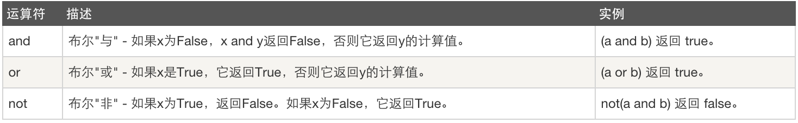

# 运算符

## 算数运算


## 比较运算


## 赋值运算


## 逻辑运算



```python
if 1 == 1 or 1 > 2 and 1 == 4:
    print("正确")
else:
    print("错误")
# 正确。没有优先级，从前往后看，按顺序执行。
# 加上括号()，就先执行括号里的
```
## 成员变量


```python
content = "成员变量"
if "成员" in content:
    print("包含")
else:
    print("不包含")
```


# 一、进制

 0   1010010100101001
1位
01010010 100101001
1字节（8位）

01010010 01010010 +
unicode（至少2个字节）

李      01010010 01010010 01010010
UTF-8: 自己对应关系

李      11010010 01110011
GBK: 自己对应关系

====》
二进制：    0  1   10   11   100    101
八进制：    0  1    2     3       4        5   6   7    10
十进制：    0  1    2     3       4        5   6   7    8   9   10    ...     15
十六进制：0  1     2    3       4        5   6   7    8   9   A  B  C  D  E  F   10


1. 数据存储到硬盘：以二进制方式存储 01010101010101010101
2. 读取：由二进制 -> 对应编码的汉字（字符）
3. 用户看到的
   - 转换完成的字符串（r方式读取，并且指定编码）
   - 以十六进制展示的01010101（rb方式读取文件时）

# 二、基本数据类型

1. 字符串
2. 整数
3. 布尔值
4. 列表
5. 元组
6. 字典
7. 集合
8. range
9. enumerate

## 1.字符串

```python
# 自动找到name1关联的str类，执行其中的capitalize方法
#1.capitalize 首字母大写，自身不变，会生成一个新的值
name1 = 'alex'
s1 = name1.capitalize()
print(s1)

#2.casefold 将所有大写变小写，casefold比lower功能更牛。casefold支持英语、德语等多种语言。lower只支持英文。
name2 = 'AleX'
s2 = name2.lower()
s22 = name2.casefold()
print(s2,s22)

#3.center 文本居中center(总长度,空白处填充的字符且长度为1)
# def center(self, width, fillchar=None): 如果参数有“=”，说明这个参数有默认值，可填可不填
n3 = ' -Alex- '
s3 = n3.center(20,'字') # 第二个参数只能传一个字符
print(s3)

#4.count 子序列在指定字符串中出现的次数 count(子序列，起始，结束)
n4 = 'alekjdokjeskedfax'
s4 = n4.count('e',3,10)
print(s4)

#5.endswith 指定字符串是否以子序列结尾
n5 = 'aleeeeeeeeeeeeeeabcx'
s5 = n5.endswith('cx',10)
print(s5)

#6.startwith 开头
s6 = n5.startswith('al',0,10)
print(s6)

#7. 只找制表符\t并进行操作。用n个空格代替\t（包含前面的值,整体占n个） -->可以用来伪造表格
n7 = 'al\ne\tx\ner\ti\tc'
s7 = n7.expandtabs(10)
print(s7)

#8. 找到指定子序列的索引位置。不存在时find返回-1，index报错
n8 = 'alex and eric'
s8 = n8.find('eax',0,5)
print(s8)
v88 = n8.index('ex')
print(v88) #没有时，报错ValueError: substring not found

#9-1.字符串格式化：format，可以是index，也可以直接赋值给变量名
n9 = 'my name is:{0}, age is:{1},gender is:{2}'
s9 = n9.format('alex',10,"male")
print(s9)
n91 = 'my name is:{name}, age is:{age},gender is:{gender}'
s91 = n91.format(name = 'alex', age = 19, gender = 'male')
print(s91)
#9-2.format_map
n92 = 'my name is:{name}, age is:{age},gender is:{gender}'
s92 = n92.format_map({'name':'bill',"age":20,'gender':'unkown'})
print(s92)

#10.判断一个字符串是否全是数字、汉字--不能含有空格
n10 = 'alexis李杰123'#汉字、字母、数字
s10 = n10.isalnum()
print(s10)

s101 = n10.isalpha() #不能包含数字
print(s101)

#11.是否为数字
n11 = '②'
s111= n11.isdigit() #阿拉伯数字，和带圈字符
s112 = n11.isdecimal() #最常用，只能阿拉伯数字，可用int类型转换过来
print(s111,s112)
n112 = '2②二'
s1121 = n112.isdigit()
s1122 = n112.isdecimal()
s1123 = n112.isnumeric() #数字：可为：阿拉伯、带圈数字、汉字
print(s1121,s1122,s1123)

#12.是否为标识符 ??这是啥意思--判断是否可以做变量名
n12 = '9alex'
s12 = n12.isidentifier()
print(s12) #True

#13.是都全部大/小写
n13 = 'ALEX'
s131 = n13.islower()
s132 = n13.isupper()
print(s131,s132)

#14.是否包含隐含字符
n14 = 'life is short \t learn\nPython'
n141 = 'hello world!'
s14 = n14.isprintable()
s141 = n141.isprintable()
print(s14,s141)

#15.是否全部为空格
n15 = '     '
s15 = n15.isspace()
print(s15)

#16.是否每个单词首字母大写
n16 = 'Congratulation' #根据空格判断单词，没有空格时会判断是否是一个单词
s16 = n16.istitle()
print(s16)

#17.元素拼接
# join()中可以传字符串或列表。只要传递可以进行for循环的元素，并且for循环拿到的都是字符串
# 原理：内部for循环字符串中的每个元素，如果后面还有元素，就加拼接符 
n171 = 'hello world!'
v171 = '+'.join(n171)
print(v171)

n172 = ['alex','bill','chris'] # 如果包含int类型，就会报错
v172 = '是'.join(n172)
print(v172)

#18.左中右填充
# 参数1：填充后的总个数
# 参数2：填充字符，只能为1个
n18 = 'Pyhon'
s181 = n18.center(20,'中') 
s182 = n18.ljust(20,'左')
s183 = n18.rjust(20,'右')
print(s181,s182,s183)

#19.对应关系+翻译
x = str.maketrans('hijkl','举头望明月')
print(x)
n19 = 'life is short, use python!'
s19 = n19.translate(x)
print(s19)

#20.分割，并且保留分割依据的元素。cf：split不保留分隔元素--都以第一个遇到的分割元素进行分割
n19 = 'life*is*short*use*python!'
s191 = n19.split('*') #返回值为列表
s192 = n19.partition('*') #返回值为元组 --用法：计算器中保留运算符号
print(s191)
print(s192)
'''
['life', 'is', 'short', 'use', 'python!']
('life', '*', 'is*short*use*python!')
'''

#21.替换
# 参数3：从前到后总共替换几个
n21 = 'alexAAbillAAchrisAAdavid'
s21 = n21.replace('AA','Like',2)
print(s21)

#22.移除空白，包括：空格 \n \t 自定义
n22 = 'al\ne\tx  '
s22 = n22.strip() #只移除了结尾的空白，存疑！！
s221 = n22.strip('a')
print(s22)
print(s221)

#23.大小写转换
n23 = 'AlEx'
s23 = n23.swapcase()
print(s23)

#24.整个字符串长度为n，在前面填充0
n24 = 'alex'  
s24 = n24.zfill(10) #填充到前面
print(s24)
```

### 1.字符串

```python
#作用：名字，性别，国籍，地址等描述信息

#定义：在单引号\双引号\三引号内，由一串字符组成
name='egon'

#优先掌握的操作：
#1、按索引取值(正向取+反向取) ：只能取
#2、切片(顾头不顾尾，步长)
#3、长度len
#4、成员运算in和not in

#5、移除空白strip
#6、切分split
#7、循环
```

需要掌握的操作

```python
#1、strip,lstrip,rstrip
#2、lower,upper
#3、startswith,endswith
#4、format的三种玩法
#5、split,rsplit
#6、join
#7、replace
#8、isdigit
```


```python
#strip
name='*egon**'
print(name.strip('*'))
print(name.lstrip('*'))
print(name.rstrip('*'))

#lower,upper
name='egon'
print(name.lower())
print(name.upper())

#startswith,endswith
name='alex_SB'
print(name.endswith('SB'))
print(name.startswith('alex'))

#format的三种玩法
res='{} {} {}'.format('egon',18,'male')
res='{1} {0} {1}'.format('egon',18,'male')
res='{name} {age} {sex}'.format(sex='male',name='egon',age=18)

#split
name='root:x:0:0::/root:/bin/bash'
print(name.split(':')) #默认分隔符为空格
name='C:/a/b/c/d.txt' #只想拿到顶级目录
print(name.split('/',1))

name='a|b|c'
print(name.rsplit('|',1)) #从右开始切分

#join
tag=' '
print(tag.join(['egon','say','hello','world'])) #可迭代对象必须都是字符串

#replace
name='alex say :i have one tesla,my name is alex'
print(name.replace('alex','SB',1))

#isdigit：可以判断bytes和unicode类型,是最常用的用于于判断字符是否为"数字"的方法
age=input('>>: ')
print(age.isdigit())
```


其他操作（了解即可）

```python
#1、find,rfind,index,rindex,count
#2、center,ljust,rjust,zfill
#3、expandtabs
#4、captalize,swapcase,title
#5、is数字系列
#6、is其他
```


```python
#find,rfind,index,rindex,count
name='egon say hello'
print(name.find('o',1,3)) #顾头不顾尾,找不到则返回-1不会报错,找到了则显示索引
# print(name.index('e',2,4)) #同上,但是找不到会报错
print(name.count('e',1,3)) #顾头不顾尾,如果不指定范围则查找所有

#center,ljust,rjust,zfill
name='egon'
print(name.center(30,'-'))
print(name.ljust(30,'*'))
print(name.rjust(30,'*'))
print(name.zfill(50)) #用0填充

#expandtabs
name='egon\thello'
print(name)
print(name.expandtabs(1))

#captalize,swapcase,title
print(name.capitalize()) #首字母大写
print(name.swapcase()) #大小写翻转
msg='egon say hi'
print(msg.title()) #每个单词的首字母大写

#is数字系列
#在python3中
num1=b'4' #bytes
num2=u'4' #unicode,python3中无需加u就是unicode
num3='四' #中文数字
num4='Ⅳ' #罗马数字

#isdigt:bytes,unicode
print(num1.isdigit()) #True
print(num2.isdigit()) #True
print(num3.isdigit()) #False
print(num4.isdigit()) #False

#isdecimal:uncicode
#bytes类型无isdecimal方法
print(num2.isdecimal()) #True
print(num3.isdecimal()) #False
print(num4.isdecimal()) #False

#isnumberic:unicode,中文数字,罗马数字
#bytes类型无isnumberic方法
print(num2.isnumeric()) #True
print(num3.isnumeric()) #True
print(num4.isnumeric()) #True

#三者不能判断浮点数
num5='4.3'
print(num5.isdigit())
print(num5.isdecimal())
print(num5.isnumeric())
'''
总结:
    最常用的是isdigit,可以判断bytes和unicode类型,这也是最常见的数字应用场景
    如果要判断中文数字或罗马数字,则需要用到isnumeric
'''

#is其他
print('===>')
name='egon123'
print(name.isalnum()) #字符串由字母或数字组成
print(name.isalpha()) #字符串只由字母组成

print(name.isidentifier())
print(name.islower())
print(name.isupper())
print(name.isspace())
print(name.istitle())
```


​    练习　　　

```python
# 写代码,有如下变量,请按照要求实现每个功能 （共6分，每小题各0.5分）
name = " aleX"
# 1)    移除 name 变量对应的值两边的空格,并输出处理结果
# 2)    判断 name 变量对应的值是否以 "al" 开头,并输出结果

# 3)    判断 name 变量对应的值是否以 "X" 结尾,并输出结果

# 4)    将 name 变量对应的值中的 “l” 替换为 “p”,并输出结果
# 5)    将 name 变量对应的值根据 “l” 分割,并输出结果。
# 6)    将 name 变量对应的值变大写,并输出结果

# 7)    将 name 变量对应的值变小写,并输出结果

# 8)    请输出 name 变量对应的值的第 2 个字符?
# 9)    请输出 name 变量对应的值的前 3 个字符?
# 10)    请输出 name 变量对应的值的后 2 个字符?

# 11)    请输出 name 变量对应的值中 “e” 所在索引位置?

# 12)    获取子序列,去掉最后一个字符。如: oldboy 则获取 oldbo。
```


```python
# 写代码,有如下变量,请按照要求实现每个功能 （共6分，每小题各0.5分）
name = " aleX"
# 1)    移除 name 变量对应的值两边的空格,并输出处理结果
name = ' aleX'
a=name.strip()
print(a)

# 2)    判断 name 变量对应的值是否以 "al" 开头,并输出结果

name=' aleX'
if name.startswith(name):
    print(name)
else:
    print('no')

# 3)    判断 name 变量对应的值是否以 "X" 结尾,并输出结果

name=' aleX'
if name.endswith(name):
    print(name)
else:
    print('no')

# 4)    将 name 变量对应的值中的 “l” 替换为 “p”,并输出结果
name=' aleX'
print(name.replace('l','p'))

# 5)    将 name 变量对应的值根据 “l” 分割,并输出结果。
name=' aleX'
print(name.split('l'))

# 6)    将 name 变量对应的值变大写,并输出结果

name=' aleX'
print(name.upper())

# 7)    将 name 变量对应的值变小写,并输出结果

name=' aleX'
print(name.lower())

# 8)    请输出 name 变量对应的值的第 2 个字符?
name=' aleX'
print(name[1])

# 9)    请输出 name 变量对应的值的前 3 个字符?
name=' aleX'
print(name[:3])

# 10)    请输出 name 变量对应的值的后 2 个字符?

name=' aleX'
print(name[-2:])

# 11)    请输出 name 变量对应的值中 “e” 所在索引位置?

name=' aleX'
print(name.index('e'))

# 12)    获取子序列,去掉最后一个字符。如: oldboy 则获取 oldbo。
name=' aleX'
a=name[:-1]
print(a)
```


### 字符串格式化

Python的字符串格式化有两种方式: 百分号方式、format方式

百分号的方式相对来说比较老，而format方式则是比较先进的方式，企图替换古老的方式，目前两者并存。[[PEP-3101](http://www.python.org/dev/peps/pep-3101/)]

*This PEP proposes a new system for built-in string formatting operations, intended as a replacement for the existing '%' string formatting operator.*

**1、百分号方式**

> %[(name)][flags][width].[precision]typecode

- (name)      可选，用于选择指定的key
- flags          可选，可供选择的值有:
  - *+       右对齐；正数前加正好，负数前加负号；*
  - *-        左对齐；正数前无符号，负数前加负号；*
  - *空格    右对齐；正数前加空格，负数前加负号；*
  - *0        右对齐；正数前无符号，负数前加负号；用0填充空白处*
- width         可选，占有宽度
- .precision   可选，小数点后保留的位数
- typecode    必选
  - *s，获取传入对象的__str__方法的返回值，并将其格式化到指定位置*
  - *r，获取传入对象的__repr__方法的返回值，并将其格式化到指定位置*
  - *c，整数：将数字转换成其unicode对应的值，10进制范围为 0 <= i <= 1114111（py27则只支持0-255）；字符：将字符添加到指定位置*
  - *o，将整数转换成 八  进制表示，并将其格式化到指定位置*
  - *x，将整数转换成十六进制表示，并将其格式化到指定位置*
  - *d，将整数、浮点数转换成 十 进制表示，并将其格式化到指定位置*
  - *e，将整数、浮点数转换成科学计数法，并将其格式化到指定位置（小写e）*
  - *E，将整数、浮点数转换成科学计数法，并将其格式化到指定位置（大写E）*
  - *f， 将整数、浮点数转换成浮点数表示，并将其格式化到指定位置（默认保留小数点后6位）*
  - *F，同上*
  - *g，自动调整将整数、浮点数转换成 浮点型或科学计数法表示（超过6位数用科学计数法），并将其格式化到指定位置（如果是科学计数则是e；）*
  - *G，自动调整将整数、浮点数转换成 浮点型或科学计数法表示（超过6位数用科学计数法），并将其格式化到指定位置（如果是科学计数则是E；）*
  - *%，当字符串中存在格式化标志时，需要用 %%表示一个百分号*

*注：Python中百分号格式化是不存在自动将整数转换成二进制表示的方式*

常用格式化：

```python
`tpl ``=` `"i am %s"` `%` `"alex"` `tpl ``=` `"i am %s age %d"` `%` `(``"alex"``, ``18``)` `tpl ``=` `"i am %(name)s age %(age)d"` `%` `{``"name"``: ``"alex"``, ``"age"``: ``18``}` `tpl ``=` `"percent %.2f"` `%` `99.97623` `tpl ``=` `"i am %(pp).2f"` `%` `{``"pp"``: ``123.425556``, }` `tpl ``=` `"i am %.2f %%"` `%` `{``"pp"``: ``123.425556``, }`
```

**2、Format方式**

> [[fill]align][sign][#][0][width][,][.precision][type]

- fill           【可选】空白处填充的字符

- align        【可选】对齐方式（需配合width使用）

- - *<，内容左对齐*
  - *>，内容右对齐(默认)*
  - *＝，内容右对齐，将符号放置在填充字符的左侧，且只对数字类型有效。 即使：符号+填充物+数字*
  - *^，内容居中*

- sign         【可选】有无符号数字

  - **+，正号加正，负号加负；**
  -  **-，正号不变，负号加负；**
  - **空格 ，正号空格，负号加负；**

- \#            【可选】对于二进制、八进制、十六进制，如果加上#，会显示 0b/0o/0x，否则不显示

- ，            【可选】为数字添加分隔符，如：1,000,000

- width       【可选】格式化位所占宽度

- .precision 【可选】小数位保留精度

- type         【可选】格式化类型

  - *传入” 字符串类型 “的参数*
    - *s，格式化字符串类型数据*
    - *空白，未指定类型，则默认是None，同s*
  - *传入“ 整数类型 ”的参数*
    - *b，将10进制整数自动转换成2进制表示然后格式化*
    - *c，将10进制整数自动转换为其对应的unicode字符*
    - *d，十进制整数*
    - *o，将10进制整数自动转换成8进制表示然后格式化；*
    - *x，将10进制整数自动转换成16进制表示然后格式化（小写x）*
    - *X，将10进制整数自动转换成16进制表示然后格式化（大写X）*
  - *传入“ 浮点型或小数类型 ”的参数*
    - *e， 转换为科学计数法（小写e）表示，然后格式化；*
    - *E， 转换为科学计数法（大写E）表示，然后格式化;*
    - *f ， 转换为浮点型（默认小数点后保留6位）表示，然后格式化；*
    - *F， 转换为浮点型（默认小数点后保留6位）表示，然后格式化；*
    - *g， 自动在e和f中切换*
    - *G， 自动在E和F中切换*
    - *%，显示百分比（默认显示小数点后6位）*

 常用格式化：

```python
`tpl ``=` `"i am {}, age {}, {}"``.``format``(``"seven"``, ``18``, ``'alex'``)`` ` `tpl ``=` `"i am {}, age {}, {}"``.``format``(``*``[``"seven"``, ``18``, ``'alex'``])`` ` `tpl ``=` `"i am {0}, age {1}, really {0}"``.``format``(``"seven"``, ``18``)`` ` `tpl ``=` `"i am {0}, age {1}, really {0}"``.``format``(``*``[``"seven"``, ``18``])`` ` `tpl ``=` `"i am {name}, age {age}, really {name}"``.``format``(name``=``"seven"``, age``=``18``)`` ` `tpl ``=` `"i am {name}, age {age}, really {name}"``.``format``(``*``*``{``"name"``: ``"seven"``, ``"age"``: ``18``})`` ` `tpl ``=` `"i am {0[0]}, age {0[1]}, really {0[2]}"``.``format``([``1``, ``2``, ``3``], [``11``, ``22``, ``33``])`` ` `tpl ``=` `"i am {:s}, age {:d}, money {:f}"``.``format``(``"seven"``, ``18``, ``88888.1``)`` ` `tpl ``=` `"i am {:s}, age {:d}"``.``format``(``*``[``"seven"``, ``18``])`` ` `tpl ``=` `"i am {name:s}, age {age:d}"``.``format``(name``=``"seven"``, age``=``18``)`` ` `tpl ``=` `"i am {name:s}, age {age:d}"``.``format``(``*``*``{``"name"``: ``"seven"``, ``"age"``: ``18``})` `tpl ``=` `"numbers: {:b},{:o},{:d},{:x},{:X}, {:%}"``.``format``(``15``, ``15``, ``15``, ``15``, ``15``, ``15.87623``, ``2``)` `tpl ``=` `"numbers: {:b},{:o},{:d},{:x},{:X}, {:%}"``.``format``(``15``, ``15``, ``15``, ``15``, ``15``, ``15.87623``, ``2``)` `tpl ``=` `"numbers: {0:b},{0:o},{0:d},{0:x},{0:X}, {0:%}"``.``format``(``15``)` `tpl ``=` `"numbers: {num:b},{num:o},{num:d},{num:x},{num:X}, {num:%}"``.``format``(num``=``15``)`
```

更多格式化操作：https://docs.python.org/3/library/string.html


## 2.整型

```python
#1.当前int的二进制，以最少位数表示时，总共有几位
num1 = 255
print(num1.bit_length())

#2.获取当前整数的字节表示--以多少位的16进制进行表示。其中，\xff为一个16进制
num2 = 255
i21 = num2.to_bytes(20,byteorder='big') #整数值在后面，其余补零
i22 = num2.to_bytes(20,byteorder='little') #整数值在前面，其余补零
print(i21)
print(i22)
```

## 3.布尔值

```python
b0 = -2 # True
#1.False类型，空内容一般都为false
b1 = ''
b2 = 0
b3 = []
```

## 4.列表

```python
# list可变类型，意味着列表中的内容可以进行增、删、改。
# 字符串、整型、布尔值为不可变类型。想要修改只能创建一个新的值。
# 注意：一般情况下是对源列表进行修改，但也不完全是。可以在对列表进行操作后，先用一个值接收。如果接收不到，说明就是修改的源列表。
#1.追加，追加到源列表。不同于字符串追加后生成新的字符串。  
u_list = ['alex','bill','chris','dick'] 
u_list.append('eric')
print(u_list)

#2.清空
u_list.clear()
print(u_list)

#3.浅拷贝。
u_list = ['alex','alex','bill','chris','dick']
v = u_list.copy()
print(u_list)
print(v)

#4.计数
v2 = u_list.count('alex')
print(v2)s

# 5.扩展源列表，多个元素
# 自动循环出列表里的元素，逐个追加到源列表中
v3 = u_list.extend(['eric','frank'])
print(u_list)
print(v3) #空，应该直接u_list.extend(['eric','frank'])

#6.查找元素的索引（拿到第一个出现的元素的索引），没有时报错
v4 = u_list.index('alex')
print(v4)

#7.插入值
# 参数1：插入的索引位置； 参数2：插入值
v51 = u_list.insert(2,'Amy')
print(v51)
print(u_list)

#7.删除并获取被删除的元素--根据索引删除。可以用变量接收被删除的值。
v52 = u_list.pop(2)
print(v52)
print(u_list)

#8.删除但获取不到元素--根据值删除,删除查找到的第一个元素
v6 = u_list.remove('alex')
print(v6)
print(u_list)

#9.翻转源列表
u_list.reverse()
print(u_list)

#10.排序
nums = [11,22,55,6,77,3]
print(nums)
#从小到大，默认
nums.sort(reverse=False)
print(nums)
#从大到小
nums.sort(reverse=True)
print(nums)
```

## 5.元组

```python
usr_tuple = ('alex','bill','bill','chris','dick')
#1.获取指定元素的个数
v = usr_tuple.count('bill')
print(v)

#2.获取值的索引，显示查到的第一个
v2 = usr_tuple.index('bill')
print(v2)
```

## 6.字典

	1.  字典可以嵌套
	2.  字典的key必须为不可变类型。比如元组
	3.  可以索引取值
	4.  可根据key删除键值对 del dic['k1']  


```python
#1.clear 清空
dic1 = {'k1':'v1','k2':'v2'}
dic1.clear()
print(dic1)

#2.copy 浅拷贝
dic = {'k1':'v1','k2':'v2'}
d2 = dic.copy()
print(d2)

#3.get 根据key获取指定的value
d3 = dic.get('k1')
d31 = dic.get('k3')
print(d3)
print(d31)

# d32 = dic['k3']
# print(d32)

#4.pop 删除并获取对应value值,并获取到该value值
dic4 = {'k1':'v1','k2':'v2','k3':'v3'}
d4 = dic4.pop('k2')
print(d4)
print(dic4)

#5.popitem 随机删除键值对，并获取到该键值
dic5 = {'k1':'v1','k2':'v2','k3':'v3'}
d5 = dic5.popitem() #dict无序，所以随机删除
print(d5)
print(dic5)

#6.setdefault 增加，只能增加一个(逗号分隔 键值)，已存在时不做操作
dic6 = {'k1':'v1','k2':'v2','k3':'v3'}
dic6.setdefault('k4','v4')
print(dic6)

dic6.setdefault('k1',123)
print(dic6)

#7.update 更新，批量增加/修改。存在时跟新，不存在时增加（括号内为字典）
dic6 = {'k1':'v1','k2':'v2','k3':'v3'}
dic6.update({'k1':999,'k5':'v5'})
print(dic6)

#8.fromkeys 循环创建字典
dic8 = dict.fromkeys(['k1','k2','k3'],123)
print(dic8)
dic8['k1'] = 'hello world' #替换。123为整型，不可变，不能追加
print(dic8)

dic81 = dict.fromkeys(['k1','k2','k3'],[1,])
print(dic81)
dic81['k1'].append(234) #值是列表时追加到所有值的列表中
print(dic81)
```

​	


##7.集合

```python
# 1. 可变类型
# 2. 不可重复的列表

s1 = {'alex','bill','chris','david'}
s2 = {'alex','bill','eric','frank'}
#1. s1中存在，s2中不存在
a1 = s1.difference(s2)
print(a1)

#1-1.将difference的值赋值给s1
# s1.difference_update(s2)
# print(s1)

#2.连个集合的所有不同元素组成一个新的集合
a2 = s1.symmetric_difference(s2)
print(a2)

#3.交集
a3 = s1.intersection(s2)
print(a3)

#4.并集
a4 = s1.union(s2)
print(a4)

#5.移除
s1.discard('alex')
print(s1)

#6.更新，已经有的不变，没有的更新
s6 = {'alex','bill','chris','david'}
s6.update({'alex','bill','rose','lily'})
print(s6)

#7.for-loop
s7 = {'alex','bill','rose','lily'}
for item in s7:
    print(item)

s8 = {'alex','bill',(1,2,3)}
for i in s8:
    print(i)
```

##8.range范围取值

```python
# 2.7中：range立即生成范围内的所有值，xrange迭代后逐个生成
# 3.x中：range等同有2.7中的xrange，不立即生成所有数值，迭代后才逐个生成

li = ['alex','bill','chris']
for i in li:
    print(i)
for i in range(0,len(li)):
    ele = li[i]
    print(i+1,ele)
```

##9.enumerate，比range额外生成一列有序数字

```python
li9 = ['alex','bill','chris']
for i,ele in enumerate(li9,10): 
    print(i,ele)
#范例：商品列表取值
# v = int(input('请输入商品序号：'))
# item = li[v-1]
# print(item)
```