Chapter03-Python字符编码

### 一 了解字符编码的知识储备

**一 计算机基础知识**

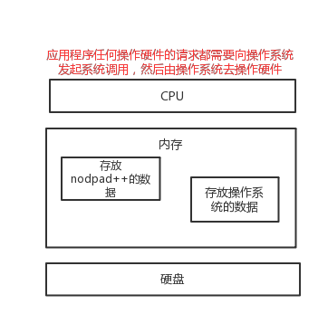 

**二、文本编辑器存取文件的原理（nodepad++，pycharm，word）**

```python
#1、打开编辑器就打开了启动了一个进程，是在内存中的，所以，用编辑器编写的内容也都是存放与内存中的，断电后数据丢失

#2、要想永久保存，需要点击保存按钮：编辑器把内存的数据刷到了硬盘上。

#3、在我们编写一个py文件（没有执行），跟编写其他文件没有任何区别，都只是在编写一堆字符而已。
```

**三、python解释器执行py文件的原理 ，例如python test.py**

```python
#第一阶段：python解释器启动，此时就相当于启动了一个文本编辑器

#第二阶段：python解释器相当于文本编辑器，去打开test.py文件，从硬盘上将test.py的文件内容读入到内存中(小复习：pyhon的解释性，决定了解释器只关心文件内容，不关心文件后缀名)

#第三阶段：python解释器解释执行刚刚加载到内存中test.py的代码( ps：在该阶段，即真正执行代码时，才会识别python的语法，执行文件内代码，当执行到name="egon"时,会开辟内存空间存放字符串"egon")
```

**四、总结python解释器与文件本编辑的异同**

```python
#1、相同点：python解释器是解释执行文件内容的，因而python解释器具备读py文件的功能，这一点与文本编辑器一样

#2、不同点：文本编辑器将文件内容读入内存后，是为了显示或者编辑，根本不去理会python的语法，而python解释器将文件内容读入内存后，可不是为了给你瞅一眼python代码写的啥，而是为了执行python代码、会识别python语法。
```

**五、语言类型：解释型、编译型、混合型**

- 解释型

Python解释器执行文件：读取文件->编译成字节码->Python解释器解释字节码后执行

优点：方便调试，代码修改后直接运行就可以。

缺点：运行速度慢，每次执行都要先编译成字节码，再解释整个字节码。

- 编译型

代码->编译成二进制->运行二进制文件	

优点：快，每次执行都是直接执行编译后的结果

缺点：编译时间长，每次执行都要重新编译

- 混合型

Java：编译成java字节码->交给JVM运行

java字节码可以重复运行

Python每次运行前都要重新编译


### 二 字符编码介绍

**一、什么是字符编码**

```python
　　计算机要想工作必须通电,即用‘电’驱使计算机干活,也就是说‘电’的特性决定了计算机的特性。电的特性即高低电平(人类从逻辑上将二进制数1对应高电平,二进制数0对应低电平)，关于磁盘的磁特性也是同样的道理。结论：计算机只认识数字

　　很明显，我们平时在使用计算机时，用的都是人类能读懂的字符（用高级语言编程的结果也无非是在文件内写了一堆字符），如何能让计算机读懂人类的字符？

　　必须经过一个过程：
　　#字符--------（翻译过程）------->数字 

　　#这个过程实际就是一个字符如何对应一个特定数字的标准，这个标准称之为字符编码
```

**二、以下两个场景下涉及到字符编码的问题：**

```python
#1、一个python文件中的内容是由一堆字符组成的，存取均涉及到字符编码问题（python文件并未执行，前两个阶段均属于该范畴）

#2、python中的数据类型字符串是由一串字符组成的（python文件执行时，即第三个阶段）
```

**三、字符编码的发展史与分类(简单了解)**

计算机由美国人发明，最早的字符编码为ASCII，只规定了英文字母数字和一些特殊字符与数字的对应关系。最多只能用 8 位来表示（一个字节），即：2**8 = 256，所以，ASCII码最多只能表示 256 个符号

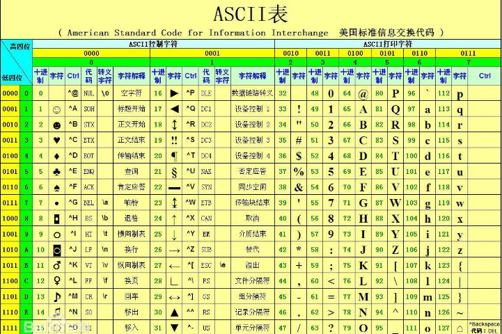

当然我们编程语言都用英文没问题，ASCII够用，但是在处理数据时，不同的国家有不同的语言，日本人会在自己的程序中加入日文，中国人会加入中文。

而要表示中文，单拿一个字节表表示一个汉子，是不可能表达完的(连小学生都认识两千多个汉字)，解决方法只有一个，就是一个字节用>8位2进制代表，位数越多，代表的变化就多，这样，就可以尽可能多的表达出不通的汉字

所以中国人规定了自己的标准gb2312编码，规定了包含中文在内的字符－>数字的对应关系。

日本人规定了自己的Shift_JIS编码

韩国人规定了自己的Euc-kr编码（另外，韩国人说，计算机是他们发明的，要求世界统一用韩国编码，但世界人民没有搭理他们）

 

这时候问题出现了，精通18国语言的小周同学谦虚的用8国语言写了一篇文档，那么这篇文档，按照哪国的标准，都会出现乱码（因为此刻的各种标准都只是规定了自己国家的文字在内的字符跟数字的对应关系，如果单纯采用一种国家的编码格式，那么其余国家语言的文字在解析时就会出现乱码）

所以迫切需要一个世界的标准（能包含全世界的语言）于是unicode应运而生（韩国人表示不服，然后没有什么卵用）

ascii用1个字节（8位二进制）代表一个字符

unicode常用2个字节（16位二进制）代表一个字符，生僻字需要用4个字节

例：

字母x，用ascii表示是十进制的120，二进制0111 1000

汉字`中`已经超出了ASCII编码的范围，用Unicode编码是十进制的`20013`，二进制的`01001110 00101101`。

字母x，用unicode表示二进制0000 0000 0111 1000，所以unicode兼容ascii，也兼容万国，是世界的标准

 

这时候乱码问题消失了，所有的文档我们都使用但是新问题出现了，如果我们的文档通篇都是英文，你用unicode会比ascii耗费多一倍的空间，在存储和传输上十分的低效

本着节约的精神，又出现了把Unicode编码转化为“可变长编码”的`UTF-8`编码。UTF-8编码把一个Unicode字符根据不同的数字大小编码成1-6个字节，常用的英文字母被编码成1个字节，汉字通常是3个字节，只有很生僻的字符才会被编码成4-6个字节。如果你要传输的文本包含大量英文字符，用UTF-8编码就能节省空间：

| 字符 | ASCII    | Unicode           | UTF-8                      |
| ---- | -------- | ----------------- | -------------------------- |
| A    | 01000001 | 00000000 01000001 | 01000001                   |
| 中   | x        | 01001110 00101101 | 11100100 10111000 10101101 |

从上面的表格还可以发现，UTF-8编码有一个额外的好处，就是ASCII编码实际上可以被看成是UTF-8编码的一部分，所以，大量只支持ASCII编码的历史遗留软件可以在UTF-8编码下继续工作。

**四、总结字符编码的发展可分为三个阶段(重要)**

！！！重点！！！

```python
#阶段一：现代计算机起源于美国，最早诞生也是基于英文考虑的ASCII
ASCII:一个Bytes代表一个字符（英文字符/键盘上的所有其他字符），1Bytes=8bit，8bit可以表示0-2**8-1种变化，即可以表示256个字符

ASCII最初只用了后七位，127个数字，已经完全能够代表键盘上所有的字符了（英文字符/键盘的所有其他字符），后来为了将拉丁文也编码进了ASCII表，将最高位也占用了

#阶段二:为了满足中文和英文，中国人定制了GBK
GBK:2Bytes代表一个中文字符，1Bytes表示一个英文字符
为了满足其他国家，各个国家纷纷定制了自己的编码
日本把日文编到Shift_JIS里，韩国把韩文编到Euc-kr里

#阶段三：各国有各国的标准，就会不可避免地出现冲突，结果就是，在多语言混合的文本中，显示出来会有乱码。如何解决这个问题呢？？？

#！！！！！！！！！！！！非常重要！！！！！！！！！！！！
说白了乱码问题的本质就是不统一，如果我们能统一全世界，规定全世界只能使用一种文字符号，然后统一使用一种编码，那么乱码问题将不复存在，
ps：就像当年秦始皇统一中国一样，书同文车同轨，所有的麻烦事全部解决
很明显，上述的假设是不可能成立的。很多地方或老的系统、应用软件仍会采用各种各样的编码，这是历史遗留问题。于是我们必须找出一种解决方案或者说编码方案，需要同时满足：
#1、能够兼容万国字符
#2、与全世界所有的字符编码都有映射关系，这样就可以转换成任意国家的字符编码

这就是unicode（定长），　统一用2Bytes代表一个字符，　虽然2**16-1=65535，但unicode却可以存放100w+个字符，因为unicode存放了与其他编码的映射关系，准确地说unicode并不是一种严格意义上的字符编码表，下载pdf来查看unicode的详情：
链接：https://pan.baidu.com/s/1dEV3RYp

很明显对于通篇都是英文的文本来说，unicode的式无疑是多了一倍的存储空间（二进制最终都是以电或者磁的方式存储到存储介质中的）

于是产生了UTF-8（可变长，全称Unicode Transformation Format），对英文字符只用1Bytes表示，对中文字符用3Bytes，对其他生僻字用更多的Bytes去存


#总结：内存中统一采用unicode，浪费空间来换取可以转换成任意编码（不乱码），硬盘可以采用各种编码，如utf-8，保证存放于硬盘或者基于网络传输的数据量很小，提高传输效率与稳定性。

！！！重点！！！
```


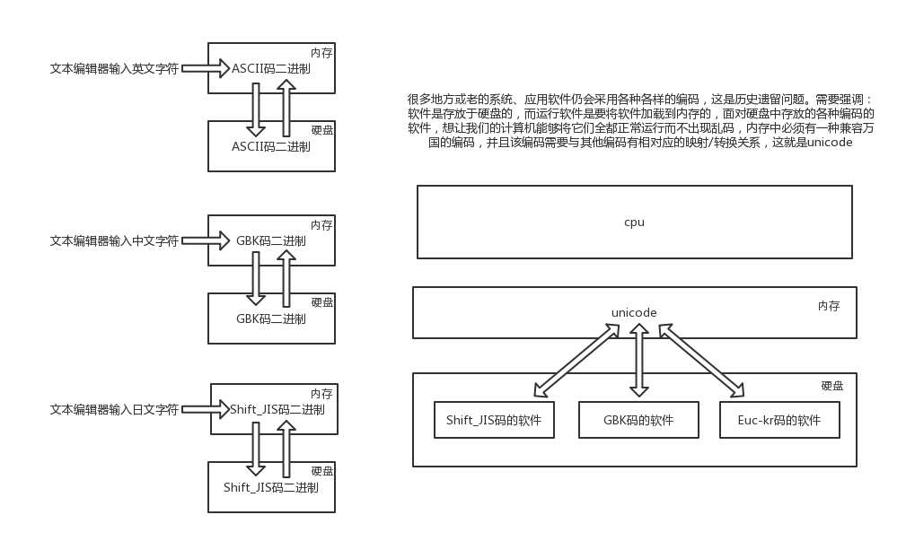

基于目前的现状，内存中的编码固定就是unicode，我们唯一可变的就是硬盘的上对应的字符编码。
此时你可能会觉得，那如果我们以后开发软时统一都用unicode编码，那么不就都统一了吗，关于统一这一点你的思路是没错的，但我们不可会使用unicode编码来编写程序的文件，因为在通篇都是英文的情况下，耗费的空间几乎会多出一倍，这样在软件读入内存或写入磁盘时，都会徒增IO次数，从而降低程序的执行效率。因而我们以后在编写程序的文件时应该统一使用一个更为精准的字符编码utf-8（用1Bytes存英文，3Bytes存中文），再次强调，内存中的编码固定使用unicode。
1、在存入磁盘时，需要将unicode转成一种更为精准的格式，utf-8:全称Unicode Transformation Format，将数据量控制到最精简

2、在读入内存时，需要将utf-8转成unicode
所以我们需要明确：内存中用unicode是为了兼容万国软件，即便是硬盘中有各国编码编写的软件，unicode也有相对应的映射关系，但在现在的开发中，程序员普遍使用utf-8编码了，估计在将来的某一天等所有老的软件都淘汰掉了情况下，就可以变成：内存utf-8<->硬盘utf-8的形式了。


### 三、字符编码应用之文件编辑器

#### 3.1 文本编辑器之nodpad++

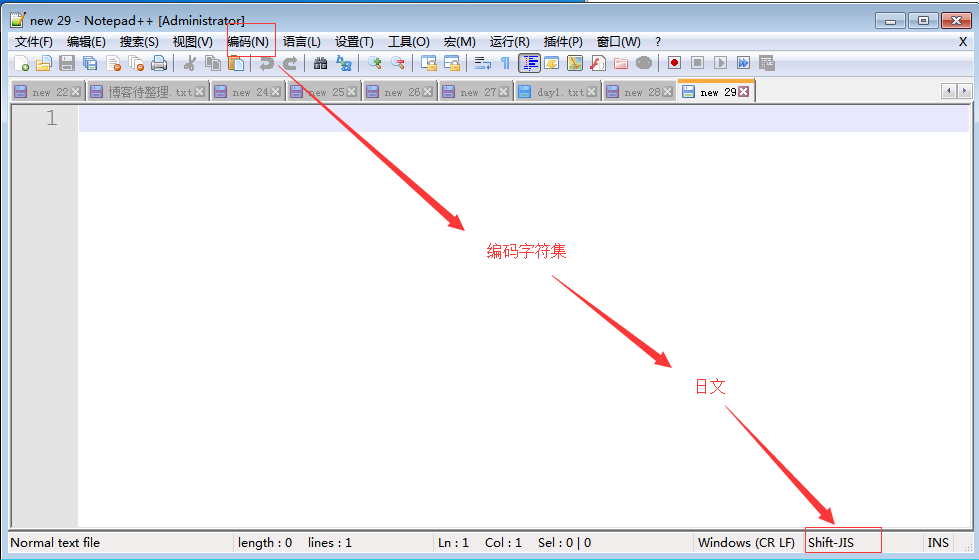

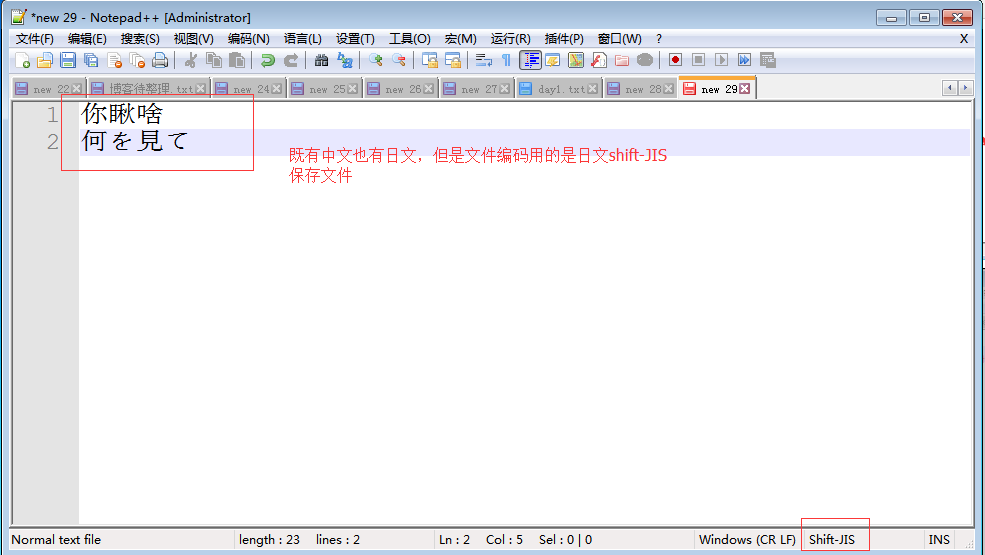

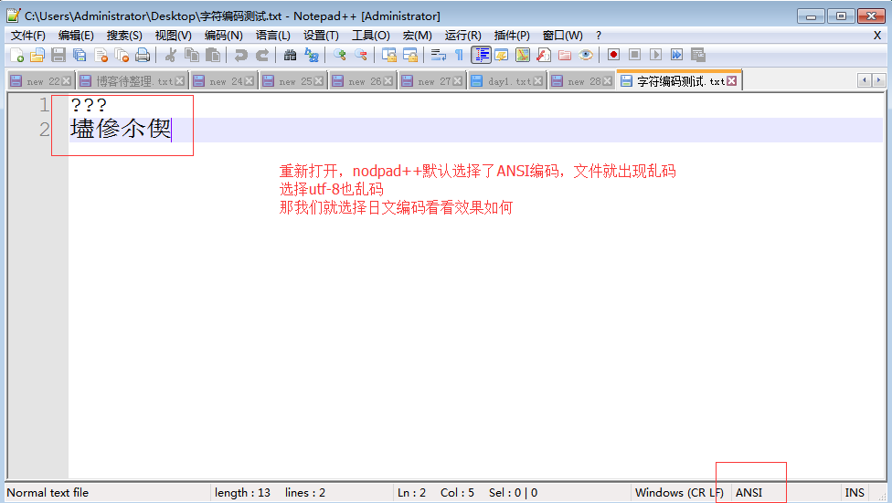

 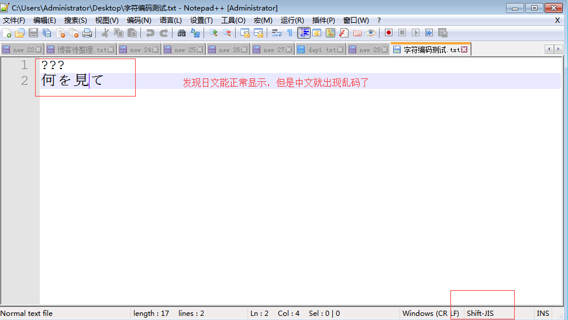

！！！乱码分析！！！

```python
首先明确概念
#1、文件从内存刷到硬盘的操作简称存文件
#2、文件从硬盘读到内存的操作简称读文件

乱码的两种情况：
#乱码一：存文件时就已经乱码
存文件时，由于文件内有各个国家的文字，我们单以shiftjis去存，
本质上其他国家的文字由于在shiftjis中没有找到对应关系而导致存储失败
但当我们硬要存的时候，编辑并不会报错（难道你的编码错误，编辑器这个软件就跟着崩溃了吗？？？），但毫无疑问，不能存而硬存，肯定是乱存了，即存文件阶段就已经发生乱码
而当我们用shiftjis打开文件时，日文可以正常显示，而中文则乱码了

#用open模拟编辑器的过程
可以用open函数的write可以测试，f=open('a.txt','w',encodig='shift_jis'
f.write('你瞅啥\n何を見て\n') #'你瞅啥'因为在shiftjis中没有找到对应关系而无法保存成功，只存'何を見て\n'可以成功

#以任何编码打开文件a.txt都会出现其余两个无法正常显示的问题
f=open('a.txt','wb')
f.write('何を見て\n'.encode('shift_jis'))
f.write('你愁啥\n'.encode('gbk'))
f.write('你愁啥\n'.encode('utf-8'))
f.close()


#乱码二：存文件时不乱码而读文件时乱码
存文件时用utf-8编码，保证兼容万国，不会乱码，而读文件时选择了错误的解码方式，比如gbk，则在读阶段发生乱码，读阶段发生乱码是可以解决的，选对正确的解码方式就ok了，
```

#### 3.2 文本编辑器之pycharm

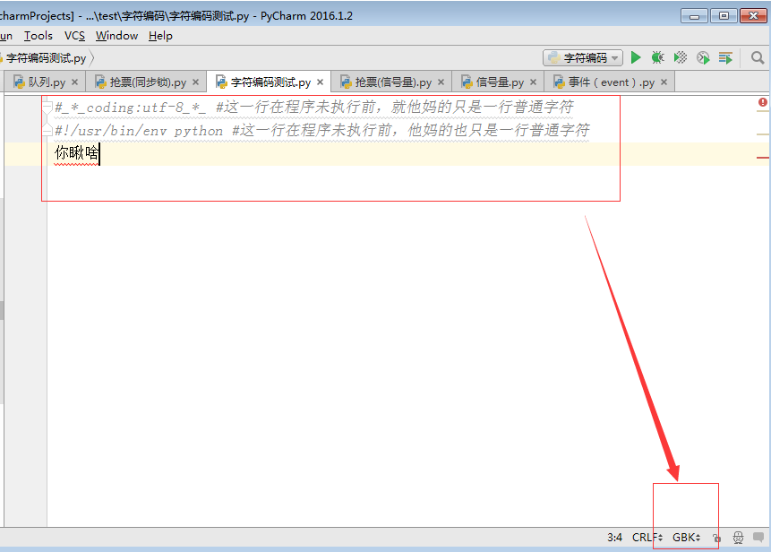

以utf-8格式打开（选择reload）

pycharm中：reload与convert的区别

```python
#reload与convert的区别：

pycharm非常强大，提供了自动帮我们convert转换的功能，即将字符按照正确的格式转换

要自己探究字符编码的本质，还是不要用这个

我们选择reload，即按照某种编码重新加载文件

pycharm中：reload与convert的区别
```


 pycharm中：reload与convert的区别

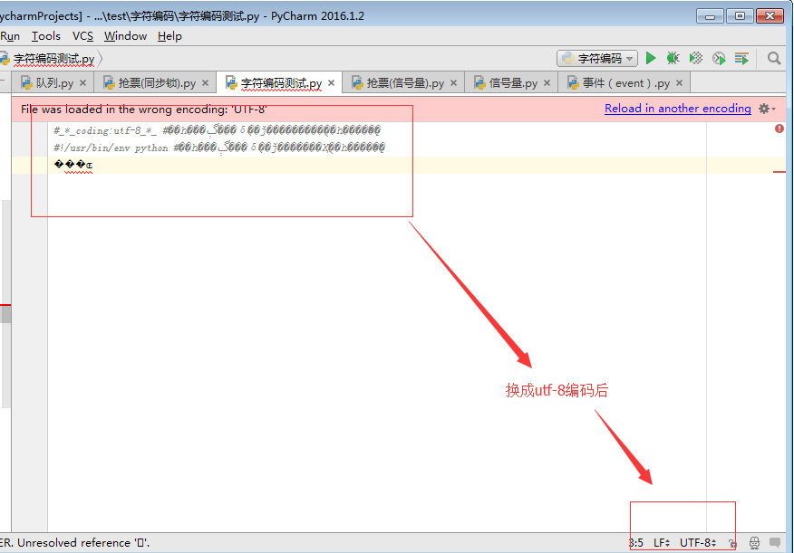


#### 3.3 文本编辑器之python解释器

```python
文件test.py以gbk格式保存，内容为：

　　x='林'

无论是

　　python2 test.py

还是

　　python3 test.py

都会报错（因为python2默认ascii，python3默认utf-8）

除非在文件开头指定#coding:gbk
```


#### 3.4 总结

**！！！总结非常重要的两点！！！**

```python
#1、保证不乱吗的核心法则就是，字符按照什么标准而编码的，就要按照什么标准解码，此处的标准指的就是字符编码

#2、在内存中写的所有字符，一视同仁，都是unicode编码，比如我们打开编辑器，输入一个“你”，我们并不能说“你”就是一个汉字，此时它仅仅只是一个符号，该符号可能很多国家都在使用，根据我们使用的输入法不同这个字的样式可能也不太一样。只有在我们往硬盘保存或者基于网络传输时，才能确定”你“到底是一个汉字，还是一个日本字，这就是unicode转换成其他编码格式的过程了
```

​                  unicode----->encode-------->utf-8

​                  utf-8-------->decode---------->unicode

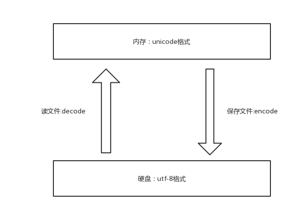

```python
#补充：

浏览网页的时候，服务器会把动态生成的Unicode内容转换为UTF-8再传输到浏览器

如果服务端encode的编码格式是utf-8， 客户端内存中收到的也是utf-8编码的结果。
```

### 四、字符编码应用之python

#### 4.1 执行python程序的三个阶段

python test.py   （我再强调一遍，执行test.py的第一步，一定是先将文件内容读入到内存中）

test.py文件内容以gbk格式保存的，内容为：

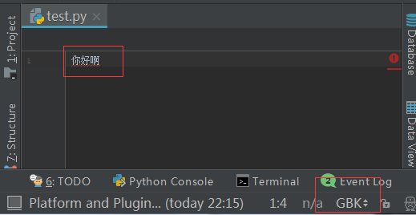

**阶段一：启动python解释器**

**阶段二：python解释器此时就是一个文本编辑器，负责打开文件test.py,即从硬盘中读取test.py的内容到内存中**

```python
此时，python解释器会读取test.py的第一行内容，#coding:utf-8，
来决定以什么编码格式来读入内存，这一行就是来设定python解释器这个软件的执行时使用的编码格式。
这个编码，可以用sys.getdefaultencoding()查看。
如果不在python文件指定头信息＃-*-coding:utf-8-*-,Python解释器就使用默认的：

python2中默认使用ascii，python3中默认使用utf-8 
```

 

改正：在test.py指定文件头，字符编码一定要为gbk，

```python
#coding:gbk
你好啊
```

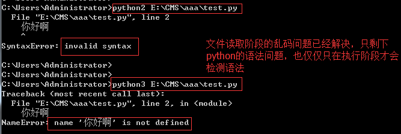

**阶段三：读取已经加载到内存的代码（unicode编码格式），然后执行，执行过程中可能会开辟新的内存空间，比如x="egon"**

```python
内存的编码使用unicode，不代表内存中全都是unicode，

在程序执行之前，内存中确实都是unicode,比如从文件中读取了一行x="egon",其中的x，等号，引号，地位都一样，都是普通字符而已，都是以unicode的格式存放于内存中的

但是程序在执行过程中，会申请内存（与程序代码所存在的内存是俩个空间）用来存放python的数据类型的值，而python的字符串类型又涉及到了字符的概念

比如x="egon",会被python解释器识别为字符串，会申请内存空间来存放字符串类型的值，至于该字符串类型的值被识别成何种编码存放，这就与python解释器的有关了，而python2与python3的字符串类型又有所不同。 
```

#### 4.2 python2与python3字符串类型的区别

Python怎么识别自己的字符串类型？

根据Python解释器规定的语法规则。

为什么字符串有encode方法，没有decode方法？

因为Python3中字符串就是Unicode，可以通过encode过程，转换成任意编码。

```python
#! /usr/bin/env python
# -*- coding:utf-8 -*-

s = '艾米'
# 编码：unicode(str)----encode---->utf-8(bytes)
# 解码：utf-8(bytes)----decode---->unicode
s1 = s.encode('utf-8') # encode过程，编码成utf-8格式的字节码
s2 = s1.decode() # 解码过程，将二进制码解码成Unicode
# s3 = s1.encode('utf-8') # 报错，只有Unicode可以encode
# s4 = s.decode('utf-8') # 报错，Python3中字符串是Unicode编码，没有decode。
print (s1)
print (s2)
```

Python2中怎样识别字符串类型？

碰到字符串，就encode，得到一个bytes格式


**一、在python2中有两种字符串类型str和unicode**

**str类型**

当python解释器执行到产生字符串的代码时（例如x='上'），会申请新的内存地址，然后将'上'编码成文件开头指定的编码格式

要想看x在内存中的真实格式，可以将其放入列表中再打印，而不要直接打印，因为直接print()会自动转换编码，这一点我们稍后再说。

```
#coding:gbk
x='上'
y='下'
print([x,y]) #['\xc9\xcf', '\xcf\xc2']
#\x代表16进制，此处是c9cf总共4位16进制数，一个16进制四4个比特位，4个16进制数则是16个比特位，即2个Bytes，这就证明了按照gbk编码中文用2Bytes
print(type(x),type(y)) #(<type 'str'>, <type 'str'>)
```

**理解字符编码的关键！！！**

内存中的数据通常用16进制表示，2位16进制数据代表一个字节，如\xc9，代表两位16进制，一个字节

**gbk存中文需要2个bytes，而存英文则需要1个bytes，它是如何做到的？？？！！！**

gbk会在每个bytes，即8位bit的第一个位作为标志位，标志位为1则表示是中文字符，如果标志位为0则表示为英文字符

```python
x=‘你a好’
转成gbk格式二进制位
8bit+8bit+8bit+8bit+8bit=(1+7bit)+(1+7bit)+(0+7bit)+(1+7bit)+(1+7bit)
```

这样计算机按照从左往右的顺序读：

```python
#连续读到前两个括号内的首位标志位均为1，则构成一个中午字符：你

#读到第三个括号的首位标志为0，则该8bit代表一个英文字符：a

#连续读到后两个括号内的首位标志位均为1，则构成一个中午字符：好
```

也就是说，每个Bytes留给我们用来存真正值的有效位数只有7位，而在unicode表中存放的只是这有效的7位，至于首位的标志位与具体的编码有关，即在unicode中表示gbk的方式为：

```python
(7bit)+(7bit)+(7bit)+(7bit)+(7bit)
```

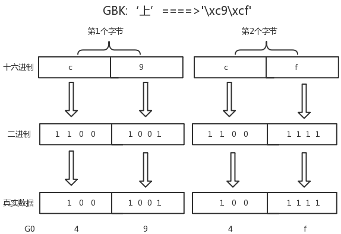 

按照上图翻译的结果，我们可以去unicode关于汉字的对应关系中去查：[链接：https://pan.baidu.com/s/1dEV3RYp](https://pan.baidu.com/s/1dEV3RYp)

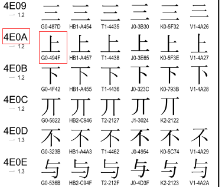

 

可以看到“”上“”对应的gbk（G0代表的是gbk）编码就为494F，即我们得出的结果，而上对应的unicode编码为4E0A，我们可以将gbk-->decode-->unicode

```python
#coding:gbk
x='上'.decode('gbk')
y='下'.decode('gbk')
print([x,y]) #[u'\u4e0a', u'\u4e0b']
```

**unicode类型**

当python解释器执行到产生字符串的代码时（例如s=u'林'），会申请新的内存地址，然后将'林'以unicode的格式存放到新的内存空间中，所以s只能encode，不能decode

```python
#coding:gbk
x=u'上' #等同于 x='上'.decode('gbk')
y=u'下' #等同于 y='下'.decode('gbk')
print([x,y]) #[u'\u4e0a', u'\u4e0b']
print(type(x),type(y)) #(<type 'unicode'>, <type 'unicode'>)
```

**打印到终端**

对于print需要特别说明的是：

当程序执行时，比如

x='上' #gbk下，字符串存放为\xc9\xcf

print(x) #这一步是将x指向的那块新的内存空间（非代码所在的内存空间）中的内存，打印到终端，按理说应该是存的什么就打印什么,但打印\xc9\xcf，对一些不熟知python编码的程序员，立马就懵逼了，所以龟叔自作主张，在print(x)时，使用终端的编码格式，将内存中的\xc9\xcf转成字符显示，此时就需要终端编码必须为gbk，否则无法正常显示原内容：上

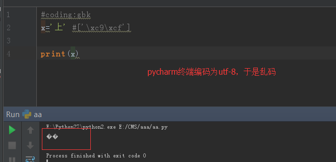


**对于unicode格式的数据来说，无论怎么打印，都不会乱码**


**unicode这么好，不会乱码，那python2为何还那么别扭，搞一个str出来呢？python诞生之时，unicode并未像今天这样普及，很明显，好的东西你能看得见，龟叔早就看见了，龟叔在python3中将str直接存成unicode，我们定义一个str，无需加u前缀，就是一个unicode，屌不屌？**

 

**二、在python3 中也有两种字符串类型str和bytes**

str是unicode

```python
#coding:gbk
x='上' #当程序执行时，无需加u，'上'也会被以unicode形式保存新的内存空间中,

print(type(x)) #<class 'str'>

#x可以直接encode成任意编码格式
print(x.encode('gbk')) #b'\xc9\xcf'
print(type(x.encode('gbk'))) #<class 'bytes'>
```

很重要的一点是：看到python3中x.encode('gbk') 的结果\xc9\xcf正是python2中的str类型的值,而在python3是bytes类型，在python2中则是str类型

于是我有一个大胆的推测：python2中的str类型就是python3的bytes类型，于是我查看python2的str()源码，发现

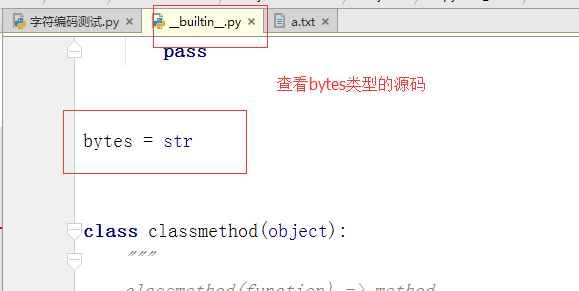


```python
#总结
内存中默认使用：Unicode
硬盘中大多数情况下默认使用：utf-8
# 编码：unicode(str)----encode---->utf-8(bytes)
# 解码：utf-8(bytes)----decode---->unicode
程序加载过程,文件打开和保存
程序执行过程，Python解释器
注意的问题：
文件以什么编码保存，就要以什么编码打开。
python test.py 过程：
1.从硬盘找到test.py文件
#!/usr/bin/python
# -*- coding:utf-8 -*- # 告诉Python解释器以什么编码打开test.py
2.Python解释器执行test.py的代码

```


