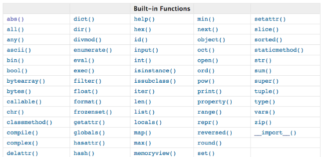

chapter04-三元表达式、列表推导式、生成器表达式、递归、匿名函数、内置函数

# 一 三元表达式、列表推导式、生成器表达式

## **一 三元表达式**

```
name=input('姓名>>: ')
res='SB' if name == 'alex' else 'NB'
print(res)
```

## **二 列表推导式**

```python
#1、示例
egg_list=[]
for i in range(10):
    egg_list.append('鸡蛋%s' %i)

egg_list=['鸡蛋%s' %i for i in range(10)]

#2、语法
[expression for item1 in iterable1 if condition1
for item2 in iterable2 if condition2
...
for itemN in iterableN if conditionN
]
类似于
res=[]
for item1 in iterable1:
    if condition1:
        for item2 in iterable2:
            if condition2
                ...
                for itemN in iterableN:
                    if conditionN:
                        res.append(expression)

#3、优点：方便，改变了编程习惯，可称之为声明式编程
```


## **三 生成器表达式**

```python
#1、把列表推导式的[]换成()就是生成器表达式

#2、示例：生一筐鸡蛋变成给你一只老母鸡，用的时候就下蛋，这也是生成器的特性
>>> chicken=('鸡蛋%s' %i for i in range(5))
>>> chicken
<generator object <genexpr> at 0x10143f200>
>>> next(chicken)
'鸡蛋0'
>>> list(chicken) #因chicken可迭代，因而可以转成列表
['鸡蛋1', '鸡蛋2', '鸡蛋3', '鸡蛋4',]

#3、优点：省内存，一次只产生一个值在内存中
```


## **四 声明式编程练习题**

1、将names=['egon','alex_sb','wupeiqi','yuanhao']中的名字全部变大写

2、将names=['egon','alex_sb','wupeiqi','yuanhao']中以sb结尾的名字过滤掉，然后保存剩下的名字长度

3、求文件a.txt中最长的行的长度（长度按字符个数算，需要使用max函数）

4、求文件a.txt中总共包含的字符个数？思考为何在第一次之后的n次sum求和得到的结果为0？（需要使用sum函数）

5、思考题

```python
with open('a.txt') as f:
    g=(len(line) for line in f)
print(sum(g)) #为何报错？
```

6、文件shopping.txt内容如下

```python
mac,20000,3
lenovo,3000,10
tesla,1000000,10
chicken,200,1
```

求总共花了多少钱？

打印出所有商品的信息，格式为[{'name':'xxx','price':333,'count':3},...]

求单价大于10000的商品信息,格式同上

```python
#题目一
names=['egon','alex_sb','wupeiqi','yuanhao']
names=[name.upper() for name in names]

#题目二
names=['egon','alex_sb','wupeiqi','yuanhao']
names=[len(name) for name in names if not name.endswith('sb')]

#题目三
with open('a.txt',encoding='utf-8') as f:
    print(max(len(line) for line in f))

#题目四
with open('a.txt', encoding='utf-8') as f:
    print(sum(len(line) for line in f))
    print(sum(len(line) for line in f)) #求包换换行符在内的文件所有的字符数，为何得到的值为0?
    print(sum(len(line) for line in f)) #求包换换行符在内的文件所有的字符数，为何得到的值为0?

#题目五（略）

#题目六：每次必须重新打开文件或seek到文件开头，因为迭代完一次就结束了
with open('a.txt',encoding='utf-8') as f:
    info=[line.split() for line in f]
    cost=sum(float(unit_price)*int(count) for _,unit_price,count in info)
    print(cost)


with open('a.txt',encoding='utf-8') as f:
    info=[{
        'name': line.split()[0],
        'price': float(line.split()[1]),
        'count': int(line.split()[2]),
    } for line in f]
    print(info)


with open('a.txt',encoding='utf-8') as f:
    info=[{
        'name': line.split()[0],
        'price': float(line.split()[1]),
        'count': int(line.split()[2]),
    } for line in f if float(line.split()[1]) > 10000]
    print(info)
```


# 二 递归与二分法

## **一 递归调用的定义**

```python
#递归调用是函数嵌套调用的一种特殊形式，函数在调用时，直接或间接调用了自身，就是递归调用
```

详解

```python
#直接调用本身
def f1():
    print('from f1')
    f1()
f1()

#间接调用本身
def f1():
    print('from f1')
    f2()

def f2():
    print('from f2')
    f1()
f1()

# 调用函数会产生局部的名称空间，占用内存，因为上述这种调用会无需调用本身，python解释器的内存管理机制为了防止其无限制占用内存，对函数的递归调用做了最大的层级限制
四 可以修改递归最大深度

import sys
sys.getrecursionlimit()
sys.setrecursionlimit(2000)

def f1(n):
    print('from f1',n)
    f1(n+1)
f1(1)

虽然可以设置，但是因为不是尾递归，仍然要保存栈，内存大小一定，不可能无限递归，而且无限制地递归调用本身是毫无意义的，递归应该分为两个明确的阶段，回溯与递推
```


## **二 递归调用应该分为两个明确的阶段：递推，回溯** 

```python
#1、递归调用应该包含两个明确的阶段：回溯，递推
    回溯就是从外向里一层一层递归调用下去，
        回溯阶段必须要有一个明确地结束条件，每进入下一次递归时，问题的规模都应该有所减少（否则，单纯地重复调用自身是毫无意义的）

    递推就是从里向外一层一层结束递归

#2、示例+图解。。。
# salary(5)=salary(4)+300
# salary(4)=salary(3)+300
# salary(3)=salary(2)+300
# salary(2)=salary(1)+300
# salary(1)=100
#
# salary(n)=salary(n-1)+300     n>1
# salary(1) =100                n=1

def salary(n):
    if n == 1:
        return 100
    return salary(n-1)+300

print(salary(5)) 
```


## **三 python中的递归效率低且没有尾递归优化**


```python
#python中的递归
python中的递归效率低，需要在进入下一次递归时保留当前的状态，在其他语言中可以有解决方法：尾递归优化，即在函数的最后一步（而非最后一行)调用自己，尾递归优化：http://egon09.blog.51cto.com/9161406/1842475
但是python又没有尾递归，且对递归层级做了限制

#总结递归的使用：
1. 必须有一个明确的结束条件

2. 每次进入更深一层递归时，问题规模相比上次递归都应有所减少

3. 递归效率不高，递归层次过多会导致栈溢出（在计算机中，函数调用是通过栈（stack）这种数据结构实现的，每当进入一个函数调用，栈就会加一层栈帧，每当函数返回，栈就会减一层栈帧。由于栈的大小不是无限的，所以，递归调用的次数过多，会导致栈溢出）
```

利用函数编写如下数列：

斐波那契数列指的是这样一个数列 0, 1, 1, 2, 3, 5, 8, 13, 21, 34, 55, 89, 144, 233，377，610，987，1597，2584，4181，6765，10946，17711，28657，46368...

```python
`def` `func(arg1,arg2):``    ``if` `arg1 ``=``=` `0``:``        ``print` `arg1, arg2``    ``arg3 ``=` `arg1 ``+` `arg2``    ``print` `arg3``    ``func(arg2, arg3)`` ` `func(``0``,``1``)`
```

## **四 二分法**

想从一个按照从小到大排列的数字列表中找到指定的数字，遍历的效率太低，用二分法（算法的一种，算法是解决问题的方法）可以极大低缩小问题规模

实现类似于in的效果

```python
l=[1,2,10,30,33,99,101,200,301,311,402,403,500,900,1000] #从小到大排列的数字列表

def search(n,l):
    print(l)
    if len(l) == 0:
        print('not exists')
        return
    mid_index=len(l) // 2
    if n > l[mid_index]:
        #in the right
        l=l[mid_index+1:]
        search(n,l)
    elif n < l[mid_index]:
        #in the left
        l=l[:mid_index]
        search(n,l)
    else:
        print('find it')


search(3,l)
```

实现类似于l.index(30)的效果

```python
l=[1,2,10,30,33,99,101,200,301,402]

def search(num,l,start=0,stop=len(l)-1):
    if start <= stop:
        mid=start+(stop-start)//2
        print('start:[%s] stop:[%s] mid:[%s] mid_val:[%s]' %(start,stop,mid,l[mid]))
        if num > l[mid]:
            start=mid+1
        elif num < l[mid]:
            stop=mid-1
        else:
            print('find it',mid)
            return
        search(num,l,start,stop)
    else: #如果stop > start则意味着列表实际上已经全部切完，即切为空
        print('not exists')
        return

search(301,l)
```


# 三 匿名函数

## **一 什么是匿名函数？**

```python
匿名就是没有名字
def func(x,y,z=1):
    return x+y+z

匿名
lambda x,y,z=1:x+y+z #与函数有相同的作用域，但是匿名意味着引用计数为0，使用一次就释放，除非让其有名字
func=lambda x,y,z=1:x+y+z 
func(1,2,3)
#让其有名字就没有意义
```


## **二 有名字的函数与匿名函数的对比**

```python
#有名函数与匿名函数的对比
有名函数：循环使用，保存了名字，通过名字就可以重复引用函数功能

匿名函数：一次性使用，随时随时定义

应用：max，min，sorted,map,reduce,filter
```


# 四 内置函数

```python
#注意：内置函数id()可以返回一个对象的身份，返回值为整数。这个整数通常对应与该对象在内存中的位置，但这与python的具体实现有关，不应该作为对身份的定义，即不够精准，最精准的还是以内存地址为准。is运算符用于比较两个对象的身份，等号比较两个对象的值，内置函数type()则返回一个对象的类型

#更多内置函数：https://docs.python.org/3/library/functions.html?highlight=built#ascii 
```



format(了解即可)

```python
#字符串可以提供的参数 's' None
>>> format('some string','s')
'some string'
>>> format('some string')
'some string'

#整形数值可以提供的参数有 'b' 'c' 'd' 'o' 'x' 'X' 'n' None
>>> format(3,'b') #转换成二进制
'11'
>>> format(97,'c') #转换unicode成字符
'a'
>>> format(11,'d') #转换成10进制
'11'
>>> format(11,'o') #转换成8进制
'13'
>>> format(11,'x') #转换成16进制 小写字母表示
'b'
>>> format(11,'X') #转换成16进制 大写字母表示
'B'
>>> format(11,'n') #和d一样
'11'
>>> format(11) #默认和d一样
'11'

#浮点数可以提供的参数有 'e' 'E' 'f' 'F' 'g' 'G' 'n' '%' None
>>> format(314159267,'e') #科学计数法，默认保留6位小数
'3.141593e+08'
>>> format(314159267,'0.2e') #科学计数法，指定保留2位小数
'3.14e+08'
>>> format(314159267,'0.2E') #科学计数法，指定保留2位小数，采用大写E表示
'3.14E+08'
>>> format(314159267,'f') #小数点计数法，默认保留6位小数
'314159267.000000'
>>> format(3.14159267000,'f') #小数点计数法，默认保留6位小数
'3.141593'
>>> format(3.14159267000,'0.8f') #小数点计数法，指定保留8位小数
'3.14159267'
>>> format(3.14159267000,'0.10f') #小数点计数法，指定保留10位小数
'3.1415926700'
>>> format(3.14e+1000000,'F')  #小数点计数法，无穷大转换成大小字母
'INF'

#g的格式化比较特殊，假设p为格式中指定的保留小数位数，先尝试采用科学计数法格式化，得到幂指数exp，如果-4<=exp<p，则采用小数计数法，并保留p-1-exp位小数，否则按小数计数法计数，并按p-1保留小数位数
>>> format(0.00003141566,'.1g') #p=1,exp=-5 ==》 -4<=exp<p不成立，按科学计数法计数，保留0位小数点
'3e-05'
>>> format(0.00003141566,'.2g') #p=1,exp=-5 ==》 -4<=exp<p不成立，按科学计数法计数，保留1位小数点
'3.1e-05'
>>> format(0.00003141566,'.3g') #p=1,exp=-5 ==》 -4<=exp<p不成立，按科学计数法计数，保留2位小数点
'3.14e-05'
>>> format(0.00003141566,'.3G') #p=1,exp=-5 ==》 -4<=exp<p不成立，按科学计数法计数，保留0位小数点，E使用大写
'3.14E-05'
>>> format(3.1415926777,'.1g') #p=1,exp=0 ==》 -4<=exp<p成立，按小数计数法计数，保留0位小数点
'3'
>>> format(3.1415926777,'.2g') #p=1,exp=0 ==》 -4<=exp<p成立，按小数计数法计数，保留1位小数点
'3.1'
>>> format(3.1415926777,'.3g') #p=1,exp=0 ==》 -4<=exp<p成立，按小数计数法计数，保留2位小数点
'3.14'
>>> format(0.00003141566,'.1n') #和g相同
'3e-05'
>>> format(0.00003141566,'.3n') #和g相同
'3.14e-05'
>>> format(0.00003141566) #和g相同
'3.141566e-05'
```

！！！lambda与内置函数结合使用！！！

```python
字典的运算：最小值，最大值，排序
salaries={
    'egon':3000,
    'alex':100000000,
    'wupeiqi':10000,
    'yuanhao':2000
}

迭代字典，取得是key，因而比较的是key的最大和最小值
>>> max(salaries)
'yuanhao'
>>> min(salaries)
'alex'

可以取values，来比较
>>> max(salaries.values())
>>> min(salaries.values())
但通常我们都是想取出，工资最高的那个人名，即比较的是salaries的值，得到的是键
>>> max(salaries,key=lambda k:salary[k])
'alex'
>>> min(salaries,key=lambda k:salary[k])
'yuanhao'


也可以通过zip的方式实现
salaries_and_names=zip(salaries.values(),salaries.keys())

先比较值，值相同则比较键
>>> max(salaries_and_names)
(100000000, 'alex')


salaries_and_names是迭代器，因而只能访问一次
>>> min(salaries_and_names)
Traceback (most recent call last):
  File "<stdin>", line 1, in <module>
ValueError: min() arg is an empty sequence


sorted(iterable，key=None,reverse=False)
```

eval与exec

```python
#1、语法
# eval(str,[,globasl[,locals]])
# exec(str,[,globasl[,locals]])

#2、区别
#示例一：
s='1+2+3'
print(eval(s)) #eval用来执行表达式，并返回表达式执行的结果
print(exec(s)) #exec用来执行语句，不会返回任何值
'''
6
None
'''

#示例二：
print(eval('1+2+x',{'x':3},{'x':30})) #返回33
print(exec('1+2+x',{'x':3},{'x':30})) #返回None

# print(eval('for i in range(10):print(i)')) #语法错误，eval不能执行表达式
print(exec('for i in range(10):print(i)'))
```

complie（了解即可）

```python
compile(str,filename,kind)
filename:用于追踪str来自于哪个文件，如果不想追踪就可以不定义
kind可以是：single代表一条语句，exec代表一组语句，eval代表一个表达式
s='for i in range(10):print(i)'
code=compile(s,'','exec')
exec(code)


s='1+2+3'
code=compile(s,'','eval')
eval(code)
```


# 五 阶段性练习

1、文件内容如下,标题为:姓名,性别,年纪,薪资

egon male 18 3000
alex male 38 30000
wupeiqi female 28 20000
yuanhao female 28 10000

要求:
从文件中取出每一条记录放入列表中,
列表的每个元素都是{'name':'egon','sex':'male','age':18,'salary':3000}的形式

2 根据1得到的列表,取出薪资最高的人的信息
3 根据1得到的列表,取出最年轻的人的信息
4 根据1得到的列表,将每个人的信息中的名字映射成首字母大写的形式
5 根据1得到的列表,过滤掉名字以a开头的人的信息
6 使用递归打印斐波那契数列(前两个数的和得到第三个数，如：0 1 1 2 3 4 7...)

7 一个嵌套很多层的列表，如l=［1,2,[3,[4,5,6,[7,8,[9,10,[11,12,13,[14,15]]]]]]］，用递归取出所有的值


```python
#1
with open('db.txt') as f:
    items=(line.split() for line in f)
    info=[{'name':name,'sex':sex,'age':age,'salary':salary} \
          for name,sex,age,salary in items]

print(info)
#2
print(max(info,key=lambda dic:dic['salary']))

#3
print(min(info,key=lambda dic:dic['age']))

# 4
info_new=map(lambda item:{'name':item['name'].capitalize(),
                          'sex':item['sex'],
                          'age':item['age'],
                          'salary':item['salary']},info)

print(list(info_new))

#5
g=filter(lambda item:item['name'].startswith('a'),info)
print(list(g))

#6
#非递归
def fib(n):
    a,b=0,1
    while a < n:
        print(a,end=' ')
        a,b=b,a+b
    print()

fib(10)
#递归
def fib(a,b,stop):
    if  a > stop:
        return
    print(a,end=' ')
    fib(b,a+b,stop)

fib(0,1,10)


#7
l=[1,2,[3,[4,5,6,[7,8,[9,10,[11,12,13,[14,15]]]]]]]

def get(seq):
    for item in seq:
        if type(item) is list:
            get(item)
        else:
            print(item)
get(l)
```


 