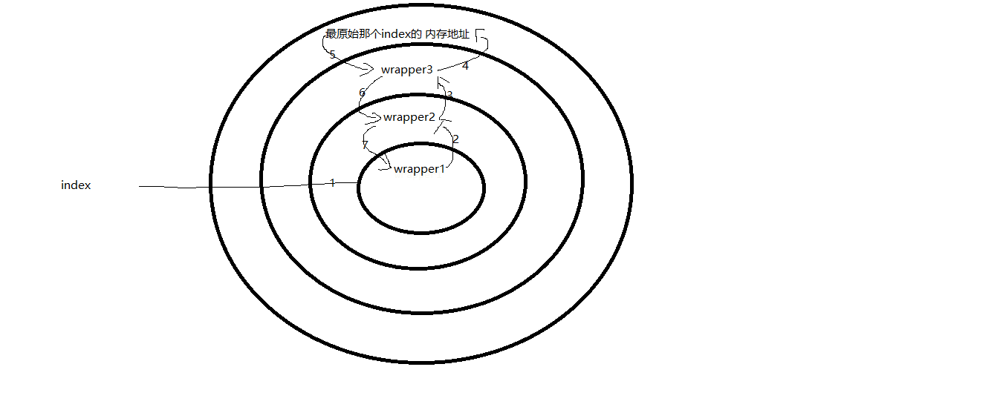

chapter04-函数对象、函数嵌套、名称空间与作用域、装饰器

# 一、函数对象

**一、函数是第一类对象，即函数可以当作数据传递**

```python
#1 可以被引用
#2 可以当作参数传递
#3 返回值可以是函数 (返回值没有类型限制)
#3 可以当作容器类型的元素
```

```python
#1 可以被引用
#2 可以当作参数传递
#3 返回值可以是函数
#3 可以当作容器类型的元素

```


**二、利用该特性，优雅的取代多分支的if**

```python
def foo():
    print('foo')

def bar():
    print('bar')

dic={
    'foo':foo,
    'bar':bar,
}
while True:
    choice=input('>>: ').strip()
    if choice in dic:
        dic[choice]()
```


# 二、函数嵌套

**一、函数的嵌套调用**

```python
def max(x,y):
    return x if x > y else y

def max4(a,b,c,d):
    res1=max(a,b)
    res2=max(res1,c)
    res3=max(res2,d)
    return res3
print(max4(1,2,3,4))
```


**二、函数的嵌套定义**

```python
def f1():
    def f2(): # f1()的内部函数
        def f3():
            print('from f3')
        f3()
    f2()

f1()
f3() #报错，为何？请看下一小节
```


### 三、名称空间与作用域

**一、什么是名称空间？**

```python
#名称空间：存放名字的地方，三种名称空间，（之前遗留的问题x=1，1存放于内存中，那名字x存放在哪里呢？名称空间正是存放名字x与1绑定关系的地方）
```

**二、名称空间的加载顺序**

```python
python test.py
#1、python解释器先启动，因而首先加载的是：内置名称空间
#2、执行test.py文件，然后以文件为基础，加载全局名称空间
#3、在执行文件的过程中如果调用函数，则临时产生局部名称空间
```

**三、名字的查找顺序**

```python
局部名称空间--->全局名称空间--->内置名称空间

#需要注意的是：在全局无法查看局部的，在局部可以查看全局的，如下示例

# max=1
def f1():
    # max=2
    def f2():
        # max=3
        print(max)
    f2()
f1()
print(max) 
```


**四、作用域**

```python
#1、作用域即范围
- 全局范围（内置名称空间与全局名称空间属于该范围）：全局存活，全局有效
- 局部范围（局部名称空间属于该范围）：临时存活，局部有效
#2、作用域关系是在函数定义阶段就已经固定的，与函数的调用位置无关，如下
x=1
def f1():
    def f2():
        print(x)
    return f2
x=100
def f3(func):
    x=2
    func()
x=10000
f3(f1())

#3、查看作用域：globals(),locals()

LEGB 代表名字查找顺序: locals -> enclosing function -> globals -> __builtins__
locals 是函数内的名字空间，包括局部变量和形参
enclosing 外部嵌套函数的名字空间（闭包中常见）
globals 全局变量，函数定义所在模块的名字空间
builtins 内置模块的名字空间

#局部是函数级别的局部，全局仍然是全局范围

```


**五、global与nonlocal关键字**


# 四、闭包函数

**一、什么是闭包？**

```python
#内部函数包含对外部作用域而非全局作用域的引用

#提示：之前我们都是通过参数将外部的值传给函数，闭包提供了另外一种思路，包起来。

        def counter():
            n=0
            def incr():
                nonlocal n
                x=n
                n+=1
                return x
            return incr

        c=counter() 
        print(c())
        print(c())
        print(c())
        print(c.__closure__[0].cell_contents) #查看闭包的元素
```


**二、闭包的意义与应用**

```python
#闭包的意义：返回的函数对象，不仅仅是一个函数对象，在该函数外还包裹了一层作用域，这使得，该函数无论在何处调用，优先使用自己外层包裹的作用域
#应用领域：延迟计算（原来我们是传参，现在我们是包起来）
    from urllib.request import urlopen

    def index(url):
        def get():
            return urlopen(url).read()
        return get

    baidu=index('http://www.baidu.com')
    print(baidu().decode('utf-8'))
    
不仅仅是一个函数，是一个函数，外面还包了一层作用域。
闭包就是内部函数外面包了一层作用域关系。并且包含对外部作用域的引用，并且要把这个函数return。
不受函数定义的级别的限制 
```


### 五、装饰器

装饰器就是闭包函数的一种应用场景

**一、为何要用装饰器**

```python
#开放封闭原则：对修改封闭，对扩展开放
```

**二、什么是装饰器**

```python
装饰器他人的器具，本身可以是任意可调用对象，被装饰者也可以是任意可调用对象。
强调装饰器的原则：1 不修改被装饰对象的源代码 2 不修改被装饰对象的调用方式
装饰器的目标：在遵循1和2的前提下，为被装饰对象添加上新功能
```

**三、装饰器的使用**

无参装饰器

```python
import time
def timmer(func):
    def wrapper(*args,**kwargs):
        start_time=time.time()
        res=func(*args,**kwargs)
        stop_time=time.time()
        print('run time is %s' %(stop_time-start_time))
        return res
    return wrapper

@timmer
def foo():
    time.sleep(3)
    print('from foo')
foo()
```

有参装饰器

```python
def auth(driver='file'):
    def auth2(func):
        def wrapper(*args,**kwargs):
            name=input("user: ")
            pwd=input("pwd: ")

            if driver == 'file':
                if name == 'egon' and pwd == '123':
                    print('login successful')
                    res=func(*args,**kwargs)
                    return res
            elif driver == 'ldap':
                print('ldap')
        return wrapper
    return auth2

@auth(driver='file')
def foo(name):
    print(name)

foo('egon')
```


**四、装饰器语法**

```python
被装饰函数的正上方，单独一行
        @deco1
        @deco2
        @deco3
        def foo():
            pass

        foo=deco1(deco2(deco3(foo)))
```


**五、装饰器补充：wraps**

```python
from functools import wraps

def deco(func):
    @wraps(func) #加在最内层函数正上方
    def wrapper(*args,**kwargs):
        return func(*args,**kwargs)
    return wrapper

@deco
def index():
    '''哈哈哈哈'''
    print('from index')

print(index.__doc__)
```


**六、叠加多个装饰器**

```python
# 叠加多个装饰器
# 1. 加载顺序(outter函数的调用顺序):自下而上
# 2. 执行顺序(wrapper函数的执行顺序):自上而下
```

示例代码

```python
def outter1(func1): #func1=wrapper2的内存地址
    print('加载了outter1')
    def wrapper1(*args,**kwargs):
        print('执行了wrapper1')
        res1=func1(*args,**kwargs)
        return res1
    return wrapper1

def outter2(func2): #func2=wrapper3的内存地址
    print('加载了outter2')
    def wrapper2(*args,**kwargs):
        print('执行了wrapper2')
        res2=func2(*args,**kwargs)
        return res2
    return wrapper2

def outter3(func3): # func3=最原始的那个index的内存地址
    print('加载了outter3')
    def wrapper3(*args,**kwargs):
        print('执行了wrapper3')
        res3=func3(*args,**kwargs)
        return res3
    return wrapper3


@outter1 # outter1(wrapper2的内存地址)======>index=wrapper1的内存地址
@outter2 # outter2(wrapper3的内存地址)======>wrapper2的内存地址
@outter3 # outter3(最原始的那个index的内存地址)===>wrapper3的内存地址
def index():
    print('from index')

print('======================================================')
index()
```





### 六、练习题

一：编写函数，（函数执行的时间是随机的）
二：编写装饰器，为函数加上统计时间的功能
三：编写装饰器，为函数加上认证的功能

四：编写装饰器，为多个函数加上认证的功能（用户的账号密码来源于文件），要求登录成功一次，后续的函数都无需再输入用户名和密码
注意：从文件中读出字符串形式的字典，可以用eval('{"name":"egon","password":"123"}')转成字典格式

五：编写装饰器，为多个函数加上认证功能，要求登录成功一次，在超时时间内无需重复登录，超过了超时时间，则必须重新登录

六：编写下载网页内容的函数，要求功能是：用户传入一个url，函数返回下载页面的结果

七：为题目五编写装饰器，实现缓存网页内容的功能：
具体：实现下载的页面存放于文件中，如果文件内有值（文件大小不为0），就优先从文件中读取网页内容，否则，就去下载，然后存到文件中

扩展功能：用户可以选择缓存介质/缓存引擎，针对不同的url，缓存到不同的文件中

八：还记得我们用函数对象的概念，制作一个函数字典的操作吗，来来来，我们有更高大上的做法，在文件开头声明一个空字典，然后在每个函数前加上装饰器，完成自动添加到字典的操作

九 编写日志装饰器，实现功能如：一旦函数f1执行，则将消息2017-07-21 11:12:11 f1 run写入到日志文件中，日志文件路径可以指定
注意：时间格式的获取
import time
time.strftime('%Y-%m-%d %X')


```python
#题目一:略
#题目二:略
#题目三:略
#题目四：
db='db.txt'
login_status={'user':None,'status':False}
def auth(auth_type='file'):
    def auth2(func):
        def wrapper(*args,**kwargs):
            if login_status['user'] and login_status['status']:
                return func(*args,**kwargs)
            if auth_type == 'file':
                with open(db,encoding='utf-8') as f:
                    dic=eval(f.read())
                name=input('username: ').strip()
                password=input('password: ').strip()
                if name in dic and password == dic[name]:
                    login_status['user']=name
                    login_status['status']=True
                    res=func(*args,**kwargs)
                    return res
                else:
                    print('username or password error')
            elif auth_type == 'sql':
                pass
            else:
                pass
        return wrapper
    return auth2

@auth()
def index():
    print('index')

@auth(auth_type='file')
def home(name):
    print('welcome %s to home' %name)


# index()
# home('egon')

#题目五
import time,random
user={'user':None,'login_time':None,'timeout':0.000003,}

def timmer(func):
    def wrapper(*args,**kwargs):
        s1=time.time()
        res=func(*args,**kwargs)
        s2=time.time()
        print('%s' %(s2-s1))
        return res
    return wrapper


def auth(func):
    def wrapper(*args,**kwargs):
        if user['user']:
            timeout=time.time()-user['login_time']
            if timeout < user['timeout']:
                return func(*args,**kwargs)
        name=input('name>>: ').strip()
        password=input('password>>: ').strip()
        if name == 'egon' and password == '123':
            user['user']=name
            user['login_time']=time.time()
            res=func(*args,**kwargs)
            return res
    return wrapper

@auth
def index():
    time.sleep(random.randrange(3))
    print('welcome to index')

@auth
def home(name):
    time.sleep(random.randrange(3))
    print('welcome %s to home ' %name)

index()
home('egon')

#题目六:略
#题目七：简单版本
import requests
import os
cache_file='cache.txt'
def make_cache(func):
    def wrapper(*args,**kwargs):
        if not os.path.exists(cache_file):
            with open(cache_file,'w'):pass

        if os.path.getsize(cache_file):
            with open(cache_file,'r',encoding='utf-8') as f:
                res=f.read()
        else:
            res=func(*args,**kwargs)
            with open(cache_file,'w',encoding='utf-8') as f:
                f.write(res)
        return res
    return wrapper

@make_cache
def get(url):
    return requests.get(url).text


# res=get('https://www.python.org')

# print(res)

#题目七:扩展版本
import requests,os,hashlib
engine_settings={
    'file':{'dirname':'./db'},
    'mysql':{
        'host':'127.0.0.1',
        'port':3306,
        'user':'root',
        'password':'123'},
    'redis':{
        'host':'127.0.0.1',
        'port':6379,
        'user':'root',
        'password':'123'},
}

def make_cache(engine='file'):
    if engine not in engine_settings:
        raise TypeError('egine not valid')
    def deco(func):
        def wrapper(url):
            if engine == 'file':
                m=hashlib.md5(url.encode('utf-8'))
                cache_filename=m.hexdigest()
                cache_filepath=r'%s/%s' %(engine_settings['file']['dirname'],cache_filename)

                if os.path.exists(cache_filepath) and os.path.getsize(cache_filepath):
                    return open(cache_filepath,encoding='utf-8').read()

                res=func(url)
                with open(cache_filepath,'w',encoding='utf-8') as f:
                    f.write(res)
                return res
            elif engine == 'mysql':
                pass
            elif engine == 'redis':
                pass
            else:
                pass

        return wrapper
    return deco

@make_cache(engine='file')
def get(url):
    return requests.get(url).text

# print(get('https://www.python.org'))
print(get('https://www.baidu.com'))


#题目八
route_dic={}

def make_route(name):
    def deco(func):
        route_dic[name]=func
    return deco
@make_route('select')
def func1():
    print('select')

@make_route('insert')
def func2():
    print('insert')

@make_route('update')
def func3():
    print('update')

@make_route('delete')
def func4():
    print('delete')

print(route_dic)


#题目九
import time
import os

def logger(logfile):
    def deco(func):
        if not os.path.exists(logfile):
            with open(logfile,'w'):pass

        def wrapper(*args,**kwargs):
            res=func(*args,**kwargs)
            with open(logfile,'a',encoding='utf-8') as f:
                f.write('%s %s run\n' %(time.strftime('%Y-%m-%d %X'),func.__name__))
            return res
        return wrapper
    return deco

@logger(logfile='aaaaaaaaaaaaaaaaaaaaa.log')
def index():
    print('index')

index()
```

