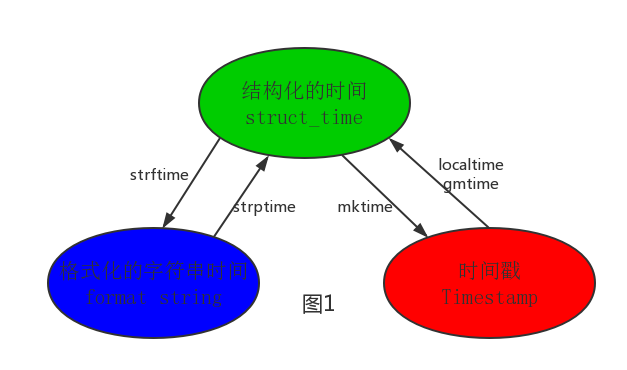
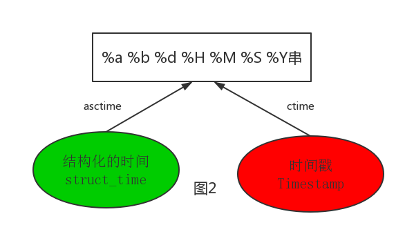
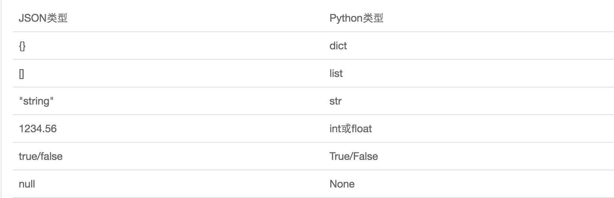
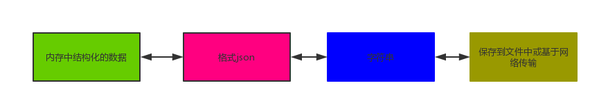
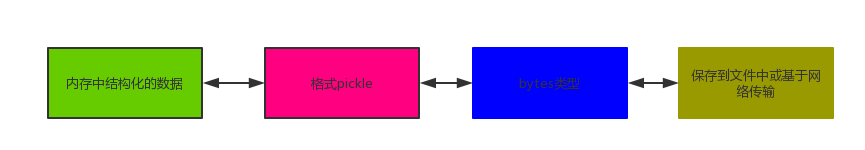
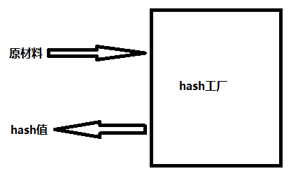
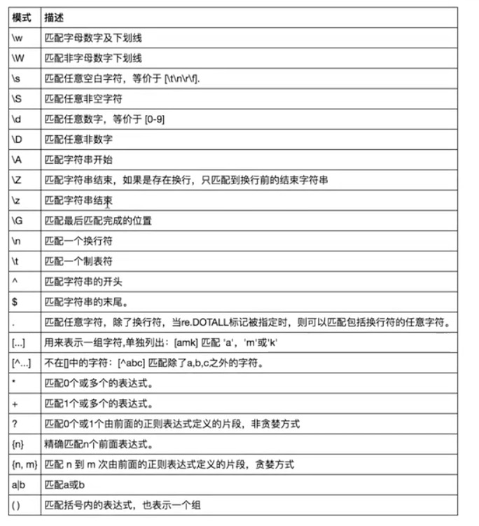

chapter06-常用模块

# 一 time与datetime模块

在Python中，通常有这几种方式来表示时间：

- 时间戳(timestamp)：通常来说，时间戳表示的是从1970年1月1日00:00:00开始按秒计算的偏移量。我们运行“type(time.time())”，返回的是float类型。
- 格式化的时间字符串(Format String)
- 结构化的时间(struct_time)：struct_time元组共有9个元素共九个元素:(年，月，日，时，分，秒，一年中第几周，一年中第几天，夏令时)

```python
1 import time
2 #--------------------------我们先以当前时间为准,让大家快速认识三种形式的时间
3 print(time.time()) # 时间戳:1487130156.419527
4 print(time.strftime("%Y-%m-%d %X")) #格式化的时间字符串:'2017-02-15 11:40:53'
5 
6 print(time.localtime()) #本地时区的struct_time
7 print(time.gmtime())    #UTC时区的struct_time
```

格式化字符串的时间格式

```python
%a    Locale’s abbreviated weekday name.     
%A    Locale’s full weekday name.     
%b    Locale’s abbreviated month name.     
%B    Locale’s full month name.     
%c    Locale’s appropriate date and time representation.     
%d    Day of the month as a decimal number [01,31].     
%H    Hour (24-hour clock) as a decimal number [00,23].     
%I    Hour (12-hour clock) as a decimal number [01,12].     
%j    Day of the year as a decimal number [001,366].     
%m    Month as a decimal number [01,12].     
%M    Minute as a decimal number [00,59].     
%p    Locale’s equivalent of either AM or PM.    (1)
%S    Second as a decimal number [00,61].    (2)
%U    Week number of the year (Sunday as the first day of the week) as a decimal number [00,53]. All days in a new year preceding the first Sunday are considered to be in week 0.    (3)
%w    Weekday as a decimal number [0(Sunday),6].     
%W    Week number of the year (Monday as the first day of the week) as a decimal number [00,53]. All days in a new year preceding the first Monday are considered to be in week 0.    (3)
%x    Locale’s appropriate date representation.     
%X    Locale’s appropriate time representation.     
%y    Year without century as a decimal number [00,99].     
%Y    Year with century as a decimal number.     
%z    Time zone offset indicating a positive or negative time difference from UTC/GMT of the form +HHMM or -HHMM, where H represents decimal hour digits and M represents decimal minute digits [-23:59, +23:59].     
%Z    Time zone name (no characters if no time zone exists).     
%%    A literal '%' character.
```

 

其中计算机认识的时间只能是'时间戳'格式，而程序员可处理的或者说人类能看懂的时间有: '格式化的时间字符串'，'结构化的时间' ，于是有了下图的转换关系




```python
 1 #--------------------------按图1转换时间
 2 # localtime([secs])
 3 # 将一个时间戳转换为当前时区的struct_time。secs参数未提供，则以当前时间为准。
 4 time.localtime()
 5 time.localtime(1473525444.037215)
 6 
 7 # gmtime([secs]) 和localtime()方法类似，gmtime()方法是将一个时间戳转换为UTC时区（0时区）的struct_time。
 8 
 9 # mktime(t) : 将一个struct_time转化为时间戳。
10 print(time.mktime(time.localtime()))#1473525749.0
11 
12 
13 # strftime(format[, t]) : 把一个代表时间的元组或者struct_time（如由time.localtime()和
14 # time.gmtime()返回）转化为格式化的时间字符串。如果t未指定，将传入time.localtime()。如果元组中任何一个
15 # 元素越界，ValueError的错误将会被抛出。
16 print(time.strftime("%Y-%m-%d %X", time.localtime()))#2016-09-11 00:49:56
17 
18 # time.strptime(string[, format])
19 # 把一个格式化时间字符串转化为struct_time。实际上它和strftime()是逆操作。
20 print(time.strptime('2011-05-05 16:37:06', '%Y-%m-%d %X'))
21 #time.struct_time(tm_year=2011, tm_mon=5, tm_mday=5, tm_hour=16, tm_min=37, tm_sec=6,
22 #  tm_wday=3, tm_yday=125, tm_isdst=-1)
23 #在这个函数中，format默认为："%a %b %d %H:%M:%S %Y"。
```




```python
1 #--------------------------按图2转换时间
2 # asctime([t]) : 把一个表示时间的元组或者struct_time表示为这种形式：'Sun Jun 20 23:21:05 1993'。
3 # 如果没有参数，将会将time.localtime()作为参数传入。
4 print(time.asctime())#Sun Sep 11 00:43:43 2016
5 
6 # ctime([secs]) : 把一个时间戳（按秒计算的浮点数）转化为time.asctime()的形式。如果参数未给或者为
7 # None的时候，将会默认time.time()为参数。它的作用相当于time.asctime(time.localtime(secs))。
8 print(time.ctime())  # Sun Sep 11 00:46:38 2016
9 print(time.ctime(time.time()))  # Sun Sep 11 00:46:38 2016
```


```python
1 #--------------------------其他用法
2 # sleep(secs)
3 # 线程推迟指定的时间运行，单位为秒。
```

datetime模块

```python
#时间加减
import datetime

# print(datetime.datetime.now()) #返回 2016-08-19 12:47:03.941925
#print(datetime.date.fromtimestamp(time.time()) )  # 时间戳直接转成日期格式 2016-08-19
# print(datetime.datetime.now() )
# print(datetime.datetime.now() + datetime.timedelta(3)) #当前时间+3天
# print(datetime.datetime.now() + datetime.timedelta(-3)) #当前时间-3天
# print(datetime.datetime.now() + datetime.timedelta(hours=3)) #当前时间+3小时
# print(datetime.datetime.now() + datetime.timedelta(minutes=30)) #当前时间+30分


#
# c_time  = datetime.datetime.now()
# print(c_time.replace(minute=3,hour=2)) #时间替换
```


# 二 random模块


```python
import random
 
print(random.random())#(0,1)----float    大于0且小于1之间的小数
 
print(random.randint(1,3))  #[1,3]    大于等于1且小于等于3之间的整数
 
print(random.randrange(1,3)) #[1,3)    大于等于1且小于3之间的整数
 
print(random.choice([1,'23',[4,5]]))#1或者23或者[4,5]
 
print(random.sample([1,'23',[4,5]],2))#列表元素任意2个组合
 
print(random.uniform(1,3))#大于1小于3的小数，如1.927109612082716 
 
 
item=[1,3,5,7,9]
random.shuffle(item) #打乱item的顺序,相当于"洗牌"
print(item)
```

生成随机验证码

```python
import random
def make_code(n):
    res=''
    for i in range(n):
        s1=chr(random.randint(65,90))
        s2=str(random.randint(0,9))
        res+=random.choice([s1,s2])
    return res

print(make_code(9))
```


# 三 os模块

os模块是与操作系统交互的一个接口

```python
os.getcwd() 获取当前工作目录，即当前python脚本工作的目录路径
os.chdir("dirname")  改变当前脚本工作目录；相当于shell下cd
os.curdir  返回当前目录: ('.')
os.pardir  获取当前目录的父目录字符串名：('..')
os.makedirs('dirname1/dirname2')    可生成多层递归目录
os.removedirs('dirname1')    若目录为空，则删除，并递归到上一级目录，如若也为空，则删除，依此类推
os.mkdir('dirname')    生成单级目录；相当于shell中mkdir dirname
os.rmdir('dirname')    删除单级空目录，若目录不为空则无法删除，报错；相当于shell中rmdir dirname
os.listdir('dirname')    列出指定目录下的所有文件和子目录，包括隐藏文件，并以列表方式打印
os.remove()  删除一个文件
os.rename("oldname","newname")  重命名文件/目录
os.stat('path/filename')  获取文件/目录信息
os.sep    输出操作系统特定的路径分隔符，win下为"\\",Linux下为"/"
os.linesep    输出当前平台使用的行终止符，win下为"\t\n",Linux下为"\n"
os.pathsep    输出用于分割文件路径的字符串 win下为;,Linux下为:
os.name    输出字符串指示当前使用平台。win->'nt'; Linux->'posix'
os.system("bash command")  运行shell命令，直接显示
os.environ  获取系统环境变量
os.path.abspath(path)  返回path规范化的绝对路径
os.path.split(path)  将path分割成目录和文件名二元组返回
os.path.dirname(path)  返回path的目录。其实就是os.path.split(path)的第一个元素
os.path.basename(path)  返回path最后的文件名。如何path以／或\结尾，那么就会返回空值。即os.path.split(path)的第二个元素
os.path.exists(path)  如果path存在，返回True；如果path不存在，返回False
os.path.isabs(path)  如果path是绝对路径，返回True
os.path.isfile(path)  如果path是一个存在的文件，返回True。否则返回False
os.path.isdir(path)  如果path是一个存在的目录，则返回True。否则返回False
os.path.join(path1[, path2[, ...]])  将多个路径组合后返回，第一个绝对路径之前的参数将被忽略
os.path.getatime(path)  返回path所指向的文件或者目录的最后存取时间
os.path.getmtime(path)  返回path所指向的文件或者目录的最后修改时间
os.path.getsize(path) 返回path的大小
```


```python
在Linux和Mac平台上，该函数会原样返回path，在windows平台上会将路径中所有字符转换为小写，并将所有斜杠转换为饭斜杠。
>>> os.path.normcase('c:/windows\\system32\\')   
'c:\\windows\\system32\\'   
   

规范化路径，如..和/
>>> os.path.normpath('c://windows\\System32\\../Temp/')   
'c:\\windows\\Temp'   

>>> a='/Users/jieli/test1/\\\a1/\\\\aa.py/../..'
>>> print(os.path.normpath(a))
/Users/jieli/test1
```


```python
os路径处理
#方式一：推荐使用
import os
#具体应用
import os,sys
possible_topdir = os.path.normpath(os.path.join(
    os.path.abspath(__file__),
    os.pardir, #上一级
    os.pardir,
    os.pardir
))
sys.path.insert(0,possible_topdir)


#方式二：不推荐使用
os.path.dirname(os.path.dirname(os.path.dirname(os.path.abspath(__file__))))
```


# 四 sys模块

```python
1 sys.argv           命令行参数List，第一个元素是程序本身路径
2 sys.exit(n)        退出程序，正常退出时exit(0)
3 sys.version        获取Python解释程序的版本信息
4 sys.maxint         最大的Int值
5 sys.path           返回模块的搜索路径，初始化时使用PYTHONPATH环境变量的值
6 sys.platform       返回操作系统平台名称
```

打印进度条

```python
#=========知识储备==========
#进度条的效果
[#             ]
[##            ]
[###           ]
[####          ]

#指定宽度
print('[%-15s]' %'#')
print('[%-15s]' %'##')
print('[%-15s]' %'###')
print('[%-15s]' %'####')

#打印%
print('%s%%' %(100)) #第二个%号代表取消第一个%的特殊意义

#可传参来控制宽度
print('[%%-%ds]' %50) #[%-50s]
print(('[%%-%ds]' %50) %'#')
print(('[%%-%ds]' %50) %'##')
print(('[%%-%ds]' %50) %'###')


#=========实现打印进度条函数==========
import sys
import time

def progress(percent,width=50):
    if percent >= 1:
        percent=1
    show_str=('[%%-%ds]' %width) %(int(width*percent)*'#')
    print('\r%s %d%%' %(show_str,int(100*percent)),file=sys.stdout,flush=True,end='')


#=========应用==========
data_size=1025
recv_size=0
while recv_size < data_size:
    time.sleep(0.1) #模拟数据的传输延迟
    recv_size+=1024 #每次收1024

    percent=recv_size/data_size #接收的比例
    progress(percent,width=70) #进度条的宽度70
```


# 五 shutil模块

高级的 文件、文件夹、压缩包 处理模块

**shutil.copyfileobj(fsrc, fdst[, length])**
将文件内容拷贝到另一个文件中

```python
1 import shutil
2  
3 shutil.copyfileobj(open('old.xml','r'), open('new.xml', 'w'))
```

**shutil.copyfile(src, dst)**
拷贝文件

```python
1 shutil.copyfile('f1.log', 'f2.log') #目标文件无需存在
```

**shutil.copymode(src, dst)**
仅拷贝权限。内容、组、用户均不变

```python
1 shutil.copymode('f1.log', 'f2.log') #目标文件必须存在
```

**shutil.copystat(src, dst)**
仅拷贝状态的信息，包括：mode bits, atime, mtime, flags

```python
1 shutil.copystat('f1.log', 'f2.log') #目标文件必须存在
```

**shutil.copy(src, dst)**
拷贝文件和权限

```
1 import shutil
2  
3 shutil.copy('f1.log', 'f2.log')
```

**shutil.copy2(src, dst)**
拷贝文件和状态信息

```python
1 import shutil
2  
3 shutil.copy2('f1.log', 'f2.log')
```

**shutil.ignore_patterns(\*patterns)**
**shutil.copytree(src, dst, symlinks=False, ignore=None)**
递归的去拷贝文件夹

```python
1 import shutil
2  
3 shutil.copytree('folder1', 'folder2', ignore=shutil.ignore_patterns('*.pyc', 'tmp*')) #目标目录不能存在，注意对folder2目录父级目录要有可写权限，ignore的意思是排除 
```

拷贝软连接

```python
import shutil

shutil.copytree('f1', 'f2', symlinks=True, ignore=shutil.ignore_patterns('*.pyc', 'tmp*'))

'''
通常的拷贝都把软连接拷贝成硬链接，即对待软连接来说，创建新的文件
'''
```

**shutil.rmtree(path[, ignore_errors[, onerror]])**
递归的去删除文件

```python
1 import shutil
2  
3 shutil.rmtree('folder1')
```

 

**shutil.move(src, dst)**
递归的去移动文件，它类似mv命令，其实就是重命名。

```python
1 import shutil
2  
3 shutil.move('folder1', 'folder3')
```

 

**shutil.make_archive(base_name, format,...)**

创建压缩包并返回文件路径，例如：zip、tar

创建压缩包并返回文件路径，例如：zip、tar

- base_name： 压缩包的文件名，也可以是压缩包的路径。只是文件名时，则保存至当前目录，否则保存至指定路径，
  如 data_bak                       =>保存至当前路径
  如：/tmp/data_bak =>保存至/tmp/
- format：	压缩包种类，“zip”, “tar”, “bztar”，“gztar”
- root_dir：	要压缩的文件夹路径（默认当前目录）
- owner：	用户，默认当前用户
- group：	组，默认当前组
- logger：	用于记录日志，通常是logging.Logger对象


```python
1 #将 /data 下的文件打包放置当前程序目录
2 import shutil
3 ret = shutil.make_archive("data_bak", 'gztar', root_dir='/data')
4   
5   
6 #将 /data下的文件打包放置 /tmp/目录
7 import shutil
8 ret = shutil.make_archive("/tmp/data_bak", 'gztar', root_dir='/data') 
```


shutil 对压缩包的处理是调用 ZipFile 和 TarFile 两个模块来进行的，详细：

zipfile压缩解压缩

```python
import zipfile

# 压缩
z = zipfile.ZipFile('laxi.zip', 'w')
z.write('a.log')
z.write('data.data')
z.close()

# 解压
z = zipfile.ZipFile('laxi.zip', 'r')
z.extractall(path='.')
z.close()
```

tarfile压缩解压缩

```python
import tarfile

# 压缩
>>> t=tarfile.open('/tmp/egon.tar','w')
>>> t.add('/test1/a.py',arcname='a.bak')
>>> t.add('/test1/b.py',arcname='b.bak')
>>> t.close()


# 解压
>>> t=tarfile.open('/tmp/egon.tar','r')
>>> t.extractall('/egon')
>>> t.close()
```


# 六 json&pickle模块

之前我们学习过用eval内置方法可以将一个字符串转成python对象，不过，eval方法是有局限性的，对于普通的数据类型，json.loads和eval都能用，但遇到特殊类型的时候，eval就不管用了,所以eval的重点还是通常用来执行一个字符串表达式，并返回表达式的值。

```python
1 import json
2 x="[null,true,false,1]"
3 print(eval(x)) #报错，无法解析null类型，而json就可以
4 print(json.loads(x)) 
```

**什么是序列化？**

我们把对象(变量)从内存中变成可存储或传输的过程称之为序列化，在Python中叫pickling，在其他语言中也被称之为serialization，marshalling，flattening等等，都是一个意思。

**为什么要序列化？**

1：持久保存状态

需知一个软件/程序的执行就在处理一系列状态的变化，在编程语言中，'状态'会以各种各样有结构的数据类型(也可简单的理解为变量)的形式被保存在内存中。

内存是无法永久保存数据的，当程序运行了一段时间，我们断电或者重启程序，内存中关于这个程序的之前一段时间的数据（有结构）都被清空了。

在断电或重启程序之前将程序当前内存中所有的数据都保存下来（保存到文件中），以便于下次程序执行能够从文件中载入之前的数据，然后继续执行，这就是序列化。

具体的来说，你玩使命召唤闯到了第13关，你保存游戏状态，关机走人，下次再玩，还能从上次的位置开始继续闯关。或如，虚拟机状态的挂起等。

2：跨平台数据交互

序列化之后，不仅可以把序列化后的内容写入磁盘，还可以通过网络传输到别的机器上，如果收发的双方约定好实用一种序列化的格式，那么便打破了平台/语言差异化带来的限制，实现了跨平台数据交互。

反过来，把变量内容从序列化的对象重新读到内存里称之为反序列化，即unpickling。

**如何序列化之json和pickle：**

**json**

如果我们要在不同的编程语言之间传递对象，就必须把对象序列化为标准格式，比如XML，但更好的方法是序列化为JSON，因为JSON表示出来就是一个字符串，可以被所有语言读取，也可以方便地存储到磁盘或者通过网络传输。JSON不仅是标准格式，并且比XML更快，而且可以直接在Web页面中读取，非常方便。

JSON表示的对象就是标准的JavaScript语言的对象，JSON和Python内置的数据类型对应如下：





```python
 1 import json
 2  
 3 dic={'name':'alvin','age':23,'sex':'male'}
 4 print(type(dic))#<class 'dict'>
 5  
 6 j=json.dumps(dic)
 7 print(type(j))#<class 'str'>
 8  
 9  
10 f=open('序列化对象','w')
11 f.write(j)  #-------------------等价于json.dump(dic,f)
12 f.close()
13 #-----------------------------反序列化<br>
14 import json
15 f=open('序列化对象')
16 data=json.loads(f.read())#  等价于data=json.load(f)
```

注意点

```python
import json
#dct="{'1':111}"#json 不认单引号
#dct=str({"1":111})#报错,因为生成的数据还是单引号:{'one': 1}

dct='{"1":"111"}'
print(json.loads(dct))

#conclusion:
#        无论数据是怎样创建的，只要满足json格式，就可以json.loads出来,不一定非要dumps的数据才能loads
```


**pickle**



```python
 1 import pickle
 2  
 3 dic={'name':'alvin','age':23,'sex':'male'}
 4  
 5 print(type(dic))#<class 'dict'>
 6  
 7 j=pickle.dumps(dic)
 8 print(type(j))#<class 'bytes'>
 9  
10  
11 f=open('序列化对象_pickle','wb')#注意是w是写入str,wb是写入bytes,j是'bytes'
12 f.write(j)  #-------------------等价于pickle.dump(dic,f)
13  
14 f.close()
15 #-------------------------反序列化
16 import pickle
17 f=open('序列化对象_pickle','rb')
18  
19 data=pickle.loads(f.read())#  等价于data=pickle.load(f)
20  
21  
22 print(data['age'])   
```


Pickle的问题和所有其他编程语言特有的序列化问题一样，就是它只能用于Python，并且可能不同版本的Python彼此都不兼容，因此，只能用Pickle保存那些不重要的数据，不能成功地反序列化也没关系。


# 七 shelve模块

 shelve模块比pickle模块简单，只有一个open函数，返回类似字典的对象，可读可写;key必须为字符串，而值可以是python所支持的数据类型

```python
import shelve

f=shelve.open(r'sheve.txt')
# f['stu1_info']={'name':'egon','age':18,'hobby':['piao','smoking','drinking']}
# f['stu2_info']={'name':'gangdan','age':53}
# f['school_info']={'website':'http://www.pypy.org','city':'beijing'}

print(f['stu1_info']['hobby'])
f.close()
```


# 八 xml模块

xml是实现不同语言或程序之间进行数据交换的协议，跟json差不多，但json使用起来更简单，不过，古时候，在json还没诞生的黑暗年代，大家只能选择用xml呀，至今很多传统公司如金融行业的很多系统的接口还主要是xml。

xml的格式如下，就是通过<>节点来区别数据结构的:

xml数据

```python
<?xml version="1.0"?>
<data>
    <country name="Liechtenstein">
        <rank updated="yes">2</rank>
        <year>2008</year>
        <gdppc>141100</gdppc>
        <neighbor name="Austria" direction="E"/>
        <neighbor name="Switzerland" direction="W"/>
    </country>
    <country name="Singapore">
        <rank updated="yes">5</rank>
        <year>2011</year>
        <gdppc>59900</gdppc>
        <neighbor name="Malaysia" direction="N"/>
    </country>
    <country name="Panama">
        <rank updated="yes">69</rank>
        <year>2011</year>
        <gdppc>13600</gdppc>
        <neighbor name="Costa Rica" direction="W"/>
        <neighbor name="Colombia" direction="E"/>
    </country>
</data>
```


xml协议在各个语言里的都 是支持的，在python中可以用以下模块操作xml：

```python
# print(root.iter('year')) #全文搜索
# print(root.find('country')) #在root的子节点找，只找一个
# print(root.findall('country')) #在root的子节点找，找所有
```


```python
import xml.etree.ElementTree as ET
 
tree = ET.parse("xmltest.xml")
root = tree.getroot()
print(root.tag)
 
#遍历xml文档
for child in root:
    print('========>',child.tag,child.attrib,child.attrib['name'])
    for i in child:
        print(i.tag,i.attrib,i.text)
 
#只遍历year 节点
for node in root.iter('year'):
    print(node.tag,node.text)
#---------------------------------------

import xml.etree.ElementTree as ET
 
tree = ET.parse("xmltest.xml")
root = tree.getroot()
 
#修改
for node in root.iter('year'):
    new_year=int(node.text)+1
    node.text=str(new_year)
    node.set('updated','yes')
    node.set('version','1.0')
tree.write('test.xml')
 
 
#删除node
for country in root.findall('country'):
   rank = int(country.find('rank').text)
   if rank > 50:
     root.remove(country)
 
tree.write('output.xml')
```


```python
#在country内添加（append）节点year2
import xml.etree.ElementTree as ET
tree = ET.parse("a.xml")
root=tree.getroot()
for country in root.findall('country'):
    for year in country.findall('year'):
        if int(year.text) > 2000:
            year2=ET.Element('year2')
            year2.text='新年'
            year2.attrib={'update':'yes'}
            country.append(year2) #往country节点下添加子节点

tree.write('a.xml.swap')
```


自己创建xml文档：

```python
import xml.etree.ElementTree as ET
 
 
new_xml = ET.Element("namelist")
name = ET.SubElement(new_xml,"name",attrib={"enrolled":"yes"})
age = ET.SubElement(name,"age",attrib={"checked":"no"})
sex = ET.SubElement(name,"sex")
sex.text = '33'
name2 = ET.SubElement(new_xml,"name",attrib={"enrolled":"no"})
age = ET.SubElement(name2,"age")
age.text = '19'
 
et = ET.ElementTree(new_xml) #生成文档对象
et.write("test.xml", encoding="utf-8",xml_declaration=True)
 
ET.dump(new_xml) #打印生成的格式
```


# 九 configparser模块

**配置文件如下：**

```python
# 注释1
; 注释2

[section1]
k1 = v1
k2:v2
user=egon
age=18
is_admin=true # 只能是：True False 0 1
salary=31

[section2]
k1 = v1
```

**读取**

```python
import configparser

config=configparser.ConfigParser()
config.read('a.cfg')

#查看所有的标题
res=config.sections() #['section1', 'section2']
print(res)

#查看标题section1下所有key=value的key
options=config.options('section1')
print(options) #['k1', 'k2', 'user', 'age', 'is_admin', 'salary']

#查看标题section1下所有key=value的(key,value)格式
item_list=config.items('section1')
print(item_list) #[('k1', 'v1'), ('k2', 'v2'), ('user', 'egon'), ('age', '18'), ('is_admin', 'true'), ('salary', '31')]

#查看标题section1下user的值=>字符串格式
val=config.get('section1','user')
print(val) #egon

#查看标题section1下age的值=>整数格式
val1=config.getint('section1','age')
print(val1) #18

#查看标题section1下is_admin的值=>布尔值格式
val2=config.getboolean('section1','is_admin')
print(val2) #True

#查看标题section1下salary的值=>浮点型格式
val3=config.getfloat('section1','salary')
print(val3) #31.0
```

**改写**

```python
import configparser

config=configparser.ConfigParser()
config.read('a.cfg',encoding='utf-8')


#删除整个标题section2
config.remove_section('section2')

#删除标题section1下的某个k1和k2
config.remove_option('section1','k1')
config.remove_option('section1','k2')

#判断是否存在某个标题
print(config.has_section('section1'))

#判断标题section1下是否有user
print(config.has_option('section1',''))


#添加一个标题
config.add_section('egon')

#在标题egon下添加name=egon,age=18的配置
config.set('egon','name','egon')
config.set('egon','age',18) #报错,必须是字符串


#最后将修改的内容写入文件,完成最终的修改
config.write(open('a.cfg','w'))
```

基于上述方法添加一个ini文档

```python
import configparser
  
config = configparser.ConfigParser()
config["DEFAULT"] = {'ServerAliveInterval': '45',
                      'Compression': 'yes',
                     'CompressionLevel': '9'}
  
config['bitbucket.org'] = {}
config['bitbucket.org']['User'] = 'hg'
config['topsecret.server.com'] = {}
topsecret = config['topsecret.server.com']
topsecret['Host Port'] = '50022'     # mutates the parser
topsecret['ForwardX11'] = 'no'  # same here
config['DEFAULT']['ForwardX11'] = 'yes'
with open('example.ini', 'w') as configfile:
   config.write(configfile)
```


# 十 hashlib模块

```python
# 1、什么叫hash:hash是一种算法（3.x里代替了md5模块和sha模块，主要提供 SHA1, SHA224, SHA256, SHA384, SHA512 ，MD5 算法），该算法接受传入的内容，经过运算得到一串hash值
# 2、hash值的特点是：
#2.1 只要传入的内容一样，得到的hash值必然一样=====>要用明文传输密码文件完整性校验
#2.2 不能由hash值返解成内容=======》把密码做成hash值，不应该在网络传输明文密码
#2.3 只要使用的hash算法不变，无论校验的内容有多大，得到的hash值长度是固定的

#文件校验
发送文件前，对文件进行校验，获得文件的hash值。接收方接收文件，并用同样的算法进行校验，与接收到的hash值进行比对。如果比对一致，证明文件传输没有问题。
```

 hash算法就像一座工厂，工厂接收你送来的原材料（可以用m.update()为工厂运送原材料），经过加工返回的产品就是hash值




```python
import hashlib
 
m=hashlib.md5()# m=hashlib.sha256()
 
m.update('hello'.encode('utf8'))
print(m.hexdigest())  #5d41402abc4b2a76b9719d911017c592
 
m.update('alvin'.encode('utf8'))
 
print(m.hexdigest())  #92a7e713c30abbb0319fa07da2a5c4af
 
m2=hashlib.md5()
m2.update('helloalvin'.encode('utf8'))
print(m2.hexdigest()) #92a7e713c30abbb0319fa07da2a5c4af

'''
注意：把一段很长的数据update多次，与一次update这段长数据，得到的结果一样
但是update多次为校验大文件提供了可能。
'''
```

以上加密算法虽然依然非常厉害，但时候存在缺陷，即：通过撞库可以反解。所以，有必要对加密算法中添加自定义key再来做加密。

```python
import hashlib
 
# ######## 256 ########
 
hash = hashlib.sha256('898oaFs09f'.encode('utf8'))
hash.update('alvin'.encode('utf8'))
print (hash.hexdigest())#e79e68f070cdedcfe63eaf1a2e92c83b4cfb1b5c6bc452d214c1b7e77cdfd1c7
```

模拟撞库破解密码

```python
import hashlib
passwds=[
    'alex3714',
    'alex1313',
    'alex94139413',
    'alex123456',
    '123456alex',
    'a123lex',
    ]
def make_passwd_dic(passwds):
    dic={}
    for passwd in passwds:
        m=hashlib.md5()
        m.update(passwd.encode('utf-8'))
        dic[passwd]=m.hexdigest()
    return dic

def break_code(cryptograph,passwd_dic):
    for k,v in passwd_dic.items():
        if v == cryptograph:
            print('密码是===>\033[46m%s\033[0m' %k)

cryptograph='aee949757a2e698417463d47acac93df'
break_code(cryptograph,make_passwd_dic(passwds))
```

python 还有一个 hmac 模块，它内部对我们创建 key 和 内容 进行进一步的处理然后再加密:

```python
import hmac
h = hmac.new('alvin'.encode('utf8'))
h.update('hello'.encode('utf8'))
print (h.hexdigest())#320df9832eab4c038b6c1d7ed73a5940
```

注意！注意！注意

```python
#要想保证hmac最终结果一致，必须保证：
#1:hmac.new括号内指定的初始key一样
#2:无论update多少次，校验的内容累加到一起是一样的内容

import hmac

h1=hmac.new(b'egon')
h1.update(b'hello')
h1.update(b'world')
print(h1.hexdigest())

h2=hmac.new(b'egon')
h2.update(b'helloworld')
print(h2.hexdigest())

h3=hmac.new(b'egonhelloworld')
print(h3.hexdigest())

'''
f1bf38d054691688f89dcd34ac3c27f2
f1bf38d054691688f89dcd34ac3c27f2
bcca84edd9eeb86f30539922b28f3981
'''
```


# 十一、suprocess模块


```python
os.system("dir") #直接运行返回结果。在哪执行，结果就在哪显示。
# xshell远程连接服务器，把命令传给服务端。在服务端执行，把结果返回给客户端。
# 所以更好的方法：执行命令，把结果保存下来，控制往任意位置发送。
```


```python
import  subprocess

'''
sh-3.2# ls /Users/egon/Desktop |grep txt$
mysql.txt
tt.txt
事物.txt
'''

res1=subprocess.Popen('ls /Users/jieli/Desktop',shell=True,stdout=subprocess.PIPE)
res=subprocess.Popen('grep txt$',shell=True,stdin=res1.stdout,
                 stdout=subprocess.PIPE)

print(res.stdout.read().decode('utf-8'))


#等同于上面,但是上面的优势在于,一个数据流可以和另外一个数据流交互,可以通过爬虫得到结果然后交给grep
res1=subprocess.Popen('ls /Users/jieli/Desktop |grep txt$',shell=True,stdout=subprocess.PIPE)
print(res1.stdout.read().decode('utf-8'))


#windows下:
# dir | findstr 'test*'
# dir | findstr 'txt$'
import subprocess
res1=subprocess.Popen(r'dir C:\Users\Administrator\PycharmProjects\test\函数备课',shell=True,stdout=subprocess.PIPE)
res=subprocess.Popen('findstr test*',shell=True,stdin=res1.stdout,
                 stdout=subprocess.PIPE)

print(res.stdout.read().decode('gbk')) #subprocess使用当前系统默认编码，得到结果为bytes类型，在windows下需要用gbk解码
```

[ 详细参考官网](https://docs.python.org/2/library/subprocess.html?highlight=subprocess#frequently-used-arguments)


# 十二 logging模块

**一、日志级别**

```python
CRITICAL = 50 #FATAL = CRITICAL
ERROR = 40
WARNING = 30 #WARN = WARNING
INFO = 20
DEBUG = 10
NOTSET = 0 #不设置
```

**二、默认级别为warning，默认打印到终端**

```python
import logging

logging.debug('调试debug')
logging.info('消息info')
logging.warning('警告warn')
logging.error('错误error')
logging.critical('严重critical')

'''
WARNING:root:警告warn
ERROR:root:错误error
CRITICAL:root:严重critical
'''
```


**三、为logging模块指定全局配置，针对所有logger有效，控制打印到文件中**

logging.basicConfig()

```python
可在logging.basicConfig()函数中通过具体参数来更改logging模块默认行为，可用参数有
filename：用指定的文件名创建FiledHandler（后边会具体讲解handler的概念），这样日志会被存储在指定的文件中。可以不指定，结果直接在当前终端显示。
filemode：文件打开方式，在指定了filename时使用这个参数，默认值为“a”还可指定为“w”。
format：指定handler使用的日志显示格式。 
datefmt：指定日期时间格式。 
level：设置rootlogger（后边会讲解具体概念）的日志级别 
stream：用指定的stream创建StreamHandler。可以指定输出到sys.stderr,sys.stdout或者文件，默认为sys.stderr。若同时列出了filename和stream两个参数，则stream参数会被忽略。


#格式
%(name)s：Logger的名字，并非用户名，也不是文件名。详细查看

%(levelno)s：数字形式的日志级别

%(levelname)s：文本形式的日志级别

%(pathname)s：调用日志输出函数的模块的完整路径名，可能没有

%(filename)s：调用日志输出函数的模块的文件名

%(module)s：调用日志输出函数的模块名

%(funcName)s：调用日志输出函数的函数名

%(lineno)d：调用日志输出函数的语句所在的代码行

%(created)f：当前时间，用UNIX标准的表示时间的浮 点数表示

%(relativeCreated)d：输出日志信息时的，自Logger创建以 来的毫秒数

%(asctime)s：字符串形式的当前时间。默认格式是 “2003-07-08 16:49:45,896”。逗号后面的是毫秒

%(thread)d：线程ID。可能没有

%(threadName)s：线程名。可能没有

%(process)d：进程ID。可能没有

%(message)s：用户输出的消息

 
```


```python
#======介绍
可在logging.basicConfig()函数中可通过具体参数来更改logging模块默认行为，可用参数有
filename：用指定的文件名创建FiledHandler（后边会具体讲解handler的概念），这样日志会被存储在指定的文件中。
filemode：文件打开方式，在指定了filename时使用这个参数，默认值为“a”还可指定为“w”。
format：指定handler使用的日志显示格式。
datefmt：指定日期时间格式。
level：设置rootlogger（后边会讲解具体概念）的日志级别
stream：用指定的stream创建StreamHandler。可以指定输出到sys.stderr,sys.stdout或者文件，默认为sys.stderr。若同时列出了filename和stream两个参数，则stream参数会被忽略。


format参数中可能用到的格式化串：
%(name)s Logger的名字
%(levelno)s 数字形式的日志级别
%(levelname)s 文本形式的日志级别
%(pathname)s 调用日志输出函数的模块的完整路径名，可能没有
%(filename)s 调用日志输出函数的模块的文件名
%(module)s 调用日志输出函数的模块名
%(funcName)s 调用日志输出函数的函数名
%(lineno)d 调用日志输出函数的语句所在的代码行
%(created)f 当前时间，用UNIX标准的表示时间的浮 点数表示
%(relativeCreated)d 输出日志信息时的，自Logger创建以 来的毫秒数
%(asctime)s 字符串形式的当前时间。默认格式是 “2003-07-08 16:49:45,896”。逗号后面的是毫秒
%(thread)d 线程ID。可能没有
%(threadName)s 线程名。可能没有
%(process)d 进程ID。可能没有
%(message)s用户输出的消息


#========使用
import logging
logging.basicConfig(filename='access.log',
                    format='%(asctime)s - %(name)s - %(levelname)s -%(module)s:  %(message)s',
                    datefmt='%Y-%m-%d %H:%M:%S %p',
                    level=10)

logging.debug('调试debug')
logging.info('消息info')
logging.warning('警告warn')
logging.error('错误error')
logging.critical('严重critical')


#========结果
access.log内容:
2017-07-28 20:32:17 PM - root - DEBUG -test:  调试debug
2017-07-28 20:32:17 PM - root - INFO -test:  消息info
2017-07-28 20:32:17 PM - root - WARNING -test:  警告warn
2017-07-28 20:32:17 PM - root - ERROR -test:  错误error
2017-07-28 20:32:17 PM - root - CRITICAL -test:  严重critical

part2: 可以为logging模块指定模块级的配置,即所有logger的配置
```

**四、logging模块的Formatter，Handler，Logger，Filter对象**

[**原理图：https://pan.baidu.com/s/1skWyTT7**](https://pan.baidu.com/s/1skWyTT7)

```python
#logger：产生日志的对象

#Filter：过滤日志的对象

#Handler：接收日志然后控制打印到不同的地方，FileHandler用来打印到文件中，StreamHandler用来打印到终端

#Formatter对象：可以定制不同的日志格式对象，然后绑定给不同的Handler对象使用，以此来控制不同的Handler的日志格式
```


```python
'''
critical=50
error =40
warning =30
info = 20
debug =10
'''


import logging

#1、logger对象：负责产生日志，然后交给Filter过滤，然后交给不同的Handler输出
logger=logging.getLogger(__file__)

#2、Filter对象：不常用，略

#3、Handler对象：接收logger传来的日志，然后控制输出
h1=logging.FileHandler('t1.log') #打印到文件
h2=logging.FileHandler('t2.log') #打印到文件
h3=logging.StreamHandler() #打印到终端

#4、Formatter对象：日志格式
formmater1=logging.Formatter('%(asctime)s - %(name)s - %(levelname)s -%(module)s:  %(message)s',
                    datefmt='%Y-%m-%d %H:%M:%S %p',)

formmater2=logging.Formatter('%(asctime)s :  %(message)s',
                    datefmt='%Y-%m-%d %H:%M:%S %p',)

formmater3=logging.Formatter('%(name)s %(message)s',)


#5、为Handler对象绑定格式
h1.setFormatter(formmater1)
h2.setFormatter(formmater2)
h3.setFormatter(formmater3)

#6、将Handler添加给logger并设置日志级别
logger.addHandler(h1)
logger.addHandler(h2)
logger.addHandler(h3)
logger.setLevel(10)

#7、测试
logger.debug('debug')
logger.info('info')
logger.warning('warning')
logger.error('error')
logger.critical('critical')
```


**五、Logger与Handler的级别**

**logger是第一级过滤，然后才能到handler，我们可以给logger和handler同时设置level，但是需要注意的是**：

重要，重要，重要！！！

```python
Logger is also the first to filter the message based on a level — if you set the logger to INFO, and all handlers to DEBUG, you still won't receive DEBUG messages on handlers — they'll be rejected by the logger itself. If you set logger to DEBUG, but all handlers to INFO, you won't receive any DEBUG messages either — because while the logger says "ok, process this", the handlers reject it (DEBUG < INFO).


#验证
import logging


form=logging.Formatter('%(asctime)s - %(name)s - %(levelname)s -%(module)s:  %(message)s',
                    datefmt='%Y-%m-%d %H:%M:%S %p',)

ch=logging.StreamHandler()

ch.setFormatter(form)
# ch.setLevel(10)
ch.setLevel(20)

l1=logging.getLogger('root')
# l1.setLevel(20)
l1.setLevel(10)
l1.addHandler(ch)

l1.debug('l1 debug')
```


**六、Logger的继承（了解）**

```python
import logging

formatter=logging.Formatter('%(asctime)s - %(name)s - %(levelname)s -%(module)s:  %(message)s',
                    datefmt='%Y-%m-%d %H:%M:%S %p',)

ch=logging.StreamHandler()
ch.setFormatter(formatter)


logger1=logging.getLogger('root')
logger2=logging.getLogger('root.child1')
logger3=logging.getLogger('root.child1.child2')


logger1.addHandler(ch)
logger2.addHandler(ch)
logger3.addHandler(ch)
logger1.setLevel(10)
logger2.setLevel(10)
logger3.setLevel(10)

logger1.debug('log1 debug')
logger2.debug('log2 debug')
logger3.debug('log3 debug')
'''
2017-07-28 22:22:05 PM - root - DEBUG -test:  log1 debug
2017-07-28 22:22:05 PM - root.child1 - DEBUG -test:  log2 debug
2017-07-28 22:22:05 PM - root.child1 - DEBUG -test:  log2 debug
2017-07-28 22:22:05 PM - root.child1.child2 - DEBUG -test:  log3 debug
2017-07-28 22:22:05 PM - root.child1.child2 - DEBUG -test:  log3 debug
2017-07-28 22:22:05 PM - root.child1.child2 - DEBUG -test:  log3 debug
'''
```


**七、应用**

logging配置文件

```python
"""
logging配置
"""

import os
import logging.config

# 定义三种日志输出格式 开始

standard_format = '[%(asctime)s][%(threadName)s:%(thread)d][task_id:%(name)s][%(filename)s:%(lineno)d]' \
                  '[%(levelname)s][%(message)s]' #其中name为getlogger指定的名字

simple_format = '[%(levelname)s][%(asctime)s][%(filename)s:%(lineno)d]%(message)s'

id_simple_format = '[%(levelname)s][%(asctime)s] %(message)s'

# 定义日志输出格式 结束

logfile_dir = os.path.dirname(os.path.abspath(__file__))  # log文件的目录

logfile_name = 'all2.log'  # log文件名

# 如果不存在定义的日志目录就创建一个
if not os.path.isdir(logfile_dir):
    os.mkdir(logfile_dir)

# log文件的全路径
logfile_path = os.path.join(logfile_dir, logfile_name)

# log配置字典
LOGGING_DIC = {
    'version': 1,
    'disable_existing_loggers': False,
    'formatters': {
        'standard': {
            'format': standard_format
        },
        'simple': {
            'format': simple_format
        },
    },
    'filters': {},
    'handlers': {
        #打印到终端的日志
        'console': {
            'level': 'DEBUG',
            'class': 'logging.StreamHandler',  # 打印到屏幕
            'formatter': 'simple'
        },
        #打印到文件的日志,收集info及以上的日志
        'default': {
            'level': 'DEBUG',
            'class': 'logging.handlers.RotatingFileHandler',  # 保存到文件
            'formatter': 'standard',
            'filename': logfile_path,  # 日志文件
            'maxBytes': 1024*1024*5,  # 日志大小 5M
            'backupCount': 5,
            'encoding': 'utf-8',  # 日志文件的编码，再也不用担心中文log乱码了
        },
    },
    'loggers': {
        #logging.getLogger(__name__)拿到的logger配置
        '': {
            'handlers': ['default', 'console'],  # 这里把上面定义的两个handler都加上，即log数据既写入文件又打印到屏幕
            'level': 'DEBUG',
            'propagate': True,  # 向上（更高level的logger）传递
        },
    },
}


def load_my_logging_cfg():
    logging.config.dictConfig(LOGGING_DIC)  # 导入上面定义的logging配置
    logger = logging.getLogger(__name__)  # 生成一个log实例
    logger.info('It works!')  # 记录该文件的运行状态

if __name__ == '__main__':
    load_my_logging_cfg()
```

使用

```python
"""
MyLogging Test
"""

import time
import logging
import my_logging  # 导入自定义的logging配置

logger = logging.getLogger(__name__)  # 生成logger实例


def demo():
    logger.debug("start range... time:{}".format(time.time()))
    logger.info("中文测试开始。。。")
    for i in range(10):
        logger.debug("i:{}".format(i))
        time.sleep(0.2)
    else:
        logger.debug("over range... time:{}".format(time.time()))
    logger.info("中文测试结束。。。")

if __name__ == "__main__":
    my_logging.load_my_logging_cfg()  # 在你程序文件的入口加载自定义logging配置
    demo()
```

!!!关于如何拿到logger对象的详细解释！！！

```python
注意注意注意：


#1、有了上述方式我们的好处是：所有与logging模块有关的配置都写到字典中就可以了，更加清晰，方便管理


#2、我们需要解决的问题是：
    1、从字典加载配置：logging.config.dictConfig(settings.LOGGING_DIC)

    2、拿到logger对象来产生日志
    logger对象都是配置到字典的loggers 键对应的子字典中的
    按照我们对logging模块的理解，要想获取某个东西都是通过名字，也就是key来获取的
    于是我们要获取不同的logger对象就是
    logger=logging.getLogger('loggers子字典的key名')

    
    但问题是：如果我们想要不同logger名的logger对象都共用一段配置，那么肯定不能在loggers子字典中定义n个key   
 'loggers': {    
        'l1': {
            'handlers': ['default', 'console'],  #
            'level': 'DEBUG',
            'propagate': True,  # 向上（更高level的logger）传递
        },
        'l2: {
            'handlers': ['default', 'console' ], 
            'level': 'DEBUG',
            'propagate': False,  # 向上（更高level的logger）传递
        },
        'l3': {
            'handlers': ['default', 'console'],  #
            'level': 'DEBUG',
            'propagate': True,  # 向上（更高level的logger）传递
        },

}

    
#我们的解决方式是，定义一个空的key
    'loggers': {
        '': {
            'handlers': ['default', 'console'], 
            'level': 'DEBUG',
            'propagate': True, 
        },

}

这样我们再取logger对象时
logging.getLogger(__name__)，不同的文件__name__不同，这保证了打印日志时标识信息不同，但是拿着该名字去loggers里找key名时却发现找不到，于是默认使用key=''的配置
```

另外一个django的配置，瞄一眼就可以，跟上面的一样

```python
#logging_config.py
LOGGING = {
    'version': 1,
    'disable_existing_loggers': False,
    'formatters': {
        'standard': {
            'format': '[%(asctime)s][%(threadName)s:%(thread)d][task_id:%(name)s][%(filename)s:%(lineno)d]'
                      '[%(levelname)s][%(message)s]'
        },
        'simple': {
            'format': '[%(levelname)s][%(asctime)s][%(filename)s:%(lineno)d]%(message)s'
        },
        'collect': {
            'format': '%(message)s'
        }
    },
    'filters': {
        'require_debug_true': {
            '()': 'django.utils.log.RequireDebugTrue',
        },
    },
    'handlers': {
        #打印到终端的日志
        'console': {
            'level': 'DEBUG',
            'filters': ['require_debug_true'],
            'class': 'logging.StreamHandler',
            'formatter': 'simple'
        },
        #打印到文件的日志,收集info及以上的日志
        'default': {
            'level': 'INFO',
            'class': 'logging.handlers.RotatingFileHandler',  # 保存到文件，自动切
            'filename': os.path.join(BASE_LOG_DIR, "xxx_info.log"),  # 日志文件
            'maxBytes': 1024 * 1024 * 5,  # 日志大小 5M
            'backupCount': 3,
            'formatter': 'standard',
            'encoding': 'utf-8',
        },
        #打印到文件的日志:收集错误及以上的日志
        'error': {
            'level': 'ERROR',
            'class': 'logging.handlers.RotatingFileHandler',  # 保存到文件，自动切
            'filename': os.path.join(BASE_LOG_DIR, "xxx_err.log"),  # 日志文件
            'maxBytes': 1024 * 1024 * 5,  # 日志大小 5M
            'backupCount': 5,
            'formatter': 'standard',
            'encoding': 'utf-8',
        },
        #打印到文件的日志
        'collect': {
            'level': 'INFO',
            'class': 'logging.handlers.RotatingFileHandler',  # 保存到文件，自动切
            'filename': os.path.join(BASE_LOG_DIR, "xxx_collect.log"),
            'maxBytes': 1024 * 1024 * 5,  # 日志大小 5M
            'backupCount': 5,
            'formatter': 'collect',
            'encoding': "utf-8"
        }
    },
    'loggers': {
        #logging.getLogger(__name__)拿到的logger配置
        '': {
            'handlers': ['default', 'console', 'error'],
            'level': 'DEBUG',
            'propagate': True,
        },
        #logging.getLogger('collect')拿到的logger配置
        'collect': {
            'handlers': ['console', 'collect'],
            'level': 'INFO',
        }
    },
}


# -----------
# 用法:拿到俩个logger

logger = logging.getLogger(__name__) #线上正常的日志
collect_logger = logging.getLogger("collect") #领导说,需要为领导们单独定制领导们看的日志
```


# 十三、re模块

一：什么是正则？

　**正则就是用一些具有特殊含义的符号组合到一起（称为正则表达式）来描述字符或者字符串的方法。或者说：正则就是用来描述一类事物的规则。****（在Python中）它内嵌在Python中，并通过 re 模块实现。正则表达式模式被编译成一系列的字节码，然后由用 C 编写的匹配引擎执行。**

**生活中处处都是正则：**

​    **比如我们描述：4条腿**

​    　　**你可能会想到的是四条腿的动物或者桌子，椅子等**

​    **继续描述：4条腿，活的**

​          **就只剩下四条腿的动物这一类了**

二：常用匹配模式(元字符)

http://blog.csdn.net/yufenghyc/article/details/51078107




```python
# =================================匹配模式=================================
#一对一的匹配
# 'hello'.replace(old,new)
# 'hello'.find('pattern')

#正则匹配
import re
#\w与\W
print(re.findall('\w','hello egon 123')) #['h', 'e', 'l', 'l', 'o', 'e', 'g', 'o', 'n', '1', '2', '3']
print(re.findall('\W','hello egon 123')) #[' ', ' ']

#\s与\S
print(re.findall('\s','hello  egon  123')) #[' ', ' ', ' ', ' ']
print(re.findall('\S','hello  egon  123')) #['h', 'e', 'l', 'l', 'o', 'e', 'g', 'o', 'n', '1', '2', '3']

#\n \t都是空,都可以被\s匹配
print(re.findall('\s','hello \n egon \t 123')) #[' ', '\n', ' ', ' ', '\t', ' ']

#\n与\t
print(re.findall(r'\n','hello egon \n123')) #['\n']
print(re.findall(r'\t','hello egon\t123')) #['\n']

#\d与\D
print(re.findall('\d','hello egon 123')) #['1', '2', '3']
print(re.findall('\D','hello egon 123')) #['h', 'e', 'l', 'l', 'o', ' ', 'e', 'g', 'o', 'n', ' ']

#\A与\Z
print(re.findall('\Ahe','hello egon 123')) #['he'],\A==>^
print(re.findall('123\Z','hello egon 123')) #['he'],\Z==>$

#^与$
print(re.findall('^h','hello egon 123')) #['h']
print(re.findall('3$','hello egon 123')) #['3']

# 重复匹配：| . | * | ? | .* | .*? | + | {n,m} |
#.
print(re.findall('a.b','a1b')) #['a1b']
print(re.findall('a.b','a1b a*b a b aaab')) #['a1b', 'a*b', 'a b', 'aab']
print(re.findall('a.b','a\nb')) #[]
print(re.findall('a.b','a\nb',re.S)) #['a\nb']
print(re.findall('a.b','a\nb',re.DOTALL)) #['a\nb']同上一条意思一样

#*
print(re.findall('ab*','bbbbbbb')) #[]
print(re.findall('ab*','a')) #['a']
print(re.findall('ab*','abbbb')) #['abbbb']

#?
print(re.findall('ab?','a')) #['a']
print(re.findall('ab?','abbb')) #['ab']
#匹配所有包含小数在内的数字
print(re.findall('\d+\.?\d*',"asdfasdf123as1.13dfa12adsf1asdf3")) #['123', '1.13', '12', '1', '3']

#.*默认为贪婪匹配
print(re.findall('a.*b','a1b22222222b')) #['a1b22222222b']

#.*?为非贪婪匹配：推荐使用
print(re.findall('a.*?b','a1b22222222b')) #['a1b']

#+
print(re.findall('ab+','a')) #[]
print(re.findall('ab+','abbb')) #['abbb']

#{n,m}
print(re.findall('ab{2}','abbb')) #['abb']
print(re.findall('ab{2,4}','abbb')) #['abb']
print(re.findall('ab{1,}','abbb')) #'ab{1,}' ===> 'ab+'
print(re.findall('ab{0,}','abbb')) #'ab{0,}' ===> 'ab*'

#[]
print(re.findall('a[1*-]b','a1b a*b a-b')) #[]内的都为普通字符了，且如果-没有被转意的话，应该放到[]的开头或结尾
print(re.findall('a[^1*-]b','a1b a*b a-b a=b')) #[]内的^代表的意思是取反，所以结果为['a=b']
print(re.findall('a[0-9]b','a1b a*b a-b a=b')) #[]内的^代表的意思是取反，所以结果为['a=b']
print(re.findall('a[a-z]b','a1b a*b a-b a=b aeb')) #[]内的^代表的意思是取反，所以结果为['a=b']
print(re.findall('a[a-zA-Z]b','a1b a*b a-b a=b aeb aEb')) #[]内的^代表的意思是取反，所以结果为['a=b']

#\# print(re.findall('a\\c','a\c')) #对于正则来说a\\c确实可以匹配到a\c,但是在python解释器读取a\\c时，会发生转义，然后交给re去执行，所以抛出异常
print(re.findall(r'a\\c','a\c')) #r代表告诉解释器使用rawstring，即原生字符串，把我们正则内的所有符号都当普通字符处理，不要转义
print(re.findall('a\\\\c','a\c')) #同上面的意思一样，和上面的结果一样都是['a\\c']

#():分组
print(re.findall('ab+','ababab123')) #['ab', 'ab', 'ab']
print(re.findall('(ab)+123','ababab123')) #['ab']，匹配到末尾的ab123中的ab
print(re.findall('(?:ab)+123','ababab123')) #findall的结果不是匹配的全部内容，而是组内的内容,?:可以让结果为匹配的全部内容
print(re.findall('href="(.*?)"','<a href="http://www.baidu.com">点击</a>'))#['http://www.baidu.com']
print(re.findall('href="(?:.*?)"','<a href="http://www.baidu.com">点击</a>'))#['href="http://www.baidu.com"']

#|
print(re.findall('compan(?:y|ies)','Too many companies have gone bankrupt, and the next one is my company'))
```


```python
# ===========================re模块提供的方法介绍===========================
import re
#1
print(re.findall('e','alex make love') )   #['e', 'e', 'e'],返回所有满足匹配条件的结果,放在列表里
#2
print(re.search('e','alex make love').group()) #e,只到找到第一个匹配然后返回一个包含匹配信息的对象,该对象可以通过调用group()方法得到匹配的字符串,如果字符串没有匹配，则返回None。

#3
print(re.match('e','alex make love'))    #None,同search,不过在字符串开始处进行匹配,完全可以用search+^代替match

#4
print(re.split('[ab]','abcd'))     #['', '', 'cd']，先按'a'分割得到''和'bcd',再对''和'bcd'分别按'b'分割

#5
print('===>',re.sub('a','A','alex make love')) #===> Alex mAke love，不指定n，默认替换所有
print('===>',re.sub('a','A','alex make love',1)) #===> Alex make love
print('===>',re.sub('a','A','alex make love',2)) #===> Alex mAke love
print('===>',re.sub('^(\w+)(.*?\s)(\w+)(.*?\s)(\w+)(.*?)$',r'\5\2\3\4\1','alex make love')) #===> love make alex

print('===>',re.subn('a','A','alex make love')) #===> ('Alex mAke love', 2),结果带有总共替换的个数


#6
obj=re.compile('\d{2}')

print(obj.search('abc123eeee').group()) #12
print(obj.findall('abc123eeee')) #['12'],重用了obj
```

补充一

```python
import re
print(re.findall("<(?P<tag_name>\w+)>\w+</(?P=tag_name)>","<h1>hello</h1>")) #['h1']
print(re.search("<(?P<tag_name>\w+)>\w+</(?P=tag_name)>","<h1>hello</h1>").group()) #<h1>hello</h1>
print(re.search("<(?P<tag_name>\w+)>\w+</(?P=tag_name)>","<h1>hello</h1>").groupdict()) #<h1>hello</h1>

print(re.search(r"<(\w+)>\w+</(\w+)>","<h1>hello</h1>").group())
print(re.search(r"<(\w+)>\w+</\1>","<h1>hello</h1>").group())

```


```python
#补充二
import re

#使用|，先匹配的先生效，|左边是匹配小数，而findall最终结果是查看分组，所有即使匹配成功小数也不会存入结果
#而不是小数时，就去匹配(-?\d+)，匹配到的自然就是，非小数的数，在此处即整数
#
print(re.findall(r"-?\d+\.\d*|(-?\d+)","1-2*(60+(-40.35/5)-(-4*3))")) #找出所有整数['1', '-2', '60', '', '5', '-4', '3']

#找到所有数字:
print(re.findall('\D?(\-?\d+\.?\d*)',"1-2*(60+(-40.35/5)-(-4*3))")) # ['1','2','60','-40.35','5','-4','3']
#计算器作业参考：http://www.cnblogs.com/wupeiqi/articles/4949995.html
expression='1-2*((60+2*(-3-40.0/5)*(9-2*5/3+7/3*99/4*2998+10*568/14))-(-4*3)/(16-3*2))'

content=re.search('\(([\-\+\*\/]*\d+\.?\d*)+\)',expression).group() #(-3-40.0/5)
```

search与findall

```python
#为何同样的表达式search与findall却有不同结果:
print(re.search('\(([\+\-\*\/]*\d+\.?\d*)+\)',"1-12*(60+(-40.35/5)-(-4*3))").group()) #(-40.35/5)
print(re.findall('\(([\+\-\*\/]*\d+\.?\d*)+\)',"1-12*(60+(-40.35/5)-(-4*3))")) #['/5', '*3']

#看这个例子:(\d)+相当于(\d)(\d)(\d)(\d)...,是一系列分组
print(re.search('(\d)+','123').group()) #group的作用是将所有组拼接到一起显示出来
print(re.findall('(\d)+','123')) #findall结果是组内的结果,且是最后一个组的结果
```


```python
#_*_coding:utf-8_*_
__author__ = 'Linhaifeng'
#在线调试工具:tool.oschina.net/regex/#
import re

s='''
http://www.baidu.com
egon@oldboyedu.com
你好
010-3141
'''

#最常规匹配
# content='Hello 123 456 World_This is a Regex Demo'
# res=re.match('Hello\s\d\d\d\s\d{3}\s\w{10}.*Demo',content)
# print(res)
# print(res.group())
# print(res.span())

#泛匹配
# content='Hello 123 456 World_This is a Regex Demo'
# res=re.match('^Hello.*Demo',content)
# print(res.group())


#匹配目标,获得指定数据

# content='Hello 123 456 World_This is a Regex Demo'
# res=re.match('^Hello\s(\d+)\s(\d+)\s.*Demo',content)
# print(res.group()) #取所有匹配的内容
# print(res.group(1)) #取匹配的第一个括号内的内容
# print(res.group(2)) #去陪陪的第二个括号内的内容


#贪婪匹配:.*代表匹配尽可能多的字符
# import re
# content='Hello 123 456 World_This is a Regex Demo'
#
# res=re.match('^He.*(\d+).*Demo$',content)
# print(res.group(1)) #只打印6,因为.*会尽可能多的匹配,然后后面跟至少一个数字


#非贪婪匹配:?匹配尽可能少的字符
# import re
# content='Hello 123 456 World_This is a Regex Demo'
#
# res=re.match('^He.*?(\d+).*Demo$',content)
# print(res.group(1)) #只打印6,因为.*会尽可能多的匹配,然后后面跟至少一个数字


#匹配模式:.不能匹配换行符
content='''Hello 123456 World_This
is a Regex Demo
'''
# res=re.match('He.*?(\d+).*?Demo$',content)
# print(res) #输出None

# res=re.match('He.*?(\d+).*?Demo$',content,re.S) #re.S让.可以匹配换行符
# print(res)
# print(res.group(1))


#转义:\

# content='price is $5.00'
# res=re.match('price is $5.00',content)
# print(res)
#
# res=re.match('price is \$5\.00',content)
# print(res)


#总结:尽量精简,详细的如下
    # 尽量使用泛匹配模式.*
    # 尽量使用非贪婪模式:.*?
    # 使用括号得到匹配目标:用group(n)去取得结果
    # 有换行符就用re.S:修改模式


#re.search:会扫描整个字符串,不会从头开始,找到第一个匹配的结果就会返回

# import re
# content='Extra strings Hello 123 456 World_This is a Regex Demo Extra strings'
#
# res=re.match('Hello.*?(\d+).*?Demo',content)
# print(res) #输出结果为None

#
# import re
# content='Extra strings Hello 123 456 World_This is a Regex Demo Extra strings'
#
# res=re.search('Hello.*?(\d+).*?Demo',content) #
# print(res.group(1)) #输出结果为


#re.search:只要一个结果,匹配演练,
import re
content='''
<tbody>
<tr id="4766303201494371851675" class="even "><td><div class="hd"><span class="num">1</span><div class="rk "><span class="u-icn u-icn-75"></span></div></div></td><td class="rank"><div class="f-cb"><div class="tt"><a href="/song?id=476630320"></a><span data-res-id="476630320" "
# res=re.search('<a\shref=.*?<b\stitle="(.*?)".*?b>',content)
# print(res.group(1))


#re.findall:找到符合条件的所有结果
# res=re.findall('<a\shref=.*?<b\stitle="(.*?)".*?b>',content)
# for i in res:
#     print(i)


#re.sub:字符串替换
import re
content='Extra strings Hello 123 456 World_This is a Regex Demo Extra strings'

# content=re.sub('\d+','',content)
# print(content)


#用\1取得第一个括号的内容
#用法:将123与456换位置
# import re
# content='Extra strings Hello 123 456 World_This is a Regex Demo Extra strings'
#
# # content=re.sub('(Extra.*?)(\d+)(\s)(\d+)(.*?strings)',r'\1\4\3\2\5',content)
# content=re.sub('(\d+)(\s)(\d+)',r'\3\2\1',content)
# print(content)


# import re
# content='Extra strings Hello 123 456 World_This is a Regex Demo Extra strings'
#
# res=re.search('Extra.*?(\d+).*strings',content)
# print(res.group(1))


# import requests,re
# respone=requests.get('https://book.douban.com/').text

# print(respone)
# print('======'*1000)
# print('======'*1000)
# print('======'*1000)
# print('======'*1000)
# res=re.findall('<li.*?cover.*?href="(.*?)".*?title="(.*?)">.*?more-meta.*?author">(.*?)</span.*?year">(.*?)</span.*?publisher">(.*?)</span.*?</li>',respone,re.S)
# # res=re.findall('<li.*?cover.*?href="(.*?)".*?more-meta.*?author">(.*?)</span.*?year">(.*?)</span.*?publisher">(.*?)</span>.*?</li>',respone,re.S)
#
#
# for i in res:
#     print('%s    %s    %s   %s' %(i[0].strip(),i[1].strip(),i[2].strip(),i[3].strip()))
```


