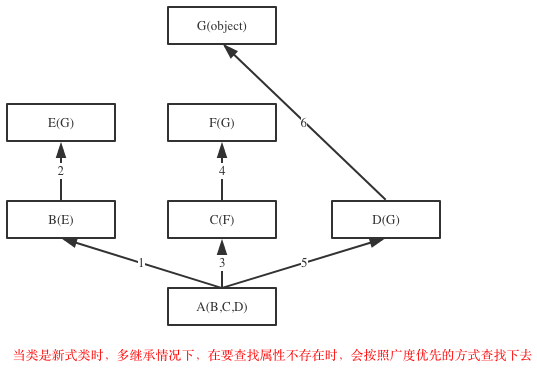

chapter07-面向对象之继承与派生


### **一 初识继承**

**什么是继承**

*继承是一种创建新类的方式，新建的类可以继承一个或多个父类（python支持多继承），父类又可称为基类或超类，新建的类称为派生类或子类。*

*子类会“”遗传”父类的属性，从而解决代码重用问题（比如练习7中Garen与Riven类有很多冗余的代码）*

**python中类的继承分为：单继承和多继承**

```python
class ParentClass1: #定义父类
    pass

class ParentClass2: #定义父类
    pass

class SubClass1(ParentClass1): #单继承，基类是ParentClass1，派生类是SubClass
    pass

class SubClass2(ParentClass1,ParentClass2): #python支持多继承，用逗号分隔开多个继承的类
    pass
```


**查看继承**

```python
>>> SubClass1.__bases__ #__base__只查看从左到右继承的第一个子类，__bases__则是查看所有继承的父类
(<class '__main__.ParentClass1'>,)
>>> SubClass2.__bases__
(<class '__main__.ParentClass1'>, <class '__main__.ParentClass2'>)
```

**经典类与新式类**

```python
1.只有在python2中才分新式类和经典类，python3中统一都是新式类
2.在python2中，没有显式的继承object类的类，以及该类的子类，都是经典类
3.在python2中，显式地声明继承object的类，以及该类的子类，都是新式类
3.在python3中，无论是否继承object，都默认继承object，即python3中所有类均为新式类
#关于新式类与经典类的区别，我们稍后讨论
```

**提示：如果没有指定基类，python的类会默认继承object类，object是所有python类的基类，它提供了一些常见方法（如__str__）的实现。**

```python
>>> ParentClass1.__bases__
(<class 'object'>,)
>>> ParentClass2.__bases__
(<class 'object'>,)
```


### **二 继承与抽象（先抽象再继承）**

**继承描述的是子类与父类之间的关系，是一种什么是什么的关系。要找出这种关系，必须先抽象再继承**

抽象即抽取类似或者说比较像的部分。

抽象分成两个层次： 

1.将奥巴马和梅西这俩对象比较像的部分抽取成类； 

2.将人，猪，狗这三个类比较像的部分抽取成父类。

抽象最主要的作用是划分类别（可以隔离关注点，降低复杂度）

 

**继承：是基于抽象的结果，通过编程语言去实现它，肯定是先经历抽象这个过程，才能通过继承的方式去表达出抽象的结构。**

抽象只是分析和设计的过程中，一个动作或者说一种技巧，通过抽象可以得到类


 


### 三 继承与重用性

使用继承来重用代码比较好的例子

```
==========================第一部分
例如

　　猫可以：喵喵叫、吃、喝、拉、撒

　　狗可以：汪汪叫、吃、喝、拉、撒

如果我们要分别为猫和狗创建一个类，那么就需要为 猫 和 狗 实现他们所有的功能，伪代码如下：
 

#猫和狗有大量相同的内容
class 猫：

    def 喵喵叫(self):
        print '喵喵叫'

    def 吃(self):
        # do something

    def 喝(self):
        # do something

    def 拉(self):
        # do something

    def 撒(self):
        # do something

class 狗：

    def 汪汪叫(self):
        print '喵喵叫'

    def 吃(self):
        # do something

    def 喝(self):
        # do something

    def 拉(self):
        # do something

    def 撒(self):
        # do something


==========================第二部分
上述代码不难看出，吃、喝、拉、撒是猫和狗都具有的功能，而我们却分别的猫和狗的类中编写了两次。如果使用 继承 的思想，如下实现：

　　动物：吃、喝、拉、撒

　　   猫：喵喵叫（猫继承动物的功能）

　　   狗：汪汪叫（狗继承动物的功能）

伪代码如下：
class 动物:

    def 吃(self):
        # do something

    def 喝(self):
        # do something

    def 拉(self):
        # do something

    def 撒(self):
        # do something

# 在类后面括号中写入另外一个类名，表示当前类继承另外一个类
class 猫(动物)：

    def 喵喵叫(self):
        print '喵喵叫'
        
# 在类后面括号中写入另外一个类名，表示当前类继承另外一个类
class 狗(动物)：

    def 汪汪叫(self):
        print '喵喵叫'


==========================第三部分
#继承的代码实现
class Animal:

    def eat(self):
        print("%s 吃 " %self.name)

    def drink(self):
        print ("%s 喝 " %self.name)

    def shit(self):
        print ("%s 拉 " %self.name)

    def pee(self):
        print ("%s 撒 " %self.name)


class Cat(Animal):

    def __init__(self, name):
        self.name = name
        self.breed = '猫'

    def cry(self):
        print('喵喵叫')

class Dog(Animal):

    def __init__(self, name):
        self.name = name
        self.breed='狗'

    def cry(self):
        print('汪汪叫')


# ######### 执行 #########

c1 = Cat('小白家的小黑猫')
c1.eat()

c2 = Cat('小黑的小白猫')
c2.drink()

d1 = Dog('胖子家的小瘦狗')
d1.eat()
```

[](javascript:void(0);)

 在开发程序的过程中，如果我们定义了一个类A，然后又想新建立另外一个类B，但是类B的大部分内容与类A的相同时

我们不可能从头开始写一个类B，这就用到了类的继承的概念。

通过继承的方式新建类B，让B继承A，B会‘遗传’A的所有属性(数据属性和函数属性)，实现代码重用


[](javascript:void(0);)

```python
class Hero:
    def __init__(self,nickname,aggressivity,life_value):
        self.nickname=nickname
        self.aggressivity=aggressivity
        self.life_value=life_value

    def move_forward(self):
        print('%s move forward' %self.nickname)

    def move_backward(self):
        print('%s move backward' %self.nickname)

    def move_left(self):
        print('%s move forward' %self.nickname)

    def move_right(self):
        print('%s move forward' %self.nickname)

    def attack(self,enemy):
        enemy.life_value-=self.aggressivity
class Garen(Hero):
    pass

class Riven(Hero):
    pass

g1=Garen('草丛伦',100,300)
r1=Riven('锐雯雯',57,200)

print(g1.life_value)
r1.attack(g1)
print(g1.life_value)

'''
运行结果
243
'''
```


提示：用已经有的类建立一个新的类，这样就重用了已经有的软件中的一部分设置大部分，大大生了编程工作量，这就是常说的软件重用，不仅可以重用自己的类，也可以继承别人的，比如标准库，来定制新的数据类型，这样就是大大缩短了软件开发周期，对大型软件开发来说，意义重大.

注意：像g1.life_value之类的属性引用，会先从实例中找life_value然后去类中找，然后再去父类中找...直到最顶级的父类。

**重点！！！：再看属性查找**

```python
class Foo:
    def f1(self):
        print('Foo.f1')

    def f2(self):
        print('Foo.f2')
        self.f1()

class Bar(Foo):
    def f1(self):
        print('Foo.f1')


b=Bar()
b.f2()
```


### 四 派生

当然子类也可以添加自己新的属性或者在自己这里重新定义这些属性（不会影响到父类），需要注意的是，一旦重新定义了自己的属性且与父类重名，那么调用新增的属性时，就以自己为准了。

```python
class Riven(Hero):
    camp='Noxus'
    def attack(self,enemy): #在自己这里定义新的attack,不再使用父类的attack,且不会影响父类
        print('from riven')
    def fly(self): #在自己这里定义新的
        print('%s is flying' %self.nickname)
```

在子类中，新建的重名的函数属性，在编辑函数内功能的时候，有可能需要重用父类中重名的那个函数功能，应该是用调用普通函数的方式，即：类名.func()，此时就与调用普通函数无异了，因此即便是self参数也要为其传值

```python
class Riven(Hero):
    camp='Noxus'
    def __init__(self,nickname,aggressivity,life_value,skin):
        Hero.__init__(self,nickname,aggressivity,life_value) #调用父类功能
        self.skin=skin #新属性
    def attack(self,enemy): #在自己这里定义新的attack,不再使用父类的attack,且不会影响父类
        Hero.attack(self,enemy) #调用功能
        print('from riven')
    def fly(self): #在自己这里定义新的
        print('%s is flying' %self.nickname)

r1=Riven('锐雯雯',57,200,'比基尼')
r1.fly()
print(r1.skin)

'''
运行结果
锐雯雯 is flying
比基尼

'''
```


### 五 组合与重用性

**软件重用的重要方式除了继承之外还有另外一种方式，即：组合**

**组合指的是，在一个类中以另外一个类的对象作为数据属性，称为类的组合**


```python
>>> class Equip: #武器装备类
...     def fire(self):
...         print('release Fire skill')
... 
>>> class Riven: #英雄Riven的类,一个英雄需要有装备,因而需要组合Equip类
...     camp='Noxus'
...     def __init__(self,nickname):
...         self.nickname=nickname
...         self.equip=Equip() #用Equip类产生一个装备,赋值给实例的equip属性
... 
>>> r1=Riven('锐雯雯')
>>> r1.equip.fire() #可以使用组合的类产生的对象所持有的方法
release Fire skill
```


**组合与继承都是有效地利用已有类的资源的重要方式。但是二者的概念和使用场景皆不同，**

**1.继承的方式**

**通过继承建立了派生类与基类之间的关系，它是一种'是'的关系，比如白马是马，人是动物。**

**当类之间有很多相同的功能，提取这些共同的功能做成基类，用继承比较好，比如老师是人，学生是人**

**2.组合的方式**

**用组合的方式建立了类与组合的类之间的关系，它是一种‘有’的关系,比如教授有生日，教授教python和linux课程，教授有学生s1、s2、s3...**

例子：继承与组合

```python
class People:
    def __init__(self,name,age,sex):
        self.name=name
        self.age=age
        self.sex=sex

class Course:
    def __init__(self,name,period,price):
        self.name=name
        self.period=period
        self.price=price
    def tell_info(self):
        print('<%s %s %s>' %(self.name,self.period,self.price))

class Teacher(People):
    def __init__(self,name,age,sex,job_title):
        People.__init__(self,name,age,sex)
        self.job_title=job_title
        self.course=[]
        self.students=[]


class Student(People):
    def __init__(self,name,age,sex):
        People.__init__(self,name,age,sex)
        self.course=[]


egon=Teacher('egon',18,'male','沙河霸道金牌讲师')
s1=Student('牛榴弹',18,'female')

python=Course('python','3mons',3000.0)
linux=Course('python','3mons',3000.0)

#为老师egon和学生s1添加课程
egon.course.append(python)
egon.course.append(linux)
s1.course.append(python)

#为老师egon添加学生s1
egon.students.append(s1)


#使用
for obj in egon.course:
    obj.tell_info()
```

**当类之间有显著不同，并且较小的类是较大的类所需要的组件时，用组合比较好**


### **六 接口与归一化设计**

**1.什么是接口**

java中的interface

```python
=================第一部分：Java 语言中的接口很好的展现了接口的含义: IAnimal.java
/*
* Java的Interface接口的特征:
* 1)是一组功能的集合,而不是一个功能
* 2)接口的功能用于交互,所有的功能都是public,即别的对象可操作
* 3)接口只定义函数,但不涉及函数实现
* 4)这些功能是相关的,都是动物相关的功能,但光合作用就不适宜放到IAnimal里面了 */

package com.oo.demo;
public interface IAnimal {
    public void eat();
    public void run(); 
    public void sleep(); 
    public void speak();
}

=================第二部分：Pig.java：猪”的类设计,实现了IAnnimal接口 
package com.oo.demo;
public class Pig implements IAnimal{ //如下每个函数都需要详细实现
    public void eat(){
        System.out.println("Pig like to eat grass");
    }

    public void run(){
        System.out.println("Pig run: front legs, back legs");
    }

    public void sleep(){
        System.out.println("Pig sleep 16 hours every day");
    }

    public void speak(){
        System.out.println("Pig can not speak"); }
}

=================第三部分：Person2.java
/*
*实现了IAnimal的“人”,有几点说明一下: 
* 1)同样都实现了IAnimal的接口,但“人”和“猪”的实现不一样,为了避免太多代码导致影响阅读,这里的代码简化成一行,但输出的内容不一样,实际项目中同一接口的同一功能点,不同的类实现完全不一样
* 2)这里同样是“人”这个类,但和前面介绍类时给的类“Person”完全不一样,这是因为同样的逻辑概念,在不同的应用场景下,具备的属性和功能是完全不一样的 */

package com.oo.demo;
public class Person2 implements IAnimal { 
    public void eat(){
        System.out.println("Person like to eat meat");
    }

    public void run(){
        System.out.println("Person run: left leg, right leg");
    }

    public void sleep(){
        System.out.println("Person sleep 8 hours every dat"); 
    }

    public void speak(){
        System.out.println("Hellow world, I am a person");
    } 
}

=================第四部分：Tester03.java
package com.oo.demo;

public class Tester03 {
    public static void main(String[] args) {
        System.out.println("===This is a person==="); 
        IAnimal person = new Person2();
        person.eat();
        person.run();
        person.sleep();
        person.speak();
        
        System.out.println("\n===This is a pig===");
        IAnimal pig = new Pig();
        pig.eat();
        pig.run();
        pig.sleep();
        pig.speak();
    } 
}
```


PS:hi boy，给我开个查询接口。。。此时的接口指的是：自己提供给使用者来调用自己功能的方式\方法\入口

**2. 为何要用接口**

接口提取了一群类共同的函数，可以把接口当做一个函数的集合。

然后让子类去实现接口中的函数。

这么做的意义在于归一化，什么叫归一化，就是只要是基于同一个接口实现的类，那么所有的这些类产生的对象在使用时，从用法上来说都一样。

 

归一化的好处在于：

\1. 归一化让使用者无需关心对象的类是什么，只需要的知道这些对象都具备某些功能就可以了，这极大地降低了使用者的使用难度。

\2. 归一化使得高层的外部使用者可以不加区分的处理所有接口兼容的对象集合

2.1：就好象linux的泛文件概念一样，所有东西都可以当文件处理，不必关心它是内存、磁盘、网络还是屏幕（当然，对底层设计者，当然也可以区分出“字符设备”和“块设备”，然后做出针对性的设计：细致到什么程度，视需求而定）。

2.2：再比如：我们有一个汽车接口，里面定义了汽车所有的功能，然后由本田汽车的类，奥迪汽车的类，大众汽车的类，他们都实现了汽车接口，这样就好办了，大家只需要学会了怎么开汽车，那么无论是本田，还是奥迪，还是大众我们都会开了，开的时候根本无需关心我开的是哪一类车，操作手法（函数调用）都一样

**3. 模仿interface**

在python中根本就没有一个叫做interface的关键字，如果非要去模仿接口的概念

可以借助第三方模块：

<http://pypi.python.org/pypi/zope.interface>

[twisted](http://blog.csdn.net/hanhuili/article/details/9389433)的twisted\internet\interface.py里使用zope.interface

文档https://zopeinterface.readthedocs.io/en/latest/

设计模式：https://github.com/faif/python-patterns

 

也可以使用继承： 

继承的两种用途

一：继承基类的方法，并且做出自己的改变或者扩展（代码重用）：实践中，继承的这种用途意义并不很大，甚至常常是有害的。因为它使得子类与基类出现强耦合。

二：声明某个子类兼容于某基类，定义一个接口类（模仿java的Interface），接口类中定义了一些接口名（就是函数名）且并未实现接口的功能，子类继承接口类，并且实现接口中的功能

```python
class Interface:#定义接口Interface类来模仿接口的概念，python中压根就没有interface关键字来定义一个接口。
    def read(self): #定接口函数read
        pass

    def write(self): #定义接口函数write
        pass


class Txt(Interface): #文本，具体实现read和write
    def read(self):
        print('文本数据的读取方法')

    def write(self):
        print('文本数据的读取方法')

class Sata(Interface): #磁盘，具体实现read和write
    def read(self):
        print('硬盘数据的读取方法')

    def write(self):
        print('硬盘数据的读取方法')

class Process(Interface):
    def read(self):
        print('进程数据的读取方法')

    def write(self):
        print('进程数据的读取方法')
```

上面的代码只是看起来像接口，其实并没有起到接口的作用，子类完全可以不用去实现接口 ，这就用到了抽象类


### 七 抽象类

**1 什么是抽象类**

​    *与java一样，python也有抽象类的概念但是同样需要借助模块实现，\**抽象类是一个特殊的类，它的特殊之处在于只能被继承，不能被实例化***

**2 为什么要有抽象类**

​    *如果说\**类是从**一堆**对象**中抽取相同的内容而来的，那么**抽象类**就**是从**一堆**类**中抽取相同的内容而来的，内容包括数据属性和函数属性。*

　 *比如我们有香蕉的类，有苹果的类，有桃子的类，从这些类抽取相同的内容就是水果这个抽象的类，你吃水果时，要么是吃一个具体的香蕉，要么是吃一个具体的桃子。。。。。。你永远无法吃到一个叫做水果的东西。*

​    *从设计角度去看，如果类是从现实对象抽象而来的，那么抽象类就是基于类抽象而来的。*

　 *从实现角度来看，抽象类与普通类的不同之处在于：抽象类中只能有抽象方法（没有实现功能），该类不能被实例化，只能被继承，且子类必须实现抽象方法。这一点与接口有点类似，但其实是不同的，即将揭晓答案*

**3. 在python中实现抽象类**

```python
#_*_coding:utf-8_*_
__author__ = 'Linhaifeng'
#一切皆文件
import abc #利用abc模块实现抽象类

class All_file(metaclass=abc.ABCMeta):
    all_type='file'
    @abc.abstractmethod #定义抽象方法，无需实现功能
    def read(self):
        '子类必须定义读功能'
        pass

    @abc.abstractmethod #定义抽象方法，无需实现功能
    def write(self):
        '子类必须定义写功能'
        pass

# class Txt(All_file):
#     pass
#
# t1=Txt() #报错,子类没有定义抽象方法

class Txt(All_file): #子类继承抽象类，但是必须定义read和write方法
    def read(self):
        print('文本数据的读取方法')

    def write(self):
        print('文本数据的读取方法')

class Sata(All_file): #子类继承抽象类，但是必须定义read和write方法
    def read(self):
        print('硬盘数据的读取方法')

    def write(self):
        print('硬盘数据的读取方法')

class Process(All_file): #子类继承抽象类，但是必须定义read和write方法
    def read(self):
        print('进程数据的读取方法')

    def write(self):
        print('进程数据的读取方法')

wenbenwenjian=Txt()

yingpanwenjian=Sata()

jinchengwenjian=Process()

#这样大家都是被归一化了,也就是一切皆文件的思想
wenbenwenjian.read()
yingpanwenjian.write()
jinchengwenjian.read()

print(wenbenwenjian.all_type)
print(yingpanwenjian.all_type)
print(jinchengwenjian.all_type)
```


**4. 抽象类与接口**

*抽象类的本质还是类，指的是一组类的相似性，包括数据属性（如all_type）和函数属性（如read、write），而接口只强调函数属性的相似性。*

**\*抽象类是一个介于类和接口直接的一个概念，同时具备类和接口的部分特性，可以用来实现归一化设计*** 


### 八 **继承实现的原理（可恶的菱形问题）**

**1 继承顺序**

在Java和C#中子类只能继承一个父类，而Python中子类可以同时继承多个父类，如A(B,C,D)

如果继承关系为非菱形结构，则会按照先找B这一条分支，然后再找C这一条分支，最后找D这一条分支的顺序直到找到我们想要的属性

如果继承关系为菱形结构，那么属性的查找方式有两种，分别是：深度优先和广度优先





```python
class A(object):
    def test(self):
        print('from A')

class B(A):
    def test(self):
        print('from B')

class C(A):
    def test(self):
        print('from C')

class D(B):
    def test(self):
        print('from D')

class E(C):
    def test(self):
        print('from E')

class F(D,E):
    # def test(self):
    #     print('from F')
    pass
f1=F()
f1.test()
print(F.__mro__) #只有新式才有这个属性可以查看线性列表，经典类没有这个属性

#新式类继承顺序:F->D->B->E->C->A
#经典类继承顺序:F->D->B->A->E->C
#python3中统一都是新式类
#pyhon2中才分新式类与经典类

继承顺序
```


**2 继承原理（python如何实现的继承）**

python到底是如何实现继承的，对于你定义的每一个类，python会计算出一个方法解析顺序(MRO)列表，这个MRO列表就是一个简单的所有基类的线性顺序列表，例如

```python
>>> F.mro() #等同于F.__mro__
[<class '__main__.F'>, <class '__main__.D'>, <class '__main__.B'>, <class '__main__.E'>, <class '__main__.C'>, <class '__main__.A'>, <class 'object'>]
```

 

为了实现继承,python会在MRO列表上从左到右开始查找基类,直到找到第一个匹配这个属性的类为止。
而这个MRO列表的构造是通过一个C3线性化算法来实现的。我们不去深究这个算法的数学原理,它实际上就是合并所有父类的MRO列表并遵循如下三条准则:
1.子类会先于父类被检查
2.多个父类会根据它们在列表中的顺序被检查
3.如果对下一个类存在两个合法的选择,选择第一个父类


### 九 子类中调用父类的方法

方法一：指名道姓，即父类名.父类方法()

```python
#_*_coding:utf-8_*_
__author__ = 'Linhaifeng'

class Vehicle: #定义交通工具类
     Country='China'
     def __init__(self,name,speed,load,power):
         self.name=name
         self.speed=speed
         self.load=load
         self.power=power

     def run(self):
         print('开动啦...')

class Subway(Vehicle): #地铁
    def __init__(self,name,speed,load,power,line):
        Vehicle.__init__(self,name,speed,load,power)
        self.line=line

    def run(self):
        print('地铁%s号线欢迎您' %self.line)
        Vehicle.run(self)

line13=Subway('中国地铁','180m/s','1000人/箱','电',13)
line13.run()
```


方法二：super()

```python
class Vehicle: #定义交通工具类
     Country='China'
     def __init__(self,name,speed,load,power):
         self.name=name
         self.speed=speed
         self.load=load
         self.power=power

     def run(self):
         print('开动啦...')

class Subway(Vehicle): #地铁
    def __init__(self,name,speed,load,power,line):
        #super(Subway,self) 就相当于实例本身 在python3中super()等同于super(Subway,self)
        super().__init__(name,speed,load,power)
        self.line=line

    def run(self):
        print('地铁%s号线欢迎您' %self.line)
        super(Subway,self).run()

class Mobike(Vehicle):#摩拜单车
    pass

line13=Subway('中国地铁','180m/s','1000人/箱','电',13)
line13.run()
```


**强调：二者使用哪一种都可以，但最好不要混合使用** 

 

了解部分：

即使没有直接继承关系，super仍然会按照mro继续往后查找

```python
#A没有继承B,但是A内super会基于C.mro()继续往后找
class A:
    def test(self):
        super().test()
class B:
    def test(self):
        print('from B')
class C(A,B):
    pass

c=C()
c.test() #打印结果:from B


print(C.mro())
#[<class '__main__.C'>, <class '__main__.A'>, <class '__main__.B'>, <class 'object'>]
```


指名道姓与super()的区别

```python
#指名道姓
class A:
    def __init__(self):
        print('A的构造方法')
class B(A):
    def __init__(self):
        print('B的构造方法')
        A.__init__(self)


class C(A):
    def __init__(self):
        print('C的构造方法')
        A.__init__(self)


class D(B,C):
    def __init__(self):
        print('D的构造方法')
        B.__init__(self)
        C.__init__(self)

    pass
f1=D() #A.__init__被重复调用
'''
D的构造方法
B的构造方法
A的构造方法
C的构造方法
A的构造方法
'''


#使用super()
class A:
    def __init__(self):
        print('A的构造方法')
class B(A):
    def __init__(self):
        print('B的构造方法')
        super(B,self).__init__()


class C(A):
    def __init__(self):
        print('C的构造方法')
        super(C,self).__init__()


class D(B,C):
    def __init__(self):
        print('D的构造方法')
        super(D,self).__init__()

f1=D() #super()会基于mro列表,往后找
'''
D的构造方法
B的构造方法
C的构造方法
A的构造方法
'''
```


*当你使用super()函数时,Python会在MRO列表上继续搜索下一个类。只要每个重定义的方法统一使用super()并只调用它一次,那么控制流最终会遍历完整个MRO列表,每个方法也只会被调用一次（\**注意注意注意：使用super调用的所有属性，都是从MRO列表当前的位置往后找，千万不要通过看代码去找继承关系，一定要看MRO列表**）*

 