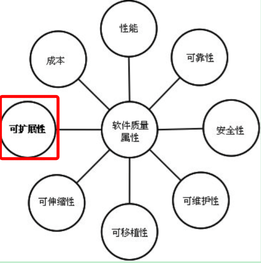
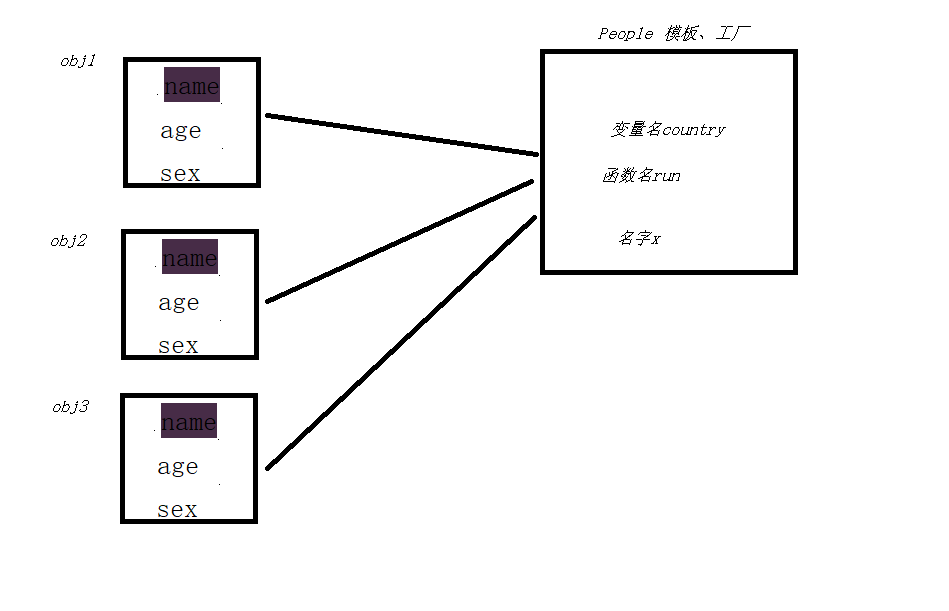

chapter07-面向对象的程序设计

上节回顾

p1.Age 的本质，是以字符串Age作为key，去p1.__dict__中找对应的value


**绑定方法**

类调用自己的函数，就是在调用普通的函数。

对象调用绑定方法的时候，就把自己当做第一个参数传进去。谁绑定的，就给谁去用。


只要定义在类内部的，由对象触发执行的函数，都算调用绑定方法。调用绑定方法，会将self自动传值。

定义在类内部的变量，是所有对象共有的，id全一样。

定义在类内部的函数，是绑定到所有对象的，给对象来用。obj.func()会把obj本身当做第一个参数传进去。

```python


p1 = Chinese('Amy','18','female')

Chinese类实例化时，就会有Chinese.__init__(p1,'Amy','18','female')自动传值的过程
```


# 一、面向对象的程序设计的由来

[面向对象设计的由来见概述：http://www.cnblogs.com/linhaifeng/articles/6428835.html](http://www.cnblogs.com/linhaifeng/articles/6428835.html)


# 二、什么是面向对象的程序设计及为什么要有它

面向过程的程序设计：核心是过程二字，过程指的是解决问题的步骤，即先干什么再干什么......面向过程的设计就好比精心设计好一条流水线，是一种机械式的思维方式。

**优点是：复杂度的问题流程化，进而简单化（一个复杂的问题，分成一个个小的步骤去实现，实现小的步骤将会非常简单）**

**缺点是：一套流水线或者流程就是用来解决一个问题，生产汽水的流水线无法生产汽车，即便是能，也得是大改，改一个组件，牵一发而动全身。**

应用场景：一旦完成基本很少改变的场景，著名的例子有Linux內核，git，以及Apache HTTP Server等。

 

面向对象的程序设计：核心是对象二字，（要理解对象为何物，必须把自己当成上帝，上帝眼里世间存在的万物皆为对象，不存在的也可以创造出来。面向对象的程序设计好比如来设计西游记，如来要解决的问题是把经书传给东土大唐，如来想了想解决这个问题需要四个人：唐僧，沙和尚，猪八戒，孙悟空，每个人都有各自的特征和技能（这就是对象的概念，特征和技能分别对应对象的数据属性和方法属性），然而这并不好玩，于是如来又安排了一群妖魔鬼怪，为了防止师徒四人在取经路上被搞死，又安排了一群神仙保驾护航，这些都是对象。然后取经开始，师徒四人与妖魔鬼怪神仙交互着直到最后取得真经。如来根本不会管师徒四人按照什么流程去取),对象是特征与技能的结合体，基于面向对象设计程序就好比在创造一个世界，你就是这个世界的上帝，存在的皆为对象，不存在的也可以创造出来，与面向过程机械式的思维方式形成鲜明对比，面向对象更加注重对现实世界的模拟，是一种“上帝式”的思维方式。

优点是：解决了程序的扩展性。对某一个对象单独修改，会立刻反映到整个体系中，如对游戏中一个人物参数的特征和技能修改都很容易。

缺点：

1. 编程的复杂度远高于面向过程，不了解面向对象而立即上手基于它设计程序，极容易出现过度设计的问题。一些扩展性要求低的场景使用面向对象会徒增编程难度，比如管理linux系统的shell脚本就不适合用面向对象去设计，面向过程反而更加适合。

2. 无法向面向过程的程序设计流水线式的可以很精准的预测问题的处理流程与结果，面向对象的程序一旦开始就由对象之间的交互解决问题，即便是上帝也无法准确地预测最终结果。于是我们经常看到对战类游戏，新增一个游戏人物，在对战的过程中极容易出现阴霸的技能，一刀砍死3个人，这种情况是无法准确预知的，只有对象之间交互才能准确地知道最终的结果。

应用场景：需求经常变化的软件，一般需求的变化都集中在用户层，互联网应用，企业内部软件，游戏等都是面向对象的程序设计大显身手的好地方

面向对象的程序设计并不是全部。对于一个软件质量来说，面向对象的程序设计只是用来解决扩展性。



[选读：程序设计思想发展史](http://www.cnblogs.com/linhaifeng/articles/6428835.html)

# 三、类与对象

类即类别、种类，是面向对象设计最重要的概念，对象是特征与技能的结合体，而类则是一系列对象相似的特征与技能的结合体。

那么问题来了，现有对象还是现有类？这个问题需要分两种情况去看

**在现实世界中：先有对象，再有类**

世界上肯定是先出现各种各样的实际存在的物体，然后随着人类文明的发展，人类站在不同的角度总结出了不同的种类，如人类、动物类、植物类等概念

也就说，对象是具体的存在，而类仅仅只是一个概念，并不真实存在

**在程序中：务必保证先定义类，后产生对象**

这与函数的使用是类似的，先定义函数，后调用函数。类也是一样的，在程序中需要先定义类，后调用类

不一样的是，调用函数会执行函数体代码，返回的是函数体执行的结果。而调用类会产生对象，返回的是对象


按照上述步骤，我们来定义一个类

```python
#在现实世界中，先有对象，再有类
对象1：张三
    特征:
        国籍=中国
        姓名=张三
        性别=女
        年龄=18
    技能：
        说汉语
        吃饭
        睡觉

对象2：李四
    特征:
        国籍=中国
        姓名=李四
        性别=男
        年龄=28
    技能：
        说汉语
        吃饭
        睡觉

现实中的中国人类
    相似的特征:
        国籍=中国
    相似的技能：
        说汉语
        吃饭
        睡觉
```


```python
#在程序中，务必保证：先定义（类），后使用（产生对象）
PS:
  1. 在程序中特征用变量标识，技能用函数标识
  2. 因而类中最常见的无非是：变量和函数的定义

#程序中的类
class Chinese:
    country = "China"
    def __init__()
    def speak(self):
        print("is speaking Chinese")

    def eat(self):
        print('is eating')

    def sleep(self):
        print('is sleeping')


#注意：
  1.类中可以有任意python代码，这些代码在类定义阶段便会执行
  2.因而会产生新的名称空间，用来存放类的变量名与函数名，可以通过OldboyStudent.__dict__查看
  3.对于经典类来说我们可以通过该字典操作类名称空间的名字（新式类有限制），但python为我们提供专门的.语法
  4.点是访问属性的语法，类中定义的名字（变量名、函数名），都是类的属性


#程序中类的用法
.:专门用来访问属性，本质操作的就是__dict__
Chinese.school #等于经典类的操作 Chinese.__dict__['school']
Chinese.school='Oldboy' #等于经典类的操作 Chinese.__dict__['school']='Oldboy'
Chinese.x=1 #等于经典类的操作 Chinese.__dict__['x']=1
del Chinese.x #等于经典类的操作 Chinese.__dict__.pop('x')


#程序中的对象
#调用类，或称为实例化，得到对象
c1=Chinese()
c2=Chinese()


#如此，c1、c2都一样了，而这两者者除了相似的属性之外还各种不同的属性，这就用到了__init__
#注意：该方法在对象产生之后才会执行，只用来为对象进行初始化操作，可以有任意代码，但一定不能有返回值
class Chinese:
    def __init__(self,name,age,sex):
        self.name=name
        self.age=age
        self.sex=sex

c1=Chinese('张三','女',18) #先调用类产生空对象c1，然后调用 Chinese.__init__(s1,'张三','女',18)
c2=Chinese('李四','男',28)


#程序中对象的用法
#执行__init__时,c1.name='张三'，很明显也会产生对象的名称空间
c1.__dict__
{'name': '张三', 'age': 18, 'sex': '女'}

c1.name #c1.__dict__['name']
c1.name='王五' #c1.__dict__['name']='王五'
c1.course='python' #c1.__dict__['course']='python'
del c1.course #c1.__dict__.pop('course')
```


 **！！！细说__init__方法！！！**

```python
#方式一、为对象初始化自己独有的特征
class People:
    country='China'
    x=1
    def run(self):
        print('----->', self)

# 实例化出三个空对象
obj1=People()
obj2=People()
obj3=People()

# 为对象定制自己独有的特征
obj1.name='egon'
obj1.age=18
obj1.sex='male'

obj2.name='lxx'
obj2.age=38
obj2.sex='female'

obj3.name='alex'
obj3.age=38
obj3.sex='female'

# print(obj1.__dict__)
# print(obj2.__dict__)
# print(obj3.__dict__)
# print(People.__dict__)


#方式二、为对象初始化自己独有的特征
class People:
    country='China'
    x=1
    def run(self):
        print('----->', self)

# 实例化出三个空对象
obj1=People()
obj2=People()
obj3=People()

# 为对象定制自己独有的特征
def chu_shi_hua(obj, x, y, z): #obj=obj1,x='egon',y=18,z='male'
    obj.name = x
    obj.age = y
    obj.sex = z

chu_shi_hua(obj1,'egon',18,'male')
chu_shi_hua(obj2,'lxx',38,'female')
chu_shi_hua(obj3,'alex',38,'female')


#方式三、为对象初始化自己独有的特征
class People:
    country='China'
    x=1

    def chu_shi_hua(obj, x, y, z): #obj=obj1,x='egon',y=18,z='male'
        obj.name = x
        obj.age = y
        obj.sex = z

    def run(self):
        print('----->', self)


obj1=People()
# print(People.chu_shi_hua)
People.chu_shi_hua(obj1,'egon',18,'male')

obj2=People()
People.chu_shi_hua(obj2,'lxx',38,'female')

obj3=People()
People.chu_shi_hua(obj3,'alex',38,'female')


# 方式四、为对象初始化自己独有的特征
class People:
    country='China'
    x=1

    def __init__(obj, x, y, z): #obj=obj1,x='egon',y=18,z='male'
        obj.name = x
        obj.age = y
        obj.sex = z

    def run(self):
        print('----->', self)

obj1=People('egon',18,'male') #People.__init__(obj1,'egon',18,'male')
obj2=People('lxx',38,'female') #People.__init__(obj2,'lxx',38,'female')
obj3=People('alex',38,'female') #People.__init__(obj3,'alex',38,'female')


# __init__方法
# 强调：
#   1、该方法内可以有任意的python代码
#   2、一定不能有返回值
class People:
    country='China'
    x=1

    def __init__(obj, name, age, sex): #obj=obj1,x='egon',y=18,z='male'
        # if type(name) is not str:
        #     raise TypeError('名字必须是字符串类型')
        obj.name = name
        obj.age = age
        obj.sex = sex


    def run(self):
        print('----->', self)


# obj1=People('egon',18,'male')
obj1=People(3537,18,'male')

# print(obj1.run)
# obj1.run() #People.run(obj1)
# print(People.run)
```

**PS：**

**1. 站的角度不同，定义出的类是截然不同的，详见面向对象实战之需求分析**

**2. 现实中的类并不完全等于程序中的类，比如现实中的公司类，在程序中有时需要拆分成部门类，业务类......** 

**3. 有时为了编程需求，程序中也可能会定义现实中不存在的类，比如策略类，现实中并不存在，但是在程序中却是一个很常见的类**

```python
#python为类内置的特殊属性(了解即可)
类名.__name__# 类的名字(字符串)
类名.__doc__# 类的文档字符串
类名.__base__# 类的第一个父类(在讲继承时会讲)
类名.__bases__# 类所有父类构成的元组(在讲继承时会讲)
类名.__dict__# 类的属性字典,或者说名称空间。
类名.__module__# 类定义所在的模块
类名.__class__# 实例对应的类(仅新式类中)
```

**！！！补充说明：从代码级别看面向对象 ！！！**

数据与专门操作该数据的功能组合到一起。

```python
#1、在没有学习类这个概念时，数据与功能是分离的
def exc1(host,port,db,charset):
    conn=connect(host,port,db,charset)
    conn.execute(sql)
    return xxx


def exc2(host,port,db,charset,proc_name)
    conn=connect(host,port,db,charset)
    conn.call_proc(sql)
    return xxx

#每次调用都需要重复传入一堆参数
exc1('127.0.0.1',3306,'db1','utf8','select * from tb1;')
exc2('127.0.0.1',3306,'db1','utf8','存储过程的名字')


#2、我们能想到的解决方法是，把这些变量都定义成全局变量
HOST=‘127.0.0.1’
PORT=3306
DB=‘db1’
CHARSET=‘utf8’

def exc1(host,port,db,charset):
    conn=connect(host,port,db,charset)
    conn.execute(sql)
    return xxx


def exc2(host,port,db,charset,proc_name)
    conn=connect(host,port,db,charset)
    conn.call_proc(sql)
    return xxx

exc1(HOST,PORT,DB,CHARSET,'select * from tb1;')
exc2(HOST,PORT,DB,CHARSET,'存储过程的名字')


#3、但是2的解决方法也是有问题的，按照2的思路，我们将会定义一大堆全局变量，这些全局变量并没有做任何区分，即能够被所有功能使用，然而事实上只有HOST，PORT，DB，CHARSET是给exc1和exc2这两个功能用的。言外之意：我们必须找出一种能够将数据与操作数据的方法组合到一起的解决方法，这就是我们说的类了

class MySQLHandler:
    def __init__(self,host,port,db,charset='utf8'):
        self.host=host
        self.port=port
        self.db=db
        self.charset=charset
    def exc1(self,sql):
        conn=connect(self.host,self.port,self.db,self.charset)
        res=conn.execute(sql)
        return res


    def exc2(self,sql):
        conn=connect(self.host,self.port,self.db,self.charset)
        res=conn.call_proc(sql)
        return res


obj=MySQLHandler('127.0.0.1',3306,'db1')
obj.exc1('select * from tb1;')
obj.exc2('存储过程的名字')


#改进
class MySQLHandler:
    def __init__(self,host,port,db,charset='utf8'):
        self.host=host
        self.port=port
        self.db=db
        self.charset=charset
        self.conn=connect(self.host,self.port,self.db,self.charset)
    def exc1(self,sql):
        return self.conn.execute(sql)

    def exc2(self,sql):
        return self.conn.call_proc(sql)


obj=MySQLHandler('127.0.0.1',3306,'db1')
obj.exc1('select * from tb1;')
obj.exc2('存储过程的名字')
```

```python
# 每产生一个对象，会对应三个属性。
id 代表变量在内存中的位置(指向内存地址)
type
value 通过变量名访问变量的值。变量名绑定到

is 身份运算符，比较的是id是否相等。
== 判断值是否相等。
x=1
y=1
x,y的id相等，因为数字占用空间小，没必要再开空间存。
a=600
b=600
数字比较大时，就要重新开辟空间保存。

```


# 四、属性查找

类有两种属性：数据属性和函数属性

*1. 类的数据属性是所有对象共享的*

*2. 类的函数属性是绑定给对象用的*

```python
#类的数据属性是所有对象共享的,id都一样
print(id(OldboyStudent.school))

print(id(s1.school))
print(id(s2.school))
print(id(s3.school))

'''
4377347328
4377347328
4377347328
4377347328
'''

#类的函数属性是绑定给对象使用的,obj.method称为绑定方法,内存地址都不一样
#ps:id是python的实现机制,并不能真实反映内存地址,如果有内存地址,还是以内存地址为准
print(OldboyStudent.learn)
print(s1.learn)
print(s2.learn)
print(s3.learn)
'''
<function OldboyStudent.learn at 0x1021329d8>
<bound method OldboyStudent.learn of <__main__.OldboyStudent object at 0x1021466d8>>
<bound method OldboyStudent.learn of <__main__.OldboyStudent object at 0x102146710>>
<bound method OldboyStudent.learn of <__main__.OldboyStudent object at 0x102146748>>
'''
```



在obj.name会先从obj自己的名称空间里找name，找不到则去类中找，类也找不到就找父类...最后都找不到就抛出异常  

**练习：编写一个学生类，产生一堆学生对象，要求有一个计数器（属性），统计总共实例了多少个对象** 


# 五、绑定到对象的方法的特殊之处

```python
#改写
class OldboyStudent:
    school='oldboy'
    def __init__(self,name,age,sex):
        self.name=name
        self.age=age
        self.sex=sex
    def learn(self):
        print('%s is learning' %self.name) #新增self.name

    def eat(self):
        print('%s is eating' %self.name)

    def sleep(self):
        print('%s is sleeping' %self.name)


s1=OldboyStudent('李坦克','男',18)
s2=OldboyStudent('王大炮','女',38)
s3=OldboyStudent('牛榴弹','男',78) 
```

类中定义的函数（没有被任何装饰器装饰的）是类的函数属性，类可以使用，但必须遵循函数的参数规则，有几个参数需要传几个参数

```python
OldboyStudent.learn(s1) #李坦克 is learning
OldboyStudent.learn(s2) #王大炮 is learning
OldboyStudent.learn(s3) #牛榴弹 is learning
```

类中定义的函数（没有被任何装饰器装饰的）,其实主要是给对象使用的，而且是绑定到对象的，虽然所有对象指向的都是相同的功能，但是绑定到不同的对象就是不同的绑定方法

强调：绑定到对象的方法的特殊之处在于，绑定给谁就由谁来调用，谁来调用，就会将‘谁’本身当做第一个参数传给方法，即自动传值（方法__init__也是一样的道理）

```python
s1.learn() #等同于OldboyStudent.learn(s1)
s2.learn() #等同于OldboyStudent.learn(s2)
s3.learn() #等同于OldboyStudent.learn(s3)
```

**注意：**

绑定到对象的方法的这种自动传值的特征，决定了在类中定义的函数都要默认写一个参数self，self可以是任意名字，但是约定俗成地写出self。 

**类即类型**

提示：python的class术语与c++有一定区别，与 Modula-3更像。

python中一切皆为对象，且python3中类与类型是一个概念，类型就是类

```python
#类型dict就是类dict
>>> list
<class 'list'>

#实例化的到3个对象l1,l2,l3
>>> l1=list()
>>> l2=list()
>>> l3=list()

#三个对象都有绑定方法append,是相同的功能,但内存地址不同
>>> l1.append
<built-in method append of list object at 0x10b482b48>
>>> l2.append
<built-in method append of list object at 0x10b482b88>
>>> l3.append
<built-in method append of list object at 0x10b482bc8>

#操作绑定方法l1.append(3),就是在往l1添加3,绝对不会将3添加到l2或l3
>>> l1.append(3)
>>> l1
[3]
>>> l2
[]
>>> l3
[]
#调用类list.append(l3,111)等同于l3.append(111)
>>> list.append(l3,111) #l3.append(111)
>>> l3
[111] 
```


# 六、对象之间的交互

```python
class Garen:        #定义英雄盖伦的类，不同的玩家可以用它实例出自己英雄;
    camp='Demacia'  #所有玩家的英雄(盖伦)的阵营都是Demacia;
    def __init__(self,nickname,aggressivity=58,life_value=455): #英雄的初始攻击力58...;
        self.nickname=nickname  #为自己的盖伦起个别名;
        self.aggressivity=aggressivity #英雄都有自己的攻击力;
        self.life_value=life_value #英雄都有自己的生命值;
    def attack(self,enemy):   #普通攻击技能，enemy是敌人;
        enemy.life_value-=self.aggressivity #根据自己的攻击力，攻击敌人就减掉敌人的生命值。
```

我们可以仿照garen类再创建一个Riven类

```python
class Riven:
    camp='Noxus'  #所有玩家的英雄(锐雯)的阵营都是Noxus;
    def __init__(self,nickname,aggressivity=54,life_value=414): #英雄的初始攻击力54;
        self.nickname=nickname  #为自己的锐雯起个别名;
        self.aggressivity=aggressivity #英雄都有自己的攻击力;
        self.life_value=life_value #英雄都有自己的生命值;
    def attack(self,enemy):   #普通攻击技能，enemy是敌人;
        enemy.life_value-=self.aggressivity #根据自己的攻击力，攻击敌人就减掉敌人的生命值。 
```

实例出俩英雄

```python
>>> g1=Garen('草丛伦')
>>> r1=Riven('锐雯雯')
```

交互：锐雯雯攻击草丛伦，反之一样

```python
>>> g1.life_value
455
>>> r1.attack(g1)
>>> g1.life_value
401 
```

补充：

　　garen_hero.Q()称为向garen_hero这个对象发送了一条消息，让他去执行Q这个功能，类似的有：

　　garen_hero.W()

　　garen_hero.E()

　　garen_hero.R()


### 七 练习

[**链接：http://www.cnblogs.com/linhaifeng/articles/7340497.html**](http://www.cnblogs.com/linhaifeng/articles/7340497.html)


### 八 继承与派生

[**链接：http://www.cnblogs.com/linhaifeng/articles/7340153.html**](http://www.cnblogs.com/linhaifeng/articles/7340153.html)


### 九 多态与多态性

[**链接：http://www.cnblogs.com/linhaifeng/articles/7340687.html**](http://www.cnblogs.com/linhaifeng/articles/7340687.html)


### 十 封装

**链接：http://www.cnblogs.com/linhaifeng/articles/7340801.html**


### 十一 绑定方法与非绑定方法

**链接：http://www.cnblogs.com/linhaifeng/articles/7341177.html**


# 十二、小白容易犯的错误

1.面向对象的程序设计看起来高大上，所以我在编程时就应该保证通篇class，这样写出的程序一定是好的程序（面向对象只适合那些可扩展性要求比较高的场景）

2.很多人喜欢说面向对象三大特性（这是从哪传出来的，封装，多态，继承？漏洞太多太多，好吧暂且称为三大特性），那么我在基于面向对象编程时，我一定要让我定义的类中完整的包含这三种特性，这样写肯定是好的程序

好家伙，我说降龙十八掌有十八掌，那么你每次跟人干仗都要从第一掌打到第18掌这才显得你会了是么：面对敌人，你打到第三掌对方就已经倒下了，你说，不行，你给老子起来，老子还没有show完...

3.类有类属性，实例有实例属性，所以我们在定义class时一定要定义出那么几个类属性，想不到怎么办，那就使劲的想，定义的越多越牛逼

这就犯了一个严重的错误，程序越早面向对象，死的越早，为啥面向对象，因为我们要将数据与功能结合到一起，程序整体的结构都没有出来，或者说需要考虑的问题你都没有搞清楚个八九不离十，你就开始面向对象了，这就导致了，你在那里干想，自以为想通了，定义了一堆属性，结果后来又都用不到，或者想不通到底应该定义啥，那就一直想吧，想着想着就疯了。

你见过哪家公司要开发一个软件，上来就开始写，肯定是频繁的开会讨论计划，请看第八节

4.既然这么麻烦，那么我彻底解脱了，我们不要用面向对象编程了，你啊，你有大才，你能成事啊，傻叉。


# 十三、python中关于OOP的常用术语

**抽象/实现**

抽象指对现实世界问题和实体的本质表现,行为和特征建模,建立一个相关的子集,可以用于 绘程序结构,从而实现这种模型。抽象不仅包括这种模型的数据属性,还定义了这些数据的接口。

对某种抽象的实现就是对此数据及与之相关接口的现实化(realization)。现实化这个过程对于客户 程序应当是透明而且无关的。 

**封装/接口**

封装描述了对数据/信息进行隐藏的观念,它对数据属性提供接口和访问函数。通过任何客户端直接对数据的访问,无视接口,与封装性都是背道而驰的,除非程序员允许这些操作。作为实现的 一部分,客户端根本就不需要知道在封装之后,数据属性是如何组织的。在Python中,所有的类属性都是公开的,但名字可能被“混淆”了,以阻止未经授权的访问,但仅此而已,再没有其他预防措施了。这就需要在设计时,对数据提供相应的接口,以免客户程序通过不规范的操作来存取封装的数据属性。

注意：封装绝不是等于“把不想让别人看到、以后可能修改的东西用private隐藏起来”

**真正的封装是，经过深入的思考，做出良好的抽象，给出“完整且最小”的接口，并使得内部细节可以对外透明**

**（注意：对外透明**的意思是**，**外部调用者可以顺利的得到自己想要的任何功能，**完全意识不到内部细节的存在）**

**合成**

合成扩充了对类的 述,使得多个不同的类合成为一个大的类,来解决现实问题。合成 述了 一个异常复杂的系统,比如一个类由其它类组成,更小的组件也可能是其它的类,数据属性及行为, 所有这些合在一起,彼此是“有一个”的关系。

**派生/继承/继承结构**

派生描述了子类衍生出新的特性,新类保留已存类类型中所有需要的数据和行为,但允许修改或者其它的自定义操作,都不会修改原类的定义。
继承描述了子类属性从祖先类继承这样一种方式
继承结构表示多“代”派生,可以述成一个“族谱”,连续的子类,与祖先类都有关系。

**泛化/特化**

基于继承
泛化表示所有子类与其父类及祖先类有一样的特点。
特化描述所有子类的自定义,也就是,什么属性让它与其祖先类不同。

**多态与多态性**

多态指的是同一种事物的多种状态：水这种事物有多种不同的状态：冰，水蒸气

多态性的概念指出了对象如何通过他们共同的属性和动作来操作及访问,而不需考虑他们具体的类。

冰，水蒸气，都继承于水，它们都有一个同名的方法就是变成云，但是冰.变云(),与水蒸气.变云()是截然不同的过程，虽然调用的方法都一样

**自省/反射**

自省也称作反射，这个性质展示了某对象是如何在运行期取得自身信息的。如果传一个对象给你,你可以查出它有什么能力,这是一项强大的特性。如果Python不支持某种形式的自省功能,dir和type内建函数,将很难正常工作。还有那些特殊属性,像__dict__,__name__及__doc__

 


### 十四 面向对象的软件开发

​    很多人在学完了python的class机制之后，遇到一个生产中的问题，还是会懵逼，这其实太正常了，因为任何程序的开发都是先设计后编程，python的class机制只不过是一种编程方式，如果你硬要拿着class去和你的问题死磕，变得更加懵逼都是分分钟的事，在以前，软件的开发相对简单，从任务的分析到编写程序，再到程序的调试，可以由一个人或一个小组去完成。但是随着软件规模的迅速增大，软件任意面临的问题十分复杂，需要考虑的因素太多，在一个软件中所产生的错误和隐藏的错误、未知的错误可能达到惊人的程度，这也不是在设计阶段就完全解决的。

​    所以软件的开发其实一整套规范，我们所学的只是其中的一小部分，一个完整的开发过程，需要明确每个阶段的任务，在保证一个阶段正确的前提下再进行下一个阶段的工作，称之为软件工程

​    面向对象的软件工程包括下面几个部：

**1.面向对象分析（object oriented analysis ，OOA）**

​    *软件工程中的系统分析阶段，要求分析员和用户结合在一起，对用户的需求做出精确的分析和明确的表述，从大的方面解析软件系统应该做什么，而不是怎么去做。面向对象的分析要按照面向对象的概念和方法，在对任务的分析中，从客观存在的事物和事物之间的关系，贵南出有关的对象（对象的‘特征’和‘技能’）以及对象之间的联系，并将具有相同属性和行为的对象用一个类class来标识。*

​    *建立一个能反映这是工作情况的需求模型，此时的模型是粗略的。*

**2 面向对象设计（object oriented design，OOD）**

​    *根据面向对象分析阶段形成的需求模型，对每一部分分别进行具体的设计。*

​    *首先是类的设计，类的设计可能包含多个层次（利用继承与派生机制）。然后以这些类为基础提出程序设计的思路和方法，包括对算法的设计。*

​    *在设计阶段并不牵涉任何一门具体的计算机语言，而是用一种更通用的描述工具（如伪代码或流程图）来描述*

**3 面向对象编程（object oriented programming，OOP）**

​    *根据面向对象设计的结果，选择一种计算机语言把它写成程序，可以是python*

**4 面向对象测试（object oriented test，OOT）**

​    *在写好程序后交给用户使用前，必须对程序进行严格的测试，测试的目的是发现程序中的错误并修正它。*

​    *面向对的测试是用面向对象的方法进行测试，以类作为测试的基本单元。*

**5 面向对象维护（object oriendted soft maintenance，OOSM）**

​    *正如对任何产品都需要进行售后服务和维护一样，软件在使用时也会出现一些问题，或者软件商想改进软件的性能，这就需要修改程序。*

​    *由于使用了面向对象的方法开发程序，使用程序的维护比较容易。*

​    *因为对象的封装性，修改一个对象对其他的对象影响很小，利用面向对象的方法维护程序，大大提高了软件维护的效率，可扩展性高。*

 

​    *在面向对象方法中，最早发展的肯定是面向对象编程(OOP),那时OOA和OOD都还没有发展起来，因此程序设计者为了写出面向对象的程序，还必须深入到分析和设计领域，尤其是设计领域，那时的OOP实际上包含了现在的OOD和OOP两个阶段，这对程序设计者要求比较高，许多人感到很难掌握。*

​    *现在设计一个大的软件，是严格按照面向对象软件工程的5个阶段进行的，这个5个阶段的工作不是由一个人从头到尾完成的，而是由不同的人分别完成，这样OOP阶段的任务就比较简单了。程序编写者只需要根据OOd提出的思路，用面向对象语言编写出程序既可。*


### 十五 面向对象实战

[**链接：http://www.cnblogs.com/linhaifeng/articles/7341318.html**](http://www.cnblogs.com/linhaifeng/articles/7341318.html)

 

本周作业

角色:学校、学员、课程、讲师
要求:
1. 创建北京、上海 2 所学校
2. 创建linux , python , go 3个课程 ， linux\py 在北京开， go 在上海开
3. 课程包含，周期，价格，通过学校创建课程 
4. 通过学校创建班级， 班级关联课程、讲师
5. 创建学员时，选择学校，关联班级
5. 创建讲师角色时要关联学校， 
6. 提供两个角色接口
6.1 学员视图， 可以注册， 交学费， 选择班级，
6.2 讲师视图， 讲师可管理自己的班级， 上课时选择班级， 查看班级学员列表 ， 修改所管理的学员的成绩 
6.3 管理视图，创建讲师， 创建班级，创建课程

\7. 上面的操作产生的数据都通过pickle序列化保存到文件里


