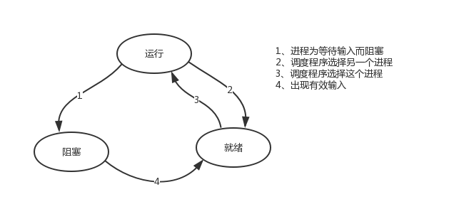

chapter13-协程

# 一、引子

​    本节的主题是基于单线程来实现并发，即只用一个主线程（很明显可利用的cpu只有一个）情况下实现并发，为此我们需要先回顾下并发的本质：切换+保存状态

​    cpu正在运行一个任务，会在两种情况下切走去执行其他的任务（切换由操作系统强制控制），一种情况是该任务发生了阻塞，另外一种情况是该任务计算的时间过长或有一个优先级更高的程序替代了它



ps：在介绍进程理论时，提及进程的三种执行状态，而线程才是执行单位，所以也可以将上图理解为线程的三种状态 

​    一：其中第二种情况并不能提升效率，只是为了让cpu能够雨露均沾，实现看起来所有任务都被“同时”执行的效果，如果多个任务都是纯计算的，这种切换反而会降低效率。为此我们可以基于yield来验证。yield本身就是一种在单线程下可以保存任务运行状态的方法，我们来简单复习一下：

```python
#1 yiled可以保存状态，yield的状态保存与操作系统的保存线程状态很像，但是yield是代码级别控制的，更轻量级
#2 send可以把一个函数的结果传给另外一个函数，以此实现单线程内程序之间的切换  
```


```python
# 单纯地切换反而会降低运行效率
'''
1、协程：
    单线程实现并发
    在应用程序里控制多个任务的切换+保存状态
    优点：
        应用程序级别速度要远远高于操作系统的切换
    缺点：
        多个任务一旦有一个阻塞没有切，整个线程都阻塞在原地
        该线程内的其他的任务都不能执行了

        一旦引入协程，就需要检测单线程下所有的IO行为,
        实现遇到IO就切换,少一个都不行，以为一旦一个任务阻塞了，整个线程就阻塞了，
        其他的任务即便是可以计算，但是也无法运行了

2、协程序的目的：
    想要在单线程下实现并发
    并发指的是多个任务看起来是同时运行的
    并发=切换+保存状态
'''

#串行执行
import time

def func1():
    for i in range(10000000):
        i+1

def func2():
    for i in range(10000000):
        i+1

start = time.time()
func1()
func2()
stop = time.time()
print(stop - start)


#基于yield并发执行
import time
def func1():
    while True:
        yield

def func2():
    g=func1()
    for i in range(10000000):
        i+1
        next(g)

start=time.time()
func2()
stop=time.time()
print(stop-start)
```


​    二：第一种情况的切换。在任务一遇到io情况下，切到任务二去执行，这样就可以利用任务一阻塞的时间完成任务二的计算，效率的提升就在于此。

```python
# yield不能检测IO，实现遇到IO自动切换
import time
def func1():
    while True:
        print('func1')
        yield

def func2():
    g=func1()
    for i in range(10000000):
        i+1
        next(g)
        time.sleep(3)
        print('func2')
start=time.time()
func2()
stop=time.time()
print(stop-start)
```


​    **对于单线程下，我们不可避免程序中出现io操作，但如果我们能在自己的程序中（即用户程序级别，而非操作系统级别）控制单线程下的多个任务能在一个任务遇到io阻塞时就切换到另外一个任务去计算，这样就保证了该线程能够最大限度地处于就绪态，即随时都可以被cpu执行的状态，相当于我们在用户程序级别将自己的io操作最大限度地隐藏起来，从而可以迷惑操作系统，让其看到：该线程好像是一直在计算，io比较少，从而更多的将cpu的执行权限分配给我们的线程。**

​    协程的本质就是在单线程下，由用户自己控制一个任务遇到io阻塞了就切换另外一个任务去执行，以此来提升效率。为了实现它，我们需要找寻一种可以同时满足以下条件的解决方案：

```python
#1. 可以控制多个任务之间的切换，切换之前将任务的状态保存下来，以便重新运行时，可以基于暂停的位置继续执行。

#2. 作为1的补充：可以检测io操作，在遇到io操作的情况下才发生切换
```


# 二、协程介绍

协程：是单线程下的并发，又称微线程，纤程。英文名Coroutine。一句话说明什么是线程：**协程是一种用户态的轻量级线程，即协程是由用户程序自己控制调度的。、**

需要强调的是：

```python
#1. python的线程属于内核级别的，即由操作系统控制调度（如单线程遇到io或执行时间过长就会被迫交出cpu执行权限，切换其他线程运行）
#2. 单线程内开启协程，一旦遇到io，就会从应用程序级别（而非操作系统）控制切换，以此来提升效率（！！！非io操作的切换与效率无关）
```

对比操作系统控制线程的切换，用户在单线程内控制协程的切换

优点如下：

```python
#1. 协程的切换开销更小，属于程序级别的切换，操作系统完全感知不到，因而更加轻量级
#2. 单线程内就可以实现并发的效果，最大限度地利用cpu
```

缺点如下：

```python
#1. 协程的本质是单线程下，无法利用多核，可以是一个程序开启多个进程，每个进程内开启多个线程，每个线程内开启协程
#2. 协程指的是单个线程，因而一旦协程出现阻塞，将会阻塞整个线程
```

总结协程特点：

1. **必须在只有一个单线程里实现并发**
2. **修改共享数据不需加锁**（本质还是串行）
3. **用户程序里自己保存多个控制流的上下文栈**
4. **附加：一个协程遇到IO操作自动切换到其它协程（如何实现检测IO，yield、greenlet都无法实现，就用到了gevent模块（select机制））**

```python
# 总结补充
在用户的代码级别控制并发，并发的关键是保存程序运行的状态。
协程在用户级别控制程序状态的保存
并发，就是伪并行，通过快速地来回切换，看起来好像是同时运行。

```


# 三、Greenlet

如果我们在单个线程内有20个任务，要想实现在多个任务之间切换，使用yield生成器的方式过于麻烦（需要先得到初始化一次的生成器，然后再调用send。。。非常麻烦），而使用greenlet模块可以非常简单地实现这20个任务直接的切换

```python
#安装
pip3 install greenlet
```


```python
# greenlet基本使用:单线程内任务的直接切换
def eat(name):
    print('%s is eating first' %name)
    g2.switch('amy')
    print('%s is eating second' %name)
    g2.switch()

def play(name):
    print('%s is playing 1' %name)
    g1.switch()
    print('%s is playing 2' %name)

g1 = greenlet(eat)
g2 = greenlet(play)
g1.switch(name='amy') # 每个greenlet对象可以在第一次switch时传入参数，以后都不需要
```

单纯的切换（在没有io的情况下或者没有重复开辟内存空间的操作），反而会降低程序的执行速度

```python
#切换
from greenlet import greenlet
import time

# 顺序执行
def f1():
    res = 1
    for i in range(100000000):
        res += i
def f2():
    res = 1
    for i in range(100000000):
        res *= i
start_time = time.time()
f1()
f2()
end_time = time.time()
print('顺序执行使用时间为：%s' %(end_time-start_time)) #23.31363606452942

# greenlet单纯切换，降低运行速度。每个任务遇到IO，原地阻塞
def f1():
    res = 1
    for i in range(100000000):
        res += i
        gf2.switch()

def f2():
    res = 1
    for i in range(100000000):
        res *= i
        gf1.switch()

start = time.time()
gf1=greenlet(f1)
gf2=greenlet(f2)
gf1.switch()
end = time.time()
print('切换执行使用时间为：%s' %(end-start)) #121.3206000328064

```

greenlet只是提供了一种比generator更加便捷的切换方式，当切到一个任务执行时如果遇到io，那就原地阻塞，仍然是没有解决遇到IO自动切换来提升效率的问题。

单线程里的这20个任务的代码通常会既有计算操作又有阻塞操作，我们完全可以在执行任务1时遇到阻塞，就利用阻塞的时间去执行任务2。。。。如此，才能提高效率，这就用到了Gevent模块。


# 四、Gevent介绍

```python
#安装
pip3 install gevent
```

Gevent 是一个第三方库，可以轻松通过gevent实现并发同步或异步编程，在gevent中用到的主要模式是**Greenlet**, 它是以C扩展模块形式接入Python的轻量级协程。 Greenlet全部运行在主程序操作系统进程的内部，但它们被协作式地调度。

```python
#用法
g1=gevent.spawn(func,1,,2,3,x=4,y=5)创建一个协程对象g1，spawn括号内第一个参数是函数名，如eat，后面可以有多个参数，可以是位置实参或关键字实参，都是传给函数eat的

g2=gevent.spawn(func2)

g1.join() #等待g1结束

g2.join() #等待g2结束

#或者上述两步合作一步：gevent.joinall([g1,g2])

g1.value#拿到func1的返回值
```


**遇到IO阻塞时会自动切换任务**

```python
import gevent
def eat(name):
    print('%s eat 1' %name)
    gevent.sleep(2)
    print('%s eat 2' %name)

def play(name):
    print('%s play 1' %name)
    gevent.sleep(1)
    print('%s play 2' %name)


g1=gevent.spawn(eat,'egon')
g2=gevent.spawn(play,name='egon')
g1.join()
g2.join()
#或者gevent.joinall([g1,g2])
print('主')
```

**上例gevent.sleep(2)模拟的是gevent可以识别的io阻塞（只能识别自己的）。**

**而gevent以外的time.sleep(2)或其他的阻塞,gevent是不能直接识别的。需要用下面一行代码,打补丁（给涉及到gevent模块以外的阻塞操作打补丁）,就可以识别了**

**from gevent import monkey;monkey.patch_all()必须放到被打补丁者的前面，如time，socket模块之前**

**或者我们干脆记忆成：要用gevent，需要将from gevent import monkey;monkey.patch_all()放到文件的开头**

```python
from gevent import monkey;monkey.patch_all()

import gevent
import time
def eat():
    print('eat food 1')
    time.sleep(2)
    print('eat food 2')

def play():
    print('play 1')
    time.sleep(1)
    print('play 2')

g1=gevent.spawn(eat)
g2=gevent.spawn(play_phone)
gevent.joinall([g1,g2])
print('主')
```


我们可以用threading.current_thread().getName()来查看每个g1和g2，查看的结果为DummyThread-n，即假线程


# 五、Gevent之同步与异步

```python
# Gevent之同步与异步
from gevent import monkey; monkey.patch_all()
import time
import gevent
def task(pid):
    time.sleep(0.5)
    print('task %s has done!' %pid)

def synchronize():
    for i in range(10):
        task(i)

def asynchronize():
    g_l = []
    for i in range(10):
        g = gevent.spawn(task,i)
        g_l.append(g)
    gevent.joinall(g_l)

if __name__ == '__main__':
    print('synchronize:')
    synchronize()
    print('asynchronize:')
    asynchronize()

#上面程序的重要部分是将task函数封装到Greenlet内部线程的gevent.spawn。 初始化的greenlet列表存放在数组threads中，此数组被传给gevent.joinall 函数，后者阻塞当前流程，并执行所有给定的greenlet。执行流程只会在 所有greenlet执行完后才会继续向下走。
```


# 六、Gevent之应用举例一

协程应用：爬虫

```python
from gevent import monkey; monkey.patch_all()
import gevent
import requests
import time

# Gevent协程应用：爬虫
def get_page(url):
    print("开始下载网页：%s" %url)
    res = requests.get(url)
    if res.status_code == 200:
        print('%s bytes from %s' %(len(res.text),url))
        
start = time.time()
g1 = gevent.spawn(get_page, 'https://www.douban.com/')
g2 = gevent.spawn(get_page, 'https://www.yahoo.com/')
g3 = gevent.spawn(get_page, 'https://www.baidu.com/')
gevent.joinall([g1, g2, g3])
end = time.time()
print('爬取网页时间为：%s' %(end-start))

```


# 七、Gevent之应用举例二

通过gevent实现单线程下的socket并发（from gevent import monkey;monkey.patch_all()一定要放到导入socket模块之前，否则gevent无法识别socket的阻塞）。

服务端

```python
from gevent import monkey;monkey.patch_all()
from socket import *
import gevent

#如果不想用money.patch_all()打补丁,可以用gevent自带的socket
# from gevent import socket
# s=socket.socket()

def server(server_ip,port):
    s=socket(AF_INET,SOCK_STREAM)
    s.setsockopt(SOL_SOCKET,SO_REUSEADDR,1)
    s.bind((server_ip,port))
    s.listen(5)
    while True:
        conn,addr=s.accept()
        gevent.spawn(talk,conn,addr)

def talk(conn,addr):
    try:
        while True:
            res=conn.recv(1024)
            print('client %s:%s msg: %s' %(addr[0],addr[1],res))
            conn.send(res.upper())
    except Exception as e:
        print(e)
    finally:
        conn.close()

if __name__ == '__main__':
    server('127.0.0.1',8080)

```

客户端

```python
#_*_coding:utf-8_*_
__author__ = 'Linhaifeng'

from socket import *

client=socket(AF_INET,SOCK_STREAM)
client.connect(('127.0.0.1',8080))


while True:
    msg=input('>>: ').strip()
    if not msg:continue

    client.send(msg.encode('utf-8'))
    msg=client.recv(1024)
    print(msg.decode('utf-8'))
```

多线程并发多个客户端

```python
from threading import Thread
from socket import *
import threading

def client(server_ip,port):
    c=socket(AF_INET,SOCK_STREAM) #套接字对象一定要加到函数内，即局部名称空间内，放在函数外则被所有线程共享，则大家公用一个套接字对象，那么客户端端口永远一样了
    c.connect((server_ip,port))

    count=0
    while True:
        c.send(('%s say hello %s' %(threading.current_thread().getName(),count)).encode('utf-8'))
        msg=c.recv(1024)
        print(msg.decode('utf-8'))
        count+=1
if __name__ == '__main__':
    for i in range(500):#开启500个链接，每个链接都以死循环的方式不停地向服务器发消息
        t=Thread(target=client,args=('127.0.0.1',8080))
        t.start()
        
#ConnectionResetError: [Errno 54] Connection reset by peer
#OSError: [Errno 9] Bad file descriptor

```

```python
# 补充总结
开销：协程<线程<进程
想要利用多核优势时。
开多个进程，每个进程中至少有一个线程。把这个线程中所有的IO操作都变成协程的方式。把程序的IO影响降到最低。
其实，单线程协程方式下，支撑的并发数就非常多。上例gevent实现单线程下的socket并发中，单线程协程方式可以支持至少500个并发。

```


 