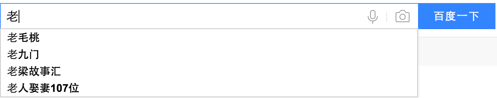
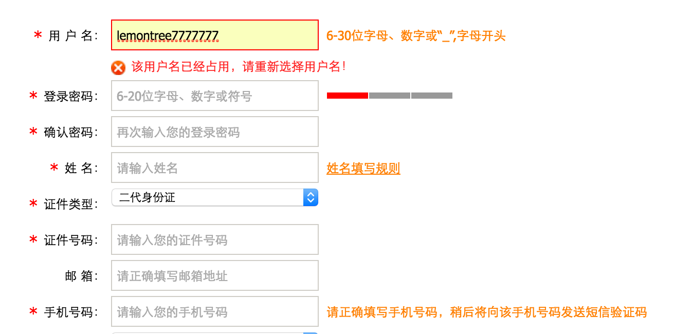

chapter16-JavaScript之AJAX


## AJAX

### 一 AJAX预备知识：json进阶

#### 1.1 什么是JSON？

JSON(JavaScript Object Notation) 是一种轻量级的数据交换格式。JSON是用字符串来表示Javascript对象；

请大家记住一句话：json字符串就是js对象的一种表现形式(字符串的形式)

既然我们已经学过python的json模块，我们就用它来测试下json字符串和json对象到底是什么

```python
import json
i=10
s='hello'
t=(1,4,6)
l=[3,5,7]
d={'name':"yuan"}

json_str1=json.dumps(i)
json_str2=json.dumps(s)
json_str3=json.dumps(t)
json_str4=json.dumps(l)
json_str5=json.dumps(d)

print(json_str1)   #'10'
print(json_str2)   #'"hello"'
print(json_str3)   #'[1, 4, 6]'
print(json_str4)   #'[3, 5, 7]'
print(json_str5)   #'{"name": "yuan"}'
```

这里面的json_str就是json字符串；

那么json字符串里都可以放哪些值呢？

JSON字符串内的值：

- 数字    （整数或浮点数）
- 字符串 （在双引号中）
- 逻辑值 （true 或 false）
- 数组    （在方括号中）
- 对象    （在花括号中，引号用双引）
- null     

​        看着是不是有点眼熟啊，对了，这就是咱们js的数据对象；不管是python还是其它语言，它们都有自己的数据类型，但如果要处理成json字符串那么，就要把数据换转成js对应的数据对象（比如python的元组就被处理成了数组，字典就被处理成object），再加上引号就是咱们的json字符串了；
​       前端接受到json字符串，就可以通过JSON.parse()等方法解析成json对象(即js对象)直接使用了。

​       之所以称json对象为js的子集，是因为像undefined,NaN,{'name':'yuan'}等都不在json对象的范畴。

#### 1.2 python与json对象的对应：

```python
        python         -->        json
        dict                      object
        list,tuple                array
        str,unicode               string
        int,long,float            number
        True                      true
        False                     false
        None                      null
```

让我们看一个带方法的json对象：

```js
var person = {"name":"alex",
              "sex":"men",
              "teacher":{
                 "name":"tiechui",
                  "sex":"half_men",
              },
              "bobby":['basketball','running'],

               "getName":function() {return 80;}
              };
alert(person.name);
alert(person.getName());
alert(person.teacher.name);
alert(person.bobby[0]);
```

person是一个json对象，因为它满足json规范：在json六大范畴且引号双引！

#### 1.3 .parse()和.stringify()

```js
parse() 用于从一个json字符串中解析出json对象,如

var str = '{"name":"yuan","age":"23"}'

结果：JSON.parse(str)     ------>  Object  {age: "23",name: "yuan"}


stringify()用于从一个json对象解析成json字符串，如

var c= {a:1,b:2} 

结果：  JSON.stringify(c)     ------>      '{"a":1,"b":2}'

注意1：单引号写在{}外，每个属性名都必须用双引号，否则会抛出异常。
注意2:

a={name:"yuan"};   //ok
b={'name':'yuan'}; //ok
c={"name":"yuan"}; //ok

alert(a.name);  //ok
alert(a[name]); //undefined
alert(a['name']) //ok
```

#### **1.4  django向js发送数据**

```python
def login(request):
    obj={'name':"alex111"}
    return render(request,'index.html',{"objs":json.dumps(obj)})
#----------------------------------
 <script>
     var temp={{ objs|safe }}
     alert(temp.name);
     alert(temp['name'])
 </script>
```

此外，还可以通过下面介绍的ajax技术使js接受django相应的json数据。

#### 1.5 JSON与XML比较 

- 可读性：   XML胜出；
- 解码难度：JSON本身就是JS对象（主场作战），所以简单很多；
- 流行度：   XML已经流行好多年，但在AJAX领域，JSON更受欢迎。

**注解：其实本没什么json对象，只是我们自己这么称呼罢了，所谓的json数据就是指json字符串，在前端解析出来的对象就是js对象的一部分！**

### **二**　**什么是****AJAX**

AJAX（Asynchronous Javascript And XML）翻译成中文就是“异步Javascript和XML”。即使用Javascript语言与服务器进行异步交互，传输的数据为XML（当然，传输的数据不只是XML）。

- 同步交互：客户端发出一个请求后，需要等待服务器响应结束后，才能发出第二个请求；
- 异步交互：客户端发出一个请求后，无需等待服务器响应结束，就可以发出第二个请求。

AJAX除了**异步**的特点外，还有一个就是：浏览器页面**局部刷新**；（这一特点给用户的感受是在不知不觉中完成请求和响应过程）

```html
<!DOCTYPE html>
<html lang="en">
<head>
    <meta charset="UTF-8">
    <title>Title</title>

<script type="text/javascript">
window.onload = function() {//当文档加载完毕时执行本函数
    var form = document.getElementById("form1");//获取表单元素对象
    form.onsubmit = function() {//给表单元素添加一个监听，监听表单被提交事件
        var usernameValue = form.username.value;//获取表单中名为username的表单元素值
        if(!usernameValue) {//判断该值是否为空
            var usernameSpan = document.getElementById("usernameSpan");//得到usernmae元素后的<span>元素
            usernameSpan.innerText = "用户名不能为空！";//设置span元素内容！
            return false;//返回false，表示拦截了表单提交动作
        }
        return true;//不拦截表单提交动作
    };
};
</script>
</head>
 <body>
<h1>注册页面</h1>
<form action="" method="post" id="form1">
用户名：<input type="text" name="username"/>
<span id="usernameSpan"></span>
<br/>
密　码：<input type="password" name="password"/>
<span id="passwordSpan"></span>
<br/>
<input type="submit" value="注册"/>

</form>
  </body>
</html>
```


### 三 AJAX常见应用情景

​       ****

当我们在百度中输入一个“老”字后，会马上出现一个下拉列表！列表中显示的是包含“传”字的4个关键字。

其实这里就使用了AJAX技术！当文件框发生了输入变化时，浏览器会使用AJAX技术向服务器发送一个请求，查询包含“传”字的前10个关键字，然后服务器会把查询到的结果响应给浏览器，最后浏览器把这4个关键字显示在下拉列表中。

- 整个过程中页面没有刷新，只是刷新页面中的局部位置而已！
- 当请求发出后，浏览器还可以进行其他操作，无需等待服务器的响应！

​       

 

当输入用户名后，把光标移动到其他表单项上时，浏览器会使用AJAX技术向服务器发出请求，服务器会查询名为zhangSan的用户是否存在，最终服务器返回true表示名为lemontree7777777的用户已经存在了，浏览器在得到结果后显示“用户名已被注册！”。

- 整个过程中页面没有刷新，只是局部刷新了；
- 在请求发出后，浏览器不用等待服务器响应结果就可以进行其他操作；

### **四**  AJAX的优缺点

#### 优点：

- AJAX使用Javascript技术向服务器发送异步请求；
- AJAX无须刷新整个页面；
- 因为服务器响应内容不再是整个页面，而是页面中的局部，所以AJAX性能高；

#### 缺点：

- AJAX并不适合所有场景，很多时候还是要使用同步交互；
- AJAX虽然提高了用户体验，但无形中向服务器发送的请求次数增多了，导致服务器压力增大；
- 因为AJAX是在浏览器中使用Javascript技术完成的，所以还需要处理浏览器兼容性问题；

### **五  AJAX****技术**

#### 四步操作：

- 创建核心对象；
- 使用核心对象打开与服务器的连接；
- 发送请求
- 注册监听，**监听服务器响应。**

#### XMLHTTPRequest

- open(请求方式, URL, 是否异步)
- send(请求体)
- onreadystatechange，指定监听函数，它会在xmlHttp对象的状态发生变化时被调用
- readyState，当前xmlHttp对象的状态，其中4状态表示服务器响应结束
- status：服务器响应的状态码，只有服务器响应结束时才有这个东东，200表示响应成功；
- responseText：获取服务器的响应体

### **六  AJAX****实现**

#### **6.1 准备工作(后台设定)：**

```
`def login(request):``    ``print(``'hello ajax'``)``    ``return` `render(request,``'index.html'``)` `def ajax_get(request):``    ``return` `HttpResponse(``'helloyuanhao'``)`
```

#### 6.2 AJAX核心（XMLHttpRequest）

​      其实AJAX就是在Javascript中多添加了一个对象：XMLHttpRequest对象。所有的异步交互都是使用XMLHttpServlet对象完成的。也就是说，我们只需要学习一个Javascript的新对象即可。

```js
`var xmlHttp ``=` `new XMLHttpRequest()；（大多数浏览器都支持DOM2规范）`
```

注意，各个浏览器对XMLHttpRequest的支持也是不同的！为了处理浏览器兼容问题，给出下面方法来创建XMLHttpRequest对象：

```python
function createXMLHttpRequest() {
        var xmlHttp;
        // 适用于大多数浏览器，以及IE7和IE更高版本
        try{
            xmlHttp = new XMLHttpRequest();
        } catch (e) {
            // 适用于IE6
            try {
                xmlHttp = new ActiveXObject("Msxml2.XMLHTTP");
            } catch (e) {
                // 适用于IE5.5，以及IE更早版本
                try{
                    xmlHttp = new ActiveXObject("Microsoft.XMLHTTP");
                } catch (e){}
            }
        }            
        return xmlHttp;
    }
```

#### 6.3	打开与服务器的连接（open方法）

当得到XMLHttpRequest对象后，就可以调用该对象的open()方法打开与服务器的连接了。open()方法的参数如下：

open(method, url, async)：

- method：请求方式，通常为GET或POST；
- url：请求的服务器地址，例如：/ajaxdemo1/AServlet，若为GET请求，还可以在URL后追加参数；
- async：这个参数可以不给，默认值为true，表示异步请求；

```js
`var` `xmlHttp = createXMLHttpRequest();``xmlHttp.open(``"GET"``, ``"/ajax_get/"``, ``true``);　`
```

#### **6.4**　**发送请求**

当使用open打开连接后，就可以调用XMLHttpRequest对象的send()方法发送请求了。send()方法的参数为POST请求参数，即对应HTTP协议的请求体内容，若是GET请求，需要在URL后连接参数。

注意：若没有参数，需要给出null为参数！若不给出null为参数，可能会导致FireFox浏览器不能正常发送请求！

```js
`xmlHttp.send(``null``);`
```

#### **6.5**　**接收服务器响应**

当请求发送出去后，服务器端Servlet就开始执行了，但服务器端的响应还没有接收到。接下来我们来接收服务器的响应。

XMLHttpRequest对象有一个onreadystatechange事件，它会在XMLHttpRequest对象的状态发生变化时被调用。下面介绍一下XMLHttpRequest对象的5种状态：

- 0：初始化未完成状态，只是创建了XMLHttpRequest对象，还未调用open()方法；
- 1：请求已开始，open()方法已调用，但还没调用send()方法；
- 2：请求发送完成状态，send()方法已调用；
- 3：开始读取服务器响应；
- 4：读取服务器响应结束。 

onreadystatechange事件会在状态为1、2、3、4时引发。

　　下面代码会被执行四次！对应XMLHttpRequest的四种状态！

```js
`xmlHttp.onreadystatechange = ``function``() {``            ``alert(``'hello'``);``        ``};`
```

但通常我们只关心最后一种状态，即读取服务器响应结束时，客户端才会做出改变。我们可以通过XMLHttpRequest对象的readyState属性来得到XMLHttpRequest对象的状态。

```js
xmlHttp.onreadystatechange = function() {
            if(xmlHttp.readyState == 4) {
                alert('hello');    
            }
        };
```

其实我们还要关心服务器响应的状态码是否为200，其服务器响应为404，或500，那么就表示请求失败了。我们可以通过XMLHttpRequest对象的status属性得到服务器的状态码。

最后，我们还需要获取到服务器响应的内容，可以通过XMLHttpRequest对象的responseText得到服务器响应内容。

```js
xmlHttp.onreadystatechange = function() {
            if(xmlHttp.readyState == 4 && xmlHttp.status == 200) {
                alert(xmlHttp.responseText);    
            }
        };
```

#### 6.6  if 发送POST请求：

​      <1>需要设置请求头：xmlHttp.setRequestHeader(“Content-Type”, “application/x-www-form-urlencoded”)；

​            注意 :form表单会默认这个键值对;不设定，Web服务器会忽略请求体的内容。

​      <2>在发送时可以指定请求体了：xmlHttp.send(“username=yuan&password=123”)

#### **6.7**　AJAX实现小结

```js
    创建XMLHttpRequest对象；
    调用open()方法打开与服务器的连接；
    调用send()方法发送请求；
    为XMLHttpRequest对象指定onreadystatechange事件函数，这个函数会在

    XMLHttpRequest的1、2、3、4，四种状态时被调用；

    XMLHttpRequest对象的5种状态，通常我们只关心4状态。

    XMLHttpRequest对象的status属性表示服务器状态码，它只有在readyState为4时才
    能获取到。

     XMLHttpRequest对象的responseText属性表示服务器响应内容，它只有在
     readyState为4时才能获取到！
```

#### **6.8  请求完整代码：**

```html
<h1>AJAX</h1>
<button onclick="send()">测试</button>
<div id="div1"></div>


<script>
       function createXMLHttpRequest() {
            try {
                return new XMLHttpRequest();//大多数浏览器
            } catch (e) {
                try {
                    return new ActiveXObject("Msxml2.XMLHTTP");
                } catch (e) {
                    return new ActiveXObject("Microsoft.XMLHTTP");
                }
            }
        }

        function send() {
            var xmlHttp = createXMLHttpRequest();
            xmlHttp.onreadystatechange = function() {
                if(xmlHttp.readyState == 4 && xmlHttp.status == 200) {
                    var div = document.getElementById("div1");
                    div.innerText = xmlHttp.responseText;
                    div.textContent = xmlHttp.responseText;
                }
            };

            xmlHttp.open("POST", "/ajax_post/", true);
            //post: xmlHttp.setRequestHeader("Content-Type", "application/x-www-form-urlencoded");
            xmlHttp.send(null);  //post: xmlHttp.send("b=B");
        }


</script>
       
#--------------------------------views.py 
from django.views.decorators.csrf import csrf_exempt

def login(request):
    print('hello ajax')
    return render(request,'index.html')

@csrf_exempt   ＃csrf防御
def ajax_post(request):
    print('ok')
    return HttpResponse('helloyuanhao') 
```

**思考：启动后台后，直接运行html，会怎么样？这就涉及到咱们一会要讲到的同源策略机制和跨域请求；**

### **七**　AJAX实例（用户名是否已被注册）

#### **7.1**　**功能介绍**

在注册表单中，当用户填写了用户名后，把光标移开后，会自动向服务器发送异步请求。服务器返回true或false，返回true表示这个用户名已经被注册过，返回false表示没有注册过。

客户端得到服务器返回的结果后，确定是否在用户名文本框后显示“用户名已被注册”的错误信息！

#### **7.2**　**案例分析**

- 页面中给出注册表单；
- 在username表单字段中添加onblur事件，调用send()方法；
- send()方法获取username表单字段的内容，向服务器发送异步请求，参数为username；
- django 的视图函数：获取username参数，判断是否为“yuan”，如果是响应true，否则响应false View Code

#### **7.3** **代码**

```html
<script type="text/javascript">
        function createXMLHttpRequest() {
            try {
                return new XMLHttpRequest();
            } catch (e) {
                try {
                    return new ActiveXObject("Msxml2.XMLHTTP");
                } catch (e) {
                    return new ActiveXObject("Microsoft.XMLHTTP");
                }
            }
        }

        function send() {
            var xmlHttp = createXMLHttpRequest();
            xmlHttp.onreadystatechange = function() {
                if(xmlHttp.readyState == 4 && xmlHttp.status == 200) {
                    if(xmlHttp.responseText == "true") {
                        document.getElementById("error").innerText = "用户名已被注册！";
                        document.getElementById("error").textContent = "用户名已被注册！";
                    } else {
                        document.getElementById("error").innerText = "";
                        document.getElementById("error").textContent = "";
                    }
                }
            };
            xmlHttp.open("POST", "/ajax_check/", true, "json");
            xmlHttp.setRequestHeader("Content-Type", "application/x-www-form-urlencoded");
            var username = document.getElementById("username").value;
            xmlHttp.send("username=" + username);
        }
</script>

//--------------------------------------------------index.html

<h1>注册</h1>
<form action="" method="post">
用户名：<input id="username" type="text" name="username" onblur="send()"/><span id="error"></span><br/>
密　码：<input type="text" name="password"/><br/>
<input type="submit" value="注册"/>
</form>


//--------------------------------------------------views.py
from django.views.decorators.csrf import csrf_exempt

def login(request):
    print('hello ajax')
    return render(request,'index.html')
    # return HttpResponse('helloyuanhao')

@csrf_exempt
def ajax_check(request):
    print('ok')

    username=request.POST.get('username',None)
    if username=='yuan':
        return HttpResponse('true')
    return HttpResponse('false')
```


### 八 jquery实现的ajax

#### 8.1  快捷API：

```html
<1>$.get(url, [data], [callback], [type])
<2>$.post(url, [data], [callback], [type])  //type: text|html|json|script


 应用：  
    //请求参数应该尽量放在data参数中，因为可以自动编码，手动拼接url要注意编码问题
    function testWithDataAndCallback() {
        //$.post...

        $.get('/user/list', {type: 1}, function (data, callbacktype, jqXHR) {
            console.log(data);//将json字符串解析成json对象
        });
    }

 －－－－－－－－－－－－－－

<3>$.getScript()使用 AJAX 请求，获取和运行 JavaScript:
     应用：
     function testGetScript() {
            // alert(testFun(3, 4));
            $.getScript('test.js', function () {
                alert(add(1, 6));
            });
        }

    // test.js
    function add(a,b){
       return a+b
       }  

<4>$.getJSON()
   与$.get()是一样的，只不过就是做后一个参数type必须是json数据了。一般同域操作用$.get()就可以，$.getJson 最主要是用来进行jsonp跨域操作的。
```


#### 8.2  核心API的基本使用：

```js
<1>  $.ajax的两种写法：

          $.ajax("url",{})
          $.ajax({})

<2>  $.ajax的基本使用

    $.ajax({
        url:"//",
        data:{a:1,b:2},
        type:"GET",
        success:function(){}
    })


<3> 回调函数

    
        $.ajax('/user/allusers', {

            success: function (data) {
                console.log(arguments);
            },

            error: function (jqXHR, textStatus, err) {

                // jqXHR: jQuery增强的xhr
                // textStatus: 请求完成状态
                // err: 底层通过throw抛出的异常对象，值与错误类型有关
                console.log(arguments);
            },

            complete: function (jqXHR, textStatus) {
                // jqXHR: jQuery增强的xhr
                // textStatus: 请求完成状态 success | error
                console.log('statusCode: %d, statusText: %s', jqXHR.status, jqXHR.statusText);
                console.log('textStatus: %s', textStatus);
            },

            statusCode: {
                '403': function (jqXHR, textStatus, err) {
                    console.log(arguments);  //注意：后端模拟errror方式：HttpResponse.status_code=500
                    
                },
                '400': function () {
                }
            }
        });
```


#### 8.3  核心API的重要字段(参数)：

```python
<1> ----------请求数据相关: data, processData, contentType, traditional--------------

       data: 当前ajax请求要携带的数据，是一个json的object对象，ajax方法就会默认地把它编码成某种格式
             (urlencoded:?a=1&b=2)发送给服务端；此外，ajax默认以get方式发送请求。

             # function testData() {
             #   $.ajax("/test",{     //此时的data是一个json形式的对象
             #      data:{
             #        a:1,
             #        b:2
             #      }      
             #   });                   //?a=1&b=2

processData：声明当前的data数据是否进行转码或预处理，默认为true，即预处理；if为false，
             # 那么对data：{a:1,b:2}会调用json对象的toString()方法，即{a:1,b:2}.toString()
             # ,最后得到一个［object，Object］形式的结果。   
             # {"1":"111","2":"222","3":"333"}.toString();//[object Object]
             # 该属性的意义在于，当data是一个dom结构或者xml数据时，我们希望数据不要进行处理，直接发过去，
             # 就可以讲其设为true。

contentType：默认值: "application/x-www-form-urlencoded"。发送信息至服务器时内容编码类型。
             # 用来指明当前请求的数据编码格式；urlencoded:?a=1&b=2；如果想以其他方式提交数据，
             # 比如contentType:"application/json"，即向服务器发送一个json字符串： 
             #   $.ajax("/ajax_get",{
             # 
             #      data:JSON.stringify({
             #           a:22,
             #           b:33
             #       }),
             #       contentType:"application/json",
             #       type:"POST",
             #       
             #   });                          //{a: 22, b: 33}

             # 注意：contentType:"application/json"一旦设定，data必须是json字符串，不能是json对象

 traditional：一般是我们的data数据有数组时会用到 ：data:{a:22,b:33,c:["x","y"]}, 
              traditional为false会对数据进行深层次迭代；          


<2> ------------------------ 响应数据: dataType、dataFilter------------------------

dataType：预期服务器返回的数据类型,服务器端返回的数据会根据这个值解析后，传递给回调函数。
            # 默认不需要显性指定这个属性，ajax会根据服务器返回的content Type来进行转换；比如我们的服务器响应的
            # content Type为json格式，这时ajax方法就会对响应的内容进行一个json格式的转换，if转换成功，我们在
            # success的回调函数里就会得到一个json格式的对象；转换失败就会触发error这个回调函数。如果我们明确地指
            # 定目标类型，就可以使用data Type。
            # dataType的可用值：html｜xml｜json｜text｜script
            # 见下dataType实例

dataFilter: 类型：Function 给 Ajax返回的原始数据的进行预处理的函数。见下dataFilter实例

<3> 请求类型 type：

    类型：String 默认值: "GET")。请求方式 ("POST" 或 "GET")， 默认为 "GET"。注意：其它 HTTP 请求方法，
    如 PUT 和 DELETE 也可以使用，但仅部分浏览器支持。

<4> 前置处理 beforeSend(XHR)

    类型：Function 发送请求前可修改 XMLHttpRequest 对象的函数，如添加自定义 HTTP 头。XMLHttpRequest 
    # 对象是唯一的参数。这是一个 Ajax 事件。如果返回 false 可以取消本次 ajax 请求。
    # 见下beforeSend实例
<5> jsonp  类型：String

    # 在一个 jsonp 请求中重写回调函数的名字。这个值用来替代在 "callback=?" 这种 GET 或 POST 请求中 URL 
    # 参数里的 "callback" 部分，比如 {jsonp:'onJsonPLoad'} 会导致将 "onJsonPLoad=?" 传给服务器。

<6> jsonpCallback  类型：String

    # 为 jsonp 请求指定一个回调函数名。这个值将用来取代 jQuery 自动生成的随机函数名。这主要用来让 jQuery 生
    # 成度独特的函数名，这样管理请求更容易，也能方便地提供回调函数和错误处理。你也可以在想让浏览器缓存 GET 请求
    # 的时候，指定这个回调函数名。
```


#### 8.4 实例代码

```python
from django.shortcuts import render,HttpResponse
from django.views.decorators.csrf import csrf_exempt
# Create your views here.

import json

def login(request):

    return render(request,'Ajax.html')


def ajax_get(request):

    l=['alex','little alex']
    dic={"name":"alex","pwd":123}

    #return HttpResponse(l)      #元素直接转成字符串alexlittle alex
    #return HttpResponse(dic)    #字典的键直接转成字符串namepwd
    return HttpResponse(json.dumps(l))
    return HttpResponse(json.dumps(dic))# 传到前端的是json字符串,要想使用,需要JSON.parse(data)

//---------------------------------------------------
    function testData() {

        $.ajax('ajax_get', {
           success: function (data) {
           console.log(data);
           console.log(typeof(data));
           //console.log(data.name);
           //JSON.parse(data);
           //console.log(data.name);
                                     },
           //dataType:"json",
                            }
                       )}

注解:Response Headers的content Type为text/html,所以返回的是String;但如果我们想要一个json对象
    设定dataType:"json"即可,相当于告诉ajax方法把服务器返回的数据转成json对象发送到前端.结果为object
    当然，
        return HttpResponse(json.dumps(a),content_type="application/json")

    这样就不需要设定dataType:"json"了。
    content_type="application/json"和content_type="json"是一样的！
```


```python
function testData() {

         $.ajax('ajax_get', {
           success: function (data) {
               console.log(data);
            },

            dataType: 'json',
            dataFilter: function(data, type) {
                console.log(data);//["alex", "little alex"]
                console.log(type);//json
                //var tmp =  JSON.parse(data);
                return tmp.length;//2
            }
        });}
```


```python
 function testData() {
        $.ajax('ajax_get', {
         beforeSend: function (jqXHR, settings) {
                console.log(arguments);
                console.log('beforeSend');
                jqXHR.setRequestHeader('test', 'haha');
                jqXHR.testData = {a: 1, b: 2};
            },
            success: function (data) {
                console.log(data);
            },

            complete: function (xhr) {
                console.log(xhr);
                console.log(xhr.testData);
            },

        })};
```

#### 8.5 csrf跨站请求伪造

```python
$.ajaxSetup({
    data: {csrfmiddlewaretoken: '{{ csrf_token }}' },
});
```

### 九 跨域请求

#### 9.1 同源策略机制

​      浏览器有一个很重要的概念——同源策略(Same-Origin Policy)。所谓同源是指，域名，协议，端口相同。不同源的客户端脚本(javascript、ActionScript)在没明确授权的情况下，不能读写对方的资源。

简单的来说，浏览器允许包含在页面A的脚本访问第二个页面B的数据资源，这一切是建立在A和B页面是同源的基础上。

如果Web世界没有同源策略，当你登录淘宝账号并打开另一个站点时，这个站点上的JavaScript可以跨域读取你的淘宝账号数据，这样整个Web世界就无隐私可言了。

#### 9.2  jsonp的js实现

​         JSONP是JSON with Padding的略称。可以让网页从别的域名（网站）那获取资料，即跨域读取数据。

它是一个非官方的协议，它允许在服务器端集成Script tags返回至客户端，通过javascript callback的形式实现跨域访问（这仅仅是JSONP简单的实现形式）。

JSONP就像是**JSON+Padding**一样(Padding这里我们理解为**填充**)

实例：

```python
 #---------------------------http://127.0.0.1:8001/login

 def login(request):
    print('hello ajax')
    return render(request,'index.html')
 #---------------------------返回用户的index.html
 <h1>发送JSONP数据</h1>


<script>
    function fun1(arg){
        alert("hello"+arg)
    }
</script>
<script src="http://127.0.0.1:8002/get_byjsonp/"></script>  //返回：<script>fun1("yuan")</script>

#-----------------------------http://127.0.0.1:8002/get_byjsonp

def get_byjsonp(req):
    print('8002...')
    return HttpResponse('fun1("yuan")')
```

​      这其实就是JSONP的简单实现模式，或者说是JSONP的原型：**创建一个回调函数，然后在远程服务上调用这个函数并且将JSON 数据形式作为参数传递，完成回调**。

**将JSON数据填充进回调函数**，这应该就是JSONP的JSON+Padding的含义吧。

​      一般情况下，我们希望这个script标签能够动态的调用，而不是像上面因为固定在html里面所以没等页面显示就执行了，很不灵活。我们可以通过javascript动态的创建script标签，这样我们就可以灵活调用远程服务了。

```python
<button onclick="f()">submit</button>

<script>
    function addScriptTag(src){
     var script = document.createElement('script');
         script.setAttribute("type","text/javascript");
         script.src = src;
         document.body.appendChild(script);
         document.body.removeChild(script);
    }
    function fun1(arg){
        alert("hello"+arg)
    }
    
    function f(){
         addScriptTag("http://127.0.0.1:8002/get_byjsonp/")
    }
</script>
```

 为了更加灵活，现在将你自己在客户端定义的回调函数的函数名传送给服务端，服务端则会返回以你定义的回调函数名的方法，将获取的json数据传入这个方法完成回调：

```python
<button onclick="f()">submit</button>

<script>
    function addScriptTag(src){
     var script = document.createElement('script');
         script.setAttribute("type","text/javascript");
         script.src = src;
         document.body.appendChild(script);
         document.body.removeChild(script);
    }
    function SayHi(arg){
        alert("Hello "+arg)
    }

    function f(){
         addScriptTag("http://127.0.0.1:8002/get_byjsonp/?callbacks=SayHi")
    }
</script>


----------------------views.py
def get_byjsonp(req):

    func=req.GET.get("callbacks")

    return HttpResponse("%s('yuan')"%func)
```

#### 11.3 jQuery对JSONP的实现

jQuery框架也当然支持JSONP，可以使用$.getJSON(url,[data],[callback])方法

```html
<script type="text/javascript">
    $.getJSON("http://127.0.0.1:8002/get_byjsonp?callback=?",function(arg){
        alert("hello"+arg)
    });
</script>
```

​      结果是一样的，要注意的是在url的后面必须添加一个callback参数，这样getJSON方法才会知道是用JSONP方式去访问服务，callback后面的那个问号是内部自动生成的一个回调函数名。

​      此外，如果说我们想指定自己的回调函数名，或者说服务上规定了固定回调函数名该怎么办呢？我们可以使用$.ajax方法来实现

```html
<script type="text/javascript" src="/static/jquery-2.2.3.js"></script>

<script type="text/javascript">
   $.ajax({
        url:"http://127.0.0.1:8002/get_byjsonp",
        dataType:"jsonp",
        jsonp: 'callbacks',
        jsonpCallback:"SayHi"
   });
    function SayHi(arg){
        alert(arg);
    }
</script>
 
#--------------------------------- http://127.0.0.1:8002/get_byjsonp
 def get_byjsonp(req):

    callback=req.GET.get('callbacks')
    print(callback)
    return HttpResponse('%s("yuan")'%callback)
```

​      **当然，最简单的形式还是通过回调函数来处理：**

```python
<script type="text/javascript" src="/static/jquery-2.2.3.js"></script>

<script type="text/javascript">
   $.ajax({
        url:"http://127.0.0.1:8002/get_byjsonp",
        dataType:"jsonp",            //必须有，告诉server，这次访问要的是一个jsonp的结果。
        jsonp: 'callbacks',          //jQuery帮助随机生成的：callbacks="wner"
        success:function(data){
            alert(data)
        }
   });

</script>
 #-------------------------------------http://127.0.0.1:8002/get_byjsonp
def get_byjsonp(req):

    callbacks=req.GET.get('callbacks')
    print(callbacks)                 #wner  

return HttpResponse("%s('yuan')"%callbacks)
```

​       jsonp: 'callbacks'就是定义一个存放回调函数的键，jsonpCallback是前端定义好的回调函数方法名'SayHi'，server端接受callback键对应值后就可以在其中填充数据打包返回了; 

​       jsonpCallback参数可以不定义，jquery会自动定义一个随机名发过去，那前端就得用回调函数来处理对应数据了。

　    利用jQuery可以很方便的实现JSONP来进行跨域访问。　　

注解1: JSONP一定是GET请求

注解2:

```python
<button onclick="f()">submit</button>

<script src="/static/jquery-1.8.2.min.js"></script>
<script type="text/javascript">
    function f(){
        $.ajax({
        url:"http://127.0.0.1:8002/get_byjsonp",
        dataType:"jsonp",
        jsonp: 'callbacks',
        success :function(data){        //传过来的数据会被转换成js对象
            console.log(data);          //Object {name: Array[2]}
            console.log(typeof data);   //object
            console.log(data.name)      //["alex", "alvin"]
        }
   });
    }
</script>
---------------------------------------------views.py
def get_byjsonp(req):

    func=req.GET.get("callbacks")

    a=json.dumps({'name':('alex','alvin')})
    return HttpResponse("%s(%s)"%(func,a))


    #return HttpResponse("%s({'name':('alex','alvin')})"%func)

    #return HttpResponse("%s('hello')"%func)
    #return HttpResponse("%s([12,34])"%func)
    #return HttpResponse("%s(5)"%func)
```

补充：

```python
#views.py 中可以用  request.is_ajax() 方法判断是否是 ajax 请求，需要添加一个 HTTP 请求头：

#原生javascript：
#xmlhttp.setRequestHeader("X-Requested-With", "XMLHttpRequest");
#用 jQuery：
#用 $.ajax 方法代替 $.get，因为 $.get 在 IE 中不会发送 ajax header

#注意：is_ajax()在跨域ajax请求时不好使
```


思考1：为什么该代码在IE上会报错？

思考2：这里只是返回了一个"hello''的字符串，那么jsonp可不可以返回更多其它的数据类型呢，比如列表，字典等？